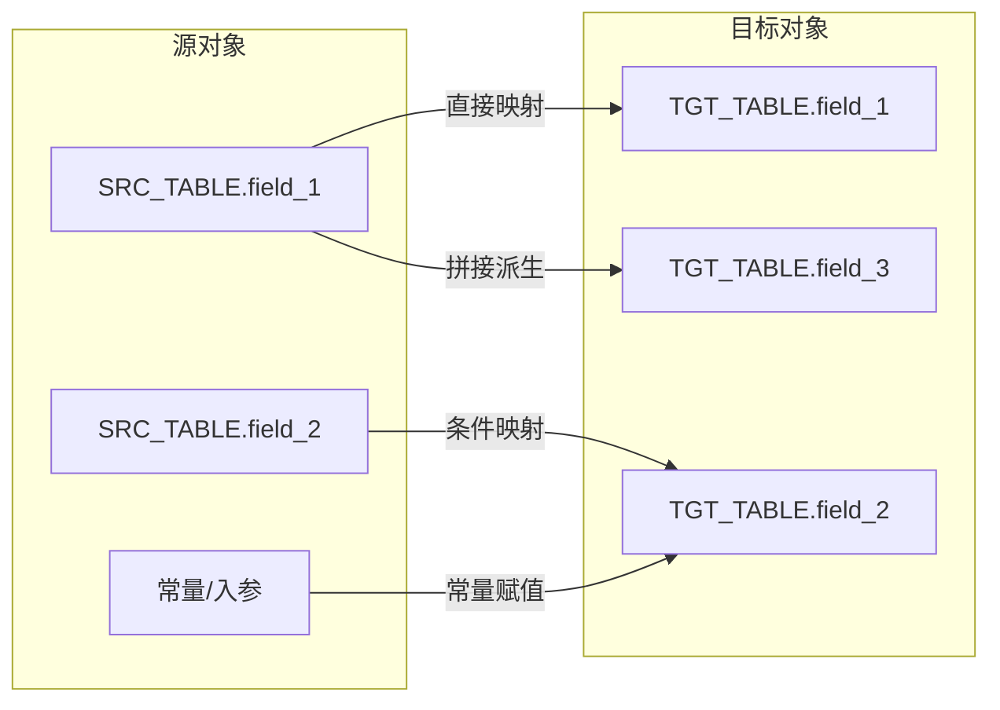

# 血缘-...

## 系统边界

- 起始系统
- 目标系统
- 是否仅系统内血缘
- 文件路径归属哪个系统

## 业务链路摘要

- 从哪个源表开始
- 经过哪些过滤/加工
- 最终形成哪个监管报表

## 直接上游对象

- 数据表页：待补充
- 来源 SQL / 过程 / 视图

## 直接下游对象

- 数据表页：待补充
- 报表页：待补充

## Nodes

- 数据表页：待补充
- CTE / 中间层
- 报表页：待补充

## 表级 Edge List

| From | To | Transform | Evidence |
| --- | --- | --- | --- |
| 数据表-... | CTE-... | 过滤/聚合/关联 | 来源-... |

## 字段级 Edge List

| 源对象 | 源字段 | 目标对象 | 目标字段 | 处理逻辑 | 关系类型 | 证据 |
| --- | --- | --- | --- | --- | --- | --- |
| 数据表-... | field_a | 数据表-... | field_b | 直接映射 / 条件映射 / 拼接 / 聚合 | 直接映射 | 来源-... |

- 要求：
  - 默认至少覆盖所有目标输出字段
  - 每个目标字段都要能回溯到来源字段
  - 常量、拼接、窗口函数、码值映射也要写
  - 如果字段过多，可以按主题拆表，但不能省略目标字段
  - 源字段和目标字段优先使用英文字段名或技术字段名
  - 中文名称如需保留，应写入“处理逻辑”或单独补充说明，不作为字段级血缘主展示名称

## Graph-总览

## Graph-字段级

- 要求：
  - 图优先面向技术影响分析和字段溯源
  - 尽量体现“原表.原字段 -> 目标表.目标字段”
  - 字段节点优先使用英文字段名或技术字段名
  - 如果太复杂，可以拆成多张图，例如“主键与标识”“状态与码值”“时间字段”

## 回链检查

- 上游对象页是否已回链本血缘页
- 下游对象页是否已回链本血缘页
- 报表页是否已回链本血缘页

## 变更与冲突

- 本次更新是否修改了既有血缘关系
- 哪些对象页需要同步改写
- 是否有页面需要从 `validated` 降级为 `draft`

## Open Questions

- 尚未确认的口径或技术问题
- 跨系统边界是否完整
