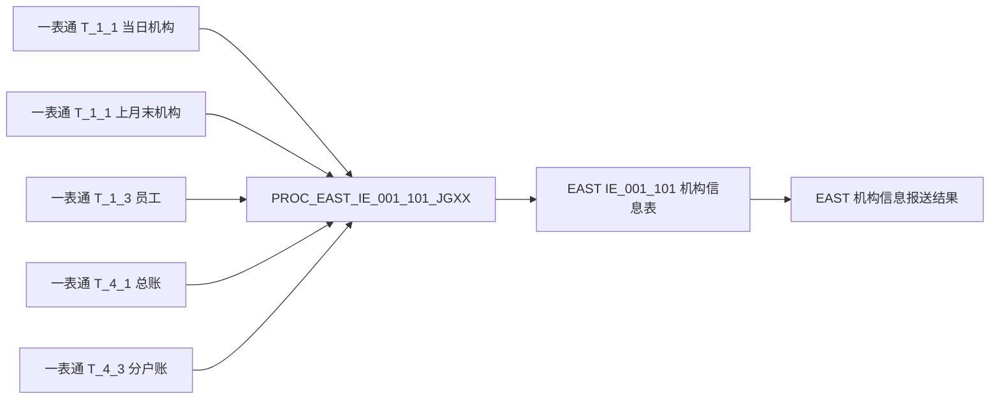
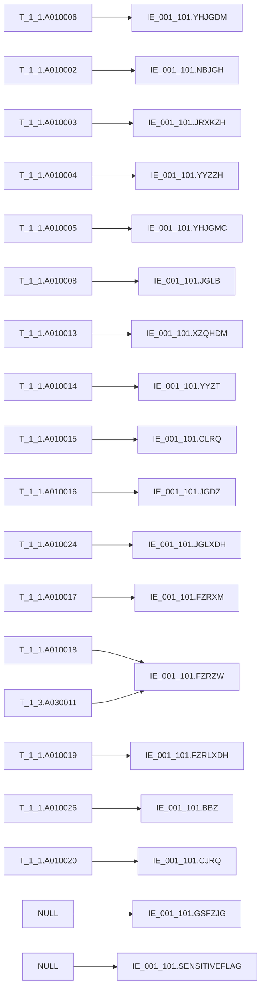

# 血缘-IE_001_101-机构信息表-EAST5.0系统

## 系统边界

- 起始系统：一表通系统
- 目标系统：EAST5.0系统
- 是否仅系统内血缘：否
- 文件路径归属哪个系统：EAST5.0系统

## 业务链路摘要

- 从一表通 `T_1_1` 读取当日机构信息快照。
- 通过上月末 `T_1_1` 识别连续停业机构，通过 `T_4_1` 与 `T_4_3` 判断是否存在余额或分户账回补证据。
- 通过一表通 `T_1_3` 员工表补取负责人职务。
- 将一表通字段映射为 EAST5.0 `IE_001_101` 字段，并把机构类别、营业状态和日期格式转换为 EAST 规范。
- 原始 SQL 已同步调整为直接 `left join` 与显式字段查询；同内容开发草案位于 `工作区/SQL开发/EAST5.0系统/PROC_EAST_IE_001_101_JGXX_草案.sql`，不改变字段级血缘结论。

## 直接上游对象

- [[数据表-T_1_1-机构信息-一表通系统]]
- [[数据表-T_1_3-员工-一表通系统]]
- [[数据表-T_4_1-总账会计全科目-一表通系统]]
- [[数据表-T_4_3-分户账信息-一表通系统]]
- [[来源-EAST5.0系统-IE_001_101-机构信息表]]
- `PROC_EAST_IE_001_101_JGXX`
- `工作区/SQL开发/EAST5.0系统/PROC_EAST_IE_001_101_JGXX_草案.sql`

## 直接下游对象

- [[数据表-IE_001_101-机构信息表-EAST5.0系统]]
- [[报表-IE_001_101-机构信息表-EAST5.0系统]]

## Nodes

- [[数据表-T_1_1-机构信息-一表通系统]]
- [[数据表-T_1_3-员工-一表通系统]]
- [[数据表-T_4_1-总账会计全科目-一表通系统]]
- [[数据表-T_4_3-分户账信息-一表通系统]]
- 原始材料/SQL/EAST5.0系统/PROC_EAST_IE_001_101_JGXX.sql（SQL 加工脚本）
- [[数据表-IE_001_101-机构信息表-EAST5.0系统]]
- [[报表-IE_001_101-机构信息表-EAST5.0系统]]

## 表级 Edge List

| From | To | Transform | Evidence |
| --- | --- | --- | --- |
| 数据表-T_1_1-机构信息-一表通系统 | PROC_EAST_IE_001_101_JGXX | 读取当日机构快照，并读取上月末快照用于连续停业过滤 | [[来源-EAST5.0系统-IE_001_101-机构信息表]] |
| 数据表-T_1_3-员工-一表通系统 | PROC_EAST_IE_001_101_JGXX | 按负责人工号关联员工ID，取负责人职务 | [[来源-EAST5.0系统-IE_001_101-机构信息表]] |
| 数据表-T_4_1-总账会计全科目-一表通系统 | PROC_EAST_IE_001_101_JGXX | 去重取机构ID，识别总账余额不为 0 的机构 | [[来源-EAST5.0系统-IE_001_101-机构信息表]] |
| 数据表-T_4_3-分户账信息-一表通系统 | PROC_EAST_IE_001_101_JGXX | 去重取机构ID，识别仍有分户账记录的机构 | [[来源-EAST5.0系统-IE_001_101-机构信息表]] |
| PROC_EAST_IE_001_101_JGXX | 数据表-IE_001_101-机构信息表-EAST5.0系统 | 删除当日 EAST 目标数据后插入映射结果 | [[来源-EAST5.0系统-IE_001_101-机构信息表]] |
| 数据表-IE_001_101-机构信息表-EAST5.0系统 | 报表-IE_001_101-机构信息表-EAST5.0系统 | 形成 EAST5.0 机构信息采集接口结果 | [[来源-EAST5.0系统-IE_001_101-机构信息表]] |

## 字段级 Edge List

| 源对象 | 源字段 | 目标对象 | 目标字段 | 处理逻辑 | 关系类型 | 证据 |
| --- | --- | --- | --- | --- | --- | --- |
| T_1_1 | A010006 | IE_001_101 | YHJGDM | 支付行号直接映射为银行机构代码 | 直接映射 | [[来源-EAST5.0系统-IE_001_101-机构信息表]] |
| T_1_1 | A010002 | IE_001_101 | NBJGH | 内部机构号直接映射 | 直接映射 | [[来源-EAST5.0系统-IE_001_101-机构信息表]] |
| T_1_1 | A010003 | IE_001_101 | JRXKZH | 金融许可证号直接映射 | 直接映射 | [[来源-EAST5.0系统-IE_001_101-机构信息表]] |
| T_1_1 | A010004 | IE_001_101 | YYZZH | 统一社会信用代码映射为营业执照号 | 直接映射 | [[来源-EAST5.0系统-IE_001_101-机构信息表]] |
| T_1_1 | A010005 | IE_001_101 | YHJGMC | 银行机构名称直接映射 | 直接映射 | [[来源-EAST5.0系统-IE_001_101-机构信息表]] |
| T_1_1 | A010008 | IE_001_101 | JGLB | `0101/0102`、`0201/0202/0203`、`0301/0302`、`0401/0402` 转为 EAST 中文机构类别 | 码值转换 | [[来源-EAST5.0系统-IE_001_101-机构信息表]] |
| T_1_1 | A010013 | IE_001_101 | XZQHDM | 行政区划直接映射 | 直接映射 | [[来源-EAST5.0系统-IE_001_101-机构信息表]] |
| T_1_1 | A010014 | IE_001_101 | YYZT | `01` 转营业，`00/02/03/其他` 转停业 | 码值转换 | [[来源-EAST5.0系统-IE_001_101-机构信息表]] |
| T_1_1 | A010015 | IE_001_101 | CLRQ | 日期转为 `YYYYMMDD` | 格式转换 | [[来源-EAST5.0系统-IE_001_101-机构信息表]] |
| T_1_1 | A010016 | IE_001_101 | JGDZ | 机构地址直接映射 | 直接映射 | [[来源-EAST5.0系统-IE_001_101-机构信息表]] |
| T_1_1 | A010024 | IE_001_101 | JGLXDH | 机构联系电话直接映射 | 直接映射 | [[来源-EAST5.0系统-IE_001_101-机构信息表]] |
| T_1_1 | A010017 | IE_001_101 | FZRXM | 负责人姓名直接映射 | 直接映射 | [[来源-EAST5.0系统-IE_001_101-机构信息表]] |
| T_1_1 + T_1_3 | A010018 + A030011 | IE_001_101 | FZRZW | `A010018 = A030001` 关联员工表，取职务 | 条件映射 | [[来源-EAST5.0系统-IE_001_101-机构信息表]] |
| T_1_1 | A010019 | IE_001_101 | FZRLXDH | 负责人联系电话直接映射 | 直接映射 | [[来源-EAST5.0系统-IE_001_101-机构信息表]] |
| T_1_1 | A010026 | IE_001_101 | BBZ | 备注直接映射 | 直接映射 | [[来源-EAST5.0系统-IE_001_101-机构信息表]] |
| T_1_1 | A010020 | IE_001_101 | CJRQ | 采集日期转为 `YYYYMMDD` | 格式转换 | [[来源-EAST5.0系统-IE_001_101-机构信息表]] |
| 常量 | NULL | IE_001_101 | GSFZJG | 当前映射图未给出来源，暂置空 | 常量赋值 | [[来源-EAST5.0系统-IE_001_101-机构信息表]] |
| 常量 | NULL | IE_001_101 | SENSITIVEFLAG | 当前映射图未给出来源，暂置空 | 常量赋值 | [[来源-EAST5.0系统-IE_001_101-机构信息表]] |

## Graph-总览

## Graph-字段级

## 回链检查

- 下游数据表页已回链本血缘页：[[数据表-IE_001_101-机构信息表-EAST5.0系统]]
- 报表业务口径页已回链本血缘页：[[报表-IE_001_101-机构信息表-EAST5.0系统]]
- 上游一表通数据表页尚未全部回链本 EAST 血缘页，后续可在跨系统血缘批量维护时补齐。

## Open Questions

- `GSFZJG` 与 `SENSITIVEFLAG` 当前没有映射来源。
- 被合并机构的状态码是否固定为 `03`，需补监管或源系统证据。
- `T_4_1` 总账余额不为 0 的判断范围需业务确认，当前脚本将余额类字段合计不为 0 作为回补依据。
