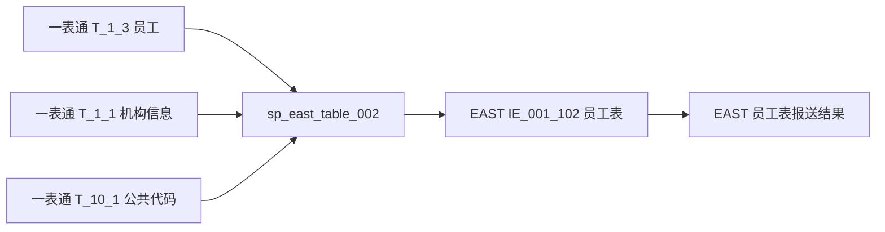
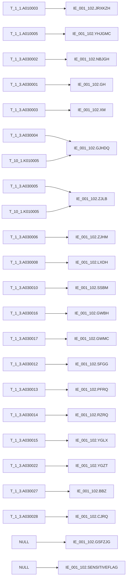

# 血缘-IE_001_102-员工表-EAST5.0系统

## 系统边界

- 起始系统：一表通系统
- 目标系统：EAST5.0系统
- 是否仅系统内血缘：否
- 文件路径归属哪个系统：EAST5.0系统

## 业务链路摘要

- 从一表通 `T_1_3` 员工表读取采集日员工快照。
- 按员工状态和离职日期筛选本期需报送员工。
- 关联一表通 `T_1_1` 机构信息，补金融许可证号和银行机构名称。
- 关联一表通 `T_10_1` 公共代码，转换国家地区和证件类型。
- 最终写入 EAST5.0 `IE_001_102` 员工表。
- 原始 SQL 已同步调整为直接 `left join` 与显式字段查询；同内容开发草案位于 `工作区/SQL开发/EAST5.0系统/sp_east_table_002_草案.sql`，不改变字段级血缘结论。

## 直接上游对象

- [[数据表-T_1_3-员工-一表通系统]]
- [[数据表-T_1_1-机构信息-一表通系统]]
- [[数据表-T_10_1-公共代码-一表通系统]]
- [[来源-EAST5.0系统-IE_001_102-员工表]]
- `sp_east_table_002`
- `工作区/SQL开发/EAST5.0系统/sp_east_table_002_草案.sql`

## 直接下游对象

- [[数据表-IE_001_102-员工表-EAST5.0系统]]
- [[报表-IE_001_102-员工表-EAST5.0系统]]

## Nodes

- [[数据表-T_1_3-员工-一表通系统]]
- [[数据表-T_1_1-机构信息-一表通系统]]
- [[数据表-T_10_1-公共代码-一表通系统]]
- `sp_east_table_002`
- `sp_east_table_002_草案`
- [[数据表-IE_001_102-员工表-EAST5.0系统]]
- [[报表-IE_001_102-员工表-EAST5.0系统]]

## 表级 Edge List

| From | To | Transform | Evidence |
| --- | --- | --- | --- |
| 数据表-T_1_3-员工-一表通系统 | sp_east_table_002 | 读取采集日员工快照，按员工状态和离职日期过滤 | [[来源-EAST5.0系统-IE_001_102-员工表]] |
| 数据表-T_1_1-机构信息-一表通系统 | sp_east_table_002 | 按机构ID关联，补金融许可证号和银行机构名称 | [[来源-EAST5.0系统-IE_001_102-员工表]] |
| 数据表-T_10_1-公共代码-一表通系统 | sp_east_table_002 | 按 `通用/国家地区`、`通用/证件类型` 转换码值 | [[来源-EAST5.0系统-IE_001_102-员工表]] |
| sp_east_table_002 | 数据表-IE_001_102-员工表-EAST5.0系统 | 删除当日目标数据后插入映射结果 | [[来源-EAST5.0系统-IE_001_102-员工表]] |
| 数据表-IE_001_102-员工表-EAST5.0系统 | 报表-IE_001_102-员工表-EAST5.0系统 | 形成 EAST5.0 员工表采集接口结果 | [[来源-EAST5.0系统-IE_001_102-员工表]] |

## 字段级 Edge List

| 源对象 | 源字段 | 目标对象 | 目标字段 | 处理逻辑 | 关系类型 | 证据 |
| --- | --- | --- | --- | --- | --- | --- |
| T_1_1 | A010003 | IE_001_102 | JRXKZH | 员工机构ID关联机构信息表后取金融许可证号 | 条件映射 | [[来源-EAST5.0系统-IE_001_102-员工表]] |
| T_1_3 | A030002 | IE_001_102 | NBJGH | 截取机构ID第 12 位至最后一位 | 截取派生 | [[来源-EAST5.0系统-IE_001_102-员工表]] |
| T_1_1 | A010005 | IE_001_102 | YHJGMC | 员工机构ID关联机构信息表后取银行机构名称 | 条件映射 | [[来源-EAST5.0系统-IE_001_102-员工表]] |
| T_1_3 | A030001 | IE_001_102 | GH | 直接映射员工ID | 直接映射 | [[来源-EAST5.0系统-IE_001_102-员工表]] |
| T_1_3 | A030003 | IE_001_102 | XM | 直接映射姓名 | 直接映射 | [[来源-EAST5.0系统-IE_001_102-员工表]] |
| T_1_3 + T_10_1 | A030004 + K010005 | IE_001_102 | GJHDQ | 按公共代码 `通用/国家地区` 转中文含义，未匹配保留源值 | 码值转换 | [[来源-EAST5.0系统-IE_001_102-员工表]] |
| T_1_3 + T_10_1 | A030005 + K010005 | IE_001_102 | ZJLB | 按公共代码 `通用/证件类型` 转中文含义，`1999/2999` 自定义类转 `其他-自定义` | 码值转换 | [[来源-EAST5.0系统-IE_001_102-员工表]] |
| T_1_3 | A030006 | IE_001_102 | ZJHM | 直接映射证件号码 | 直接映射 | [[来源-EAST5.0系统-IE_001_102-员工表]] |
| T_1_3 | A030008 | IE_001_102 | LXDH | 直接映射办公电话 | 直接映射 | [[来源-EAST5.0系统-IE_001_102-员工表]] |
| T_1_3 | A030010 | IE_001_102 | SSBM | 直接映射所属部门 | 直接映射 | [[来源-EAST5.0系统-IE_001_102-员工表]] |
| T_1_3 | A030016 | IE_001_102 | GWBH | 直接映射岗位编号，空值兜底为空字符串 | 直接映射 | [[来源-EAST5.0系统-IE_001_102-员工表]] |
| T_1_3 | A030017 | IE_001_102 | GWMC | 直接映射岗位名称，空值兜底为空字符串 | 直接映射 | [[来源-EAST5.0系统-IE_001_102-员工表]] |
| T_1_3 | A030012 | IE_001_102 | SFGG | `1 -> 是`，`0 -> 否` | 码值转换 | [[来源-EAST5.0系统-IE_001_102-员工表]] |
| T_1_3 | A030013 | IE_001_102 | PFRQ | 日期转 `YYYYMMDD` | 格式转换 | [[来源-EAST5.0系统-IE_001_102-员工表]] |
| T_1_3 | A030014 | IE_001_102 | RZRQ | 日期转 `YYYYMMDD` | 格式转换 | [[来源-EAST5.0系统-IE_001_102-员工表]] |
| T_1_3 | A030015 | IE_001_102 | YGLX | `01/02/03/00...` 转 EAST 员工类型 | 码值转换 | [[来源-EAST5.0系统-IE_001_102-员工表]] |
| T_1_3 | A030022 | IE_001_102 | YGZT | `01/02/03/04/05/00...` 转 EAST 员工状态 | 码值转换 | [[来源-EAST5.0系统-IE_001_102-员工表]] |
| T_1_3 | A030027 | IE_001_102 | BBZ | 备注直接映射 | 直接映射 | [[来源-EAST5.0系统-IE_001_102-员工表]] |
| T_1_3 | A030028 | IE_001_102 | CJRQ | 采集日期转 `YYYYMMDD` | 格式转换 | [[来源-EAST5.0系统-IE_001_102-员工表]] |
| 常量 | NULL | IE_001_102 | GSFZJG | 当前映射清单未给出来源，暂置空 | 常量赋值 | [[来源-EAST5.0系统-IE_001_102-员工表]] |
| 常量 | NULL | IE_001_102 | SENSITIVEFLAG | 当前映射清单未给出来源，暂置空 | 常量赋值 | [[来源-EAST5.0系统-IE_001_102-员工表]] |

## Graph-总览

## Graph-字段级

## 回链检查

- 下游数据表页已回链本血缘页：[[数据表-IE_001_102-员工表-EAST5.0系统]]
- 报表业务口径页已回链本血缘页：[[报表-IE_001_102-员工表-EAST5.0系统]]
- 上游一表通数据表页尚未全部回链本 EAST 血缘页，后续可在跨系统血缘批量维护时补齐。

## Open Questions

- 子公司员工排除规则和理财子公司纳入规则缺少字段来源，当前 SQL 未实现。
- `GSFZJG` 与 `SENSITIVEFLAG` 当前没有映射来源。
- 公共代码表中 `国家地区`、`证件类型` 的实际码值完整性需要跑数验证。
- 如果同一采集日、同一员工、同一机构存在字段值不同的多条记录，当前缺少稳定排序字段来确定唯一保留记录。
