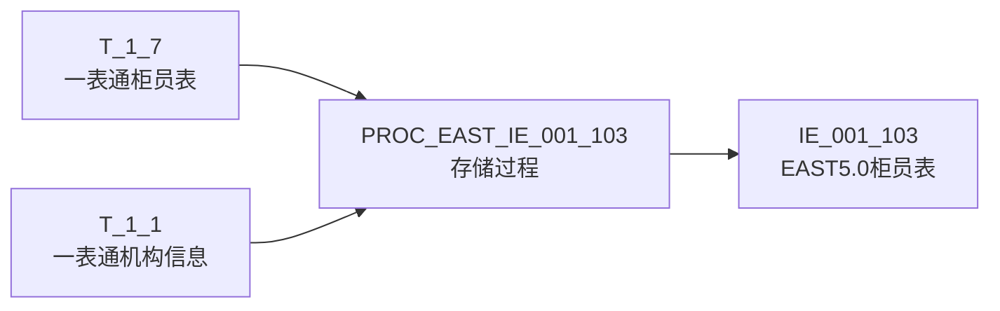
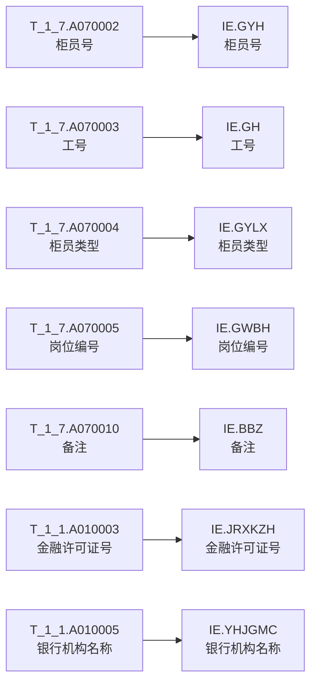
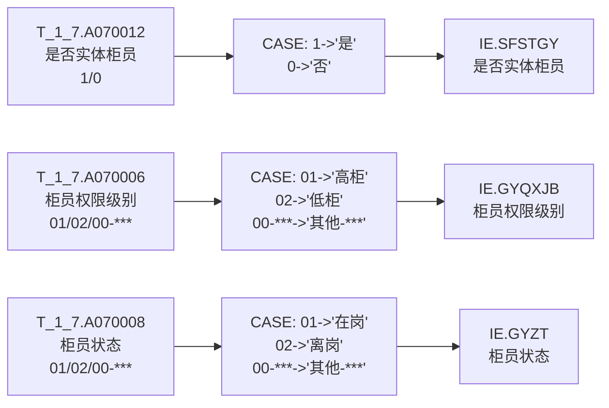
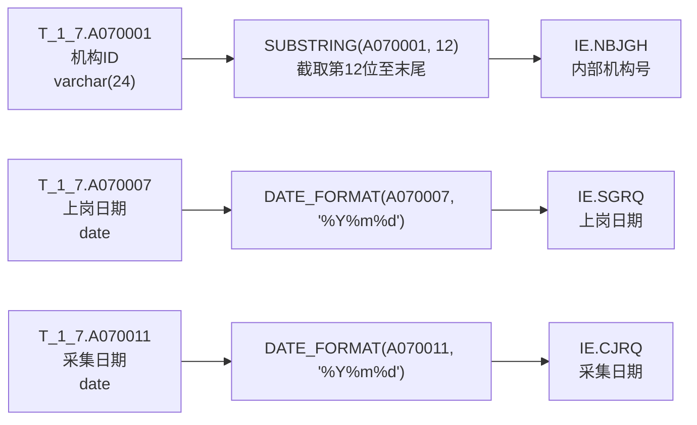

# 血缘-IE_001_103-柜员表-EAST5.0系统

## 业务链路摘要

- 本血缘描述从一表通柜员表（T_1_7）和机构信息表（T_1_1）到 EAST5.0 柜员表（IE_001_103）的数据加工链路。
- 存储过程：`PROC_EAST_IE_001_103`
- 处理动作：柜员主源过滤（在岗或当月失效）-> 左关联机构信息补字段 -> 码值转换 -> 日期格式转换 -> 写入目标表。
- 本血缘基于 `工作区/SQL开发/EAST5.0系统/PROC_EAST_IE_001_103_草案.sql` 生成，为设计血缘，尚未运行验证。

## 节点列表

| 节点 | 类型 | 说明 |
| --- | --- | --- |
| T_1_7 | 源表 | 一表通柜员表，柜员明细主源 |
| T_1_1 | 源表 | 一表通机构信息表，补金融许可证号和银行机构名称 |
| PROC_EAST_IE_001_103 | 存储过程 | EAST5.0 柜员表装载过程（草案） |
| IE_001_103 | 目标表 | EAST5.0 柜员表 |

## 表级边列表

| 源节点 | 目标节点 | 处理动作 | 证据 |
| --- | --- | --- | --- |
| T_1_7 | PROC_EAST_IE_001_103 | 过滤：采集日期=p_data_date AND (柜员状态='01' OR 失效日期>=当月月初) | PROC_EAST_IE_001_103_草案.sql |
| T_1_1 | PROC_EAST_IE_001_103 | 左关联：通过机构ID关联，取金融许可证号和银行机构名称 | PROC_EAST_IE_001_103_草案.sql |
| PROC_EAST_IE_001_103 | IE_001_103 | 插入：13 个字段映射后 INSERT SELECT | PROC_EAST_IE_001_103_草案.sql |

## 字段级边列表

| 源对象 | 源字段 | 目标对象 | 目标字段 | 处理逻辑 | 关系类型 | 证据 |
| --- | --- | --- | --- | --- | --- | --- |
| T_1_1 | A010003 | IE_001_103 | JRXKZH | NULLIF(TRIM(A010003), '') 直接映射 | 直接映射 | PROC_EAST_IE_001_103_草案.sql |
| T_1_7 | A070001 | IE_001_103 | NBJGH | SUBSTRING(NULLIF(TRIM(A070001), ''), 12) 截取第12位至末尾 | 拼接派生 | PROC_EAST_IE_001_103_草案.sql |
| T_1_1 | A010005 | IE_001_103 | YHJGMC | NULLIF(TRIM(A010005), '') 直接映射 | 直接映射 | PROC_EAST_IE_001_103_草案.sql |
| T_1_7 | A070002 | IE_001_103 | GYH | NULLIF(TRIM(A070002), '') 直接映射 | 直接映射 | PROC_EAST_IE_001_103_草案.sql |
| T_1_7 | A070003 | IE_001_103 | GH | NULLIF(TRIM(A070003), '') 直接映射 | 直接映射 | PROC_EAST_IE_001_103_草案.sql |
| T_1_7 | A070004 | IE_001_103 | GYLX | NULLIF(TRIM(A070004), '') 直接映射 | 直接映射 | PROC_EAST_IE_001_103_草案.sql |
| T_1_7 | A070012 | IE_001_103 | SFSTGY | CASE WHEN A070012='1' THEN '是' WHEN A070012='0' THEN '否' ELSE 原值 | 码值转换 | PROC_EAST_IE_001_103_草案.sql |
| T_1_7 | A070005 | IE_001_103 | GWBH | NULLIF(TRIM(A070005), '') 直接映射 | 直接映射 | PROC_EAST_IE_001_103_草案.sql |
| T_1_7 | A070006 | IE_001_103 | GYQXJB | CASE WHEN A070006='01' THEN '高柜' WHEN A070006='02' THEN '低柜' WHEN A070006 LIKE '00-%' THEN CONCAT('其他-', SUBSTRING(A070006, 4)) ELSE 原值 | 码值转换 | PROC_EAST_IE_001_103_草案.sql |
| T_1_7 | A070007 | IE_001_103 | SGRQ | DATE_FORMAT(A070007, '%Y%m%d') 日期格式转换 | 拼接派生 | PROC_EAST_IE_001_103_草案.sql |
| T_1_7 | A070008 | IE_001_103 | GYZT | CASE WHEN A070008='01' THEN '在岗' WHEN A070008='02' THEN '离岗' WHEN A070008 LIKE '00-%' THEN CONCAT('其他-', SUBSTRING(A070008, 4)) ELSE 原值 | 码值转换 | PROC_EAST_IE_001_103_草案.sql |
| T_1_7 | A070010 | IE_001_103 | BBZ | NULLIF(TRIM(A070010), '') 直接映射 | 直接映射 | PROC_EAST_IE_001_103_草案.sql |
| T_1_7 | A070011 | IE_001_103 | CJRQ | DATE_FORMAT(A070011, '%Y%m%d') 日期格式转换 | 拼接派生 | PROC_EAST_IE_001_103_草案.sql |

## 总览图

## 详细图（按处理逻辑分组）

### 直接映射字段

### 码值转换字段

### 派生/转换字段

## 已知缺口、人工假设或未确认点

1. 本血缘基于存储过程草案生成，为设计血缘，尚未运行验证。
2. `SENSITIVEFLAG`（涉密标志）和 `GSFZJG`（归属分支机构）两个字段当前 SQL 未映射，无血缘节点。
3. 一表通柜员表 T_1_7 的机构ID截取第12位至最后一位生成内部机构号的规则，需与业务确认是否所有机构ID均符合此编码规范。
4. 柜员状态码值 01=在岗、02=离岗，'00-***'→'其他-***'，是否还有其他枚举值待补。
5. 柜员权限级别码值 01=高柜、02=低柜，'00-***'→'其他-***'，是否还有其他枚举值待补。
6. 上岗日期为 NULL 的虚拟柜员，默认日期规则待业务确认。

## 相关页面

- 报表业务口径页：[[报表-IE_001_103-柜员表-EAST5.0系统]]
- 数据表页（上游）：[[数据表-T_1_7-柜员-一表通系统]]、[[数据表-T_1_1-机构信息-一表通系统]]
- 数据表页（目标）：[[数据表-IE_001_103-柜员表-EAST5.0系统]]
- 来源页：[[来源-EAST5.0系统-IE_001_103-柜员表]]、[[来源-一表通系统-1.7-柜员]]

## Open Questions

- 本血缘页为设计血缘，待存储过程运行通过后转为生产血缘。
- `SENSITIVEFLAG` 和 `GSFZJG` 字段的取数来源待补，补到后需在此追加血缘节点。
