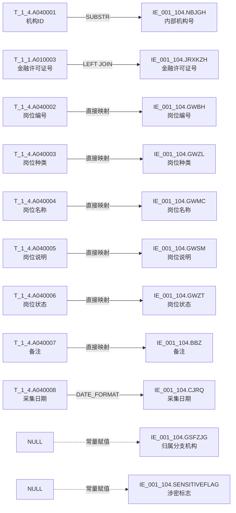

# 血缘-IE_001_104-岗位信息表-EAST5.0系统

## 业务链路摘要

- 本血缘页描述 EAST5.0 `岗位信息表`（`IE_001_104`）的数据来源链路。
- 数据来源：一表通 `T_1_4`（岗位信息）为主源，一表通 `T_1_1`（机构信息）为维度关联源。
- 映射依据：《附件2："一表通"转换EAST映射规则.xls》第 56 行。
- 存储过程：`PROC_EAST_IE_001_104_GXAXB`（`工作区/SQL开发/EAST5.0系统/PROC_EAST_IE_001_104_GXAXB_草案.sql`）。
- 报送模式：全量表，截至采集日有效数据及终态数据。

## 节点列表

| 节点 | 类型 | 系统 | 说明 |
| --- | --- | --- | --- |
| `T_1_4` | 源表 | 一表通系统 | 岗位信息，主源表 |
| `T_1_1` | 源表 | 一表通系统 | 机构信息，维度关联表 |
| `IE_001_104` | 目标表 | EAST5.0系统 | 岗位信息表 |

## 表级边列表

| 源节点 | 目标节点 | 处理动作 | 关联条件 |
| --- | --- | --- | --- |
| `T_1_4` | `IE_001_104` | 过滤（岗位撤销日期=当月或9999-12-31）+ 字段映射 + 日期格式转换 | 主表直接映射 |
| `T_1_1` | `IE_001_104` | LEFT JOIN 补充金融许可证号 | `SUBSTR(T_1_4.A040001, 12) = T_1_1.A010002` |

## 字段级边列表

| 源对象 | 源字段 | 目标对象 | 目标字段 | 处理逻辑 | 关系类型 | 证据 |
| --- | --- | --- | --- | --- | --- | --- |
| `T_1_4` | `A040001` | `IE_001_104` | `NBJGH` | `SUBSTR(A040001, 12)`，从第12位截取至最后一位 | 拼接派生 | 《附件2："一表通"转换EAST映射规则.xls》第56行 |
| `T_1_1` | `A010003` | `IE_001_104` | `JRXKZH` | LEFT JOIN 通过内部机构号关联获取 | 直接映射 | 《附件2："一表通"转换EAST映射规则.xls》 |
| `T_1_4` | `A040002` | `IE_001_104` | `GWBH` | 直接映射 | 直接映射 | 《附件2："一表通"转换EAST映射规则.xls》 |
| `T_1_4` | `A040003` | `IE_001_104` | `GWZL` | 直接映射 | 直接映射 | 《附件2："一表通"转换EAST映射规则.xls》 |
| `T_1_4` | `A040004` | `IE_001_104` | `GWMC` | 直接映射 | 直接映射 | 《附件2："一表通"转换EAST映射规则.xls》 |
| `T_1_4` | `A040005` | `IE_001_104` | `GWSM` | 直接映射 | 直接映射 | 《附件2："一表通"转换EAST映射规则.xls》 |
| `T_1_4` | `A040006` | `IE_001_104` | `GWZT` | 直接映射 | 直接映射 | 《附件2："一表通"转换EAST映射规则.xls》 |
| `T_1_4` | `A040007` | `IE_001_104` | `BBZ` | 直接映射 | 直接映射 | 《附件2："一表通"转换EAST映射规则.xls》 |
| `T_1_4` | `A040008` | `IE_001_104` | `CJRQ` | `DATE_FORMAT(A040008, '%Y%m%d')`，DATE 转 YYYYMMDD | 拼接派生 | 《附件2："一表通"转换EAST映射规则.xls》 |
| — | — | `IE_001_104` | `GSFZJG` | 无映射来源，置 NULL | 常量赋值 | 待确认 |
| — | — | `IE_001_104` | `SENSITIVEFLAG` | 无映射来源，置 NULL | 常量赋值 | 待确认 |

## 过滤条件

| 过滤字段 | 过滤条件 | 业务含义 | 证据 |
| --- | --- | --- | --- |
| `T_1_4.A040010` | `= DATE_FORMAT(V_DATA_DATE, '%Y-%m-%d') OR = '9999-12-31'` | 岗位撤销日期等于当月 或 9999-12-31（视为有效/终态） | 《附件2："一表通"转换EAST映射规则.xls》第56行 |

## Mermaid 总览图

```mermaid
graph LR
    T14["T_1_4\n岗位信息\n一表通系统"] -->|SUBSTR(A040001,12) 过滤 A040010| IE104["IE_001_104\n岗位信息表\nEAST5.0系统"]
    T11["T_1_1\n机构信息\n一表通系统"] -->|LEFT JOIN SUBSTR(A040001,12)=A010002| IE104
```

## Mermaid 详细字段级图



## 已知缺口与未确认点

- `GSFZJG`（归属分支机构）和 `SENSITIVEFLAG`（涉密标志）无映射来源，SQL 中置 NULL，需确认是否报送及数据来源。
- 一表通 `T_1_4` 的 `A040001`（机构ID）截取第12位后与 `T_1_1` 的 `A010002`（内部机构号）匹配关系，需确认截取起始位是否固定。
- 存储过程草案尚未运行验证，实际执行结果可能与预期存在差异。
- 岗位撤销日期的"当月"判断逻辑需确认是否应使用采集日期的年月。
- 9999-12-31 作为有效岗位常量是否统一，需确认外部原文。

## 相关页面

- 数据表页：[[数据表-IE_001_104-岗位信息表-EAST5.0系统]]
- 上游数据表页：[[数据表-T_1_4-岗位信息-一表通系统]]
- 上游来源页：[[来源-一表通系统-1.4-岗位信息]]
- EAST5.0 来源页：[[来源-EAST5.0系统-IE_001_104-岗位信息表]]
- 报表业务口径页：[[报表-IE_001_104-岗位信息表-EAST5.0系统]]
- SQL 草案：`工作区/SQL开发/EAST5.0系统/PROC_EAST_IE_001_104_GXAXB_草案.sql`
- 校验 SQL：`工作区/SQL开发/EAST5.0系统/CHECK_EAST_IE_001_104_GXAXB_校验.sql`
