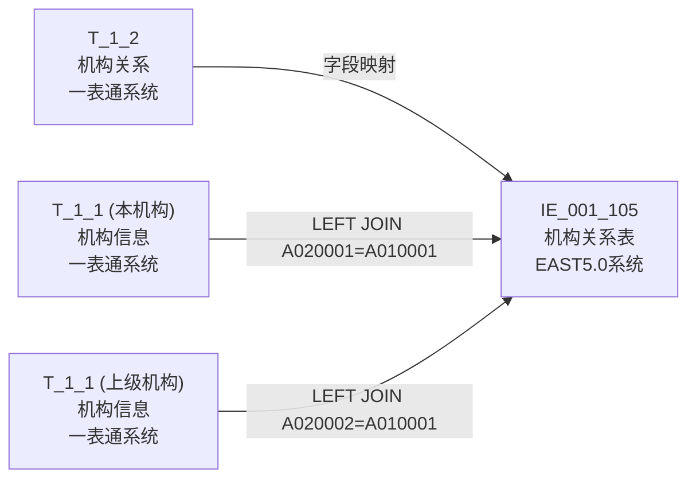
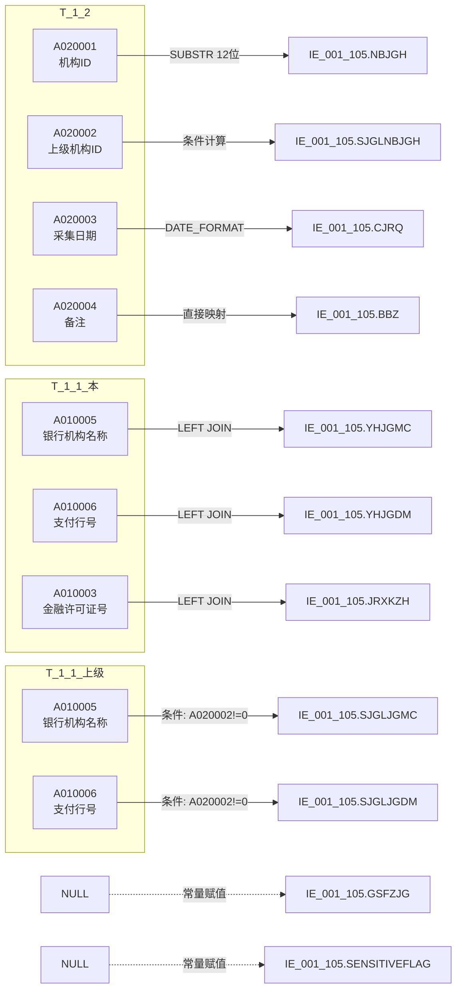

# 血缘-IE_001_105-机构关系表-EAST5.0系统

## 业务链路摘要

- 本血缘页描述 EAST5.0 `机构关系表`（`IE_001_105`）的数据来源链路。
- 数据来源：一表通 `T_1_2`（机构关系）为主源，一表通 `T_1_1`（机构信息）为维度关联源。
- 映射依据：《附件2："一表通"转换EAST映射规则.xls》第 66 行。
- 存储过程：`PROC_EAST_IE_001_105`（`工作区/SQL开发/EAST5.0系统/PROC_EAST_IE_001_105_草案.sql`）。
- 报送模式：全量表，截至采集日有效数据及终态数据。

## 节点列表

| 节点 | 类型 | 系统 | 说明 |
| --- | --- | --- | --- |
| `T_1_2` | 源表 | 一表通系统 | 机构关系，主源表 |
| `T_1_1` (本机构) | 源表 | 一表通系统 | 机构信息，维度关联：本机构信息 |
| `T_1_1` (上级机构) | 源表 | 一表通系统 | 机构信息，维度关联：上级机构信息（仅 A020002≠'0'） |
| `IE_001_105` | 目标表 | EAST5.0系统 | 机构关系表 |

## 表级边列表

| 源节点 | 目标节点 | 处理动作 | 关联条件 |
| --- | --- | --- | --- |
| `T_1_2` | `IE_001_105` | 过滤（采集日期）+ 字段映射 + 截取计算 | 主表直接映射 |
| `T_1_1` (本机构) | `IE_001_105` | LEFT JOIN 补充本机构名称、支付行号、许可证号 | `T_1_2.A020001 = T_1_1.A010001 AND A010020 = V_DATA_DATE` |
| `T_1_1` (上级机构) | `IE_001_105` | LEFT JOIN 补充上级机构名称、支付行号 | `T_1_2.A020002 = T_1_1.A010001 AND A020002 ≠ '0'` |

## 字段级边列表

| 源对象 | 源字段 | 目标对象 | 目标字段 | 处理逻辑 | 关系类型 | 证据 |
| --- | --- | --- | --- | --- | --- | --- |
| `T_1_1` | `A010005` | `IE_001_105` | `YHJGMC` | LEFT JOIN 通过 A020001=A010001 获取 | 直接映射 | SQL草案 |
| `T_1_1` | `A010003` | `IE_001_105` | `JRXKZH` | LEFT JOIN 通过 A020001=A010001 获取 | 直接映射 | SQL草案 |
| `T_1_1` | `A010006` | `IE_001_105` | `SJGLJGDM` | CASE WHEN：A020002='0'→'0'；否则取上级 A010006 | 条件映射 | SQL草案 |
| — | — | `IE_001_105` | `GSFZJG` | 无映射来源，置 NULL | 常量赋值 | 待确认 |
| `T_1_2` | `A020002` | `IE_001_105` | `SJGLNBJGH` | CASE WHEN：A020002='0'→'0'；否则 SUBSTR(A020002, 12) | 条件计算 | 映射规则 |
| `T_1_1` | `A010006` | `IE_001_105` | `YHJGDM` | LEFT JOIN 通过 A020001=A010001 获取 | 直接映射 | SQL草案 |
| `T_1_2` | `A020004` | `IE_001_105` | `BBZ` | 直接取值 | 直接映射 | SQL草案 |
| `T_1_2` | `A020003` | `IE_001_105` | `CJRQ` | `DATE_FORMAT('%Y%m%d')` | 日期格式 | SQL草案 |
| — | — | `IE_001_105` | `SENSITIVEFLAG` | 无映射来源，置 NULL | 常量赋值 | 待确认 |
| `T_1_2` | `A020001` | `IE_001_105` | `NBJGH` | `SUBSTR(A020001, 12)` | 截取派生 | 映射规则 |
| `T_1_1` | `A010005` | `IE_001_105` | `SJGLJGMC` | CASE WHEN：A020002='0'→本机构 A010005；否则取上级 A010005 | 条件映射 | SQL草案 |

## 过滤条件

| 过滤字段 | 过滤条件 | 业务含义 | 证据 |
| --- | --- | --- | --- |
| `T_1_2.A020020` | `= V_DATA_DATE` | 仅取采集日期当期数据 | 映射规则 |

## Mermaid 总览图

## Mermaid 详细字段级图

## 已知缺口与未确认点

- `GSFZJG`（归属分支机构）和 `SENSITIVEFLAG`（涉密标志）无映射来源，SQL 中置 NULL，需确认是否报送及数据来源。
- 上级机构关联条件 `A020002 ≠ '0'` 时 LEFT JOIN，'0' 时使用本机构信息兜底，需确认'0'是否为常量代表无上级。
- 内部机构号 `SUBSTR(A020001, 12)` 截取逻辑待确认。
- 存储过程草案尚未运行验证，实际执行结果可能与预期存在差异。

## 相关页面

- 数据表页：[[数据表-IE_001_105-机构关系表-EAST5.0系统]]
- 上游数据表页：[[数据表-T_1_2-机构关系-一表通系统]]
- 上游数据表页：[[数据表-T_1_1-机构信息-一表通系统]]
- 上游来源页：[[来源-一表通系统-1.2-机构关系]]
- EAST5.0 来源页：[[来源-EAST5.0系统-IE_001_105-机构关系表]]
- 报表业务口径页：[[报表-IE_001_105-机构关系表-EAST5.0系统]]
- SQL 草案：`工作区/SQL开发/EAST5.0系统/PROC_EAST_IE_001_105_草案.sql`
