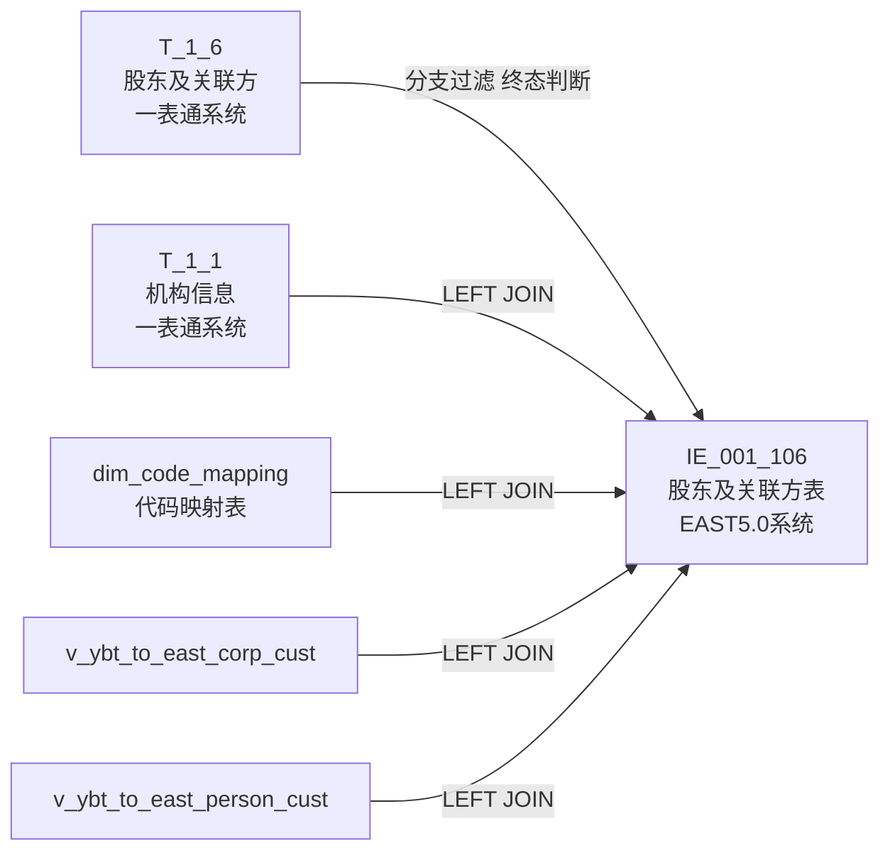
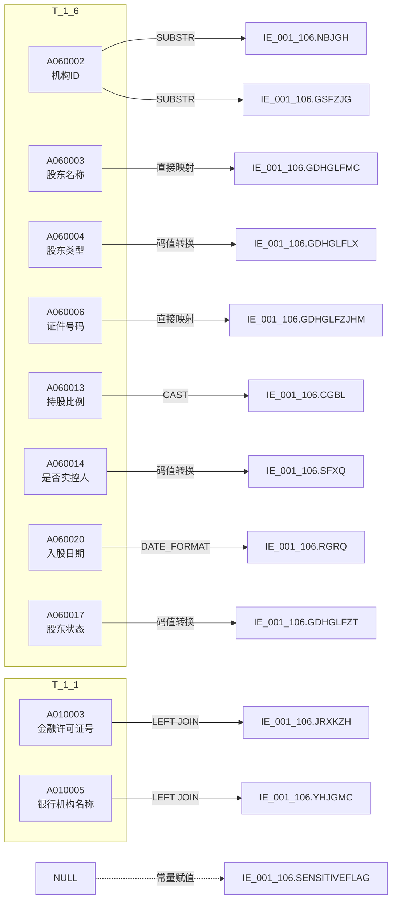

# 血缘-IE_001_106-股东及关联方信息表-EAST5.0系统

## 业务链路摘要

- 本血缘页描述 EAST5.0 `股东及关联方信息表`（`IE_001_106`）的数据来源链路。
- 数据来源：一表通 `T_1_6`（股东及关联方信息）为主源，一表通 `T_1_1`（机构信息）为维度关联源。
- 映射依据：《附件2："一表通"转换EAST映射规则.xls》第 76 行。
- 存储过程：`PROC_EAST_IE_001_106_GDHLFBXXB`（`工作区/SQL开发/EAST5.0系统/PROC_EAST_IE_001_106_GDHLFBXXB_草案.sql`）。
- 报送模式：全量表，截至采集日有效数据及终态数据。上市/未上市双分支独立处理。

## 节点列表

| 节点 | 类型 | 系统 | 说明 |
| --- | --- | --- | --- |
| `T_1_6` (当期) | 源表 | 一表通系统 | 股东及关联方信息，主源表 |
| `T_1_6` (上月) | 源表 | 一表通系统 | 上月数据，终态判断辅助 |
| `T_1_1` | 源表 | 一表通系统 | 机构信息，维度关联表 |
| `dim_code_mapping` | 源表 | 待确认 | 代码映射表，证件类别转换 |
| `v_ybt_to_east_corp_cust` | 源表 | 待确认 | 转EAST对公客户表 |
| `v_ybt_to_east_person_cust` | 源表 | 待确认 | 转EAST个人客户表 |
| `IE_001_106` | 目标表 | EAST5.0系统 | 股东及关联方信息表 |

## 表级边列表

| 源节点 | 目标节点 | 处理动作 | 关联条件 |
| --- | --- | --- | --- |
| `T_1_6` | `IE_001_106` | 上市/未上市分支过滤 + 终态判断 + 字段映射 | `A060024=V_DATA_DATE` |
| `T_1_1` | `IE_001_106` | LEFT JOIN 补充金融许可证号、银行机构名称 | `A060002=A010001 AND A010020=V_DATA_DATE` |
| `dim_code_mapping` | `IE_001_106` | LEFT JOIN 证件类别码值转换 | `A060005=source_code AND type=...` |
| `v_ybt_to_east_corp_cust` | `IE_001_106` | LEFT JOIN 对公客户统一编号 | 通过客户ID关联 |
| `v_ybt_to_east_person_cust` | `IE_001_106` | LEFT JOIN 个人客户统一编号 | 通过客户ID关联 |

## 字段级边列表

| 源对象 | 源字段 | 目标对象 | 目标字段 | 处理逻辑 | 关系类型 | 证据 |
| --- | --- | --- | --- | --- | --- | --- |
| `T_1_1` | `A010003` | `IE_001_106` | `JRXKZH` | LEFT JOIN 获取 | 直接映射 | SQL草案 |
| 入参 | `p_data_date` | `IE_001_106` | `CJRQ` | 直接使用入参 | 常量赋值 | SQL草案 |
| `T_1_6` | `A060013` | `IE_001_106` | `BLXX` | '00'→NULL；否则 TRIM(LEADING '0') | 条件映射 | 映射规则 |
| `T_1_1` | `A010005` | `IE_001_106` | `YHJGMC` | LEFT JOIN 获取 | 直接映射 | SQL草案 |
| `T_1_6` | `A060008` | `IE_001_106` | `ZCD` | NULLIF(TRIM()) | 直接映射 | 映射规则 |
| `T_1_6` | `A060009` | `IE_001_106` | `GXLX` | 01→'1', ... 13→'13'; 00-XX→'其他-XX' | 码值转换 | 映射规则 |
| `T_1_6` | `A060011` | `IE_001_106` | `CGSYYHSL` | CAST AS DECIMAL(20,0) | 类型转换 | 映射规则 |
| `T_1_6` | `A060014` | `IE_001_106` | `SFXQ` | '0'→'否'; '1'→'是' | 码值转换 | 映射规则 |
| `T_1_6` | `A060015` | `IE_001_106` | `RGZJLY` | 01→自有资金; 02→委托资金; 03→债务资金; 00-XX→其他-XX | 码值转换 | 映射规则 |
| `T_1_6` | `A060018` | `IE_001_106` | `CGSL` | CAST AS DECIMAL(20,0) | 类型转换 | 映射规则 |
| `T_1_6` | `A060020` | `IE_001_106` | `RGRQ` | DATE_FORMAT('%Y%m%d') | 日期格式 | 映射规则 |
| `T_1_6` | `A060021` | `IE_001_106` | `ZYBL` | CAST AS DECIMAL(20,6) | 类型转换 | 映射规则 |
| `T_1_6` | `A060023` | `IE_001_106` | `ZJYCBDRQ` | DATE_FORMAT('%Y%m%d') | 日期格式 | 映射规则 |
| `T_1_6` | `A060030` | `IE_001_106` | `BBZ` | NULLIF(TRIM()) | 直接映射 | 映射规则 |
| `T_1_6` | `A060002` | `IE_001_106` | `GSFZJG` | SUBSTRING(12)（与 NBJGH 同源，待确认） | 截取派生 | SQL草案 |
| `T_1_6` | `A060002` | `IE_001_106` | `NBJGH` | SUBSTRING(NULLIF(TRIM()), 12) | 截取派生 | 映射规则 |
| `v_ybt_to_east_corp_cust` / `v_ybt_to_east_person_cust` | `east_cust_id` | `IE_001_106` | `KHTYBH` | COALESCE(对公编号, 个人编号) | 条件映射 | 映射规则 |
| `T_1_6` | `A060003` | `IE_001_106` | `GDHGLFMC` | NULLIF(TRIM()) | 直接映射 | 映射规则 |
| `T_1_6` | `A060004` | `IE_001_106` | `GDHGLFLX` | 码值映射（01→自然人中国公民, ... 16→境外机构, 00-XX→其他-XX） | 码值转换 | 映射规则 |
| `dim_code_mapping` | `target_desc` | `IE_001_106` | `GDHGLFZJLB` | COALESCE(映射表结果, '00-XX'→'其他-XX'兜底) | 维表映射 | 映射规则 |
| `T_1_6` | `A060006` | `IE_001_106` | `GDHGLFZJHM` | NULLIF(TRIM()) | 直接映射 | 映射规则 |
| `T_1_6` | `A060007` | `IE_001_106` | `SSHY` | '99999'→'境外'; 否则直取 | 条件映射 | 映射规则 |
| `T_1_6` | `A060010` | `IE_001_106` | `SJKZR` | '0'→'无'; 否则直取 | 条件映射 | 映射规则 |
| `T_1_6` | `A060012` | `IE_001_106` | `KGSL` | CAST AS DECIMAL(20,0) | 类型转换 | 映射规则 |
| `T_1_6` | `A060016` | `IE_001_106` | `RGZJZH` | NULLIF(TRIM()) | 直接映射 | 映射规则 |
| `T_1_6` | `A060019` | `IE_001_106` | `CGBL` | CAST AS DECIMAL(20,6) | 类型转换 | 映射规则 |
| `T_1_6` | `A060022` | `IE_001_106` | `SFZPDJS` | '0'→'否'; '1'→'是' | 码值转换 | 映射规则 |
| `T_1_6` | `A060017` | `IE_001_106` | `GDHGLFZT` | 01→'有效'; 00→'无效'; 00-XX→'其他-XX' | 码值转换 | 映射规则 |
| — | — | `IE_001_106` | `SENSITIVEFLAG` | 无映射来源，置 NULL | 常量赋值 | 待确认 |

## 过滤条件

| 过滤字段 | 过滤条件 | 业务含义 | 证据 |
| --- | --- | --- | --- |
| `T_1_6.A060024` | `= V_DATA_DATE` | 仅取采集日期当期数据 | 映射规则 |
| `T_1_6.A060019, A060029` | 上市标识=1 且 CAST(A060019≥0.01) | 上市分支：持股≥1% | 映射规则 |
| `T_1_6.A060022, A060029` | 上市标识=1 且 A060022=1 | 上市分支：派驻董监事 | 映射规则 |
| `T_1_6.A060029` | 上市标识=0 全量保留 | 未上市分支全量 | 映射规则 |
| cur.A060017 + prev.A060017 | cur='00' AND prev='00' → 排除 | 连续两月无效排除（终态判断） | 映射规则 |

## Mermaid 总览图

## Mermaid 详细字段级图

## 已知缺口与未确认点

- `SENSITIVEFLAG`（涉密标志）无映射来源，SQL 中置 NULL。
- `GSFZJG`（归属分支机构）当前以 NBJGH 兜底，映射规则未明确提供来源。
- `dim_code_mapping`（代码映射表）物理表名待确认。
- `v_ybt_to_east_corp_cust`（转EAST对公客户表）物理表名待确认。
- `v_ybt_to_east_person_cust`（转EAST个人客户表）物理表名待确认。
- KHTYBH 通过 COALESCE 取对公/个人客户编号，两表都取不到时可能为 NULL（主键不允许为空）。

## 相关页面

- 数据表页：[[数据表-IE_001_106-股东及关联方信息表-EAST5.0系统]]
- 上游数据表页：[[数据表-T_1_6-股东及关联方信息-一表通系统]]
- 上游数据表页：[[数据表-T_1_1-机构信息-一表通系统]]
- 上游来源页：[[来源-一表通系统-1.6-股东及关联方信息]]
- EAST5.0 来源页：[[来源-EAST5.0系统-IE_001_106-股东及关联方信息表]]
- 报表业务口径页：[[报表-IE_001_106-股东及关联方信息表-EAST5.0系统]]
- SQL 草案：`工作区/SQL开发/EAST5.0系统/PROC_EAST_IE_001_106_GDHLFBXXB_草案.sql`
- 校验 SQL：`工作区/SQL开发/EAST5.0系统/CHECK_EAST_IE_001_106_GDHLFBXXB_校验.sql`
- 实现说明：`工作区/SQL开发/EAST5.0系统/说明-IE_001_106-股东及关联方信息表.md`
