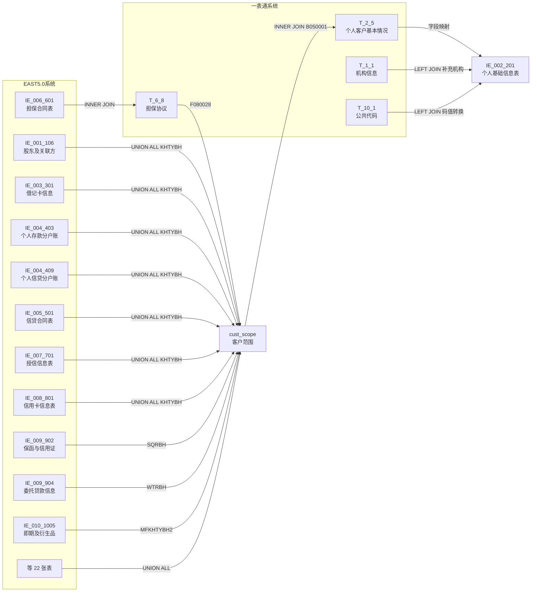

# 血缘-IE_002_201-个人基础信息表-EAST5.0系统

## 业务链路摘要

- 本血缘页描述 EAST5.0 `个人基础信息表`（`IE_002_201`）的数据来源链路。
- 数据来源：一表通 `T_2_5`（个人客户基本情况）为主源，一表通 `T_1_1`（机构信息）为维度关联源，一表通 `T_10_1`（公共代码）为码值转换源。
- 客户范围圈定：从 22 张 EAST 业务表 UNION ALL 取当期 KHTYBH + 表内外业务担保合同表关联担保协议补担保人客户ID，最终 DISTINCT 去重。
- 存储过程：`PROC_EAST_IE_002_201`（`工作区/SQL开发/EAST5.0系统/PROC_EAST_IE_002_201_草案.sql`）。
- 报送模式：全量表，截至采集日有效数据及终态数据。

## 节点列表

| 节点 | 类型 | 系统 | 说明 |
| --- | --- | --- | --- |
| `T_2_5` | 源表 | 一表通系统 | 个人客户基本情况，主源表 |
| `T_1_1` | 源表 | 一表通系统 | 机构信息，维度关联表 |
| `T_10_1` | 源表 | 一表通系统 | 公共代码，码值转换（国籍、学历） |
| `T_6_8` | 源表 | 一表通系统 | 担保协议，担保人补集关联 |
| `IE_006_601` | 源表 | EAST5.0系统 | 表内外业务担保合同表，担保人补集 |
| `IE_001_106` ~ `IE_010_1005_INC` | 源表 | EAST5.0系统 | 22 张 EAST 业务表，KHTYBH 来源 |
| `cust_scope_raw` | CTE | — | 22 张 EAST 表 UNION ALL 取 KHTYBH |
| `cust_scope_guar` | CTE | — | 担保人补集（IE_006_601 INNER JOIN T_6_8） |
| `cust_scope` | CTE | — | UNION ALL 后 DISTINCT 去重 |
| `cust_info` | CTE | — | T_2_5 按 KHTYBH 去重（ROW_NUMBER） |
| `org_info` | CTE | — | T_1_1 取当期机构信息 |
| `code_nation` | CTE | — | T_10_1 过滤 表名=通用, 字段名=国家地区 |
| `code_edu` | CTE | — | T_10_1 过滤 表名=通用, 字段名=学历 |
| `IE_002_201` | 目标表 | EAST5.0系统 | 个人基础信息表 |

## 表级边列表

| 源节点 | 目标节点 | 处理动作 | 关联条件 |
| --- | --- | --- | --- |
| 22 张 EAST 表 | `cust_scope_raw` | UNION ALL SELECT KHTYBH | `KHTYBH IS NOT NULL AND CJRQ = I_DATE` |
| `IE_006_601` + `T_6_8` | `cust_scope_guar` | INNER JOIN 取担保人客户ID | `DBHTH=F080001 AND BDBHTH=F080003 AND F080004 IN ('03','04','05','06')` |
| `cust_scope_raw` + `cust_scope_guar` | `cust_scope` | UNION ALL + DISTINCT 去重 | — |
| `T_2_5` | `cust_info` | 过滤 + ROW_NUMBER 去重 | `B050036=V_DATA_DATE AND (B050038 IS NULL OR B050038>=日期)` |
| `cust_scope` + `cust_info` | `IE_002_201` | INNER JOIN 客户信息 + LEFT JOIN 维度表 + 字段映射 | `KHTYBH=B050001` |
| `T_1_1` | `IE_002_201` | LEFT JOIN 补充金融许可证号、银行机构名称 | `B050002=A010002` |
| `T_10_1` (国籍) | `IE_002_201` | LEFT JOIN 补充国籍中文含义 | `B050032=K010004` |
| `T_10_1` (学历) | `IE_002_201` | LEFT JOIN 补充学历中文含义 | `B050011=K010004` |

## 字段级边列表

| 源对象 | 源字段 | 目标对象 | 目标字段 | 处理逻辑 | 关系类型 | 证据 |
| --- | --- | --- | --- | --- | --- | --- |
| `T_1_1` | `A010003` | `IE_002_201` | `JRXKZH` | NULLIF(TRIM())，LEFT JOIN 通过 B050002=A010002 获取 | 直接映射 | SQL草案 |
| `T_2_5` | `B050002` | `IE_002_201` | `NBJGH` | `SUBSTR(B050002, 12)`，从第12位截取至最后 | 截取派生 | 需求文档 |
| `T_1_1` | `A010005` | `IE_002_201` | `YHJGMC` | NULLIF(TRIM())，LEFT JOIN 获取 | 直接映射 | SQL草案 |
| `T_2_5` | `B050001` | `IE_002_201` | `KHTYBH` | 直接取值，INNER JOIN cust_scope | 直接映射 | SQL草案 |
| `T_2_5` | `B050003` | `IE_002_201` | `KHXM` | 直接取值 | 直接映射 | SQL草案 |
| `T_2_5` | `B050005/B050006/B050007` | `IE_002_201` | `ZJLB` | CASE WHEN：身份证非空→'居民身份证'；护照非空→'护照'；否则取其他证件类型 | 条件映射 | 需求文档 |
| `T_2_5` | `B050005/B050006/B050008` | `IE_002_201` | `ZJHM` | COALESCE(身份证, 护照, 其他证件号码) | 条件映射 | 需求文档 |
| `T_2_5` | `B050004` | `IE_002_201` | `BXYGBZ` | CASE WHEN 码值转换：01→普通个人客户; 02→个体工商户; 03→小微企业主; 04→境外客户; 00-XX→其他-XX | 码值转换 | 需求文档 |
| `T_10_1` | `K010005` | `IE_002_201` | `GJHDQ` | LEFT JOIN code_nation（表名=通用, 字段名=国家地区），COALESCE 兜底'其他国家和地区' | 维表映射 | 需求文档 |
| `T_2_5` | `B050009` | `IE_002_201` | `MZ` | NULLIF(TRIM()) | 直接映射 | SQL草案 |
| `T_2_5` | `B050010` | `IE_002_201` | `XB` | CASE WHEN：'01'→'男'; '02'→'女' | 码值转换 | 需求文档 |
| `T_10_1` | `K010005` | `IE_002_201` | `XL` | LEFT JOIN code_edu（表名=通用, 字段名=学历） | 维表映射 | 需求文档 |
| `T_2_5` | `B050012` | `IE_002_201` | `CSNY` | `LEFT(DATE_FORMAT('%Y%m%d'), 6)`，日期截取前6位 | 日期格式 | 需求文档 |
| `T_2_5` | `B050013` | `IE_002_201` | `SFYH` | CASE WHEN：'0'→'否'; '1'→'是' | 码值转换 | 需求文档 |
| `T_2_5` | `B050016` | `IE_002_201` | `GZDWMC` | NULLIF(TRIM()) | 直接映射 | SQL草案 |
| `T_2_5` | `B050018` | `IE_002_201` | `GZDWDZ` | NULLIF(TRIM()) | 直接映射 | SQL草案 |
| `T_2_5` | `B050017` | `IE_002_201` | `GZDWDH` | NULLIF(TRIM()) | 直接映射 | SQL草案 |
| `T_2_5` | `B050019` | `IE_002_201` | `DWXZ` | CASE WHEN 码值转换：01→国有企业; 02→民营企业; 03→政府机关; 04→事业单位; 05→社会团体; 06→境外机构; 00-XX→其他-XX | 码值转换 | 需求文档 |
| `T_2_5` | `B050020` | `IE_002_201` | `ZY` | NULLIF(TRIM()) | 直接映射 | SQL草案 |
| `T_2_5` | `B050021` | `IE_002_201` | `ZW` | NULLIF(TRIM()) | 直接映射 | SQL草案 |
| `T_2_5` | `B050022` | `IE_002_201` | `GRNSR` | NULLIF(TRIM()) | 直接映射 | SQL草案 |
| `T_2_5` | `B050024` | `IE_002_201` | `TXDZ` | NULLIF(TRIM()) | 直接映射 | SQL草案 |
| `T_2_5` | `B050014/B050015` | `IE_002_201` | `LXDH` | COALESCE(电话1, 电话2) | 条件映射 | 需求文档 |
| `T_2_5` | `B050027` | `IE_002_201` | `XDKHBZ` | CASE WHEN：B050027≠'9999-12'→'是'; 否则→'否' | 条件映射 | 需求文档 |
| `T_2_5` | `B050027` | `IE_002_201` | `SCJLXDGXNY` | `REPLACE('-', '')` 转为 YYYYMM | 日期格式 | 需求文档 |
| `T_2_5` | `B050033` | `IE_002_201` | `SFNH` | CASE WHEN：'0'→'否'; '1'→'是' | 码值转换 | 需求文档 |
| `T_2_5` | `B050026` | `IE_002_201` | `BHYGBZ` | CASE WHEN：'0'→'否'; '1'→'是' | 码值转换 | 需求文档 |
| `T_2_5` | `B050028` | `IE_002_201` | `SHMDBZ` | CASE WHEN：'0'→'否'; '1'→'是' | 码值转换 | 需求文档 |
| `T_2_5` | `B050029` | `IE_002_201` | `SHMDRQ` | `DATE_FORMAT('%Y%m%d')`，YYYY-MM-DD 转 YYYYMMDD | 日期格式 | 需求文档 |
| `T_2_5` | `B050039` | `IE_002_201` | `BBZ` | NULLIF(TRIM()) | 直接映射 | SQL草案 |
| 入参 | `I_DATE` | `IE_002_201` | `CJRQ` | 直接使用存储过程入参 | 常量赋值 | SQL草案 |
| — | — | `IE_002_201` | `SENSITIVEFLAG` | 无映射来源，置 NULL | 常量赋值 | 待确认 |
| — | — | `IE_002_201` | `GSFZJG` | 无映射来源，置 NULL | 常量赋值 | 待确认 |

## 过滤条件

| 过滤字段 | 过滤条件 | 业务含义 | 证据 |
| --- | --- | --- | --- |
| 各 EAST 表 `CJRQ` | `= I_DATE` | 仅取当期数据 | 需求文档 表级规则 |
| 各 EAST 表 `KHTYBH` | `IS NOT NULL` | 客户统一编号不为空 | 需求文档 表级规则 |
| `T_6_8.F080004` | `IN ('03','04','05','06')` | 担保类型为特定类型 | 需求文档 |
| `T_2_5.B050036` | `= V_DATA_DATE` | 仅取采集日期当期数据 | 需求文档 |
| `T_2_5.B050038` | `IS NULL OR >= DATE_SUB(V_DATA_DATE, INTERVAL 1 DAY)` | 有效（无失效日期）或终态（失效日期≥上一采集日） | AGENTS.md 全量报送规则 |
| `cust_info.rn` | `= 1` | 同一客户跨多机构去重，按机构ID升序取第一条 | SQL草案（待确认策略） |

## Mermaid 总览图

## Mermaid 详细字段级图

```mermaid
graph LR
    subgraph 一表通_T2_5
        S_ID["B050001<br/>客户ID"]
        S_ORG["B050002<br/>机构ID"]
        S_NAME["B050003<br/>客户名称"]
        S_CARD["B050005<br/>身份证"]
        S_PASS["B050006<br/>护照号"]
        S_OTYPE["B050007<br/>其他证件类型"]
        S_ONUM["B050008<br/>其他证件号码"]
        S_SEX["B050010<br/>性别"]
        S_MARRY["B050013<br/>已婚标识"]
        S_CUSTYPE["B050004<br/>客户类型"]
        S_UNIT["B050019<br/>单位性质"]
        S_BIRTH["B050012<br/>出生日期"]
        S_CREDIT["B050027<br/>首次信贷年月"]
        S_FARMER["B050033<br/>农户标识"]
        S_EMP["B050026<br/>员工标识"]
        S_BLACK["B050028<br/>黑名单标识"]
        S_BLACKDT["B050029<br/>黑名单日期"]
        S_PHONE1["B050014<br/>电话1"]
        S_PHONE2["B050015<br/>电话2"]
    end
    subgraph 一表通_T1_1
        O_LIC["A010003<br/>金融许可证号"]
        O_NAME["A010005<br/>银行机构名称"]
    end
    subgraph 一表通_T10_1
        C_NATION["K010005<br/>国籍含义"]
        C_EDU["K010005<br/>学历含义"]
    end

    S_ID -->|直接映射| T_KHTYBH["IE_002_201.KHTYBH"]
    S_ORG -->|截取第12位| T_NBJGH["IE_002_201.NBJGH"]
    S_NAME -->|直接映射| T_KHXM["IE_002_201.KHXM"]
    S_CARD -->|COALESCE优先| T_ZJHM["IE_002_201.ZJHM"]
    S_PASS -->|COALESCE优先| T_ZJHM
    S_ONUM -->|COALESCE兜底| T_ZJHM
    S_CARD -->|CASE WHEN| T_ZJLB["IE_002_201.ZJLB"]
    S_PASS -->|CASE WHEN| T_ZJLB
    S_OTYPE -->|CASE WHEN| T_ZJLB
    S_SEX -->|01→男,02→女| T_XB["IE_002_201.XB"]
    S_MARRY -->|0→否,1→是| T_SFYH["IE_002_201.SFYH"]
    S_CUSTYPE -->|码值转换| T_BXYGBZ["IE_002_201.BXYGBZ"]
    S_UNIT -->|码值转换| T_DWXZ["IE_002_201.DWXZ"]
    S_BIRTH -->|LEFT前6位| T_CSNY["IE_002_201.CSNY"]
    S_CREDIT -->|≠9999-12→是| T_XDKHBZ["IE_002_201.XDKHBZ"]
    S_FARMER -->|0→否,1→是| T_SFNH["IE_002_201.SFNH"]
    S_EMP -->|0→否,1→是| T_BHYGBZ["IE_002_201.BHYGBZ"]
    S_BLACK -->|0→否,1→是| T_SHMDBZ["IE_002_201.SHMDBZ"]
    S_BLACKDT -->|DATE_FORMAT| T_SHMDRQ["IE_002_201.SHMDRQ"]
    S_PHONE1 -->|COALESCE| T_LXDH["IE_002_201.LXDH"]
    S_PHONE2 -->|COALESCE| T_LXDH
    O_LIC -->|LEFT JOIN| T_JRXKZH["IE_002_201.JRXKZH"]
    O_NAME -->|LEFT JOIN| T_YHJGMC["IE_002_201.YHJGMC"]
    C_NATION -->|LEFT JOIN| T_GJHDQ["IE_002_201.GJHDQ"]
    C_EDU -->|LEFT JOIN| T_XL["IE_002_201.XL"]
```

## 已知缺口与未确认点

- `SENSITIVEFLAG`（涉密标志）和 `GSFZJG`（归属分支机构）无映射来源，SQL 中置 NULL，需确认是否报送及数据来源。
- 同一客户跨多机构去重策略（当前 ROW_NUMBER() ORDER BY B050002），是否应改为保留多机构记录待确认。
- 内部机构号 `SUBSTR(B050002, 12)` 截取逻辑待确认实际字段格式。
- T_2_5.B050033 是"农户及新型农业经营主体标识"而非单纯的"农户标识"，字段映射偏差待确认。
- 学历字段 B050011 是代码还是文字待确认，当前关联 T_10_1 可能匹配不到。
- 担保人补集中可能混入对公客户 ID，应对公客户已在对公客户信息表覆盖，混入个人表待确认。
- 对公存款分户账 IE_004_405 的 KHTYBH 注释关联对公客户信息表，纳入个人报送客户范围是否合理待确认。
- 22 张 EAST 业务表的实际数据存在性待生产环境验证。

## 相关页面

- 数据表页：[[数据表-IE_002_201-个人基础信息表-EAST5.0系统]]
- 上游数据表页：[[数据表-T_2_5-个人客户基本情况-一表通系统]]
- 上游数据表页：[[数据表-T_1_1-机构信息-一表通系统]]
- 上游来源页：[[来源-一表通系统-2.5-个人客户基本情况]]
- EAST5.0 来源页：[[来源-EAST5.0系统-IE_002_201-个人基础信息表]]
- 报表业务口径页：[[报表-IE_002_201-个人基础信息表-EAST5.0系统]]
- SQL 草案：`工作区/SQL开发/EAST5.0系统/PROC_EAST_IE_002_201_草案.sql`
- 校验 SQL：`工作区/SQL开发/EAST5.0系统/CHECK_IE_002_201_个人基础信息表_校验.sql`
