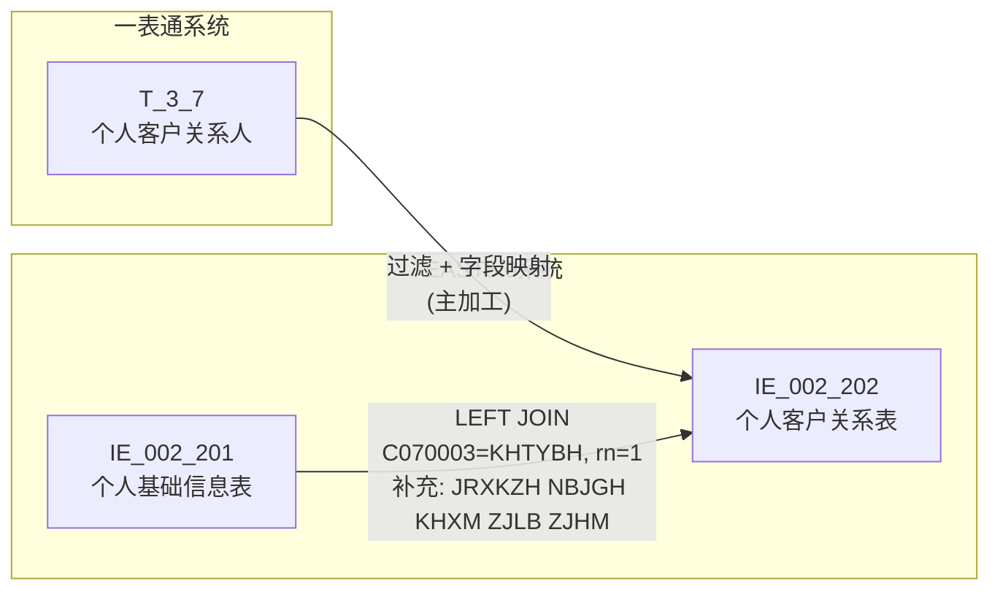
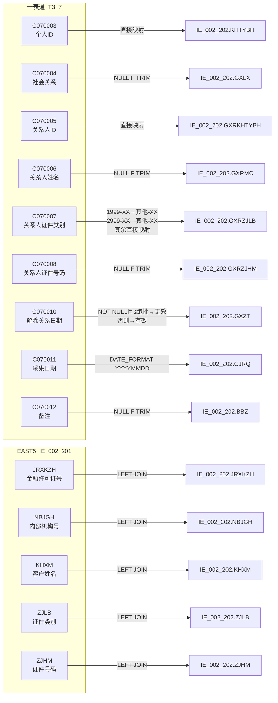

# 血缘-IE_002_202-个人客户关系表-EAST5.0系统

## 业务链路摘要

- 本血缘页描述 EAST5.0 `个人客户关系表`（`IE_002_202`）的数据来源链路。
- 数据来源：一表通 `T_3_7`（个人客户关系人）为主源，EAST5.0 `IE_002_201`（个人基础信息表）为辅源，通过 `KHTYBH` 关联补充客户信息。
- 涵盖个人客户的所有关联关系，包括个人对个人、个人对对公。本人为本人担保的关系不报送。
- 存储过程：`PROC_EAST_IE_002_202_GRRKXB`（`工作区/SQL开发/EAST5.0系统/PROC_EAST_IE_002_202_GRRKXB_草案.sql`）。
- 报送模式：全量表，报送截至采集日有效的数据，以及上一采集日至采集日期间结清、失效、终结等所有视为终态的数据。

## 节点列表

| 节点 | 类型 | 系统 | 说明 |
| --- | --- | --- | --- |
| `T_3_7` | 源表 | 一表通系统 | 个人客户关系人，主源表 |
| `IE_002_201` | 源表 | EAST5.0系统 | 个人基础信息表，LEFT JOIN 补充客户信息（JRXKZH、NBJGH、KHXM、ZJLB、ZJHM） |
| `IE_002_202` | 目标表 | EAST5.0系统 | 个人客户关系表 |

## 表级边列表

| 源节点 | 目标节点 | 处理动作 | 关联条件 |
| --- | --- | --- | --- |
| `T_3_7` | `IE_002_202` | 过滤 + 字段映射（主加工） | — |
| `IE_002_201` | `IE_002_202` | LEFT JOIN 补充客户信息（JRXKZH、NBJGH、KHXM、ZJLB、ZJHM） | `rel.C070003 = e201.KHTYBH AND e201.rn = 1`（子查询 ROW_NUMBER 按 NBJGH 去重） |

## 字段级边列表

| 源对象 | 源字段 | 目标对象 | 目标字段 | 处理逻辑 | 关系类型 | 证据 |
| --- | --- | --- | --- | --- | --- | --- |
| — | — | `IE_002_202` | `SENSITIVEFLAG` | 无映射来源，置 NULL | 常量赋值 | SQL草案 待确认 |
| `T_3_7` | `C070010` | `IE_002_202` | `GXZT` | CASE WHEN：解除关系日期非空且 ≤ 跑批日期 → '无效'，否则 → '有效' | 条件映射 | SQL草案 |
| `IE_002_201` | `ZJLB` | `IE_002_202` | `ZJLB` | NULLIF(TRIM())，LEFT JOIN 通过 C070003=KHTYBH 获取 | 直接映射 | SQL草案 |
| `T_3_7` | `C070004` | `IE_002_202` | `GXLX` | NULLIF(TRIM())，直接映射社会关系 | 直接映射 | SQL草案 |
| `T_3_7` | `C070006` | `IE_002_202` | `GXRMC` | NULLIF(TRIM())，直接映射关系人姓名 | 直接映射 | SQL草案 |
| `IE_002_201` | `JRXKZH` | `IE_002_202` | `JRXKZH` | NULLIF(TRIM())，LEFT JOIN 通过 C070003=KHTYBH 获取 | 直接映射 | SQL草案 |
| `IE_002_201` | `KHXM` | `IE_002_202` | `KHXM` | NULLIF(TRIM())，LEFT JOIN 通过 C070003=KHTYBH 获取 | 直接映射 | SQL草案 |
| `T_3_7` | `C070012` | `IE_002_202` | `BBZ` | NULLIF(TRIM())，直接映射备注 | 直接映射 | SQL草案 |
| `T_3_7` | `C070011` | `IE_002_202` | `CJRQ` | `DATE_FORMAT('%Y%m%d')`，DATE 类型转 VARCHAR(8) | 日期格式 | SQL草案 |
| — | — | `IE_002_202` | `GXRKHLB` | 无映射来源，置 NULL | 常量赋值 | SQL草案 待确认 |
| `IE_002_201` | `NBJGH` | `IE_002_202` | `NBJGH` | NULLIF(TRIM())，LEFT JOIN 通过 C070003=KHTYBH 获取 | 直接映射 | SQL草案 |
| `T_3_7` | `C070003` | `IE_002_202` | `KHTYBH` | 直接取值，客户统一编号 | 直接映射 | SQL草案 |
| `IE_002_201` | `ZJHM` | `IE_002_202` | `ZJHM` | NULLIF(TRIM())，LEFT JOIN 通过 C070003=KHTYBH 获取 | 直接映射 | SQL草案 |
| `T_3_7` | `C070005` | `IE_002_202` | `GXRKHTYBH` | 直接映射关系人ID | 直接映射 | SQL草案 |
| `T_3_7` | `C070007` | `IE_002_202` | `GXRZJLB` | CASE WHEN 码值转换：`1999-%` → `其他-XX`；`2999-%` → `其他-XX`；其余直接映射 | 码值转换 | SQL草案 |
| `T_3_7` | `C070008` | `IE_002_202` | `GXRZJHM` | NULLIF(TRIM())，直接映射关系人证件号码 | 直接映射 | SQL草案 |
| — | — | `IE_002_202` | `GSFZJG` | 无映射来源，置 NULL | 常量赋值 | SQL草案 待确认 |

## 过滤条件

| 过滤字段 | 过滤条件 | 业务含义 | 证据 |
| --- | --- | --- | --- |
| `T_3_7.C070011` | `= V_DATA_DATE` | 仅取采集日期当期数据 | SQL草案 |
| `T_3_7.C070010` | `NOT (C070010 IS NOT NULL AND C070010 < V_PREV_DATE)` | 剔除上个采集周期前已解除的关系（已在上周期作为终态报送） | SQL草案 |
| `T_3_7.C070004` | `NOT (C070003 = C070005 AND TRIM(C070004) = '担保')` | 剔除本人为本人担保的关系，不报送 | SQL草案 |
| `T_3_7.C070003` | `IS NOT NULL AND TRIM() != ''` | 客户统一编号不可为空（否则无法关联 IE_002_201） | SQL草案 |
| `IE_002_201.rn` | `= 1` | 同一客户跨多机构去重，按 NBJGH 升序取第一条 | SQL草案 |

## Mermaid 总览图

## Mermaid 详细字段级图

## 已知缺口与未确认点

- `SENSITIVEFLAG`（涉密标志）、`GXRKHLB`（关系人客户类别）和 `GSFZJG`（归属分支机构）无映射来源，SQL 中均置 NULL，需确认是否报送及数据来源。
- "担保"码值假设 `T_3_7.C070004`（社会关系）直接存储中文 `'担保'`；如为编码，需替换对应码值。
- `IE_002_201` 可能因机构关联缺失导致 `JRXKZH`、`NBJGH` 为空，当前不做强制校验，留空处理。
- 上一采集日 `V_PREV_DATE` 按 `DATE_SUB(V_DATA_DATE, INTERVAL 1 DAY)` 计算，与 `PROC_EAST_IE_002_201` 保持一致，是否与实际报送周期匹配待确认。
- `T_3_7.C070011` 是 DATE 类型，目标 `IE_002_202.CJRQ` 是 VARCHAR(8)，需 `DATE_FORMAT` 转换。
- 同一客户关联 IE_002_201 时 ROW_NUMBER 按 NBJGH 去重取第一条，多机构场景下可能丢失差异信息，待确认策略。

## 相关页面

- 数据表页：[[数据表-IE_002_202-个人客户关系表-EAST5.0系统]]
- 上游数据表页：[[数据表-T_3_7-个人客户关系人-一表通系统]]
- 上游数据表页：[[数据表-IE_002_201-个人基础信息表-EAST5.0系统]]
- 上游来源页：[[来源-一表通系统-3.7-个人客户关系人]]
- EAST5.0 来源页：[[来源-EAST5.0系统-IE_002_202-个人客户关系表]]
- 血缘页：[[血缘-IE_002_201-个人基础信息表-EAST5.0系统]]
- SQL 草案：`工作区/SQL开发/EAST5.0系统/PROC_EAST_IE_002_202_GRRKXB_草案.sql`
