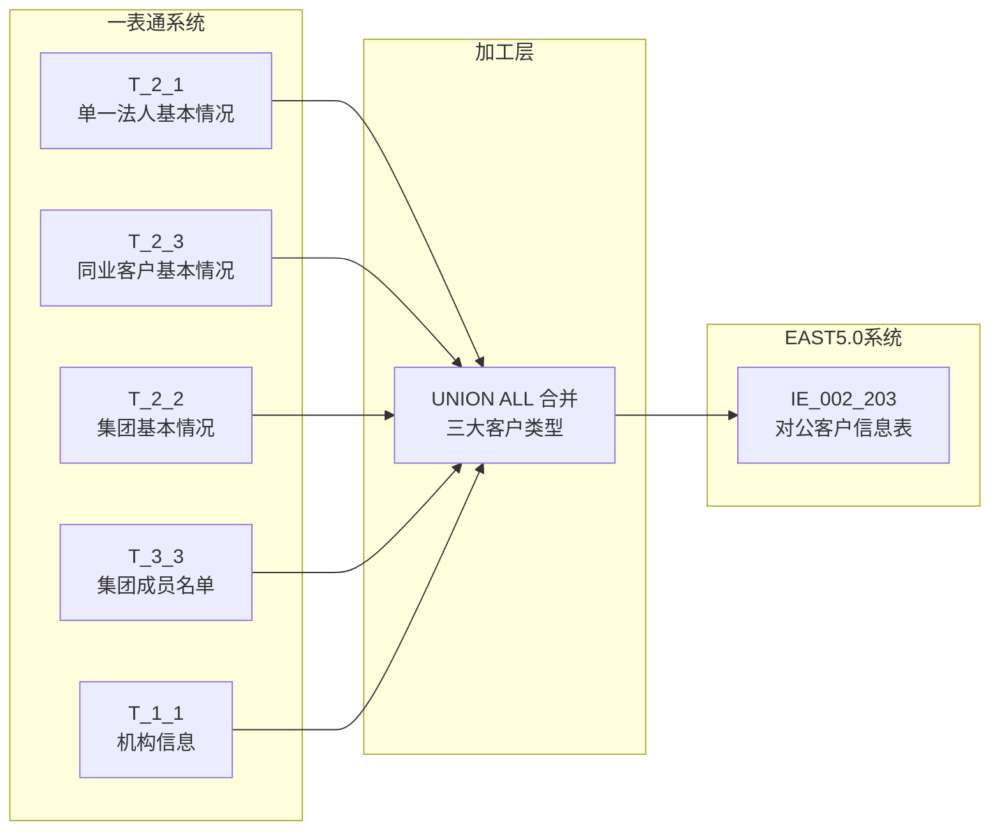

# 血缘-IE_002_203-对公客户信息表-EAST5.0系统

## 页面边界

- 本页面向技术影响分析和字段溯源，回答"数据从哪里来、经过什么处理、落到哪里"。
- 不维护完整字段字典、码值说明或业务字段清单；这些内容写入相关数据表页和报表业务口径页。
- 不复制来源页的证据全文，只在 Edge List 中引用来源页或原始材料路径。
- 字段级血缘基于 SQL 草案，标注"依据 SQL 草案"，未验证生产血缘。

## 系统边界

- 起始系统：一表通系统
- 目标系统：EAST5.0系统
- 是否仅系统内血缘：否，跨系统血缘
- 文件路径归属：EAST5.0系统

## 业务链路摘要

- 从一表通单一法人基本情况（T_2_1）、同业客户基本情况（T_2_3）、集团基本情况（T_2_2）开始。
- 经过三大客户类型 UNION ALL 合并、证件类别码值转换、日期格式转换、集团成员关联汇总等加工。
- 最终形成 EAST5.0 对公客户信息表（IE_002_203）。

## 直接上游对象

- 数据表页：
  - [[数据表-T_2_1-单一法人基本情况-一表通系统]]
  - [[数据表-T_2_3-同业客户基本情况-一表通系统]]
  - [[数据表-T_2_2-集团基本情况-一表通系统]]
  - [[数据表-T_3_3-集团成员名单-一表通系统]]
  - [[数据表-T_1_1-机构信息-一表通系统]]
- 来源 SQL：`工作区/SQL开发/EAST5.0系统/PROC_EAST_IE_002_203_DGKHXXB_草案.sql`

## 直接下游对象

- 数据表页：[[数据表-IE_002_203-对公客户信息表-EAST5.0系统]]
- 报表业务口径页：[[报表-IE_002_203-对公客户信息表-EAST5.0系统]]

## Nodes

| 节点 ID | 节点名称 | 类型 | 说明 |
| --- | --- | --- | --- |
| S1 | T_2_1 | 一表通数据表 | 单一法人基本情况，单一法人客户主源 |
| S2 | T_2_3 | 一表通数据表 | 同业客户基本情况，同业客户主源 |
| S3 | T_2_2 | 一表通数据表 | 集团基本情况，集团客户主源 |
| S4 | T_3_3 | 一表通数据表 | 集团成员名单，集团客户成员关联 |
| S5 | T_1_1 | 一表通数据表 | 机构信息，补金融许可证号和银行机构名称 |
| T1 | IE_002_203 | EAST5.0 数据表 | 对公客户信息表，目标表 |

## 表级 Edge List

| From | To | Transform | Evidence |
| --- | --- | --- | --- |
| 数据表-T_2_1-单一法人基本情况-一表通系统 | IE_002_203 | 直接映射 + 码值转换 + 日期格式转换 | 依据 SQL 草案，来源页 |
| 数据表-T_2_3-同业客户基本情况-一表通系统 | IE_002_203 | 直接映射 + 码值转换 + 日期格式转换 | 依据 SQL 草案，来源页 |
| 数据表-T_2_2-集团基本情况-一表通系统 | IE_002_203 | 直接映射 + 集团成员关联汇总 | 依据 SQL 草案，来源页 |
| 数据表-T_3_3-集团成员名单-一表通系统 | IE_002_203 | 成员信贷关系取 MIN、员工人数 SUM | 依据 SQL 草案，来源页 |
| 数据表-T_1_1-机构信息-一表通系统 | IE_002_203 | LEFT JOIN 取金融许可证号、银行机构名称 | 依据 SQL 草案，来源页 |

## 字段级 Edge List

| 源对象 | 源字段 | 目标对象 | 目标字段 | 处理逻辑 | 关系类型 | 证据 |
| --- | --- | --- | --- | --- | --- | --- |
| T_1_1 | A010003 | IE_002_203 | JRXKZH | NULLIF(TRIM()) | 直接映射 | 依据 SQL 草案 |
| T_2_1/T_2_3/T_2_2 | B010002/B030002/B020002 | IE_002_203 | NBJGH | SUBSTR(机构ID, 12) | 加工映射 | 依据 SQL 草案 |
| T_1_1 | A010005 | IE_002_203 | YHJGMC | NULLIF(TRIM()) | 直接映射 | 依据 SQL 草案 |
| T_2_1 | B010001 | IE_002_203 | KHTYBH | UNION ALL 合并 | 直接映射 | 依据 SQL 草案 |
| T_2_3 | B030001 | IE_002_203 | KHTYBH | UNION ALL 合并 | 直接映射 | 依据 SQL 草案 |
| T_2_2 | B020001 | IE_002_203 | KHTYBH | UNION ALL 合并 | 直接映射 | 依据 SQL 草案 |
| T_2_1 | B010003 | IE_002_203 | KHMC | UNION ALL 合并 | 直接映射 | 依据 SQL 草案 |
| T_2_3 | B030003 | IE_002_203 | KHMC | UNION ALL 合并 | 直接映射 | 依据 SQL 草案 |
| T_2_2 | B020007 | IE_002_203 | KHMC | UNION ALL 合并 | 直接映射 | 依据 SQL 草案 |
| 常量 | - | IE_002_203 | KHTX | '单一法人客户'/'同业客户'/'集团客户' | 常量赋值 | 依据 SQL 草案 |
| T_2_1 | B010004/B010062 | IE_002_203 | ZJLB | CASE 优先级判断 | 码值转换 | 依据 SQL 草案 |
| T_2_3 | B030007/B030005/B030006/B030039 | IE_002_203 | ZJLB | CASE 优先级判断（同业） | 码值转换 | 依据 SQL 草案 |
| T_2_2 → T_2_1 | B020020 → B010001 | IE_002_203 | ZJLB | 母公司证件信息 | 关联映射 | 依据 SQL 草案 |
| T_2_1 | B010004/B010063 | IE_002_203 | ZJHM | CASE 对应取号 | 加工映射 | 依据 SQL 草案 |
| T_2_3 | B030007/B030005/B030006/B030040 | IE_002_203 | ZJHM | CASE 对应取号（同业） | 加工映射 | 依据 SQL 草案 |
| T_2_2 | B020003 | IE_002_203 | ZJHM | 母公司统一社会信用代码 | 直接映射 | 依据 SQL 草案 |
| T_2_1 | B010032 | IE_002_203 | FRDB | UNION ALL 合并 | 直接映射 | 依据 SQL 草案 |
| T_2_3 | B030013 | IE_002_203 | FRDB | UNION ALL 合并 | 直接映射 | 依据 SQL 草案 |
| T_2_2 → T_2_1 | B020020 → B010001 | IE_002_203 | FRDB | 母公司法人代表 | 关联映射 | 依据 SQL 草案 |
| T_2_1 | B010033 | IE_002_203 | FRDBZJLB | CASE 码值转换 | 码值转换 | 依据 SQL 草案 |
| T_2_3 | B030014 | IE_002_203 | FRDBZJLB | CASE 码值转换（同业） | 码值转换 | 依据 SQL 草案 |
| T_2_2 → T_2_1 | B020020 → B010001 | IE_002_203 | FRDBZJLB | 母公司证件类别 | 关联映射 | 依据 SQL 草案 |
| T_2_1 | B010034 | IE_002_203 | FRDBZJHM | UNION ALL 合并 | 直接映射 | 依据 SQL 草案 |
| T_2_3 | B030015 | IE_002_203 | FRDBZJHM | UNION ALL 合并 | 直接映射 | 依据 SQL 草案 |
| T_2_2 → T_2_1 | B020020 → B010001 | IE_002_203 | FRDBZJHM | 母公司证件号码 | 关联映射 | 依据 SQL 草案 |
| T_2_1 | B010035 | IE_002_203 | CWFZR | UNION ALL 合并 | 直接映射 | 依据 SQL 草案 |
| T_2_3 | B030016 | IE_002_203 | CWFZR | UNION ALL 合并 | 直接映射 | 依据 SQL 草案 |
| T_2_2 → T_2_1 | B020020 → B010001 | IE_002_203 | CWFZR | 母公司财务负责人 | 关联映射 | 依据 SQL 草案 |
| T_2_1 | B010036 | IE_002_203 | CWFZRZJLB | CASE 码值转换 | 码值转换 | 依据 SQL 草案 |
| T_2_3 | B030017 | IE_002_203 | CWFZRZJLB | CASE 码值转换（同业） | 码值转换 | 依据 SQL 草案 |
| T_2_2 → T_2_1 | B020020 → B010001 | IE_002_203 | CWFZRZJLB | 母公司证件类别 | 关联映射 | 依据 SQL 草案 |
| T_2_1 | B010037 | IE_002_203 | CWFZRZJHM | UNION ALL 合并 | 直接映射 | 依据 SQL 草案 |
| T_2_3 | B030018 | IE_002_203 | CWFZRZJHM | UNION ALL 合并 | 直接映射 | 依据 SQL 草案 |
| T_2_2 → T_2_1 | B020020 → B010001 | IE_002_203 | CWFZRZJHM | 母公司证件号码 | 关联映射 | 依据 SQL 草案 |
| T_2_1 | B010038 | IE_002_203 | JBCKZH | UNION ALL 合并 | 直接映射 | 依据 SQL 草案 |
| T_2_3 | B030019 | IE_002_203 | JBCKZH | UNION ALL 合并 | 直接映射 | 依据 SQL 草案 |
| T_2_2 → T_2_1 | B020020 → B010001 | IE_002_203 | JBCKZH | 母公司基本存款账号 | 关联映射 | 依据 SQL 草案 |
| T_2_1 | B010039 | IE_002_203 | JBCKZHKHHH | UNION ALL 合并 | 直接映射 | 依据 SQL 草案 |
| T_2_3 | B030020 | IE_002_203 | JBCKZHKHHH | UNION ALL 合并 | 直接映射 | 依据 SQL 草案 |
| T_2_2 → T_2_1 | B020020 → B010001 | IE_002_203 | JBCKZHKHHH | 母公司开户行号 | 关联映射 | 依据 SQL 草案 |
| T_2_1 | B010040 | IE_002_203 | JBCKZHKHHMC | UNION ALL 合并 | 直接映射 | 依据 SQL 草案 |
| T_2_3 | B030021 | IE_002_203 | JBCKZHKHHMC | UNION ALL 合并 | 直接映射 | 依据 SQL 草案 |
| T_2_2 → T_2_1 | B020020 → B010001 | IE_002_203 | JBCKZHKHHMC | 母公司开户行名称 | 关联映射 | 依据 SQL 草案 |
| T_2_1 | B010019 | IE_002_203 | ZCZB | UNION ALL 合并 | 直接映射 | 依据 SQL 草案 |
| T_2_3 | B030022 | IE_002_203 | ZCZB | UNION ALL 合并 | 直接映射 | 依据 SQL 草案 |
| T_2_2 → T_2_1 | B020020 → B010001 | IE_002_203 | ZCZB | 母公司注册资本 | 关联映射 | 依据 SQL 草案 |
| T_2_1 | B010020 | IE_002_203 | ZCZBBZ | UNION ALL 合并 | 直接映射 | 依据 SQL 草案 |
| T_2_3 | B030023 | IE_002_203 | ZCZBBZ | UNION ALL 合并 | 直接映射 | 依据 SQL 草案 |
| T_2_2 → T_2_1 | B020020 → B010001 | IE_002_203 | ZCZBBZ | 母公司注册资本币种 | 关联映射 | 依据 SQL 草案 |
| T_2_1 | B010021 | IE_002_203 | SSZB | UNION ALL 合并 | 直接映射 | 依据 SQL 草案 |
| T_2_3 | B030024 | IE_002_203 | SSZB | UNION ALL 合并 | 直接映射 | 依据 SQL 草案 |
| T_2_2 → T_2_1 | B020020 → B010001 | IE_002_203 | SSZB | 母公司实收资本 | 关联映射 | 依据 SQL 草案 |
| T_2_1 | B010022 | IE_002_203 | SSZBBZ | UNION ALL 合并 | 直接映射 | 依据 SQL 草案 |
| T_2_3 | B030025 | IE_002_203 | SSZBBZ | UNION ALL 合并 | 直接映射 | 依据 SQL 草案 |
| T_2_2 → T_2_1 | B020020 → B010001 | IE_002_203 | SSZBBZ | 母公司实收资本币种 | 关联映射 | 依据 SQL 草案 |
| T_2_1 | B010029 | IE_002_203 | ZCDZ | UNION ALL 合并 | 直接映射 | 依据 SQL 草案 |
| T_2_3 | B030010 | IE_002_203 | ZCDZ | UNION ALL 合并 | 直接映射 | 依据 SQL 草案 |
| T_2_2 | B020009 | IE_002_203 | ZCDZ | UNION ALL 合并 | 直接映射 | 依据 SQL 草案 |
| T_2_1 | B010031 | IE_002_203 | LXDH | UNION ALL 合并 | 直接映射 | 依据 SQL 草案 |
| T_2_3 | B030029 | IE_002_203 | LXDH | UNION ALL 合并 | 直接映射 | 依据 SQL 草案 |
| T_2_2 → T_2_1 | B020020 → B010001 | IE_002_203 | LXDH | 母公司联系电话 | 关联映射 | 依据 SQL 草案 |
| T_2_1 | B010024 | IE_002_203 | JYFW | UNION ALL 合并 | 直接映射 | 依据 SQL 草案 |
| T_2_3 | B030008 | IE_002_203 | JYFW | UNION ALL 合并 | 直接映射 | 依据 SQL 草案 |
| T_2_2 → T_2_1 | B020020 → B010001 | IE_002_203 | JYFW | 母公司经营范围 | 关联映射 | 依据 SQL 草案 |
| T_2_1 | B010023 | IE_002_203 | CLRQ | TO_CHAR(TO_DATE(), 'YYYYMMDD') | 日期格式转换 | 依据 SQL 草案 |
| T_2_3 | B030009 | IE_002_203 | CLRQ | TO_CHAR(TO_DATE(), 'YYYYMMDD') | 日期格式转换 | 依据 SQL 草案 |
| T_2_2 → T_2_1 | B020020 → B010001 | IE_002_203 | CLRQ | 母公司成立日期 | 关联映射 | 依据 SQL 草案 |
| T_2_1 | B010025 | IE_002_203 | SSHY | UNION ALL 合并 | 直接映射 | 依据 SQL 草案 |
| T_2_3 | B030041 | IE_002_203 | SSHY | UNION ALL 合并 | 直接映射 | 依据 SQL 草案 |
| T_2_2 → T_2_1 | B020020 → B010001 | IE_002_203 | SSHY | 母公司行业类型 | 关联映射 | 依据 SQL 草案 |
| T_2_1 | B010026 | IE_002_203 | QYFL | CASE 码值转换 | 码值转换 | 依据 SQL 草案 |
| T_2_3 | B030037 | IE_002_203 | QYFL | CASE 码值转换（同业） | 码值转换 | 依据 SQL 草案 |
| - | - | IE_002_203 | QYFL | NULL（集团客户） | 常量赋值 | 依据 SQL 草案 |
| T_2_1 | B010048 | IE_002_203 | XDKHBZ | CASE 判断非空/非999912 | 规则映射 | 依据 SQL 草案 |
| T_2_3 | B030033 | IE_002_203 | XDKHBZ | CASE 判断非空/非999912 | 规则映射 | 依据 SQL 草案 |
| T_3_3 → T_2_1/T_2_3 | C030007 → MIN(信贷年月) | IE_002_203 | XDKHBZ | 成员最早信贷关系判断 | 聚合映射 | 依据 SQL 草案 |
| T_2_1 | B010048 | IE_002_203 | SCJLXDGXNY | SUBSTR(YYYY-MM, 1, 6) | 日期格式转换 | 依据 SQL 草案 |
| T_2_3 | B030033 | IE_002_203 | SCJLXDGXNY | SUBSTR(YYYY-MM, 1, 6) | 日期格式转换 | 依据 SQL 草案 |
| T_3_3 → T_2_1/T_2_3 | C030007 → MIN(信贷年月) | IE_002_203 | SCJLXDGXNY | 成员最早信贷关系 | 聚合映射 | 依据 SQL 草案 |
| T_2_1 | B010042 | IE_002_203 | SSGSBZ | CASE 非空判断 | 规则映射 | 依据 SQL 草案 |
| T_2_3 | B030026 | IE_002_203 | SSGSBZ | CASE = '1' 判断 | 规则映射 | 依据 SQL 草案 |
| - | - | IE_002_203 | SSGSBZ | '否'（集团客户） | 常量赋值 | 依据 SQL 草案 |
| T_2_1 | B010044/B010046 | IE_002_203 | XYPJ | COALESCE(外部, 内部) | 加工映射 | 依据 SQL 草案 |
| T_2_3 | B030030/B030032 | IE_002_203 | XYPJ | COALESCE(外部, 内部) | 加工映射 | 依据 SQL 草案 |
| T_2_2 | B020018 | IE_002_203 | XYPJ | 内部评级结果 | 直接映射 | 依据 SQL 草案 |
| T_2_1 | B010041 | IE_002_203 | YGRS | UNION ALL 合并 | 直接映射 | 依据 SQL 草案 |
| T_2_3 | B030027 | IE_002_203 | YGRS | UNION ALL 合并 | 直接映射 | 依据 SQL 草案 |
| T_3_3 → T_2_1 | C030007 → SUM(员工人数) | IE_002_203 | YGRS | 成员员工人数汇总 | 聚合映射 | 依据 SQL 草案 |
| T_2_1 | B010030 | IE_002_203 | XZQHDM | UNION ALL 合并 | 直接映射 | 依据 SQL 草案 |
| T_2_3 | B030012 | IE_002_203 | XZQHDM | UNION ALL 合并 | 直接映射 | 依据 SQL 草案 |
| T_2_2 | B020011 | IE_002_203 | XZQHDM | UNION ALL 合并 | 直接映射 | 依据 SQL 草案 |
| T_2_1 | B010049 | IE_002_203 | FXYJXH | UNION ALL 合并 | 直接映射 | 依据 SQL 草案 |
| T_2_3 | B030034 | IE_002_203 | FXYJXH | UNION ALL 合并 | 直接映射 | 依据 SQL 草案 |
| T_2_2 | B020016 | IE_002_203 | FXYJXH | UNION ALL 合并 | 直接映射 | 依据 SQL 草案 |
| T_2_1 | B010050 | IE_002_203 | GZSJDM | UNION ALL 合并 | 直接映射 | 依据 SQL 草案 |
| T_2_3 | B030035 | IE_002_203 | GZSJDM | UNION ALL 合并 | 直接映射 | 依据 SQL 草案 |
| T_2_2 | B020017 | IE_002_203 | GZSJDM | UNION ALL 合并 | 直接映射 | 依据 SQL 草案 |
| T_2_1 | B010065 | IE_002_203 | BBZ | UNION ALL 合并 | 直接映射 | 依据 SQL 草案 |
| T_2_3 | B030043 | IE_002_203 | BBZ | UNION ALL 合并 | 直接映射 | 依据 SQL 草案 |
| T_2_2 | B020021 | IE_002_203 | BBZ | UNION ALL 合并 | 直接映射 | 依据 SQL 草案 |
| T_2_1 | B010060 | IE_002_203 | CJRQ | TO_CHAR(TO_DATE(), 'YYYYMMDD') | 日期格式转换 | 依据 SQL 草案 |
| T_2_3 | B030036 | IE_002_203 | CJRQ | TO_CHAR(TO_DATE(), 'YYYYMMDD') | 日期格式转换 | 依据 SQL 草案 |
| T_2_2 | B020019 | IE_002_203 | CJRQ | TO_CHAR(TO_DATE(), 'YYYYMMDD') | 日期格式转换 | 依据 SQL 草案 |

## 缺口字段

| 目标字段 | 说明 |
| --- | --- |
| GSFZJG | 归属分支机构，无映射来源，SQL 暂置空 |
| SENSITIVEFLAG | 涉密标志，无映射来源，SQL 暂置空 |
| FRDBKHLB | 法人代表客户类别，无映射来源，SQL 暂置空 |

## Graph-总览

## Graph-字段级

```mermaid
flowchart LR
    subgraph 源对象
        S1["T_2_1.B010001"]
        S2["T_2_3.B030001"]
        S3["T_2_2.B020001"]
        S4["T_2_1.B010003"]
        S5["T_2_3.B030003"]
        S6["T_2_2.B020007"]
        S7["T_2_1.B010004"]
        S8["T_2_1.B010062"]
        S9["T_2_3.B030007"]
        S10["T_2_3.B030005"]
        S11["T_2_3.B030006"]
        S12["T_2_3.B030039"]
        S13["T_2_1.B010032"]
        S14["T_2_1.B010026"]
        S15["T_2_3.B030037"]
        S16["T_2_1.B010048"]
        S17["T_2_3.B030033"]
        S18["T_2_1.B010042"]
        S19["T_2_3.B030026"]
        S20["T_2_1.B010044"]
        S21["T_2_1.B010046"]
        S22["T_2_2.B020018"]
        S23["T_2_1.B010041"]
        S24["T_2_2.B020009"]
        S25["T_2_1.B010060"]
        S26["T_2_2.B020019"]
        S27["T_1_1.A010003"]
        S28["T_1_1.A010005"]
        S29["T_2_2.B020020"]
        S30["T_3_3.C030007"]
        S31["T_2_1.B010023"]
        S32["T_2_3.B030009"]
        S33["T_2_2.B020002"]
        S34["T_2_1.B010002"]
        S35["T_2_3.B030002"]
    end

    subgraph 目标对象
        T1["IE_002_203.KHTYBH"]
        T2["IE_002_203.KHMC"]
        T3["IE_002_203.KHTX"]
        T4["IE_002_203.ZJLB"]
        T5["IE_002_203.ZJHM"]
        T6["IE_002_203.FRDB"]
        T7["IE_002_203.QYFL"]
        T8["IE_002_203.XDKHBZ"]
        T9["IE_002_203.SCGJXDGXNY"]
        T10["IE_002_203.SSGSBZ"]
        T11["IE_002_203.XYPJ"]
        T12["IE_002_203.YGRS"]
        T13["IE_002_203.ZCDZ"]
        T14["IE_002_203.CJRQ"]
        T15["IE_002_203.JRXKZH"]
        T16["IE_002_203.YHJGMC"]
        T17["IE_002_203.NBJGH"]
        T18["IE_002_203.CLRQ"]
    end

    S1 -->|单一法人ID| T1
    S2 -->|同业客户ID| T1
    S3 -->|集团ID| T1
    S4 -->|单一法人名称| T2
    S5 -->|同业客户名称| T2
    S6 -->|集团名称| T2
    S7 -->|统一社会信用代码| T4
    S8 -->|其他证件类型| T4
    S9 -->|统一社会信用代码| T4
    S10 -->|金融许可证| T4
    S11 -->|SWIFT编码| T4
    S12 -->|其他证件类型| T4
    S13 -->|法人代表| T6
    S14 -->|对公客户类型| T7
    S15 -->|对公客户类型| T7
    S16 -->|首次信贷年月| T8
    S17 -->|首次授信日期| T8
    S18 -->|上市情况| T10
    S19 -->|上市企业标识| T10
    S20 -->|外部评级| T11
    S21 -->|内部评级| T11
    S22 -->|内部评级| T11
    S23 -->|员工人数| T12
    S24 -->|集团注册地址| T13
    S25 -->|采集日期| T14
    S26 -->|采集日期| T14
    S27 -->|金融许可证号| T15
    S28 -->|银行机构名称| T16
    S33 -->|机构ID| T17
    S34 -->|机构ID| T17
    S35 -->|机构ID| T17
    S31 -->|成立日期| T18
    S32 -->|成立日期| T18
    S29 -->|母公司客户ID| T4
    S30 -->|成员信贷关系| T8
    S29 -->|母公司证件| T5
```

## 回链检查

- 上游对象页是否已回链本血缘页：待确认，需更新 T_2_1、T_2_2、T_2_3、T_3_3、T_1_1 数据表页。
- 下游对象页是否已回链本血缘页：已回链，[[数据表-IE_002_203-对公客户信息表-EAST5.0系统]] 已补充血缘链接。
- 报表业务口径页是否已回链本血缘页：已回链，[[报表-IE_002_203-对公客户信息表-EAST5.0系统]] 已补充血缘链接。

## 变更与冲突

- 本次为新增血缘页，不修改既有血缘关系。
- 若后续 SQL 或外部原文显示字段来源与本血缘不一致，应在本页记录冲突并维持 `draft`。

## Open Questions

- GSFZJG、SENSITIVEFLAG、FRDBKHLB 三个缺口字段尚无映射来源。
- 一表通 T_2_1、T_2_2、T_2_3、T_3_3、T_1_1 数据表页尚未回链本血缘页。
- 集团客户成员首次信贷关系取 MIN 的逻辑是否覆盖所有成员类型待验证。
