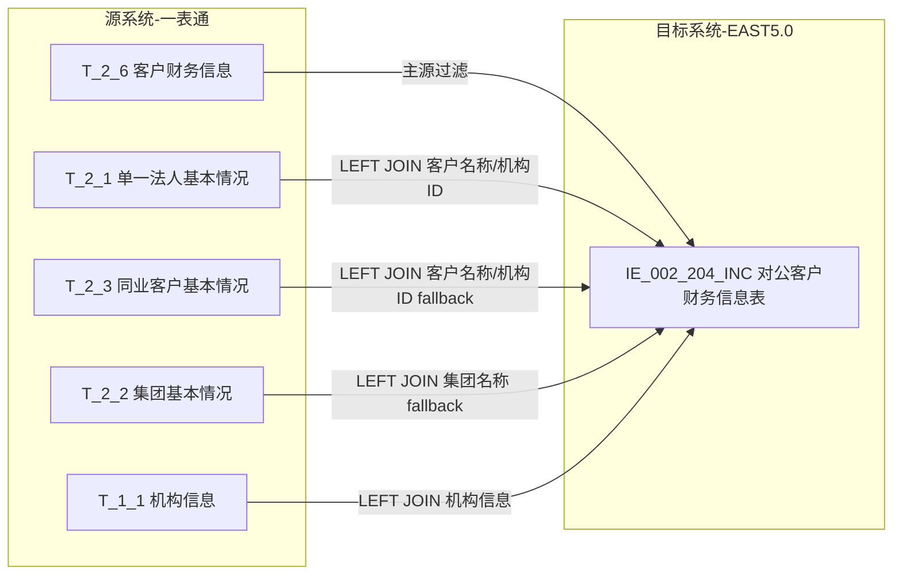
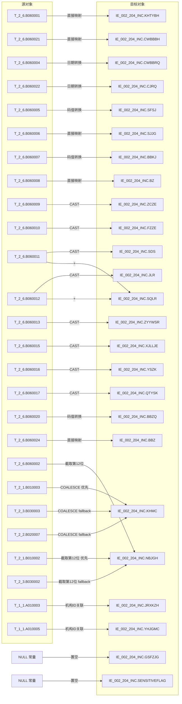

# 血缘-IE_002_204_INC-对公客户财务信息表-EAST5.0系统

## 页面边界

- 本页面向技术影响分析和字段溯源，回答"数据从哪里来、经过什么处理、落到哪里"。
- 完整字段字典、码值说明写入 [[数据表-IE_002_204_INC-对公客户财务信息表-EAST5.0系统]]。
- 证据为 SQL 草案，标注"待验证"，不写成生产已验证血缘。

## 系统边界

- 起始系统：一表通系统
- 目标系统：EAST5.0系统
- 是否仅系统内血缘：否，跨系统血缘
- 文件路径归属：EAST5.0系统

## 业务链路摘要

- 从一表通客户财务信息（T_2_6）开始，按财报录入日期筛选当月新增记录
- 关联单一法人基本情况（T_2_1）、同业客户基本情况（T_2_3）、集团基本情况（T_2_2）获取客户名称和机构ID
- 关联机构信息（T_1_1）获取金融许可证号和银行机构名称
- 经过日期格式转换、码值转换、派生字段计算后，生成 EAST5.0 对公客户财务信息表（IE_002_204_INC）

## 直接上游对象

- 数据表页：[[数据表-T_2_6-客户财务信息-一表通系统]]、[[数据表-T_2_1-单一法人基本情况-一表通系统]]、[[数据表-T_2_3-同业客户基本情况-一表通系统]]、[[数据表-T_2_2-集团基本情况-一表通系统]]、[[数据表-T_1_1-机构信息-一表通系统]]
- 来源 SQL/过程：`工作区/SQL开发/EAST5.0系统/PROC_IE_002_204_DGKHCWXXB_草案.sql`

## 直接下游对象

- 数据表页：[[数据表-IE_002_204_INC-对公客户财务信息表-EAST5.0系统]]
- 报表业务口径页：[[报表-IE_002_204_INC-对公客户财务信息表-EAST5.0系统]]

## Nodes

| 节点 | 类型 | 系统 | 说明 |
| --- | --- | --- | --- |
| T_2_6 | 数据表 | 一表通系统 | 客户财务信息主源 |
| T_2_1 | 数据表 | 一表通系统 | 单一法人基本情况 |
| T_2_3 | 数据表 | 一表通系统 | 同业客户基本情况 |
| T_2_2 | 数据表 | 一表通系统 | 集团基本情况 |
| T_1_1 | 数据表 | 一表通系统 | 机构信息 |
| IE_002_204_INC | 数据表 | EAST5.0系统 | 对公客户财务信息表（目标） |

## 表级 Edge List

| From | To | Transform | Evidence |
| --- | --- | --- | --- |
| T_2_6 | IE_002_204_INC | 主源过滤：B060023 当月新增 | PROC_IE_002_204_DGKHCWXXB_草案.sql |
| T_2_1 | IE_002_204_INC | LEFT JOIN：B010001=B060001，取客户名称/机构ID | PROC_IE_002_204_DGKHCWXXB_草案.sql |
| T_2_3 | IE_002_204_INC | LEFT JOIN：B030001=B060001，取客户名称/机构ID fallback | PROC_IE_002_204_DGKHCWXXB_草案.sql |
| T_2_2 | IE_002_204_INC | LEFT JOIN：B020001=B060001，取集团名称 fallback | PROC_IE_002_204_DGKHCWXXB_草案.sql |
| T_1_1 | IE_002_204_INC | LEFT JOIN：截取后的机构ID → A010001，取金融许可证号/机构名称 | PROC_IE_002_204_DGKHCWXXB_草案.sql |

## 字段级 Edge List

| 源对象 | 源字段 | 目标对象 | 目标字段 | 处理逻辑 | 关系类型 | 证据 |
| --- | --- | --- | --- | --- | --- | --- |
| T_2_6 | B060001 | IE_002_204_INC | KHTYBH | 直接映射 | 直接映射 | PROC_IE_002_204_DGKHCWXXB_草案.sql |
| T_2_6 | B060021 | IE_002_204_INC | CWBBBH | 直接映射 | 直接映射 | PROC_IE_002_204_DGKHCWXXB_草案.sql |
| T_2_6 | B060004 | IE_002_204_INC | CWBBRQ | DATE_FORMAT(date → 'YYYYMMDD') | 转换映射 | PROC_IE_002_204_DGKHCWXXB_草案.sql |
| T_2_6 | B060022 | IE_002_204_INC | CJRQ | DATE_FORMAT(date → 'YYYYMMDD') | 转换映射 | PROC_IE_002_204_DGKHCWXXB_草案.sql |
| T_2_6 | B060005 | IE_002_204_INC | SFSJ | 0→'否'，1→'是' | 码值转换 | PROC_IE_002_204_DGKHCWXXB_草案.sql |
| T_2_6 | B060006 | IE_002_204_INC | SJJG | 直接映射 | 直接映射 | PROC_IE_002_204_DGKHCWXXB_草案.sql |
| T_2_6 | B060007 | IE_002_204_INC | BBKJ | '01'→'本部报表'，'02'→'合并报表'，'00'→'其他' | 码值转换 | PROC_IE_002_204_DGKHCWXXB_草案.sql |
| T_2_6 | B060008 | IE_002_204_INC | BZ | 直接映射 | 直接映射 | PROC_IE_002_204_DGKHCWXXB_草案.sql |
| T_2_6 | B060009 | IE_002_204_INC | ZCZE | CAST(varchar → DECIMAL) | 直接映射 | PROC_IE_002_204_DGKHCWXXB_草案.sql |
| T_2_6 | B060010 | IE_002_204_INC | FZZE | CAST(varchar → DECIMAL) | 直接映射 | PROC_IE_002_204_DGKHCWXXB_草案.sql |
| T_2_6 | B060011 | IE_002_204_INC | SDS | CAST(varchar → DECIMAL) | 直接映射 | PROC_IE_002_204_DGKHCWXXB_草案.sql |
| T_2_6 | B060012 | IE_002_204_INC | JLR | CAST(varchar → DECIMAL) | 直接映射 | PROC_IE_002_204_DGKHCWXXB_草案.sql |
| T_2_6 | B060013 | IE_002_204_INC | ZYYWSR | CAST(varchar → DECIMAL) | 直接映射 | PROC_IE_002_204_DGKHCWXXB_草案.sql |
| T_2_6 | B060015 | IE_002_204_INC | XJLLJE | CAST(varchar → DECIMAL) | 直接映射 | PROC_IE_002_204_DGKHCWXXB_草案.sql |
| T_2_6 | B060016 | IE_002_204_INC | YSZK | CAST(varchar → DECIMAL) | 直接映射 | PROC_IE_002_204_DGKHCWXXB_草案.sql |
| T_2_6 | B060017 | IE_002_204_INC | QTYSK | CAST(varchar → DECIMAL) | 直接映射 | PROC_IE_002_204_DGKHCWXXB_草案.sql |
| T_2_6 | B060020 | IE_002_204_INC | BBZQ | '01'→'日报'，'02'→'月报'，'03'→'季报'，'04'→'半年报'，'05'→'年报' | 码值转换 | PROC_IE_002_204_DGKHCWXXB_草案.sql |
| T_2_6 | B060024 | IE_002_204_INC | BBZ | 直接映射 | 直接映射 | PROC_IE_002_204_DGKHCWXXB_草案.sql |
| T_2_6, T_2_1, T_2_3, T_2_2 | 联合 | IE_002_204_INC | KHMC | COALESCE(T_2_1.B010003, T_2_3.B030003, T_2_2.B020007) | 条件映射 | PROC_IE_002_204_DGKHCWXXB_草案.sql |
| T_2_6 | B060012 + B060011 | IE_002_204_INC | SQLR | 派生：净利润 + 所得税 | 派生字段 | PROC_IE_002_204_DGKHCWXXB_草案.sql |
| T_2_6/T_2_1/T_2_3 | 机构ID | IE_002_204_INC | NBJGH | COALESCE(截取T_2_1.B010002, 截取T_2_3.B030002, 截取T_2_6.B060002)，从第12位起 | 条件映射 | PROC_IE_002_204_DGKHCWXXB_草案.sql |
| T_1_1 | A010003 | IE_002_204_INC | JRXKZH | 通过截取后的机构ID关联获取 | 关联映射 | PROC_IE_002_204_DGKHCWXXB_草案.sql |
| T_1_1 | A010005 | IE_002_204_INC | YHJGMC | 通过截取后的机构ID关联获取 | 关联映射 | PROC_IE_002_204_DGKHCWXXB_草案.sql |
| - | - | IE_002_204_INC | GSFZJG | 无映射来源，置空 | 缺口字段 | PROC_IE_002_204_DGKHCWXXB_草案.sql |
| - | - | IE_002_204_INC | SENSITIVEFLAG | 无映射来源，置空 | 缺口字段 | PROC_IE_002_204_DGKHCWXXB_草案.sql |

## Graph-总览

## Graph-字段级

## 回链检查

- 上游对象页是否已回链本血缘页：待确认（T_2_6, T_2_1, T_2_3, T_2_2, T_1_1 的下游对象待更新）
- 下游对象页是否已回链本血缘页：待确认（IE_002_204 的上游对象待更新）
- 报表业务口径页是否已回链本血缘页：是，[[报表-IE_002_204_INC-对公客户财务信息表-EAST5.0系统]] 已链接
- 源数据表页是否已在"直接下游对象"记录本血缘消费：待更新
- 目标数据表页是否已在"直接上游对象"记录本血缘来源：待更新
- 跨系统数据表页是否已同步回写上下游摘要：待更新

## 变更与冲突

- 本次为新增血缘页，基于 SQL 草案生成设计血缘，标注"待验证"
- 不修改既有血缘关系

## Open Questions

- 排除规则（非授信客户、负债类客户、离岸对公客户、机关事业单位、未达建账标准个体工商户）的筛选逻辑未实现，字段来源待确认
- `GSFZJG`（归属分支机构）、`SENSITIVEFLAG`（涉密标志）无映射来源，SQL 暂置空
- 税前利润 = 净利润 + 所得税，所得税符号（正值还是绝对值）待确认
- 机构ID截取从第12位开始的规则在各源表中是否一致待验证
- 客户统一编号 KHTYBH 包含个人身份证号时的隐私变形规则待确认
