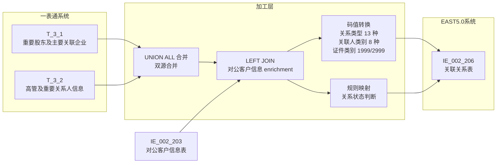
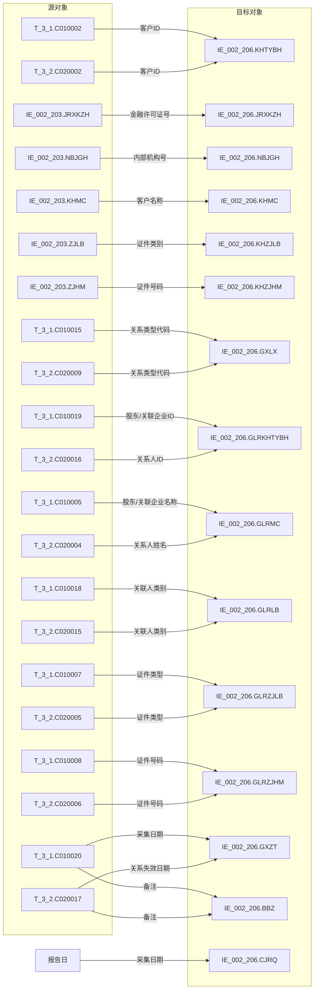

# 血缘-IE_002_206-关联关系表-EAST5.0系统

## 页面边界

- 本页面向技术影响分析和字段溯源，回答"数据从哪里来、经过什么处理、落到哪里"。
- 不维护完整字段字典、码值说明或业务字段清单；这些内容写入相关数据表页和报表业务口径页。
- 不复制来源页的证据全文，只在 Edge List 中引用来源页或原始材料路径。
- 字段级血缘基于 SQL 草案，标注"依据 SQL 草案"，未验证生产血缘。

## 系统边界

- 起始系统：一表通系统
- 目标系统：EAST5.0系统
- 是否仅系统内血缘：否，跨系统血缘
- 文件路径归属：EAST5.0系统

## 业务链路摘要

- 从一表通重要股东及主要关联企业（T_3_1）和高管及重要关系人信息（T_3_2）开始。
- 经过 UNION ALL 合并、关联对公客户信息表（IE_002_203） enrichment 客户主数据。
- 经过关系类型码值转换（13 种）、关联人类别码值转换（8 种）、关联人证件类别转换（1999/2999 → 其他-XX）、关系状态判断。
- 最终形成 EAST5.0 关联关系表（IE_002_206）。

## 直接上游对象

- 数据表页：
  - [[数据表-T_3_1-重要股东及主要关联企业-一表通系统]]
  - [[数据表-T_3_2-高管及重要关系人信息-一表通系统]]
  - [[数据表-IE_002_203-对公客户信息表-EAST5.0系统]]
- 来源 SQL：`工作区/SQL开发/一表通系统/PROC_BSP_IE_002_206_GLGXB.sql`

## 直接下游对象

- 数据表页：[[数据表-IE_002_206-关联关系表-EAST5.0系统]]
- 报表业务口径页：[[报表-IE_002_206-关联关系表-EAST5.0系统]]

## Nodes

| 节点 ID | 节点名称 | 类型 | 说明 |
| --- | --- | --- | --- |
| S1 | T_3_1 | 一表通数据表 | 重要股东及主要关联企业，关系人为对公/集团/供应链 |
| S2 | T_3_2 | 一表通数据表 | 高管及重要关系人信息，关系人为个人 |
| S3 | IE_002_203 | EAST5.0 数据表 | 对公客户信息表，客户主数据 enrichment |
| T1 | IE_002_206 | EAST5.0 数据表 | 关联关系表，目标表 |

## 表级 Edge List

| From | To | Transform | Evidence |
| --- | --- | --- | --- |
| 数据表-T_3_1-重要股东及主要关联企业-一表通系统 | IE_002_206 | 直接映射 + 码值转换 + 采集日期过滤 | 依据 SQL 草案，来源页 |
| 数据表-T_3_2-高管及重要关系人信息-一表通系统 | IE_002_206 | 直接映射 + 码值转换 + 关系失效日期过滤 | 依据 SQL 草案，来源页 |
| 数据表-IE_002_203-对公客户信息表-EAST5.0系统 | IE_002_206 | LEFT JOIN 取金融许可证号、内部机构号、客户名称、证件类别、证件号码 | 依据 SQL 草案，来源页 |

## 字段级 Edge List

| 源对象 | 源字段 | 目标对象 | 目标字段 | 处理逻辑 | 关系类型 | 证据 |
| --- | --- | --- | --- | --- | --- | --- |
| T_3_1 | C010002 | IE_002_206 | KHTYBH | UNION ALL 合并 | 直接映射 | 依据 SQL 草案 |
| T_3_2 | C020002 | IE_002_206 | KHTYBH | UNION ALL 合并 | 直接映射 | 依据 SQL 草案 |
| IE_002_203 | JRXKZH | IE_002_206 | JRXKZH | LEFT JOIN 取数 | 加工映射 | 依据 SQL 草案 |
| IE_002_203 | NBJGH | IE_002_206 | NBJGH | LEFT JOIN 取数 | 加工映射 | 依据 SQL 草案 |
| IE_002_203 | KHMC | IE_002_206 | KHMC | LEFT JOIN 取数 | 加工映射 | 依据 SQL 草案 |
| IE_002_203 | ZJLB | IE_002_206 | KHZJLB | LEFT JOIN 取数 | 加工映射 | 依据 SQL 草案 |
| IE_002_203 | ZJHM | IE_002_206 | KHZJHM | LEFT JOIN 取数 | 加工映射 | 依据 SQL 草案 |
| T_3_1 | C010015 | IE_002_206 | GXLX | CASE 码值转换（13 种） | 码值转换 | 依据 SQL 草案 |
| T_3_2 | C020009 | IE_002_206 | GXLX | CASE 码值转换（13 种） | 码值转换 | 依据 SQL 草案 |
| T_3_1 | C010019 | IE_002_206 | GLRKHTYBH | UNION ALL 合并 | 直接映射 | 依据 SQL 草案 |
| T_3_2 | C020016 | IE_002_206 | GLRKHTYBH | UNION ALL 合并 | 直接映射 | 依据 SQL 草案 |
| T_3_1 | C010005 | IE_002_206 | GLRMC | UNION ALL 合并 | 直接映射 | 依据 SQL 草案 |
| T_3_2 | C020004 | IE_002_206 | GLRMC | UNION ALL 合并 | 直接映射 | 依据 SQL 草案 |
| T_3_1 | C010018 | IE_002_206 | GLRLB | CASE 码值转换（8 种） | 码值转换 | 依据 SQL 草案 |
| T_3_2 | C020015 | IE_002_206 | GLRLB | CASE 码值转换（8 种） | 码值转换 | 依据 SQL 草案 |
| T_3_1 | C010007 | IE_002_206 | GLRZJLB | CASE 1999/2999 转换 | 码值转换 | 依据 SQL 草案 |
| T_3_2 | C020005 | IE_002_206 | GLRZJLB | CASE 1999/2999 转换 | 码值转换 | 依据 SQL 草案 |
| T_3_1 | C010008 | IE_002_206 | GLRZJHM | UNION ALL 合并 | 直接映射 | 依据 SQL 草案 |
| T_3_2 | C020006 | IE_002_206 | GLRZJHM | UNION ALL 合并 | 直接映射 | 依据 SQL 草案 |
| T_3_1/T_3_2 | C010017/C020013 | IE_002_206 | GXZT | CASE 失效判断 | 规则映射 | 依据 SQL 草案 |
| T_3_1 | C010020 | IE_002_206 | BBZ | UNION ALL 合并 | 直接映射 | 依据 SQL 草案 |
| T_3_2 | C020017 | IE_002_206 | BBZ | UNION ALL 合并 | 直接映射 | 依据 SQL 草案 |
| 常量 | - | IE_002_206 | CJRQ | I_DATE 参数 | 常量赋值 | 依据 SQL 草案 |

## 过滤条件血缘

| 源对象 | 过滤条件 | 影响目标字段 | 证据 |
| --- | --- | --- | --- |
| T_3_1 | `C010017 = 报告日` | 全部字段 | 依据 SQL 草案 |
| T_3_2 | `C020014 = 报告日 AND (C020013 IS NULL OR C020013 > 报告日)` | 全部字段 | 依据 SQL 草案 |
| IE_002_203 | `CJRQ = 报告日`（LEFT JOIN 条件） | JRXKZH, NBJGH, KHMC, KHZJLB, KHZJHM | 依据 SQL 草案 |

## 缺口字段

| 目标字段 | 说明 |
| --- | --- |
| GSFZJG | 归属分支机构，无映射来源，SQL 暂置空 |
| SENSITIVEFLAG | 涉密标志，无映射来源，SQL 暂置空 |
| GLRKHLB | 关联人客户类别，无映射来源，SQL 暂置空 |
| KHLB | 客户类别，无映射来源，SQL 暂置空 |

## Graph-总览

## Graph-字段级

## 回链检查

- 上游对象页是否已回链本血缘页：待确认，需更新 T_3_1、T_3_2、IE_002_203 数据表页。
- 下游对象页是否已回链本血缘页：待确认，需更新 IE_002_206 数据表页和报表业务口径页。

## 变更与冲突

- 本次为新增血缘页，不修改既有血缘关系。
- 若后续 SQL 或外部原文显示字段来源与本血缘不一致，应在本页记录冲突并维持 `draft`。

## Open Questions

- T_3_1 无显式"关系失效时间"字段，当前以采集日期作过滤代理，是否正确待确认。
- 缺口字段 GSFZJG、SENSITIVEFLAG、GLRKHLB、KHLB 尚无映射来源。
- 一表通 T_3_1、T_3_2 数据表页尚未回链本血缘页。
- IE_002_203 对公客户信息表数据表页尚未回链本血缘页。
- 码值转换中的 `00-XX` 通配策略需与公共代码表 T_10_1 核对。
