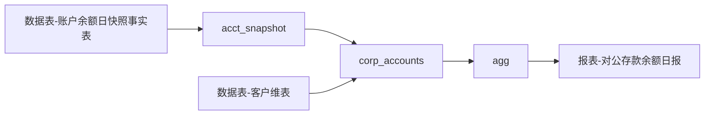

# 血缘-对公存款余额日报

## 业务链路摘要

- 先从账户余额快照表取报表日活跃账户。
- 再通过客户维表筛出对公且非内部客户。
- 最后按产品类型汇总余额和账户数，形成监管报表输出。

## Nodes

- [[数据表-账户余额日快照事实表]]
- `acct_snapshot`
- [[数据表-客户维表]]
- `corp_accounts`
- `agg`
- [[报表-对公存款余额日报]]

## Edge List

| From | To | Transform | Evidence |
| --- | --- | --- | --- |
| [[数据表-账户余额日快照事实表]] | `acct_snapshot` | 按 `snapshot_date = ${biz_date}` 和 `status = 'ACTIVE'` 过滤 | [[来源-示例-对公存款余额日报]] |
| `acct_snapshot` | `corp_accounts` | 通过 `customer_id` 关联客户维表 | [[来源-示例-对公存款余额日报]] |
| [[数据表-客户维表]] | `corp_accounts` | 保留 `customer_type = 'CORP'` 且 `is_internal = 0` | [[来源-示例-对公存款余额日报]] |
| `corp_accounts` | `agg` | 按 `product_type` 聚合余额和账户数 | [[来源-示例-对公存款余额日报]] |
| `agg` | [[报表-对公存款余额日报]] | 输出报表日、产品类型、余额、账户数 | [[来源-示例-对公存款余额日报]] |

## Semantic Lineage

| Regulatory Output | Business Metric | SQL Expression | Source Field |
| --- | --- | --- | --- |
| `ending_balance` | [[指标-期末对公存款余额]] | `SUM(balance)` | [[字段-余额]] |
| `active_account_cnt` | [[指标-活跃对公账户数]] | `COUNT(DISTINCT account_no)` | `account_no` |

## Graph

## Open Questions

- 示例链路没有展示更上游的 ODS 到 DWD 加工过程；真实场景建议继续向上补齐物理血缘。
- 如 `product_type` 有口径映射表，应新增映射表页面并补入血缘链路。
