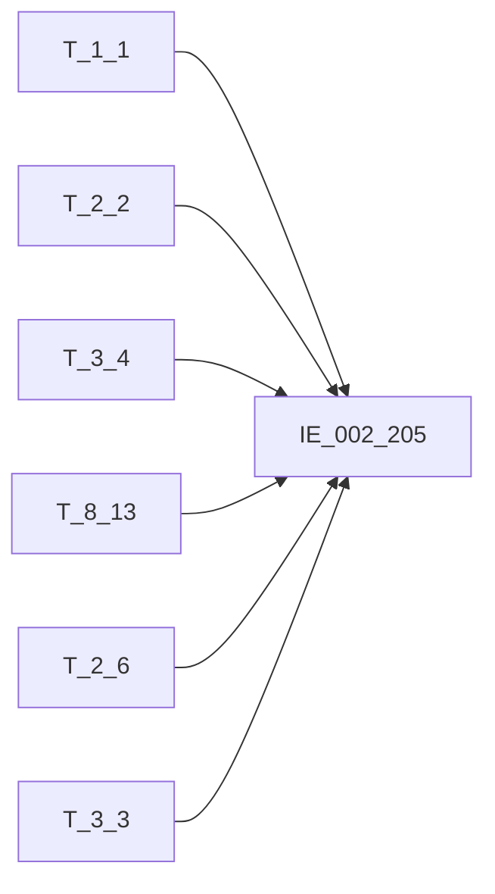

# 血缘-IE_002_205-集团客户表-EAST5.0系统

## 页面边界

- 本页维护 `集团客户表` 从一表通来源表到 EAST5.0 目标表 `IE_002_205` 的设计血缘。
- 证据为业务需求文档和工作区 GBase SQL 草案，尚未经过生产运行验证。
- 数据表字段定义见 [[数据表-IE_002_205-集团客户表-EAST5.0系统]]；业务报送口径见 [[报表-IE_002_205-集团客户表-EAST5.0系统]]。

## 系统边界

- 起始系统：一表通系统
- 目标系统：EAST5.0系统
- 是否跨系统血缘：是
- 目标对象：`IE_002_205` `集团客户表`

## 业务链路摘要

- 按 `原始材料/业务需求/EAST5.0/011_集团客户表.md` 的字段映射，将一表通来源表加工为 EAST5.0 `集团客户表`。
- 表级规则：### 2.1 表级规则（Excel第 213 行） 【集团基本情况】失效时间 限制为 空或失效时间在报送当月 【集团实际控制人】关系失效时间 限制为 空或失效时间在报送当月 【集团成员名单】关系失效时间 限制为 空或失效时间在报送当月 【集团基本情况】集团ID 限制在【授信情况】客户ID范围内的。
- SQL 草案采用按 `P_DATA_DATE` 清理后重插或增量边界过滤的方式；具体投产方式待验证。

## 直接上游对象

- [[数据表-T_1_1-机构信息-一表通系统]]：一表通来源表。
- [[数据表-T_2_2-集团基本情况-一表通系统]]：一表通来源表。
- [[数据表-T_3_4-集团实际控制人-一表通系统]]：一表通来源表。
- [[数据表-T_8_13-授信情况-一表通系统]]：一表通来源表。
- [[数据表-T_2_6-客户财务信息-一表通系统]]：一表通来源表。
- [[数据表-T_3_3-集团成员名单-一表通系统]]：一表通来源表。

## 直接下游对象

- 目标数据表：[[数据表-IE_002_205-集团客户表-EAST5.0系统]]
- 报表业务口径页：[[报表-IE_002_205-集团客户表-EAST5.0系统]]
- SQL 草案：`工作区/SQL开发/EAST5.0系统/PROC_EAST_IE_002_205_JTKHB_草案.sql`

## Nodes

- [[数据表-T_1_1-机构信息-一表通系统]]：一表通来源表。
- [[数据表-T_2_2-集团基本情况-一表通系统]]：一表通来源表。
- [[数据表-T_3_4-集团实际控制人-一表通系统]]：一表通来源表。
- [[数据表-T_8_13-授信情况-一表通系统]]：一表通来源表。
- [[数据表-T_2_6-客户财务信息-一表通系统]]：一表通来源表。
- [[数据表-T_3_3-集团成员名单-一表通系统]]：一表通来源表。
- [[数据表-IE_002_205-集团客户表-EAST5.0系统]]：EAST5.0 目标采集表。
- [[报表-IE_002_205-集团客户表-EAST5.0系统]]：业务口径说明。

## 表级 Edge List

| From | To | Transform | Evidence |
| --- | --- | --- | --- |
| [[数据表-T_1_1-机构信息-一表通系统]] | [[数据表-IE_002_205-集团客户表-EAST5.0系统]] | 字段映射、关联、过滤、码值/日期转换后装载 `IE_002_205` | [[来源-EAST5.0系统-IE_002_205-集团客户表]]；SQL 草案 |
| [[数据表-T_2_2-集团基本情况-一表通系统]] | [[数据表-IE_002_205-集团客户表-EAST5.0系统]] | 字段映射、关联、过滤、码值/日期转换后装载 `IE_002_205` | [[来源-EAST5.0系统-IE_002_205-集团客户表]]；SQL 草案 |
| [[数据表-T_3_4-集团实际控制人-一表通系统]] | [[数据表-IE_002_205-集团客户表-EAST5.0系统]] | 字段映射、关联、过滤、码值/日期转换后装载 `IE_002_205` | [[来源-EAST5.0系统-IE_002_205-集团客户表]]；SQL 草案 |
| [[数据表-T_8_13-授信情况-一表通系统]] | [[数据表-IE_002_205-集团客户表-EAST5.0系统]] | 字段映射、关联、过滤、码值/日期转换后装载 `IE_002_205` | [[来源-EAST5.0系统-IE_002_205-集团客户表]]；SQL 草案 |
| [[数据表-T_2_6-客户财务信息-一表通系统]] | [[数据表-IE_002_205-集团客户表-EAST5.0系统]] | 字段映射、关联、过滤、码值/日期转换后装载 `IE_002_205` | [[来源-EAST5.0系统-IE_002_205-集团客户表]]；SQL 草案 |
| [[数据表-T_3_3-集团成员名单-一表通系统]] | [[数据表-IE_002_205-集团客户表-EAST5.0系统]] | 字段映射、关联、过滤、码值/日期转换后装载 `IE_002_205` | [[来源-EAST5.0系统-IE_002_205-集团客户表]]；SQL 草案 |

## 字段级 Edge List

| 源对象 | 源字段 | 目标对象 | 目标字段 | 处理逻辑 | 关系类型 | 证据 |
| --- | --- | --- | --- | --- | --- | --- |
| [[数据表-T_1_1-机构信息-一表通系统]] | `A010003` | [[数据表-IE_002_205-集团客户表-EAST5.0系统]] | `JRXKZH` | 加工映射：本表【机构ID】关联【机构信息】.【机构ID】取金融许可证号 | 加工映射 | [[来源-EAST5.0系统-IE_002_205-集团客户表]]；SQL 草案 |
| [[数据表-T_2_2-集团基本情况-一表通系统]] | `B020002` | [[数据表-IE_002_205-集团客户表-EAST5.0系统]] | `NBJGH` | 加工映射：【机构ID】12位开始截取 | 加工映射 | [[来源-EAST5.0系统-IE_002_205-集团客户表]]；SQL 草案 |
| [[数据表-T_1_1-机构信息-一表通系统]] | `A010005` | [[数据表-IE_002_205-集团客户表-EAST5.0系统]] | `YHJGMC` | 加工映射：【机构ID】关联机构信息取银行机构名称 | 加工映射 | [[来源-EAST5.0系统-IE_002_205-集团客户表]]；SQL 草案 |
| [[数据表-T_2_2-集团基本情况-一表通系统]] | `B020001` | [[数据表-IE_002_205-集团客户表-EAST5.0系统]] | `JTBH` | 直接映射 | 直接映射 | [[来源-EAST5.0系统-IE_002_205-集团客户表]]；SQL 草案 |
| [[数据表-T_2_2-集团基本情况-一表通系统]] | `B020007` | [[数据表-IE_002_205-集团客户表-EAST5.0系统]] | `JTMC` | 直接映射 | 直接映射 | [[来源-EAST5.0系统-IE_002_205-集团客户表]]；SQL 草案 |
| [[数据表-T_2_2-集团基本情况-一表通系统]] | `B020020` | [[数据表-IE_002_205-集团客户表-EAST5.0系统]] | `MGSKHTYBH` | 直接映射 | 直接映射 | [[来源-EAST5.0系统-IE_002_205-集团客户表]]；SQL 草案 |
| [[数据表-T_2_2-集团基本情况-一表通系统]] | `B020005` | [[数据表-IE_002_205-集团客户表-EAST5.0系统]] | `MGSMC` | 直接映射 | 直接映射 | [[来源-EAST5.0系统-IE_002_205-集团客户表]]；SQL 草案 |
| [[数据表-T_3_4-集团实际控制人-一表通系统]] | `C040004` | [[数据表-IE_002_205-集团客户表-EAST5.0系统]] | `SKRMC` | 加工映射：用集团ID关联集团实际控制人（集团实际控制人表取关系状态为01，按集团ID、机构ID分组，按实际控制人类别排序取第一条）取实际控制人名称 | 加工映射 | [[来源-EAST5.0系统-IE_002_205-集团客户表]]；SQL 草案 |
| [[数据表-T_3_4-集团实际控制人-一表通系统]] | `C040012` | [[数据表-IE_002_205-集团客户表-EAST5.0系统]] | `SKRLX` | 直接映射 | 直接映射 | [[来源-EAST5.0系统-IE_002_205-集团客户表]]；SQL 草案 |
| [[数据表-T_8_13-授信情况-一表通系统]] | `H130007` | [[数据表-IE_002_205-集团客户表-EAST5.0系统]] | `BZ` | 加工映射：用集团ID关联取授信情况.授信币种 | 加工映射 | [[来源-EAST5.0系统-IE_002_205-集团客户表]]；SQL 草案 |
| [[数据表-T_2_6-客户财务信息-一表通系统]] | `B060009` | [[数据表-IE_002_205-集团客户表-EAST5.0系统]] | `JTZCZE` | 加工映射：用集团ID关联取对公客户财务信息表.资产总额 | 加工映射 | [[来源-EAST5.0系统-IE_002_205-集团客户表]]；SQL 草案 |
| [[数据表-T_2_6-客户财务信息-一表通系统]] | `B060010` | [[数据表-IE_002_205-集团客户表-EAST5.0系统]] | `JTFZZE` | 加工映射：用集团ID关联取对公客户财务信息表.负债总额 | 加工映射 | [[来源-EAST5.0系统-IE_002_205-集团客户表]]；SQL 草案 |
| [[数据表-T_2_2-集团基本情况-一表通系统]] | `B020023` | [[数据表-IE_002_205-集团客户表-EAST5.0系统]] | `JTSXED` | 直接映射 | 直接映射 | [[来源-EAST5.0系统-IE_002_205-集团客户表]]；SQL 草案 |
| [[数据表-T_2_2-集团基本情况-一表通系统]] | `B020024` | [[数据表-IE_002_205-集团客户表-EAST5.0系统]] | `JTYYED` | 直接映射 | 直接映射 | [[来源-EAST5.0系统-IE_002_205-集团客户表]]；SQL 草案 |
| [[数据表-T_3_3-集团成员名单-一表通系统]] | `C030002` | [[数据表-IE_002_205-集团客户表-EAST5.0系统]] | `CYKHTYBH` | 加工映射：用集团ID关联【集团成员名单】取成员ID | 加工映射 | [[来源-EAST5.0系统-IE_002_205-集团客户表]]；SQL 草案 |
| [[数据表-T_3_3-集团成员名单-一表通系统]] | `C030003` | [[数据表-IE_002_205-集团客户表-EAST5.0系统]] | `CYMC` | 加工映射：用集团ID关联【集团成员名单】取成员企业名称 | 加工映射 | [[来源-EAST5.0系统-IE_002_205-集团客户表]]；SQL 草案 |
| [[数据表-T_3_3-集团成员名单-一表通系统]] | `C030014` | [[数据表-IE_002_205-集团客户表-EAST5.0系统]] | `CYYYED` | 直接映射 | 直接映射 | [[来源-EAST5.0系统-IE_002_205-集团客户表]]；SQL 草案 |
| 待确认 | `待确认` | [[数据表-IE_002_205-集团客户表-EAST5.0系统]] | `BBZ` | 备注 | 直接映射 | [[来源-EAST5.0系统-IE_002_205-集团客户表]]；SQL 草案 |
| [[数据表-T_2_2-集团基本情况-一表通系统]] | `B020019` | [[数据表-IE_002_205-集团客户表-EAST5.0系统]] | `CJRQ` | 直接映射:yyyy-mm-dd转为yyyymmdd | 直接映射 | [[来源-EAST5.0系统-IE_002_205-集团客户表]]；SQL 草案 |

## Graph-总览

## 回链检查

- 目标数据表页：已补 SQL 草案上游依赖摘要或待本次批处理补齐。
- 报表业务口径页：已创建或补充血缘回链。
- 一表通源表页：已补下游消费摘要或待本次批处理补齐。
- 当前字段级血缘基于业务需求和 SQL 草案，未运行验证，状态为待确认。

## 变更与冲突

- 本次为新增设计血缘或补齐草案血缘，不覆盖已验证生产血缘。
- 未发现需要将 `validated` 页面降级的情况；本页保持 `draft`。

## Open Questions

- GBase 草案中的复杂 JOIN、窗口去重、终态纳入和增量边界需要人工复核。
- 部分字段的码值 CASE 在草案中仍为待补，需要结合外部填报说明和跑数结果闭环。
- 外部监管实体页 wikilink 待补。

## 缺口字段（2026-05-04）

| 目标字段 | 字段名称 | 缺口说明 |
| --- | --- | --- |
| `GSFZJG` | 归属分支机构 | 本地 DDL 存在，但业务需求映射表和 SQL 草案未能确认来源，字段级血缘待补。 |
| `SENSITIVEFLAG` | 涉密标志 | 本地 DDL 存在，但业务需求映射表和 SQL 草案未能确认来源，字段级血缘待补。 |
