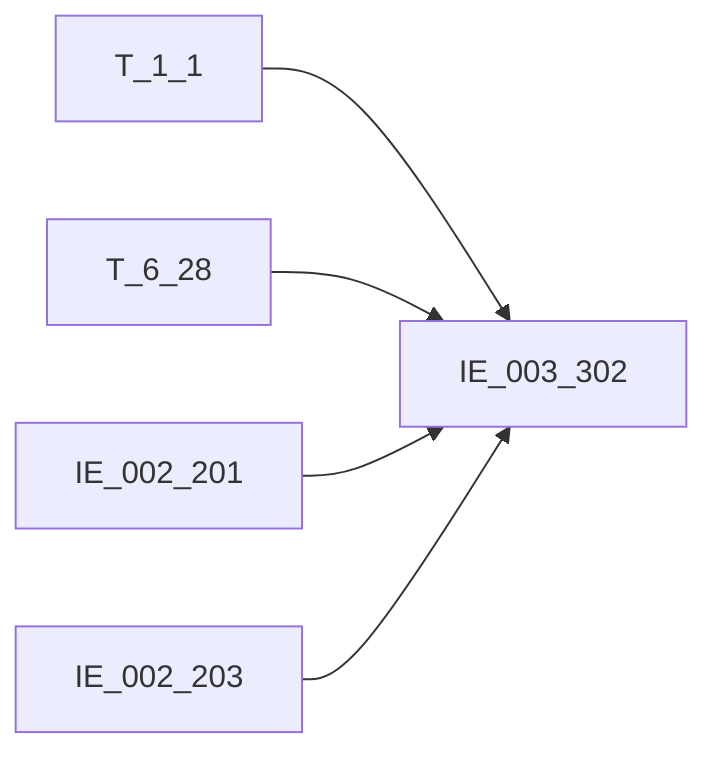

# 血缘-IE_003_302-存折信息表-EAST5.0系统

## 页面边界

- 本页维护 `存折信息表` 从一表通来源表到 EAST5.0 目标表 `IE_003_302` 的设计血缘。
- 证据为业务需求文档和工作区 GBase SQL 草案，尚未经过生产运行验证。
- 数据表字段定义见 [[数据表-IE_003_302-存折信息表-EAST5.0系统]]；业务报送口径见 [[报表-IE_003_302-存折信息表-EAST5.0系统]]。

## 系统边界

- 起始系统：一表通系统
- 目标系统：EAST5.0系统
- 是否跨系统血缘：是
- 目标对象：`IE_003_302` `存折信息表`

## 业务链路摘要

- 按 `原始材料/业务需求/EAST5.0/014_存折信息表.md` 的字段映射，将一表通来源表加工为 EAST5.0 `存折信息表`。
- 表级规则：### 2.1 表级规则（Excel第 266 行） 主表：【介质协议表】 左关联：【机构信息表】 关联条件：【介质协议表】【内部机构号】关联【机构信息表】【内部机构号】 左关联：EAST.【个人基础信息表】 关联条件：【介质协议表】【客户ID】关联EAST.【个人基础信息表】的【客户统一编号】 左关联：EAST.【对公客户信息表】 关联条件：【介质协议表】【客户ID】关联EAST.【对公客户信息表】的【客户统一编号】 过滤条件：筛选介质类型不为’01-卡'的介质，包含失效日期大于等于当月 且 介质状态不包含上月已注销的除卡外的其他介质
- SQL 草案采用按 `P_DATA_DATE` 清理后重插或增量边界过滤的方式；具体投产方式待验证。

## 直接上游对象

- [[数据表-T_1_1-机构信息-一表通系统]]：一表通来源表。
- [[数据表-T_6_28-介质协议表-一表通系统]]：一表通来源表。
- [[数据表-IE_002_201-个人基础信息表-EAST5.0系统]]：客户姓名、证件类别、证件号码补充来源。
- [[数据表-IE_002_203-对公客户信息表-EAST5.0系统]]：客户名称、证件类别、证件号码补充来源。

## 直接下游对象

- 目标数据表：[[数据表-IE_003_302-存折信息表-EAST5.0系统]]
- 报表业务口径页：[[报表-IE_003_302-存折信息表-EAST5.0系统]]
- SQL 草案：`工作区/SQL开发/EAST5.0系统/PROC_EAST_IE_003_302_CZXXB_草案.sql`

## Nodes

- [[数据表-T_1_1-机构信息-一表通系统]]：一表通来源表。
- [[数据表-T_6_28-介质协议表-一表通系统]]：一表通来源表。
- [[数据表-IE_002_201-个人基础信息表-EAST5.0系统]]：客户补充来源。
- [[数据表-IE_002_203-对公客户信息表-EAST5.0系统]]：客户补充来源。
- [[数据表-IE_003_302-存折信息表-EAST5.0系统]]：EAST5.0 目标采集表。
- [[报表-IE_003_302-存折信息表-EAST5.0系统]]：业务口径说明。

## 表级 Edge List

| From | To | Transform | Evidence |
| --- | --- | --- | --- |
| [[数据表-T_1_1-机构信息-一表通系统]] | [[数据表-IE_003_302-存折信息表-EAST5.0系统]] | 字段映射、关联、过滤、码值/日期转换后装载 `IE_003_302` | [[来源-EAST5.0系统-IE_003_302-存折信息表]]；SQL 草案 |
| [[数据表-T_6_28-介质协议表-一表通系统]] | [[数据表-IE_003_302-存折信息表-EAST5.0系统]] | 字段映射、关联、过滤、码值/日期转换后装载 `IE_003_302` | [[来源-EAST5.0系统-IE_003_302-存折信息表]]；SQL 草案 |
| [[数据表-IE_002_201-个人基础信息表-EAST5.0系统]] | [[数据表-IE_003_302-存折信息表-EAST5.0系统]] | 按客户统一编号左关联，补充个人客户姓名、证件类别、证件号码 | [[来源-EAST5.0系统-IE_003_302-存折信息表]]；SQL 草案 |
| [[数据表-IE_002_203-对公客户信息表-EAST5.0系统]] | [[数据表-IE_003_302-存折信息表-EAST5.0系统]] | 按客户统一编号左关联，补充对公客户名称、证件类别、证件号码 | [[来源-EAST5.0系统-IE_003_302-存折信息表]]；SQL 草案 |

## 字段级 Edge List

| 源对象 | 源字段 | 目标对象 | 目标字段 | 处理逻辑 | 关系类型 | 证据 |
| --- | --- | --- | --- | --- | --- | --- |
| [[数据表-T_1_1-机构信息-一表通系统]] | `A010003` | [[数据表-IE_003_302-存折信息表-EAST5.0系统]] | `JRXKZH` | 加工映射：将【一表通】【介质协议表】【机构id】，关联【一表通】【机构信息表】的【机构ID】取【金融许可证号】 | 加工映射 | [[来源-EAST5.0系统-IE_003_302-存折信息表]]；SQL 草案 |
| [[数据表-T_6_28-介质协议表-一表通系统]] | `F280001` | [[数据表-IE_003_302-存折信息表-EAST5.0系统]] | `NBJGH` | 加工映射：将【一表通】【介质协议表】【机构id】从第12位开始截取 | 加工映射 | [[来源-EAST5.0系统-IE_003_302-存折信息表]]；SQL 草案 |
| [[数据表-T_6_28-介质协议表-一表通系统]] | `F280002` | [[数据表-IE_003_302-存折信息表-EAST5.0系统]] | `KHTYBH` | 直接映射:【介质协议表】.【客户ID】 | 直接映射 | [[来源-EAST5.0系统-IE_003_302-存折信息表]]；SQL 草案 |
| [[数据表-IE_002_201-个人基础信息表-EAST5.0系统]] / [[数据表-IE_002_203-对公客户信息表-EAST5.0系统]] | `KHXM` / `KHMC` | [[数据表-IE_003_302-存折信息表-EAST5.0系统]] | `KHMC` | 按客户统一编号关联，优先取个人客户姓名，取不到再取对公客户名称 | 多源择优 | [[来源-EAST5.0系统-IE_003_302-存折信息表]]；SQL 草案 |
| [[数据表-IE_002_201-个人基础信息表-EAST5.0系统]] / [[数据表-IE_002_203-对公客户信息表-EAST5.0系统]] | `ZJLB` | [[数据表-IE_003_302-存折信息表-EAST5.0系统]] | `ZJLB` | 按客户统一编号关联，优先个人、再对公，均取不到赋“无证件” | 多源择优 | [[来源-EAST5.0系统-IE_003_302-存折信息表]]；SQL 草案 |
| [[数据表-IE_002_201-个人基础信息表-EAST5.0系统]] / [[数据表-IE_002_203-对公客户信息表-EAST5.0系统]] | `ZJHM` | [[数据表-IE_003_302-存折信息表-EAST5.0系统]] | `ZJHM` | 按客户统一编号关联，优先个人、再对公 | 多源择优 | [[来源-EAST5.0系统-IE_003_302-存折信息表]]；SQL 草案 |
| [[数据表-T_6_28-介质协议表-一表通系统]] | `F280005` | [[数据表-IE_003_302-存折信息表-EAST5.0系统]] | `CZH` | 直接映射:【介质协议表】.【介质号】 | 直接映射 | [[来源-EAST5.0系统-IE_003_302-存折信息表]]；SQL 草案 |
| [[数据表-T_6_28-介质协议表-一表通系统]] | `F280003` | [[数据表-IE_003_302-存折信息表-EAST5.0系统]] | `HQCKZH` | 直接映射:【介质协议表】.【分户账号】 | 直接映射 | [[来源-EAST5.0系统-IE_003_302-存折信息表]]；SQL 草案 |
| [[数据表-T_6_28-介质协议表-一表通系统]] | `F280006` | [[数据表-IE_003_302-存折信息表-EAST5.0系统]] | `CZLX` | 需求字段“交易介质”在 DDL 未单列，草案按介质类型转换：02 普通存折、04 存单、05 大额定期存单、06 一本通、07 普通存折、00% 其他 | 加工映射 | [[来源-EAST5.0系统-IE_003_302-存折信息表]]；SQL 草案 |
| [[数据表-T_6_28-介质协议表-一表通系统]] | `F280008` | [[数据表-IE_003_302-存折信息表-EAST5.0系统]] | `YGBZ` | 加工映射：0.否，1.是 | 加工映射 | [[来源-EAST5.0系统-IE_003_302-存折信息表]]；SQL 草案 |
| [[数据表-T_6_28-介质协议表-一表通系统]] | `F280009` | [[数据表-IE_003_302-存折信息表-EAST5.0系统]] | `QYRQ` | 加工映射：格式由YYYY-MM-DD转化成YYYYMMDD | 码值转换/格式转换 | [[来源-EAST5.0系统-IE_003_302-存折信息表]]；SQL 草案 |
| [[数据表-T_6_28-介质协议表-一表通系统]] | `F280011` | [[数据表-IE_003_302-存折信息表-EAST5.0系统]] | `QYGYH` | 加工映射:【介质协议表】.【介质启用柜员ID】，如为“自动”则转为空，否则取原值 | 加工映射 | [[来源-EAST5.0系统-IE_003_302-存折信息表]]；SQL 草案 |
| [[数据表-T_6_28-介质协议表-一表通系统]] | `F280012` | [[数据表-IE_003_302-存折信息表-EAST5.0系统]] | `CZZT` | 加工映射:CASE WHEN 【介质协议表】.【介质状态】 = '01' THEN '未激活'； WHEN 【介质协议表】.【介质状态】= '02' THEN '正常'； WHEN 【介质协议表】.【介质状态】= '03' THEN '注销'； WHEN 【介质协议表】.【介质状态】 = '04' THEN '冻结'； WHEN 【介质协议表】.【介质状态】= '05' THEN '睡眠'； WHEN 【介质协议表】.【介质状态】= '... | 加工映射 | [[来源-EAST5.0系统-IE_003_302-存折信息表]]；SQL 草案 |
| [[数据表-T_6_28-介质协议表-一表通系统]] | `F280013` | [[数据表-IE_003_302-存折信息表-EAST5.0系统]] | `BBZ` | 提取一表通《表6.28介质协议》备注，如有多项，以英文分隔符';'拼接 | 加工映射 | [[来源-EAST5.0系统-IE_003_302-存折信息表]]；SQL 草案 |
| 参数 | `P_DATA_DATE` | [[数据表-IE_003_302-存折信息表-EAST5.0系统]] | `CJRQ` | 跑批参数直接赋值 | 参数赋值 | [[来源-EAST5.0系统-IE_003_302-存折信息表]]；SQL 草案 |

## Graph-总览

## SQL 修正记录（2026-05-04）

- 已按 `014_存折信息表.md` 重写 `PROC_EAST_IE_003_302_CZXXB_草案.sql` 的表级关联和过滤条件，移除 `ON 1 = 1` 与过滤占位。
- 关键关联：`T_6_28.F280001 = T_1_1.A010001`；`T_6_28.F280002 = IE_002_201.KHTYBH / IE_002_203.KHTYBH`。
- 关键过滤：采集日期等于跑批日；介质类型不为 `01-卡`；失效日期为空或大于等于采集月月初；排除上月已注销且失效日期早于采集月月初的除卡外介质。

## 回链检查

- 目标数据表页：已补 SQL 草案上游依赖摘要或待本次批处理补齐。
- 报表业务口径页：已创建或补充血缘回链。
- 一表通源表页：已补下游消费摘要或待本次批处理补齐。
- 当前字段级血缘基于业务需求和 SQL 草案，未运行验证，状态为待确认。

## 变更与冲突

- 本次为新增设计血缘或补齐草案血缘，不覆盖已验证生产血缘。
- 未发现需要将 `validated` 页面降级的情况；本页保持 `draft`。

## Open Questions

- 业务需求写“内部机构号关联机构信息内部机构号”，但 T_6_28 DDL 仅确认 `F280001` 为机构ID；当前 SQL 按机构ID关联，需现场确认是否与内部机构号同源。
- `KHLB`、`SENSITIVEFLAG`、`GSFZJG` 无业务需求来源，仍为缺口字段。
- 外部监管实体页 wikilink 待补。

## 缺口字段（2026-05-04）

| 目标字段 | 字段名称 | 缺口说明 |
| --- | --- | --- |
| `KHLB` | 客户类别 | 本地 DDL 存在，但业务需求映射表和 SQL 草案未能确认来源，字段级血缘待补。 |
| `SENSITIVEFLAG` | 涉密标志 | 本地 DDL 存在，但业务需求映射表和 SQL 草案未能确认来源，字段级血缘待补。 |
| `GSFZJG` | 归属分支机构 | 本地 DDL 存在，但业务需求映射表和 SQL 草案未能确认来源，字段级血缘待补。 |
