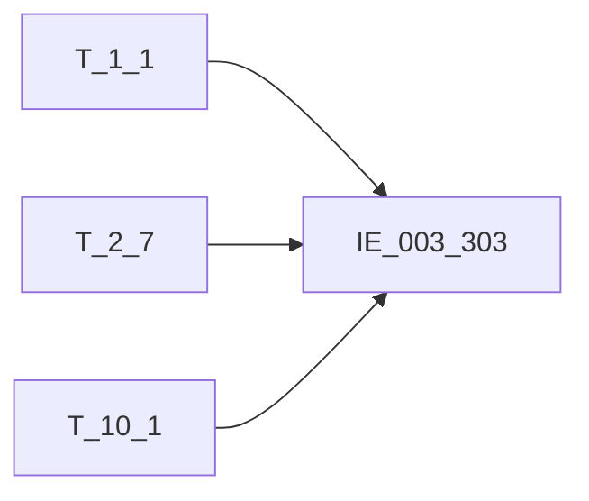

# 血缘-IE_003_303-收单商户信息表-EAST5.0系统

## 页面边界

- 本页维护 `收单商户信息表` 从一表通来源表到 EAST5.0 目标表 `IE_003_303` 的设计血缘。
- 证据为业务需求文档和工作区 GBase SQL 草案，尚未经过生产运行验证。
- 数据表字段定义见 [[数据表-IE_003_303-收单商户信息表-EAST5.0系统]]；业务报送口径见 [[报表-IE_003_303-收单商户信息表-EAST5.0系统]]。

## 系统边界

- 起始系统：一表通系统
- 目标系统：EAST5.0系统
- 是否跨系统血缘：是
- 目标对象：`IE_003_303` `收单商户信息表`

## 业务链路摘要

- 按 `原始材料/业务需求/EAST5.0/015_收单商户信息表.md` 的字段映射，将一表通来源表加工为 EAST5.0 `收单商户信息表`。
- 表级规则：### 2.1 表级规则（Excel第 282 行） 1、主表：【收单商户信息表】 左关联：【机构信息】 关联条件：【收单商户信息表】【机构ID】关联【机构信息】【机构ID】 左关联：【机构信息】 关联条件：【收单商户信息表】【商户地区】前两位拼接‘0000’关联【公共代码】【代码】 并且【公共代码】【表名】等于‘通用’ 并且【公共代码】【字段名】等于‘行政区划’ 关联条件：【收单商户信息表】【商户地区】前四位拼接‘00’关联【公共代码】【代码】 并且【公共代码】【表名】等于‘通用’ 并且【公共代码】【字段名】等于‘行政区划’ 关联条件：【收单商户信息表】【商户地区】关联【公共代码】【代码】 并且【公共代码】【表名】等于‘通用’ 并且【公共代码】【字段名】等于‘行政区划’ 过滤条件：【收单商户信息表】的【失效日期】大于等于当月月初日期或者【收单商户信息表】的【终端失效日期】大于等于当月月初日期。
- SQL 草案采用按 `P_DATA_DATE` 清理后重插或增量边界过滤的方式；具体投产方式待验证。

## 直接上游对象

- [[数据表-T_1_1-机构信息-一表通系统]]：一表通来源表。
- [[数据表-T_2_7-收单商户信息表-一表通系统]]：一表通来源表。
- [[数据表-T_10_1-公共代码-一表通系统]]：商户地区行政区划中文含义来源。

## 直接下游对象

- 目标数据表：[[数据表-IE_003_303-收单商户信息表-EAST5.0系统]]
- 报表业务口径页：[[报表-IE_003_303-收单商户信息表-EAST5.0系统]]
- SQL 草案：`工作区/SQL开发/EAST5.0系统/PROC_EAST_IE_003_303_SDSHXXB_草案.sql`

## Nodes

- [[数据表-T_1_1-机构信息-一表通系统]]：一表通来源表。
- [[数据表-T_2_7-收单商户信息表-一表通系统]]：一表通来源表。
- [[数据表-T_10_1-公共代码-一表通系统]]：商户地区行政区划码值来源。
- [[数据表-IE_003_303-收单商户信息表-EAST5.0系统]]：EAST5.0 目标采集表。
- [[报表-IE_003_303-收单商户信息表-EAST5.0系统]]：业务口径说明。

## 表级 Edge List

| From | To | Transform | Evidence |
| --- | --- | --- | --- |
| [[数据表-T_1_1-机构信息-一表通系统]] | [[数据表-IE_003_303-收单商户信息表-EAST5.0系统]] | 字段映射、关联、过滤、码值/日期转换后装载 `IE_003_303` | [[来源-EAST5.0系统-IE_003_303-收单商户信息表]]；SQL 草案 |
| [[数据表-T_2_7-收单商户信息表-一表通系统]] | [[数据表-IE_003_303-收单商户信息表-EAST5.0系统]] | 字段映射、关联、过滤、码值/日期转换后装载 `IE_003_303` | [[来源-EAST5.0系统-IE_003_303-收单商户信息表]]；SQL 草案 |
| [[数据表-T_10_1-公共代码-一表通系统]] | [[数据表-IE_003_303-收单商户信息表-EAST5.0系统]] | 按行政区划代码关联公共代码中文含义，生成商户地区 | [[来源-EAST5.0系统-IE_003_303-收单商户信息表]]；SQL 草案 |

## 字段级 Edge List

| 源对象 | 源字段 | 目标对象 | 目标字段 | 处理逻辑 | 关系类型 | 证据 |
| --- | --- | --- | --- | --- | --- | --- |
| [[数据表-T_1_1-机构信息-一表通系统]] | `A010003` | [[数据表-IE_003_303-收单商户信息表-EAST5.0系统]] | `JRXKZH` | 加工映射：【机构ID】关联机构信息取金融许可证号 | 加工映射 | [[来源-EAST5.0系统-IE_003_303-收单商户信息表]]；SQL 草案 |
| [[数据表-T_2_7-收单商户信息表-一表通系统]] | `B070003` | [[数据表-IE_003_303-收单商户信息表-EAST5.0系统]] | `NBJGH` | 加工映射：截取机构ID12位开始的值 | 加工映射 | [[来源-EAST5.0系统-IE_003_303-收单商户信息表]]；SQL 草案 |
| [[数据表-T_2_7-收单商户信息表-一表通系统]] | `B070001` | [[数据表-IE_003_303-收单商户信息表-EAST5.0系统]] | `SHBH` | 直接映射 | 直接映射 | [[来源-EAST5.0系统-IE_003_303-收单商户信息表]]；SQL 草案 |
| [[数据表-T_2_7-收单商户信息表-一表通系统]] | `B070004` | [[数据表-IE_003_303-收单商户信息表-EAST5.0系统]] | `SHMC` | 直接映射 | 直接映射 | [[来源-EAST5.0系统-IE_003_303-收单商户信息表]]；SQL 草案 |
| [[数据表-T_2_7-收单商户信息表-一表通系统]] | `B070005` | [[数据表-IE_003_303-收单商户信息表-EAST5.0系统]] | `SFPOS` | 加工映射：【收单商户信息 是否为POS机特约商户】若为1则'是'，否则为‘否’ | 加工映射 | [[来源-EAST5.0系统-IE_003_303-收单商户信息表]]；SQL 草案 |
| [[数据表-T_2_7-收单商户信息表-一表通系统]] | `B070006` | [[数据表-IE_003_303-收单商户信息表-EAST5.0系统]] | `ZDH` | 直接映射 | 直接映射 | [[来源-EAST5.0系统-IE_003_303-收单商户信息表]]；SQL 草案 |
| [[数据表-T_2_7-收单商户信息表-一表通系统]] | `B070007` | [[数据表-IE_003_303-收单商户信息表-EAST5.0系统]] | `SHMCCM` | 直接映射 | 直接映射 | [[来源-EAST5.0系统-IE_003_303-收单商户信息表]]；SQL 草案 |
| [[数据表-T_2_7-收单商户信息表-一表通系统]] | `B070008` | [[数据表-IE_003_303-收单商户信息表-EAST5.0系统]] | `SHMCCMC` | 直接映射 | 直接映射 | [[来源-EAST5.0系统-IE_003_303-收单商户信息表]]；SQL 草案 |
| [[数据表-T_2_7-收单商户信息表-一表通系统]] / [[数据表-T_10_1-公共代码-一表通系统]] | `B070015` / `K010004`, `K010005` | [[数据表-IE_003_303-收单商户信息表-EAST5.0系统]] | `SHDQ` | 商户地区前两位补 `0000`、前四位补 `00`、原值分别关联 `T_10_1`；公共代码限定 `K010002='通用'`、`K010003='行政区划'`，按省/市/县中文含义拼接 | 关联码值转换 | [[来源-EAST5.0系统-IE_003_303-收单商户信息表]]；SQL 草案 |
| [[数据表-T_2_7-收单商户信息表-一表通系统]] | `B070009` | [[数据表-IE_003_303-收单商户信息表-EAST5.0系统]] | `QSZH` | 直接映射 | 直接映射 | [[来源-EAST5.0系统-IE_003_303-收单商户信息表]]；SQL 草案 |
| [[数据表-T_2_7-收单商户信息表-一表通系统]] | `B070010` | [[数据表-IE_003_303-收单商户信息表-EAST5.0系统]] | `QSZHLX` | 代码转化：；一表通代码 映射east：；01 本行卡 本行卡；02 本行对公结算账户 本行对公结算账户；03 他行卡 他行卡；04 他行对公结算账户 他行对公结算账户；00 其他-银行自定义。 其他-自定义 | 码值转换/格式转换 | [[来源-EAST5.0系统-IE_003_303-收单商户信息表]]；SQL 草案 |
| [[数据表-T_2_7-收单商户信息表-一表通系统]] | `B070011` | [[数据表-IE_003_303-收单商户信息表-EAST5.0系统]] | `QSZHMC` | 直接映射 | 直接映射 | [[来源-EAST5.0系统-IE_003_303-收单商户信息表]]；SQL 草案 |
| [[数据表-T_2_7-收单商户信息表-一表通系统]] | `B070012` | [[数据表-IE_003_303-收单商户信息表-EAST5.0系统]] | `QSZHKHHMC` | 直接映射 | 直接映射 | [[来源-EAST5.0系统-IE_003_303-收单商户信息表]]；SQL 草案 |
| [[数据表-T_2_7-收单商户信息表-一表通系统]] | `B070013` | [[数据表-IE_003_303-收单商户信息表-EAST5.0系统]] | `QXRQ` | 直接映射:yyyy-mm-dd转为yyyymmdd | 直接映射 | [[来源-EAST5.0系统-IE_003_303-收单商户信息表]]；SQL 草案 |
| [[数据表-T_2_7-收单商户信息表-一表通系统]] | `B070014` | [[数据表-IE_003_303-收单商户信息表-EAST5.0系统]] | `SXRQ` | 若为空赋值为99991231，否则格式yyyy-mm-dd转为yyyymmdd | 加工映射 | [[来源-EAST5.0系统-IE_003_303-收单商户信息表]]；SQL 草案 |
| [[数据表-T_2_7-收单商户信息表-一表通系统]] | `B070016` | [[数据表-IE_003_303-收单商户信息表-EAST5.0系统]] | `SHZT` | 直接映射 | 直接映射 | [[来源-EAST5.0系统-IE_003_303-收单商户信息表]]；SQL 草案 |
| [[数据表-T_2_7-收单商户信息表-一表通系统]] | `B070018` | [[数据表-IE_003_303-收单商户信息表-EAST5.0系统]] | `BBZ` | 直接映射 | 直接映射 | [[来源-EAST5.0系统-IE_003_303-收单商户信息表]]；SQL 草案 |
| [[数据表-T_2_7-收单商户信息表-一表通系统]] | `B070017` | [[数据表-IE_003_303-收单商户信息表-EAST5.0系统]] | `CJRQ` | 直接映射:yyyy-mm-dd转为yyyymmdd | 直接映射 | [[来源-EAST5.0系统-IE_003_303-收单商户信息表]]；SQL 草案 |

## Graph-总览

## SQL 修正记录（2026-05-04）

- 已按 `015_收单商户信息表.md` 重写 `PROC_EAST_IE_003_303_SDSHXXB_草案.sql` 的表级关联和过滤条件，移除 `ON 1 = 1` 与过滤占位。
- 关键关联：`T_2_7.B070003 = T_1_1.A010001`；`T_2_7.B070015` 按省/市/县三层行政区划关联 `T_10_1.K010004`。
- 关键过滤：采集日期等于跑批日；商户失效日期或终端失效日期为空/大于等于采集月月初时纳入。

## 回链检查

- 目标数据表页：已补 SQL 草案上游依赖摘要或待本次批处理补齐。
- 报表业务口径页：已创建或补充血缘回链。
- 一表通源表页：已补下游消费摘要或待本次批处理补齐。
- 当前字段级血缘基于业务需求和 SQL 草案，未运行验证，状态为待确认。

## 变更与冲突

- 本次为新增设计血缘或补齐草案血缘，不覆盖已验证生产血缘。
- 未发现需要将 `validated` 页面降级的情况；本页保持 `draft`。

## Open Questions

- 业务需求第 2.1 节将公共代码关联误写成“左关联机构信息”，当前按关联条件与字段级规则识别为 `T_10_1` 公共代码，需现场确认。
- `QSZHLB`、`SENSITIVEFLAG`、`GSFZJG` 无业务需求来源，仍为缺口字段。
- 外部监管实体页 wikilink 待补。

## 缺口字段（2026-05-04）

| 目标字段 | 字段名称 | 缺口说明 |
| --- | --- | --- |
| `QSZHLB` | 清算账户类别 | 本地 DDL 存在，但业务需求映射表和 SQL 草案未能确认来源，字段级血缘待补。 |
| `SENSITIVEFLAG` | 涉密标志 | 本地 DDL 存在，但业务需求映射表和 SQL 草案未能确认来源，字段级血缘待补。 |
| `GSFZJG` | 归属分支机构 | 本地 DDL 存在，但业务需求映射表和 SQL 草案未能确认来源，字段级血缘待补。 |
