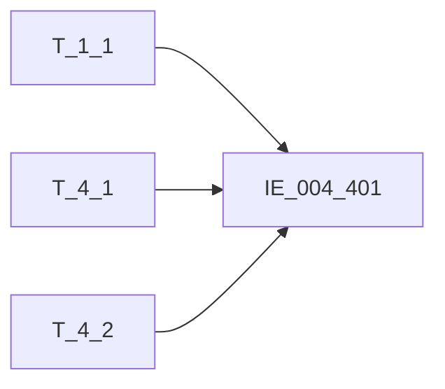

# 血缘-IE_004_401-总账会计全科目表-EAST5.0系统

## 页面边界

- 本页维护 `总账会计全科目表` 从一表通来源表到 EAST5.0 目标表 `IE_004_401` 的设计血缘。
- 证据为业务需求文档和工作区 GBase SQL 草案，尚未经过生产运行验证。
- 数据表字段定义见 [[数据表-IE_004_401-总账会计全科目表-EAST5.0系统]]；业务报送口径见 [[报表-IE_004_401-总账会计全科目表-EAST5.0系统]]。

## 系统边界

- 起始系统：一表通系统
- 目标系统：EAST5.0系统
- 是否跨系统血缘：是
- 目标对象：`IE_004_401` `总账会计全科目表`

## 业务链路摘要

- 按 `原始材料/业务需求/EAST5.0/016_总账会计全科目表.md` 的字段映射，将一表通来源表加工为 EAST5.0 `总账会计全科目表`。
- 表级规则：### 2.1 表级规则（Excel第 301 行） 取【总账会计科目】中【币种】为'CNY’和'BWB'且【采集日期】为统计当月的数据
- SQL 草案采用按 `P_DATA_DATE` 清理后重插或增量边界过滤的方式；具体投产方式待验证。

## 直接上游对象

- [[数据表-T_1_1-机构信息-一表通系统]]：一表通来源表。
- [[数据表-T_4_1-总账会计全科目-一表通系统]]：一表通来源表。
- [[数据表-T_4_2-科目信息-一表通系统]]：一表通来源表。

## 直接下游对象

- 目标数据表：[[数据表-IE_004_401-总账会计全科目表-EAST5.0系统]]
- 报表业务口径页：[[报表-IE_004_401-总账会计全科目表-EAST5.0系统]]
- SQL 草案：`工作区/SQL开发/EAST5.0系统/PROC_EAST_IE_004_401_ZZKJQKMB_草案.sql`

## Nodes

- [[数据表-T_1_1-机构信息-一表通系统]]：一表通来源表。
- [[数据表-T_4_1-总账会计全科目-一表通系统]]：一表通来源表。
- [[数据表-T_4_2-科目信息-一表通系统]]：一表通来源表。
- [[数据表-IE_004_401-总账会计全科目表-EAST5.0系统]]：EAST5.0 目标采集表。
- [[报表-IE_004_401-总账会计全科目表-EAST5.0系统]]：业务口径说明。

## 表级 Edge List

| From | To | Transform | Evidence |
| --- | --- | --- | --- |
| [[数据表-T_1_1-机构信息-一表通系统]] | [[数据表-IE_004_401-总账会计全科目表-EAST5.0系统]] | 字段映射、关联、过滤、码值/日期转换后装载 `IE_004_401` | [[来源-EAST5.0系统-IE_004_401-总账会计全科目表]]；SQL 草案 |
| [[数据表-T_4_1-总账会计全科目-一表通系统]] | [[数据表-IE_004_401-总账会计全科目表-EAST5.0系统]] | 字段映射、关联、过滤、码值/日期转换后装载 `IE_004_401` | [[来源-EAST5.0系统-IE_004_401-总账会计全科目表]]；SQL 草案 |
| [[数据表-T_4_2-科目信息-一表通系统]] | [[数据表-IE_004_401-总账会计全科目表-EAST5.0系统]] | 字段映射、关联、过滤、码值/日期转换后装载 `IE_004_401` | [[来源-EAST5.0系统-IE_004_401-总账会计全科目表]]；SQL 草案 |

## 字段级 Edge List

| 源对象 | 源字段 | 目标对象 | 目标字段 | 处理逻辑 | 关系类型 | 证据 |
| --- | --- | --- | --- | --- | --- | --- |
| [[数据表-T_1_1-机构信息-一表通系统]] | `A010003` | [[数据表-IE_004_401-总账会计全科目表-EAST5.0系统]] | `JRXKZH` | 加工规则：用【总账会计科目】.【机构ID】关联【机构信息】.【机构ID】，取【机构信息】.【金融许可证号】 | 加工映射 | [[来源-EAST5.0系统-IE_004_401-总账会计全科目表]]；SQL 草案 |
| [[数据表-T_4_1-总账会计全科目-一表通系统]] | `D010001` | [[数据表-IE_004_401-总账会计全科目表-EAST5.0系统]] | `NBJGH` | 加工规则：从【总账会计全科目】.【机构ID】第12位开始截取。 | 加工映射 | [[来源-EAST5.0系统-IE_004_401-总账会计全科目表]]；SQL 草案 |
| [[数据表-T_1_1-机构信息-一表通系统]] | `A010005` | [[数据表-IE_004_401-总账会计全科目表-EAST5.0系统]] | `YHJGMC` | 加工规则：用【总账会计全科目】.【机构ID】关联【机构信息】.【机构ID】，取【机构信息】.【银行机构名称】 | 加工映射 | [[来源-EAST5.0系统-IE_004_401-总账会计全科目表]]；SQL 草案 |
| [[数据表-T_4_1-总账会计全科目-一表通系统]] | `D010002` | [[数据表-IE_004_401-总账会计全科目表-EAST5.0系统]] | `KJKMBH` | 直接映射：【总账会计全科目】.【科目ID】 | 直接映射 | [[来源-EAST5.0系统-IE_004_401-总账会计全科目表]]；SQL 草案 |
| [[数据表-T_4_2-科目信息-一表通系统]] | `D020003` | [[数据表-IE_004_401-总账会计全科目表-EAST5.0系统]] | `KJKMMC` | 用 `T_4_1.D010001/D010002` 关联 `T_4_2.D020002/D020001`，取科目名称 | 加工映射 | [[来源-EAST5.0系统-IE_004_401-总账会计全科目表]]；SQL 草案 |
| [[数据表-T_4_1-总账会计全科目-一表通系统]] | `D010009` | [[数据表-IE_004_401-总账会计全科目表-EAST5.0系统]] | `BZ` | 直接映射：【总账会计全科目】.【币种】 | 直接映射 | [[来源-EAST5.0系统-IE_004_401-总账会计全科目表]]；SQL 草案 |
| [[数据表-T_4_1-总账会计全科目-一表通系统]] | `D010003` | [[数据表-IE_004_401-总账会计全科目表-EAST5.0系统]] | `QCJFYE` | 直接映射：【总账会计全科目】.【期初借方余额】 | 直接映射 | [[来源-EAST5.0系统-IE_004_401-总账会计全科目表]]；SQL 草案 |
| [[数据表-T_4_1-总账会计全科目-一表通系统]] | `D010004` | [[数据表-IE_004_401-总账会计全科目表-EAST5.0系统]] | `QCDFYE` | 直接映射：【总账会计全科目】.【期初贷方余额】 | 直接映射 | [[来源-EAST5.0系统-IE_004_401-总账会计全科目表]]；SQL 草案 |
| [[数据表-T_4_1-总账会计全科目-一表通系统]] | `D010005` | [[数据表-IE_004_401-总账会计全科目表-EAST5.0系统]] | `JFFSE` | 直接映射：【总账会计全科目】.【本期借方发生额】 | 直接映射 | [[来源-EAST5.0系统-IE_004_401-总账会计全科目表]]；SQL 草案 |
| [[数据表-T_4_1-总账会计全科目-一表通系统]] | `D010006` | [[数据表-IE_004_401-总账会计全科目表-EAST5.0系统]] | `DFFSE` | 直接映射：【总账会计全科目】.【本期贷方发生额】 | 直接映射 | [[来源-EAST5.0系统-IE_004_401-总账会计全科目表]]；SQL 草案 |
| [[数据表-T_4_1-总账会计全科目-一表通系统]] | `D010007` | [[数据表-IE_004_401-总账会计全科目表-EAST5.0系统]] | `QMJFYE` | 直接映射：【总账会计全科目】.【期末借方余额】 | 直接映射 | [[来源-EAST5.0系统-IE_004_401-总账会计全科目表]]；SQL 草案 |
| [[数据表-T_4_1-总账会计全科目-一表通系统]] | `D010008` | [[数据表-IE_004_401-总账会计全科目表-EAST5.0系统]] | `QMDFYE` | 直接映射：【总账会计全科目】.【期末贷方余额】 | 直接映射 | [[来源-EAST5.0系统-IE_004_401-总账会计全科目表]]；SQL 草案 |
| [[数据表-T_4_1-总账会计全科目-一表通系统]] | `D010011` | [[数据表-IE_004_401-总账会计全科目表-EAST5.0系统]] | `BSZQ` | 码值转化：取【总账会计全科目】.【报表周期】；01 日报；02 月报；03 季报；04 半年报；05 年报；00-XX 转换为其他-XX | 码值转换/格式转换 | [[来源-EAST5.0系统-IE_004_401-总账会计全科目表]]；SQL 草案 |
| [[数据表-T_4_1-总账会计全科目-一表通系统]] | `D010010` | [[数据表-IE_004_401-总账会计全科目表-EAST5.0系统]] | `KJRQ` | 加工映射：取【总账会计全科目】.【会计日期】，格式由YYYY-MM-DD转化成YYYYMMDD | 码值转换/格式转换 | [[来源-EAST5.0系统-IE_004_401-总账会计全科目表]]；SQL 草案 |
| [[数据表-T_4_1-总账会计全科目-一表通系统]] | `D010013` | [[数据表-IE_004_401-总账会计全科目表-EAST5.0系统]] | `BBZ` | 直接映射：【总账会计全科目】.【备注】 | 直接映射 | [[来源-EAST5.0系统-IE_004_401-总账会计全科目表]]；SQL 草案 |
| [[数据表-T_4_1-总账会计全科目-一表通系统]] | `D010012` | [[数据表-IE_004_401-总账会计全科目表-EAST5.0系统]] | `CJRQ` | 加工映射：取【总账会计全科目】.【采集日期】，格式由YYYY-MM-DD转化成YYYYMMDD | 码值转换/格式转换 | [[来源-EAST5.0系统-IE_004_401-总账会计全科目表]]；SQL 草案 |

## Graph-总览

## 回链检查

- 目标数据表页：已补 SQL 草案上游依赖摘要或待本次批处理补齐。
- 报表业务口径页：已创建或补充血缘回链。
- 一表通源表页：已补下游消费摘要或待本次批处理补齐。
- 当前字段级血缘基于业务需求和 SQL 草案，未运行验证，状态为待确认。

## 变更与冲突

- 本次为新增设计血缘或补齐草案血缘，不覆盖已验证生产血缘。
- 未发现需要将 `validated` 页面降级的情况；本页保持 `draft`。

## Open Questions

- SQL 草案已消除 JOIN/WHERE 占位；`统计当月的数据` 当前按采集日期等于跑批日实现，需确认调度传入日期是否固定为统计月末。
- `GSFZJG`、`SENSITIVEFLAG` 无业务需求来源，仍为缺口字段。
- 外部监管实体页 wikilink 待补。

## SQL 修正记录（2026-05-04）

- 已按 `016_总账会计全科目表.md` 重写 `PROC_EAST_IE_004_401_ZZKJQKMB_草案.sql` 的表级关联和过滤条件，移除 `ON 1 = 1` 与过滤占位。
- 关键关联：`T_4_1.D010001 = T_1_1.A010001`；`T_4_1.D010001/D010002 = T_4_2.D020002/D020001`。
- 关键过滤：`T_4_1.D010012 = P_DATA_DATE`，且币种限定为 `CNY`、`BWB`。

## 缺口字段（2026-05-04）

| 目标字段 | 字段名称 | 缺口说明 |
| --- | --- | --- |
| `GSFZJG` | 归属分支机构 | 本地 DDL 存在，但业务需求映射表和 SQL 草案未能确认来源，字段级血缘待补。 |
| `SENSITIVEFLAG` | 涉密标志 | 本地 DDL 存在，但业务需求映射表和 SQL 草案未能确认来源，字段级血缘待补。 |
