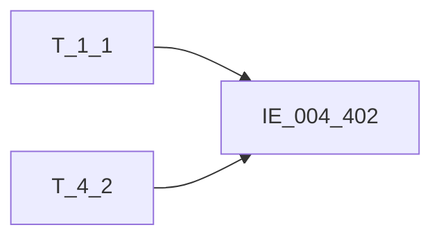

# 血缘-IE_004_402-内部科目对照表-EAST5.0系统

## 页面边界

- 本页维护 `内部科目对照表` 从一表通来源表到 EAST5.0 目标表 `IE_004_402` 的设计血缘。
- 证据为业务需求文档和工作区 GBase SQL 草案，尚未经过生产运行验证。
- 数据表字段定义见 [[数据表-IE_004_402-内部科目对照表-EAST5.0系统]]；业务报送口径见 [[报表-IE_004_402-内部科目对照表-EAST5.0系统]]。

## 系统边界

- 起始系统：一表通系统
- 目标系统：EAST5.0系统
- 是否跨系统血缘：是
- 目标对象：`IE_004_402` `内部科目对照表`

## 业务链路摘要

- 按 `原始材料/业务需求/EAST5.0/017_内部科目对照表.md` 的字段映射，将一表通来源表加工为 EAST5.0 `内部科目对照表`。
- 表级规则：### 2.1 表级规则（Excel第 318 行） 取【科目信息】表当月末的数据
- SQL 草案采用按 `P_DATA_DATE` 清理后重插或增量边界过滤的方式；具体投产方式待验证。

## 直接上游对象

- [[数据表-T_1_1-机构信息-一表通系统]]：一表通来源表。
- [[数据表-T_4_2-科目信息-一表通系统]]：一表通来源表。

## 直接下游对象

- 目标数据表：[[数据表-IE_004_402-内部科目对照表-EAST5.0系统]]
- 报表业务口径页：[[报表-IE_004_402-内部科目对照表-EAST5.0系统]]
- SQL 草案：`工作区/SQL开发/EAST5.0系统/PROC_EAST_IE_004_402_NBKMDZB_草案.sql`

## Nodes

- [[数据表-T_1_1-机构信息-一表通系统]]：一表通来源表。
- [[数据表-T_4_2-科目信息-一表通系统]]：一表通来源表。
- [[数据表-IE_004_402-内部科目对照表-EAST5.0系统]]：EAST5.0 目标采集表。
- [[报表-IE_004_402-内部科目对照表-EAST5.0系统]]：业务口径说明。

## 表级 Edge List

| From | To | Transform | Evidence |
| --- | --- | --- | --- |
| [[数据表-T_1_1-机构信息-一表通系统]] | [[数据表-IE_004_402-内部科目对照表-EAST5.0系统]] | 字段映射、关联、过滤、码值/日期转换后装载 `IE_004_402` | [[来源-EAST5.0系统-IE_004_402-内部科目对照表]]；SQL 草案 |
| [[数据表-T_4_2-科目信息-一表通系统]] | [[数据表-IE_004_402-内部科目对照表-EAST5.0系统]] | 字段映射、关联、过滤、码值/日期转换后装载 `IE_004_402` | [[来源-EAST5.0系统-IE_004_402-内部科目对照表]]；SQL 草案 |

## 字段级 Edge List

| 源对象 | 源字段 | 目标对象 | 目标字段 | 处理逻辑 | 关系类型 | 证据 |
| --- | --- | --- | --- | --- | --- | --- |
| [[数据表-T_1_1-机构信息-一表通系统]] | `A010003` | [[数据表-IE_004_402-内部科目对照表-EAST5.0系统]] | `JRXKZH` | 加工规则：用【科目信息】.【机构ID】关联【机构信息】.【机构ID】，取【机构信息】.【金融许可证号】 | 加工映射 | [[来源-EAST5.0系统-IE_004_402-内部科目对照表]]；SQL 草案 |
| [[数据表-T_4_2-科目信息-一表通系统]] | `D020002` | [[数据表-IE_004_402-内部科目对照表-EAST5.0系统]] | `NBJGH` | 加工规则：从【科目信息】.【机构ID】第12位开始截取。 | 加工映射 | [[来源-EAST5.0系统-IE_004_402-内部科目对照表]]；SQL 草案 |
| [[数据表-T_1_1-机构信息-一表通系统]] | `A010005` | [[数据表-IE_004_402-内部科目对照表-EAST5.0系统]] | `YHJGMC` | 加工规则：用【科目信息】.【机构ID】关联【机构信息】.【机构ID】，取【机构信息】.【银行机构名称】 | 加工映射 | [[来源-EAST5.0系统-IE_004_402-内部科目对照表]]；SQL 草案 |
| [[数据表-T_4_2-科目信息-一表通系统]] | `D020001` | [[数据表-IE_004_402-内部科目对照表-EAST5.0系统]] | `KJKMBH` | 直接映射：【科目信息】.【科目ID】 | 直接映射 | [[来源-EAST5.0系统-IE_004_402-内部科目对照表]]；SQL 草案 |
| [[数据表-T_4_2-科目信息-一表通系统]] | `D020003` | [[数据表-IE_004_402-内部科目对照表-EAST5.0系统]] | `KJKMMC` | 直接映射：【科目信息】.【科目名称】 | 直接映射 | [[来源-EAST5.0系统-IE_004_402-内部科目对照表]]；SQL 草案 |
| [[数据表-T_4_2-科目信息-一表通系统]] | `D020004` | [[数据表-IE_004_402-内部科目对照表-EAST5.0系统]] | `KJKMJC` | 码值转化：取【科目信息】.【科目级次】，01-1,02-2,03-3,04-4，05-5,06-6,07-7,08-8,09-9,10-10,11-11,12-12,13-13,14-14,15-15,16-16,17-17,18-18,19-19,20-20 | 码值转换/格式转换 | [[来源-EAST5.0系统-IE_004_402-内部科目对照表]]；SQL 草案 |
| [[数据表-T_4_2-科目信息-一表通系统]] | `D020004`, `D020008` | [[数据表-IE_004_402-内部科目对照表-EAST5.0系统]] | `SJKMBH` | 一级科目填 `0`，非一级科目取上级科目ID `D020008` | 加工映射 | [[来源-EAST5.0系统-IE_004_402-内部科目对照表]]；SQL 草案 |
| [[数据表-T_4_2-科目信息-一表通系统]] | `D020008` / parent.`D020003` | [[数据表-IE_004_402-内部科目对照表-EAST5.0系统]] | `SJKMMC` | 一级科目为空；非一级按同机构、同采集日期、上级科目ID自关联科目信息，取上级科目名称 | 加工映射 | [[来源-EAST5.0系统-IE_004_402-内部科目对照表]]；SQL 草案 |
| [[数据表-T_4_2-科目信息-一表通系统]] | `D020006` | [[数据表-IE_004_402-内部科目对照表-EAST5.0系统]] | `KMJDBZ` | 码值转化：取【科目信息】.【借贷标识】，01-借，02-贷，03-借贷并列 | 码值转换/格式转换 | [[来源-EAST5.0系统-IE_004_402-内部科目对照表]]；SQL 草案 |
| [[数据表-T_4_2-科目信息-一表通系统]] | `D020005` | [[数据表-IE_004_402-内部科目对照表-EAST5.0系统]] | `GSYWDL` | 码值转化：取【科目信息】.【科目类型】，；01 资产；02 负债；03 所有者权益；04 损益；05 资产负债共同类；06 表外；00 其他 | 码值转换/格式转换 | [[来源-EAST5.0系统-IE_004_402-内部科目对照表]]；SQL 草案 |
| [[数据表-T_4_2-科目信息-一表通系统]] | `D020007` | [[数据表-IE_004_402-内部科目对照表-EAST5.0系统]] | `GSYWZL` | 码值：通过【科目信息】.【归属业务子类】关联公共参数取对应转换值 | 码值转换/格式转换 | [[来源-EAST5.0系统-IE_004_402-内部科目对照表]]；SQL 草案 |
| [[数据表-T_4_2-科目信息-一表通系统]] | `D020010` | [[数据表-IE_004_402-内部科目对照表-EAST5.0系统]] | `BBZ` | 直接映射：【科目信息】.【备注】 | 直接映射 | [[来源-EAST5.0系统-IE_004_402-内部科目对照表]]；SQL 草案 |
| [[数据表-T_4_2-科目信息-一表通系统]] | `D020011` | [[数据表-IE_004_402-内部科目对照表-EAST5.0系统]] | `CJRQ` | 加工映射：取【科目信息】.【采集日期】，格式由YYYY-MM-DD转化成YYYYMMDD | 码值转换/格式转换 | [[来源-EAST5.0系统-IE_004_402-内部科目对照表]]；SQL 草案 |

## Graph-总览

## 回链检查

- 目标数据表页：已补 SQL 草案上游依赖摘要或待本次批处理补齐。
- 报表业务口径页：已创建或补充血缘回链。
- 一表通源表页：已补下游消费摘要或待本次批处理补齐。
- 当前字段级血缘基于业务需求和 SQL 草案，未运行验证，状态为待确认。

## 变更与冲突

- 本次为新增设计血缘或补齐草案血缘，不覆盖已验证生产血缘。
- 未发现需要将 `validated` 页面降级的情况；本页保持 `draft`。

## Open Questions

- SQL 草案已消除 JOIN/WHERE 占位；`当月末的数据` 当前按采集日期等于跑批日实现，需确认调度传入日期是否固定为月末。
- `归属业务子类` 需求写关联公共参数，但未给出公共参数表名/字段条件，草案暂取 `T_4_2.D020007` 原值。
- `GSFZJG`、`SENSITIVEFLAG` 无业务需求来源，仍为缺口字段。
- 外部监管实体页 wikilink 待补。

## SQL 修正记录（2026-05-04）

- 已按 `017_内部科目对照表.md` 重写 `PROC_EAST_IE_004_402_NBKMDZB_草案.sql` 的表级关联和过滤条件，移除 `ON 1 = 1` 与过滤占位。
- 关键关联：`T_4_2.D020002 = T_1_1.A010001`；上级科目名称按 `T_4_2.D020008 = parent.D020001` 自关联。
- 关键过滤：`T_4_2.D020011 = P_DATA_DATE`。

## 缺口字段（2026-05-04）

| 目标字段 | 字段名称 | 缺口说明 |
| --- | --- | --- |
| `SENSITIVEFLAG` | 涉密标志 | 本地 DDL 存在，但业务需求映射表和 SQL 草案未能确认来源，字段级血缘待补。 |
| `GSFZJG` | 归属分支机构 | 本地 DDL 存在，但业务需求映射表和 SQL 草案未能确认来源，字段级血缘待补。 |
