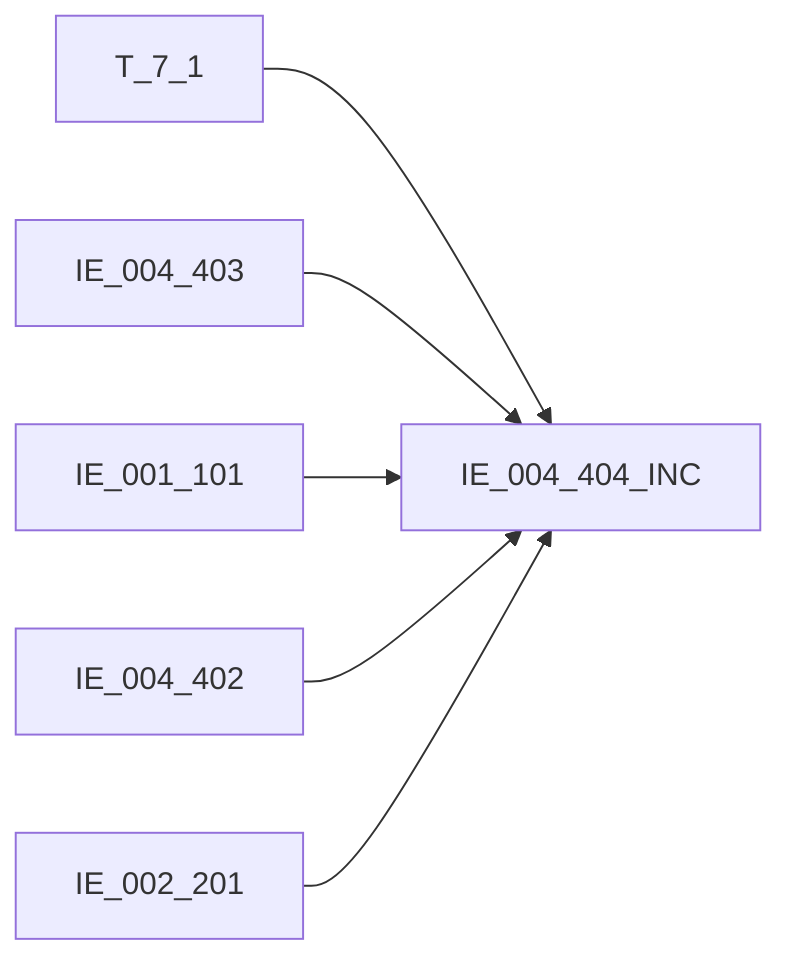

# 血缘-IE_004_404_INC-个人存款分户账明细记录-EAST5.0系统

## 页面边界

- 本页维护 `个人存款分户账明细记录` 从一表通来源表到 EAST5.0 目标表 `IE_004_404_INC` 的设计血缘。
- 证据为业务需求文档和工作区 GBase SQL 草案，尚未经过生产运行验证。
- 数据表字段定义见 [[数据表-IE_004_404_INC-个人存款分户账明细记录-EAST5.0系统]]；业务报送口径见 [[报表-IE_004_404_INC-个人存款分户账明细记录-EAST5.0系统]]。

## 系统边界

- 起始系统：一表通系统
- 目标系统：EAST5.0系统
- 是否跨系统血缘：是
- 目标对象：`IE_004_404_INC` `个人存款分户账明细记录`

## 业务链路摘要

- 按 `原始材料/业务需求/EAST5.0/019_个人存款分户账明细记录.md` 的字段映射，将一表通来源表加工为 EAST5.0 `个人存款分户账明细记录`。
- 表级规则：### 2.1 表级规则（Excel第 354 行） 主表：【客户存款账户交易表】 内关联1：【EAST.个人存款分户账】 关联条件1：【客户存款账户交易表】【分户账号】=【EAST.个人存款分户账】【分户账号】 AND 【客户存款账户交易表】【币种】=【分户账号】【币种】 AND CASE WHEN 【客户存款账户交易表】【币种】 = 'CNY' THEN '人民币' WHEN 【客户存款账户交易表】【钞汇类别】 = '01' THEN '钞' WHEN 【客户存款账户交易表】【钞汇类别】 = '02' THEN '汇' WHEN 【客户存款账户交易表】【钞汇类别】 = '03' THEN '可钞可汇' =【个人存款分户账】【钞汇类别】 左关联：【EAST.机构信息表】 关联条件：【客户存款账户交易表】【内部机构号】关联【EAST.机构信息表】【内部机构号】 左关联：【EAST.内部科目对照表】 关联条件：【客户存款账户交易表】【科目ID】，关联【EAST.内部科目对照表】的【会计科目编号】 左关联：【EAST.个人基础信息表】 关联条件：【客户存款账户交易表】【客户ID】，关联【EAST.个人基础信息表】的【统一客户编号】
- SQL 草案采用按 `P_DATA_DATE` 清理后重插或增量边界过滤的方式；具体投产方式待验证。

## 直接上游对象

- [[数据表-T_7_1-客户存款账户交易-一表通系统]]：一表通来源表。
- [[数据表-IE_004_403-个人存款分户账-EAST5.0系统]]：内关联账户主档，用于限定个人存款账户并补账户名称。
- [[数据表-IE_001_101-机构信息表-EAST5.0系统]]：机构补充来源。
- [[数据表-IE_004_402-内部科目对照表-EAST5.0系统]]：明细科目名称来源。
- [[数据表-IE_002_201-个人基础信息表-EAST5.0系统]]：证件类别、证件号码来源。

## 直接下游对象

- 目标数据表：[[数据表-IE_004_404_INC-个人存款分户账明细记录-EAST5.0系统]]
- 报表业务口径页：[[报表-IE_004_404_INC-个人存款分户账明细记录-EAST5.0系统]]
- SQL 草案：`工作区/SQL开发/EAST5.0系统/PROC_EAST_IE_004_404_INC_GRCKFHZMX_草案.sql`

## Nodes

- [[数据表-T_7_1-客户存款账户交易-一表通系统]]：一表通来源表。
- [[数据表-IE_004_404_INC-个人存款分户账明细记录-EAST5.0系统]]：EAST5.0 目标采集表。
- [[报表-IE_004_404_INC-个人存款分户账明细记录-EAST5.0系统]]：业务口径说明。

## 表级 Edge List

| From | To | Transform | Evidence |
| --- | --- | --- | --- |
| [[数据表-T_7_1-客户存款账户交易-一表通系统]] | [[数据表-IE_004_404_INC-个人存款分户账明细记录-EAST5.0系统]] | 字段映射、关联、过滤、码值/日期转换后装载 `IE_004_404_INC` | [[来源-EAST5.0系统-IE_004_404_INC-个人存款分户账明细记录]]；SQL 草案 |
| [[数据表-IE_004_403-个人存款分户账-EAST5.0系统]] | [[数据表-IE_004_404_INC-个人存款分户账明细记录-EAST5.0系统]] | 按账号、币种、钞汇类别内关联，限定个人存款账户并补账户名称 | [[来源-EAST5.0系统-IE_004_404_INC-个人存款分户账明细记录]]；SQL 草案 |
| [[数据表-IE_001_101-机构信息表-EAST5.0系统]] | [[数据表-IE_004_404_INC-个人存款分户账明细记录-EAST5.0系统]] | 按内部机构号补金融许可证号和银行机构名称 | [[来源-EAST5.0系统-IE_004_404_INC-个人存款分户账明细记录]]；SQL 草案 |
| [[数据表-IE_004_402-内部科目对照表-EAST5.0系统]] | [[数据表-IE_004_404_INC-个人存款分户账明细记录-EAST5.0系统]] | 按会计科目编号补明细科目名称 | [[来源-EAST5.0系统-IE_004_404_INC-个人存款分户账明细记录]]；SQL 草案 |
| [[数据表-IE_002_201-个人基础信息表-EAST5.0系统]] | [[数据表-IE_004_404_INC-个人存款分户账明细记录-EAST5.0系统]] | 按客户统一编号补证件类别和证件号码 | [[来源-EAST5.0系统-IE_004_404_INC-个人存款分户账明细记录]]；SQL 草案 |

## 字段级 Edge List

| 源对象 | 源字段 | 目标对象 | 目标字段 | 处理逻辑 | 关系类型 | 证据 |
| --- | --- | --- | --- | --- | --- | --- |
| [[数据表-T_7_1-客户存款账户交易-一表通系统]] | `G010001` | [[数据表-IE_004_404_INC-个人存款分户账明细记录-EAST5.0系统]] | `JYXLH` | 直接映射：【客户存款账户交易表 BS_JY_KHZZJY】.【交易ID JYID】 | 直接映射 | [[来源-EAST5.0系统-IE_004_404_INC-个人存款分户账明细记录]]；SQL 草案 |
| [[数据表-IE_001_101-机构信息表-EAST5.0系统]] | `JRXKZH` | [[数据表-IE_004_404_INC-个人存款分户账明细记录-EAST5.0系统]] | `JRXKZH` | 按入账机构ID截取后的内部机构号关联机构信息表 | 直接映射 | [[来源-EAST5.0系统-IE_004_404_INC-个人存款分户账明细记录]]；SQL 草案 |
| [[数据表-T_7_1-客户存款账户交易-一表通系统]] | `G010035` | [[数据表-IE_004_404_INC-个人存款分户账明细记录-EAST5.0系统]] | `NBJGH` | 加工映射：SUBSTR(【客户存款账户交易 BS_JY_KHZZJY】.【入账机构ID JYJGID】,12) | 加工映射 | [[来源-EAST5.0系统-IE_004_404_INC-个人存款分户账明细记录]]；SQL 草案 |
| [[数据表-T_7_1-客户存款账户交易-一表通系统]] | `G010004` | [[数据表-IE_004_404_INC-个人存款分户账明细记录-EAST5.0系统]] | `YWBLJGH` | 加工映射：SUBSTR(【客户存款账户交易 BS_JY_KHZZJY】.【交易机构ID JYJGID】,12) | 加工映射 | [[来源-EAST5.0系统-IE_004_404_INC-个人存款分户账明细记录]]；SQL 草案 |
| [[数据表-IE_001_101-机构信息表-EAST5.0系统]] | `YHJGMC` | [[数据表-IE_004_404_INC-个人存款分户账明细记录-EAST5.0系统]] | `YHJGMC` | 按入账机构ID截取后的内部机构号关联机构信息表 | 直接映射 | [[来源-EAST5.0系统-IE_004_404_INC-个人存款分户账明细记录]]；SQL 草案 |
| [[数据表-T_7_1-客户存款账户交易-一表通系统]] | `G010011` | [[数据表-IE_004_404_INC-个人存款分户账明细记录-EAST5.0系统]] | `MXKMBH` | 直接映射：【客户存款账户交易表 BS_JY_KHZZJY】.【科目ID KMID】 | 直接映射 | [[来源-EAST5.0系统-IE_004_404_INC-个人存款分户账明细记录]]；SQL 草案 |
| [[数据表-IE_004_402-内部科目对照表-EAST5.0系统]] | `KJKMMC` | [[数据表-IE_004_404_INC-个人存款分户账明细记录-EAST5.0系统]] | `MXKMMC` | 按科目ID关联内部科目对照表会计科目编号 | 直接映射 | [[来源-EAST5.0系统-IE_004_404_INC-个人存款分户账明细记录]]；SQL 草案 |
| [[数据表-T_7_1-客户存款账户交易-一表通系统]] | `G010003` | [[数据表-IE_004_404_INC-个人存款分户账明细记录-EAST5.0系统]] | `KHTYBH` | 直接映射：【客户存款账户交易表 BS_JY_KHZZJY】.【客户ID KHID】 | 直接映射 | [[来源-EAST5.0系统-IE_004_404_INC-个人存款分户账明细记录]]；SQL 草案 |
| [[数据表-IE_004_403-个人存款分户账-EAST5.0系统]] | `ZHMC` | [[数据表-IE_004_404_INC-个人存款分户账明细记录-EAST5.0系统]] | `ZHMC` | 按分户账号、币种、钞汇类别内关联个人存款分户账 | 直接映射 | [[来源-EAST5.0系统-IE_004_404_INC-个人存款分户账明细记录]]；SQL 草案 |
| [[数据表-IE_002_201-个人基础信息表-EAST5.0系统]] | `ZJLB` | [[数据表-IE_004_404_INC-个人存款分户账明细记录-EAST5.0系统]] | `ZJLB` | 按客户统一编号关联个人基础信息表 | 直接映射 | [[来源-EAST5.0系统-IE_004_404_INC-个人存款分户账明细记录]]；SQL 草案 |
| [[数据表-IE_002_201-个人基础信息表-EAST5.0系统]] | `ZJHM` | [[数据表-IE_004_404_INC-个人存款分户账明细记录-EAST5.0系统]] | `ZJHM` | 按客户统一编号关联个人基础信息表 | 直接映射 | [[来源-EAST5.0系统-IE_004_404_INC-个人存款分户账明细记录]]；SQL 草案 |
| [[数据表-T_7_1-客户存款账户交易-一表通系统]] | `G010002` | [[数据表-IE_004_404_INC-个人存款分户账明细记录-EAST5.0系统]] | `GRCKZH` | 直接映射：【客户存款账户交易表 BS_JY_KHZZJY】.【分户账号 FHZH】 | 直接映射 | [[来源-EAST5.0系统-IE_004_404_INC-个人存款分户账明细记录]]；SQL 草案 |
| [[数据表-T_7_1-客户存款账户交易-一表通系统]] | `G010025` | [[数据表-IE_004_404_INC-个人存款分户账明细记录-EAST5.0系统]] | `WBZH` | 直接映射：【客户存款账户交易表 BS_JY_KHZZJY】.【外部账号 WBZH】 | 直接映射 | [[来源-EAST5.0系统-IE_004_404_INC-个人存款分户账明细记录]]；SQL 草案 |
| [[数据表-T_7_1-客户存款账户交易-一表通系统]] | `G010010` | [[数据表-IE_004_404_INC-个人存款分户账明细记录-EAST5.0系统]] | `JYLX` | 码值转化：CASE WHEN 【客户存款账户交易表 BS_JY_KHZZJY】.【账户交易类型 ZZJYLX】 = '01' THEN '转账'； WHEN 【客户存款账户交易表 BS_JY_KHZZJY】.【账户交易类型 ZZJYLX】 = '02' THEN '取现'； WHEN 【客户存款账户交易表 BS_JY_KHZZJY】.【账户交易类型 ZZJYLX】 = '03' THEN '存现'； WHEN 【客户存款账户交易表 BS... | 码值转换/格式转换 | [[来源-EAST5.0系统-IE_004_404_INC-个人存款分户账明细记录]]；SQL 草案 |
| [[数据表-T_7_1-客户存款账户交易-一表通系统]] | `G010014` | [[数据表-IE_004_404_INC-个人存款分户账明细记录-EAST5.0系统]] | `JYJDBZ` | 码值转换：01 借；02 贷 | 码值转换/格式转换 | [[来源-EAST5.0系统-IE_004_404_INC-个人存款分户账明细记录]]；SQL 草案 |
| [[数据表-T_7_1-客户存款账户交易-一表通系统]] | `G010005` | [[数据表-IE_004_404_INC-个人存款分户账明细记录-EAST5.0系统]] | `HXJYRQ` | 加工映射：格式由YYYY-MM-DD转化成YYYYMMDD | 码值转换/格式转换 | [[来源-EAST5.0系统-IE_004_404_INC-个人存款分户账明细记录]]；SQL 草案 |
| [[数据表-T_7_1-客户存款账户交易-一表通系统]] | `G010006` | [[数据表-IE_004_404_INC-个人存款分户账明细记录-EAST5.0系统]] | `HXJYSJ` | 加工映射：REPLACE(【客户存款账户交易表 BS_JY_KHZZJY】.【核心交易时间 HXJYSJ】,':','') | 加工映射 | [[来源-EAST5.0系统-IE_004_404_INC-个人存款分户账明细记录]]；SQL 草案 |
| [[数据表-T_7_1-客户存款账户交易-一表通系统]] | `G010009` | [[数据表-IE_004_404_INC-个人存款分户账明细记录-EAST5.0系统]] | `BZ` | 直接映射：【客户存款账户交易表 BS_JY_KHZZJY】.【币种 BZ】 | 直接映射 | [[来源-EAST5.0系统-IE_004_404_INC-个人存款分户账明细记录]]；SQL 草案 |
| [[数据表-T_7_1-客户存款账户交易-一表通系统]] | `G010007` | [[数据表-IE_004_404_INC-个人存款分户账明细记录-EAST5.0系统]] | `JYJE` | 直接映射：【客户存款账户交易表 BS_JY_KHZZJY】.【交易金额 JYJE】 | 直接映射 | [[来源-EAST5.0系统-IE_004_404_INC-个人存款分户账明细记录]]；SQL 草案 |
| [[数据表-T_7_1-客户存款账户交易-一表通系统]] | `G010008` | [[数据表-IE_004_404_INC-个人存款分户账明细记录-EAST5.0系统]] | `ZHYE` | 直接映射：【客户存款账户交易表 BS_JY_KHZZJY】.【账户余额 ZHYE】 | 直接映射 | [[来源-EAST5.0系统-IE_004_404_INC-个人存款分户账明细记录]]；SQL 草案 |
| [[数据表-T_7_1-客户存款账户交易-一表通系统]] | `G010015` | [[数据表-IE_004_404_INC-个人存款分户账明细记录-EAST5.0系统]] | `DFZH` | 直接映射：【客户存款账户交易表 BS_JY_KHZZJY】.【对方账号 DFZH】 | 直接映射 | [[来源-EAST5.0系统-IE_004_404_INC-个人存款分户账明细记录]]；SQL 草案 |
| [[数据表-T_7_1-客户存款账户交易-一表通系统]] | `G010016` | [[数据表-IE_004_404_INC-个人存款分户账明细记录-EAST5.0系统]] | `DFHM` | 直接映射：【客户存款账户交易表 BS_JY_KHZZJY】.【对方户名 HFHUM】 | 直接映射 | [[来源-EAST5.0系统-IE_004_404_INC-个人存款分户账明细记录]]；SQL 草案 |
| [[数据表-T_7_1-客户存款账户交易-一表通系统]] | `G010017` | [[数据表-IE_004_404_INC-个人存款分户账明细记录-EAST5.0系统]] | `DFXH` | 直接映射：【客户存款账户交易表 BS_JY_KHZZJY】.【对方账号行号 DFZHHH】 | 直接映射 | [[来源-EAST5.0系统-IE_004_404_INC-个人存款分户账明细记录]]；SQL 草案 |
| [[数据表-T_7_1-客户存款账户交易-一表通系统]] | `G010018` | [[数据表-IE_004_404_INC-个人存款分户账明细记录-EAST5.0系统]] | `DFXM` | 直接映射：【客户存款账户交易表 BS_JY_KHZZJY】.【对方行名 DFHM】 | 直接映射 | [[来源-EAST5.0系统-IE_004_404_INC-个人存款分户账明细记录]]；SQL 草案 |
| [[数据表-T_7_1-客户存款账户交易-一表通系统]] | `G010019` | [[数据表-IE_004_404_INC-个人存款分户账明细记录-EAST5.0系统]] | `ZY` | 直接映射：【客户存款账户交易表 BS_JY_KHZZJY】.【交易摘要 JYZY】 | 直接映射 | [[来源-EAST5.0系统-IE_004_404_INC-个人存款分户账明细记录]]；SQL 草案 |
| [[数据表-T_7_1-客户存款账户交易-一表通系统]] | `G010031` | [[数据表-IE_004_404_INC-个人存款分户账明细记录-EAST5.0系统]] | `FY` | 直接映射：【客户存款账户交易表 BS_JY_KHZZJY】.【附言】 | 直接映射 | [[来源-EAST5.0系统-IE_004_404_INC-个人存款分户账明细记录]]；SQL 草案 |
| [[数据表-T_7_1-客户存款账户交易-一表通系统]] | `G010020` | [[数据表-IE_004_404_INC-个人存款分户账明细记录-EAST5.0系统]] | `CBMBZ` | 码值转化：；01 正常；02 冲补抹 | 码值转换/格式转换 | [[来源-EAST5.0系统-IE_004_404_INC-个人存款分户账明细记录]]；SQL 草案 |
| [[数据表-T_7_1-客户存款账户交易-一表通系统]] | `G010013` | [[数据表-IE_004_404_INC-个人存款分户账明细记录-EAST5.0系统]] | `XZBZ` | 码值转化：；01 现；02 转 | 码值转换/格式转换 | [[来源-EAST5.0系统-IE_004_404_INC-个人存款分户账明细记录]]；SQL 草案 |
| [[数据表-T_7_1-客户存款账户交易-一表通系统]] | `G010021` | [[数据表-IE_004_404_INC-个人存款分户账明细记录-EAST5.0系统]] | `JYQD` | 码值转化：CASE WHEN 【客户存款账户交易表 BS_JY_KHZZJY】.【交易渠道 JYQD】 = '01' THEN '柜面' ； WHEN 【客户存款账户交易表 BS_JY_KHZZJY】.【交易渠道 JYQD】 = '02' THEN 'ATM'； WHEN 【客户存款账户交易表 BS_JY_KHZZJY】.【交易渠道 JYQD】 = '03' THEN 'VTM'； WHEN 【客户存款账户交易表 BS_JY_KHZZJ... | 码值转换/格式转换 | [[来源-EAST5.0系统-IE_004_404_INC-个人存款分户账明细记录]]；SQL 草案 |
| [[数据表-T_7_1-客户存款账户交易-一表通系统]] | `G010023` | [[数据表-IE_004_404_INC-个人存款分户账明细记录-EAST5.0系统]] | `IPDZ` | 直接映射：【客户存款账户交易表 BS_JY_KHZZJY】.【IP地址 IPDZ】 | 直接映射 | [[来源-EAST5.0系统-IE_004_404_INC-个人存款分户账明细记录]]；SQL 草案 |
| [[数据表-T_7_1-客户存款账户交易-一表通系统]] | `G010024` | [[数据表-IE_004_404_INC-个人存款分户账明细记录-EAST5.0系统]] | `MACDZ` | 直接映射：【客户存款账户交易表 BS_JY_KHZZJY】.【MAC地址 MACDZ】 | 直接映射 | [[来源-EAST5.0系统-IE_004_404_INC-个人存款分户账明细记录]]；SQL 草案 |
| [[数据表-T_7_1-客户存款账户交易-一表通系统]] | `G010026` | [[数据表-IE_004_404_INC-个人存款分户账明细记录-EAST5.0系统]] | `DBRXM` | 直接映射：【客户存款账户交易表 BS_JY_KHZZJY】.【代办人姓名 DBRXM】 | 直接映射 | [[来源-EAST5.0系统-IE_004_404_INC-个人存款分户账明细记录]]；SQL 草案 |
| [[数据表-T_7_1-客户存款账户交易-一表通系统]] | `G010027` | [[数据表-IE_004_404_INC-个人存款分户账明细记录-EAST5.0系统]] | `DBRZJLB` | 直接映射：COALESCE(P11.targetcd,'') | 直接映射 | [[来源-EAST5.0系统-IE_004_404_INC-个人存款分户账明细记录]]；SQL 草案 |
| [[数据表-T_7_1-客户存款账户交易-一表通系统]] | `G010028` | [[数据表-IE_004_404_INC-个人存款分户账明细记录-EAST5.0系统]] | `DBRZJHM` | 直接映射：【客户存款账户交易表 BS_JY_KHZZJY】.【代办人证件号码 DBRZJHM】 | 直接映射 | [[来源-EAST5.0系统-IE_004_404_INC-个人存款分户账明细记录]]；SQL 草案 |
| [[数据表-T_7_1-客户存款账户交易-一表通系统]] | `G010029` | [[数据表-IE_004_404_INC-个人存款分户账明细记录-EAST5.0系统]] | `JYGYH` | 加工映射：如果【客户存款账户交易表 BS_JY_KHZZJY】.【经办员工ID JBYGID】为'自动'，则为''，否则为【客户存款账户交易表 BS_JY_KHZZJY】.【经办员工ID JBYGID】 | 加工映射 | [[来源-EAST5.0系统-IE_004_404_INC-个人存款分户账明细记录]]；SQL 草案 |
| [[数据表-T_7_1-客户存款账户交易-一表通系统]] | `G010030` | [[数据表-IE_004_404_INC-个人存款分户账明细记录-EAST5.0系统]] | `SQGYH` | 加工映射：【客户存款账户交易表 BS_JY_KHZZJY】.【授权员工ID SQYGID】，如为“自动”则转为空，否则取原值 | 加工映射 | [[来源-EAST5.0系统-IE_004_404_INC-个人存款分户账明细记录]]；SQL 草案 |
| [[数据表-T_7_1-客户存款账户交易-一表通系统]] | `G010034` | [[数据表-IE_004_404_INC-个人存款分户账明细记录-EAST5.0系统]] | `BBZ` | 提取一表通《表7.1客户存款账户交易》、《表1.1机构信息》备注，如有多项，以英文分隔符';'拼接 | 加工映射 | [[来源-EAST5.0系统-IE_004_404_INC-个人存款分户账明细记录]]；SQL 草案 |
| 参数 | `P_DATA_DATE` | [[数据表-IE_004_404_INC-个人存款分户账明细记录-EAST5.0系统]] | `CJRQ` | 跑批参数直接赋值 | 参数赋值 | [[来源-EAST5.0系统-IE_004_404_INC-个人存款分户账明细记录]]；SQL 草案 |

## Graph-总览

## 回链检查

- 目标数据表页：已补 SQL 草案上游依赖摘要或待本次批处理补齐。
- 报表业务口径页：已创建或补充血缘回链。
- 一表通源表页：已补下游消费摘要或待本次批处理补齐。
- 当前字段级血缘基于业务需求和 SQL 草案，未运行验证，状态为待确认。

## 变更与冲突

- 本次为新增设计血缘或补齐草案血缘，不覆盖已验证生产血缘。
- 未发现需要将 `validated` 页面降级的情况；本页保持 `draft`。

## Open Questions

- SQL 草案已消除 JOIN/WHERE 占位；增量边界当前按 `T_7_1.G010032 = P_DATA_DATE` 实现，若需“上一采集日至采集日”范围需补上一批次日期参数或交易入库时间。
- 查询交易排除所需码值未在业务需求中给出，当前未额外排除查询交易。
- `DFKHLB`、`DBRKHLB`、`GSFZJG`、`SENSITIVEFLAG` 无业务需求来源，仍为缺口字段。
- 外部监管实体页 wikilink 待补。

## SQL 修正记录（2026-05-04）

- 已按 `019_个人存款分户账明细记录.md` 重写 `PROC_EAST_IE_004_404_INC_GRCKFHZMX_草案.sql` 的表级关联和过滤条件，移除过滤占位。
- 关键关联：`T_7_1` 内关联 `IE_004_403`，按分户账号、币种、钞汇类别匹配；左关联 `IE_001_101`、`IE_004_402`、`IE_002_201` 补机构、科目和证件信息。
- 关键过滤：`T_7_1.G010032 = P_DATA_DATE`。

## 缺口字段（2026-05-04）

| 目标字段 | 字段名称 | 缺口说明 |
| --- | --- | --- |
| `SENSITIVEFLAG` | 涉密标志 | 本地 DDL 存在，但业务需求映射表和 SQL 草案未能确认来源，字段级血缘待补。 |
| `DFKHLB` | 对方客户类别 | 本地 DDL 存在，但业务需求映射表和 SQL 草案未能确认来源，字段级血缘待补。 |
| `DBRKHLB` | 代办人客户类别 | 本地 DDL 存在，但业务需求映射表和 SQL 草案未能确认来源，字段级血缘待补。 |
| `GSFZJG` | 归属分支机构 | 本地 DDL 存在，但业务需求映射表和 SQL 草案未能确认来源，字段级血缘待补。 |
