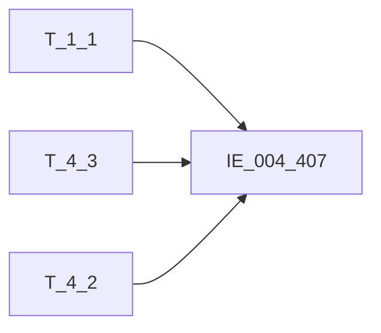

# 血缘-IE_004_407-内部分户账-EAST5.0系统

## 页面边界

- 本页维护 `内部分户账` 从一表通来源表到 EAST5.0 目标表 `IE_004_407` 的设计血缘。
- 证据为业务需求文档和工作区 GBase SQL 草案，尚未经过生产运行验证。
- 数据表字段定义见 [[数据表-IE_004_407-内部分户账-EAST5.0系统]]；业务报送口径见 [[报表-IE_004_407-内部分户账-EAST5.0系统]]。

## 系统边界

- 起始系统：一表通系统
- 目标系统：EAST5.0系统
- 是否跨系统血缘：是
- 目标对象：`IE_004_407` `内部分户账`

## 业务链路摘要

- 按 `原始材料/业务需求/EAST5.0/022_内部分户账.md` 的字段映射，将一表通来源表加工为 EAST5.0 `内部分户账`。
- 表级规则：### 2.1 表级规则（Excel第 449 行） 主表：【分户账信息】 左关联： 【机构信息】 关联条件：【存款协议】【内部机构号】关联【机构信息】【内部机构号】 左关联： 【科目信息】 关联条件：【科目信息】【科目ID】关联【分户账信息】【科目ID】 过滤条件：账户状态不等于'销户'或者账户状态等于销户且销户日期是当月的数据，【分户账信息】【分户账类型】='03'
- SQL 草案 `PROC_EAST_IE_004_407_NBFHZ_草案.sql`（2026-05-05 重构）：
  - T_4_3 LEFT JOIN T_1_1 ON SUBSTR(TRIM(src.D030001),12) = TRIM(s1.A010002) AND s1.A010020 = V_DATA_DATE
  - T_4_3 LEFT JOIN T_4_2 ON src.D030008 = s2.D020001 AND s2.D020011 = V_DATA_DATE
  - WHERE 过滤：D030005='03' AND D030015=V_DATA_DATE AND (D030013!='03' OR (D030013='03' AND D030012 在采集当月))
  - 码值转换：账户状态、计息方式、计息标志、借贷标志全部使用 CASE
  - 日期转换：KHRQ/XHRQ 使用 DATE_FORMAT 由 YYYY-MM-DD 转 YYYYMMDD，空值默认 '99991231'
  - 利率字段由 D030017（内部账利率）映射，非 NULL
  - 备注 BBZ 使用 CONCAT_WS 拼接三表备注

## 直接上游对象

- [[数据表-T_1_1-机构信息-一表通系统]]：一表通来源表。
- [[数据表-T_4_3-分户账信息-一表通系统]]：一表通来源表。
- [[数据表-T_4_2-科目信息-一表通系统]]：一表通来源表。

## 直接下游对象

- 目标数据表：[[数据表-IE_004_407-内部分户账-EAST5.0系统]]
- 报表业务口径页：[[报表-IE_004_407-内部分户账-EAST5.0系统]]
- SQL 草案：`工作区/SQL开发/EAST5.0系统/PROC_EAST_IE_004_407_NBFHZ_草案.sql`

## Nodes

- [[数据表-T_1_1-机构信息-一表通系统]]：一表通来源表。
- [[数据表-T_4_3-分户账信息-一表通系统]]：一表通来源表。
- [[数据表-T_4_2-科目信息-一表通系统]]：一表通来源表。
- [[数据表-IE_004_407-内部分户账-EAST5.0系统]]：EAST5.0 目标采集表。
- [[报表-IE_004_407-内部分户账-EAST5.0系统]]：业务口径说明。

## 表级 Edge List

| From | To | Transform | Evidence |
| --- | --- | --- | --- |
| [[数据表-T_1_1-机构信息-一表通系统]] | [[数据表-IE_004_407-内部分户账-EAST5.0系统]] | 字段映射、关联、过滤、码值/日期转换后装载 `IE_004_407` | [[来源-EAST5.0系统-IE_004_407-内部分户账]]；SQL 草案 |
| [[数据表-T_4_3-分户账信息-一表通系统]] | [[数据表-IE_004_407-内部分户账-EAST5.0系统]] | 字段映射、关联、过滤、码值/日期转换后装载 `IE_004_407` | [[来源-EAST5.0系统-IE_004_407-内部分户账]]；SQL 草案 |
| [[数据表-T_4_2-科目信息-一表通系统]] | [[数据表-IE_004_407-内部分户账-EAST5.0系统]] | 字段映射、关联、过滤、码值/日期转换后装载 `IE_004_407` | [[来源-EAST5.0系统-IE_004_407-内部分户账]]；SQL 草案 |

## 字段级 Edge List

| 源对象 | 源字段 | 目标对象 | 目标字段 | 处理逻辑 | 关系类型 | 证据 |
| --- | --- | --- | --- | --- | --- | --- |
| [[数据表-T_1_1-机构信息-一表通系统]] | `A010003` | [[数据表-IE_004_407-内部分户账-EAST5.0系统]] | `JRXKZH` | LEFT JOIN ON SUBSTR(TRIM(src.D030001),12)=TRIM(s1.A010002) AND A010020=V_DATA_DATE；取 A010003 | 加工映射 | [[来源-EAST5.0系统-IE_004_407-内部分户账]]；`PROC_EAST_IE_004_407_NBFHZ_草案.sql` |
| [[数据表-T_4_3-分户账信息-一表通系统]] | `D030001` | [[数据表-IE_004_407-内部分户账-EAST5.0系统]] | `NBJGH` | SUBSTR(TRIM(D030001), 12) | 加工映射 | [[来源-EAST5.0系统-IE_004_407-内部分户账]]；`PROC_EAST_IE_004_407_NBFHZ_草案.sql` |
| [[数据表-T_1_1-机构信息-一表通系统]] | `A010005` | [[数据表-IE_004_407-内部分户账-EAST5.0系统]] | `YHJGMC` | LEFT JOIN ON SUBSTR(TRIM(src.D030001),12)=TRIM(s1.A010002) AND A010020=V_DATA_DATE；取 A010005 | 加工映射 | [[来源-EAST5.0系统-IE_004_407-内部分户账]]；`PROC_EAST_IE_004_407_NBFHZ_草案.sql` |
| [[数据表-T_4_3-分户账信息-一表通系统]] | `D030008` | [[数据表-IE_004_407-内部分户账-EAST5.0系统]] | `MXKMBH` | LEFT JOIN T_4_2 ON D030008=D020001 AND D020011=V_DATA_DATE；直接映射 D030008 | 直接映射 | [[来源-EAST5.0系统-IE_004_407-内部分户账]]；`PROC_EAST_IE_004_407_NBFHZ_草案.sql` |
| [[数据表-T_4_2-科目信息-一表通系统]] | `D020003` | [[数据表-IE_004_407-内部分户账-EAST5.0系统]] | `MXKMMC` | LEFT JOIN ON D030008=D020001 AND D020011=V_DATA_DATE；取 D020003 | 加工映射 | [[来源-EAST5.0系统-IE_004_407-内部分户账]]；`PROC_EAST_IE_004_407_NBFHZ_草案.sql` |
| [[数据表-T_4_3-分户账信息-一表通系统]] | `D030004` | [[数据表-IE_004_407-内部分户账-EAST5.0系统]] | `ZHMC` | 直接映射 D030004 | 直接映射 | [[来源-EAST5.0系统-IE_004_407-内部分户账]]；`PROC_EAST_IE_004_407_NBFHZ_草案.sql` |
| [[数据表-T_4_3-分户账信息-一表通系统]] | `D030002` | [[数据表-IE_004_407-内部分户账-EAST5.0系统]] | `NBFHZZH` | 直接映射 D030002 | 直接映射 | [[来源-EAST5.0系统-IE_004_407-内部分户账]]；`PROC_EAST_IE_004_407_NBFHZ_草案.sql` |
| [[数据表-T_4_3-分户账信息-一表通系统]] | `D030009` | [[数据表-IE_004_407-内部分户账-EAST5.0系统]] | `BZ` | 直接映射 D030009 | 直接映射 | [[来源-EAST5.0系统-IE_004_407-内部分户账]]；`PROC_EAST_IE_004_407_NBFHZ_草案.sql` |
| [[数据表-T_4_3-分户账信息-一表通系统]] | `D030010` | [[数据表-IE_004_407-内部分户账-EAST5.0系统]] | `JDBZ` | CASE TRIM(D030010)：01→借，02→贷，03→借贷并列，ELSE 原值 | 码值转换 | [[来源-EAST5.0系统-IE_004_407-内部分户账]]；`PROC_EAST_IE_004_407_NBFHZ_草案.sql` |
| [[数据表-T_4_3-分户账信息-一表通系统]] | `D030018` | [[数据表-IE_004_407-内部分户账-EAST5.0系统]] | `JFYE` | CAST(NULLIF(TRIM(D030018),'') AS DECIMAL(20,2)) | 格式转换 | [[来源-EAST5.0系统-IE_004_407-内部分户账]]；`PROC_EAST_IE_004_407_NBFHZ_草案.sql` |
| [[数据表-T_4_3-分户账信息-一表通系统]] | `D030019` | [[数据表-IE_004_407-内部分户账-EAST5.0系统]] | `DFYE` | CAST(NULLIF(TRIM(D030019),'') AS DECIMAL(20,2)) | 格式转换 | [[来源-EAST5.0系统-IE_004_407-内部分户账]]；`PROC_EAST_IE_004_407_NBFHZ_草案.sql` |
| [[数据表-T_4_3-分户账信息-一表通系统]] | `D030006` | [[数据表-IE_004_407-内部分户账-EAST5.0系统]] | `JXBZ` | CASE TRIM(D030006)：1→是，0→否，ELSE '' | 码值转换 | [[来源-EAST5.0系统-IE_004_407-内部分户账]]；`PROC_EAST_IE_004_407_NBFHZ_草案.sql` |
| [[数据表-T_4_3-分户账信息-一表通系统]] | `D030007` | [[数据表-IE_004_407-内部分户账-EAST5.0系统]] | `JXFS` | CASE TRIM(D030007)：01→按月结息，02→按季结息，03→按半年结息，04→按年结息，05→不定期结息，06→不记利息，07→利随本清，00→其他-XX，ELSE 原值 | 码值转换 | [[来源-EAST5.0系统-IE_004_407-内部分户账]]；`PROC_EAST_IE_004_407_NBFHZ_草案.sql` |
| [[数据表-T_4_3-分户账信息-一表通系统]] | `D030017` | [[数据表-IE_004_407-内部分户账-EAST5.0系统]] | `LL` | CAST(NULLIF(TRIM(D030017),'') AS DECIMAL(20,6))；内部账利率 | 格式转换 | [[来源-EAST5.0系统-IE_004_407-内部分户账]]；`PROC_EAST_IE_004_407_NBFHZ_草案.sql` |
| [[数据表-T_4_3-分户账信息-一表通系统]] | `D030011` | [[数据表-IE_004_407-内部分户账-EAST5.0系统]] | `KHRQ` | CASE WHEN D030011 IS NULL THEN '99991231' ELSE DATE_FORMAT(D030011,'%Y%m%d') | 格式转换 | [[来源-EAST5.0系统-IE_004_407-内部分户账]]；`PROC_EAST_IE_004_407_NBFHZ_草案.sql` |
| [[数据表-T_4_3-分户账信息-一表通系统]] | `D030012` | [[数据表-IE_004_407-内部分户账-EAST5.0系统]] | `XHRQ` | CASE WHEN D030012 IS NULL THEN '99991231' ELSE DATE_FORMAT(D030012,'%Y%m%d') | 格式转换 | [[来源-EAST5.0系统-IE_004_407-内部分户账]]；`PROC_EAST_IE_004_407_NBFHZ_草案.sql` |
| [[数据表-T_4_3-分户账信息-一表通系统]] | `D030013` | [[数据表-IE_004_407-内部分户账-EAST5.0系统]] | `ZHZT` | CASE TRIM(D030013)：01→正常，02→预销户，03→销户，04→冻结，05→止付，00→其他-XX，ELSE 原值 | 码值转换 | [[来源-EAST5.0系统-IE_004_407-内部分户账]]；`PROC_EAST_IE_004_407_NBFHZ_草案.sql` |
| [[数据表-T_4_3-分户账信息-一表通系统]] | `D030014`；[[数据表-T_1_1-机构信息-一表通系统]] `A010026`；[[数据表-T_4_2-科目信息-一表通系统]] `D020010` | [[数据表-IE_004_407-内部分户账-EAST5.0系统]] | `BBZ` | CONCAT_WS(';', D030014, A010026, D020010)；三表备注以英文分号拼接 | 加工映射 | [[来源-EAST5.0系统-IE_004_407-内部分户账]]；`PROC_EAST_IE_004_407_NBFHZ_草案.sql` |
| 规则 | `P_DATA_DATE` | [[数据表-IE_004_407-内部分户账-EAST5.0系统]] | `CJRQ` | 存储过程入参直接赋值 | 规则映射 | [[来源-EAST5.0系统-IE_004_407-内部分户账]]；`PROC_EAST_IE_004_407_NBFHZ_草案.sql` |

## Graph-总览

## 回链检查

- 目标数据表页：已补 SQL 草案上游依赖摘要或待本次批处理补齐。
- 报表业务口径页：已创建或补充血缘回链。
- 一表通源表页：已补下游消费摘要或待本次批处理补齐。
- 当前字段级血缘基于业务需求和 SQL 草案，未运行验证，状态为待确认。

## 变更与冲突

- 本次为新增设计血缘或补齐草案血缘，不覆盖已验证生产血缘。
- 未发现需要将 `validated` 页面降级的情况；本页保持 `draft`。

## Open Questions

- 外部监管实体页 wikilink 待补。
- 销户日期过滤条件（D030012 在采集当月）依赖 `LAST_DAY()` 函数，需确认 GBase 8a 是否支持。
- 账户状态码值 '00-XX' 通配处理策略（`00` 前缀 → `其他-XX`）需与外部填报说明核对。
- 计息方式码值 '00-XX' 通配处理策略同样需核对。

## 缺口字段（2026-05-05）

| 目标字段 | 字段名称 | 缺口说明 |
| --- | --- | --- |
| `GSFZJG` | 归属分支机构 | 本地 DDL 存在，但业务需求映射表和 SQL 草案未能确认来源，SQL 中置 NULL，符合审计处置原则。 |
| `SENSITIVEFLAG` | 涉密标志 | 本地 DDL 存在，但业务需求映射表和 SQL 草案未能确认来源，SQL 中置 NULL，符合审计处置原则。 |
