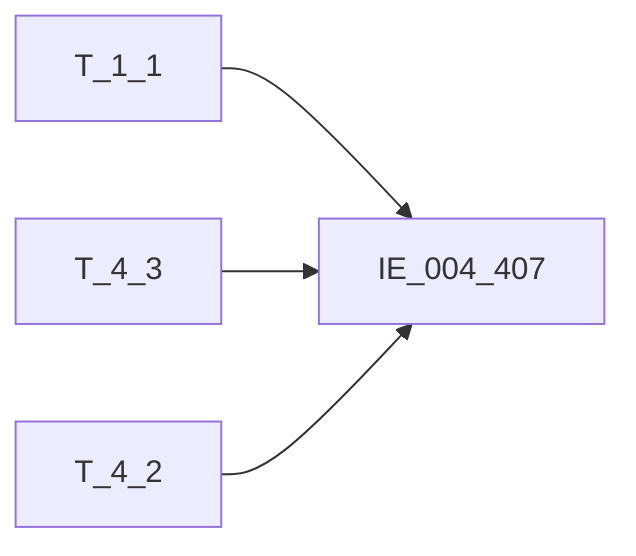

# 血缘-IE_004_407-内部分户账-EAST5.0系统

## 页面边界

- 本页维护 `内部分户账` 从一表通来源表到 EAST5.0 目标表 `IE_004_407` 的设计血缘。
- 证据为业务需求文档和工作区 GBase SQL 草案，尚未经过生产运行验证。
- 数据表字段定义见 [[数据表-IE_004_407-内部分户账-EAST5.0系统]]；业务报送口径见 [[报表-IE_004_407-内部分户账-EAST5.0系统]]。

## 系统边界

- 起始系统：一表通系统
- 目标系统：EAST5.0系统
- 是否跨系统血缘：是
- 目标对象：`IE_004_407` `内部分户账`

## 业务链路摘要

- 按 `原始材料/业务需求/EAST5.0/022_内部分户账.md` 的字段映射，将一表通来源表加工为 EAST5.0 `内部分户账`。
- 表级规则：### 2.1 表级规则（Excel第 449 行） 主表：【分户账信息】 左关联： 【机构信息】 关联条件：【存款协议】【内部机构号】关联【机构信息】【内部机构号】 左关联： 【科目信息】 关联条件：【科目信息】【科目ID】关联【分户账信息】【科目ID】 过滤条件：账户状态不等于‘销户’或者账户状态等于销户且销户日期是当月的数据，【分户账信息】【分户账类型】='03'
- SQL 草案采用按 `P_DATA_DATE` 清理后重插或增量边界过滤的方式；具体投产方式待验证。

## 直接上游对象

- [[数据表-T_1_1-机构信息-一表通系统]]：一表通来源表。
- [[数据表-T_4_3-分户账信息-一表通系统]]：一表通来源表。
- [[数据表-T_4_2-科目信息-一表通系统]]：一表通来源表。

## 直接下游对象

- 目标数据表：[[数据表-IE_004_407-内部分户账-EAST5.0系统]]
- 报表业务口径页：[[报表-IE_004_407-内部分户账-EAST5.0系统]]
- SQL 草案：`工作区/SQL开发/EAST5.0系统/PROC_EAST_IE_004_407_NBFHZ_草案.sql`

## Nodes

- [[数据表-T_1_1-机构信息-一表通系统]]：一表通来源表。
- [[数据表-T_4_3-分户账信息-一表通系统]]：一表通来源表。
- [[数据表-T_4_2-科目信息-一表通系统]]：一表通来源表。
- [[数据表-IE_004_407-内部分户账-EAST5.0系统]]：EAST5.0 目标采集表。
- [[报表-IE_004_407-内部分户账-EAST5.0系统]]：业务口径说明。

## 表级 Edge List

| From | To | Transform | Evidence |
| --- | --- | --- | --- |
| [[数据表-T_1_1-机构信息-一表通系统]] | [[数据表-IE_004_407-内部分户账-EAST5.0系统]] | 字段映射、关联、过滤、码值/日期转换后装载 `IE_004_407` | [[来源-EAST5.0系统-IE_004_407-内部分户账]]；SQL 草案 |
| [[数据表-T_4_3-分户账信息-一表通系统]] | [[数据表-IE_004_407-内部分户账-EAST5.0系统]] | 字段映射、关联、过滤、码值/日期转换后装载 `IE_004_407` | [[来源-EAST5.0系统-IE_004_407-内部分户账]]；SQL 草案 |
| [[数据表-T_4_2-科目信息-一表通系统]] | [[数据表-IE_004_407-内部分户账-EAST5.0系统]] | 字段映射、关联、过滤、码值/日期转换后装载 `IE_004_407` | [[来源-EAST5.0系统-IE_004_407-内部分户账]]；SQL 草案 |

## 字段级 Edge List

| 源对象 | 源字段 | 目标对象 | 目标字段 | 处理逻辑 | 关系类型 | 证据 |
| --- | --- | --- | --- | --- | --- | --- |
| [[数据表-T_1_1-机构信息-一表通系统]] | `A010003` | [[数据表-IE_004_407-内部分户账-EAST5.0系统]] | `JRXKZH` | 加工映射：将【一表通】【分户账信息】【机构id】，关联【一表通】【机构信息表】的【机构id】取【金融许可证号】 | 加工映射 | [[来源-EAST5.0系统-IE_004_407-内部分户账]]；SQL 草案 |
| [[数据表-T_4_3-分户账信息-一表通系统]] | `D030001` | [[数据表-IE_004_407-内部分户账-EAST5.0系统]] | `NBJGH` | 加工映射：将【一表通】【分户账信息】【机构id】从第12位开始截取 | 加工映射 | [[来源-EAST5.0系统-IE_004_407-内部分户账]]；SQL 草案 |
| [[数据表-T_1_1-机构信息-一表通系统]] | `A010005` | [[数据表-IE_004_407-内部分户账-EAST5.0系统]] | `YHJGMC` | 加工映射：将【一表通】【分户账信息】【机构id】，关联【一表通】【机构信息表】的【机构id】取【银行机构名称】 | 加工映射 | [[来源-EAST5.0系统-IE_004_407-内部分户账]]；SQL 草案 |
| [[数据表-T_4_3-分户账信息-一表通系统]] | `D030008` | [[数据表-IE_004_407-内部分户账-EAST5.0系统]] | `MXKMBH` | 直接映射:【分户账信息】.【科目ID】 | 直接映射 | [[来源-EAST5.0系统-IE_004_407-内部分户账]]；SQL 草案 |
| [[数据表-T_4_2-科目信息-一表通系统]] | `D020003` | [[数据表-IE_004_407-内部分户账-EAST5.0系统]] | `MXKMMC` | 加工映射：将【一表通】【分户账信息】【科目ID】，关联【一表通】【科目信息】的【科目ID】取【会计科目名称】 | 加工映射 | [[来源-EAST5.0系统-IE_004_407-内部分户账]]；SQL 草案 |
| [[数据表-T_4_3-分户账信息-一表通系统]] | `D030004` | [[数据表-IE_004_407-内部分户账-EAST5.0系统]] | `ZHMC` | 直接映射:【分户账信息】.【分户账名称】 | 直接映射 | [[来源-EAST5.0系统-IE_004_407-内部分户账]]；SQL 草案 |
| [[数据表-T_4_3-分户账信息-一表通系统]] | `D030002` | [[数据表-IE_004_407-内部分户账-EAST5.0系统]] | `NBFHZZH` | 直接映射:【分户账信息】.【分户账号】 | 直接映射 | [[来源-EAST5.0系统-IE_004_407-内部分户账]]；SQL 草案 |
| [[数据表-T_4_3-分户账信息-一表通系统]] | `D030009` | [[数据表-IE_004_407-内部分户账-EAST5.0系统]] | `BZ` | 直接映射:【分户账信息】.【币种】 | 直接映射 | [[来源-EAST5.0系统-IE_004_407-内部分户账]]；SQL 草案 |
| [[数据表-T_4_3-分户账信息-一表通系统]] | `D030010` | [[数据表-IE_004_407-内部分户账-EAST5.0系统]] | `JDBZ` | 码值转化：01-借，02-贷，03-借贷并列 ELSE '' | 码值转换/格式转换 | [[来源-EAST5.0系统-IE_004_407-内部分户账]]；SQL 草案 |
| [[数据表-T_4_3-分户账信息-一表通系统]] | `D030018` | [[数据表-IE_004_407-内部分户账-EAST5.0系统]] | `JFYE` | 直接映射:SUM(COALESCE(【分户账信息】.【借方余额】,0)) | 直接映射 | [[来源-EAST5.0系统-IE_004_407-内部分户账]]；SQL 草案 |
| [[数据表-T_4_3-分户账信息-一表通系统]] | `D030019` | [[数据表-IE_004_407-内部分户账-EAST5.0系统]] | `DFYE` | 直接映射:SUM(COALESCE(【分户账信息】.【贷方余额】,0)) | 直接映射 | [[来源-EAST5.0系统-IE_004_407-内部分户账]]；SQL 草案 |
| [[数据表-T_4_3-分户账信息-一表通系统]] | `D030006` | [[数据表-IE_004_407-内部分户账-EAST5.0系统]] | `JXBZ` | 码值转化：1-是，0-否 ELSE '' | 码值转换/格式转换 | [[来源-EAST5.0系统-IE_004_407-内部分户账]]；SQL 草案 |
| [[数据表-T_4_3-分户账信息-一表通系统]] | `D030007` | [[数据表-IE_004_407-内部分户账-EAST5.0系统]] | `JXFS` | 码值转化：；当计息方式为'01'时， 赋值 '按月结息'; ；当计息方式为'02'时， 赋值 '按季结息'; ；当计息方式为'03'时， 赋值 '按半年结息'; ；当计息方式为'04'时， 赋值 '按年结息';；当计息方式为'05'时， 赋值 '不定期结息'; ；当计息方式为'06'时， 赋值‘不记利息'; ；当计息方式为'07'时， 赋值 '利随本清'; ；当计息方式为'00-XX'时，赋值'其他-XX' | 码值转换/格式转换 | [[来源-EAST5.0系统-IE_004_407-内部分户账]]；SQL 草案 |
| [[数据表-T_4_3-分户账信息-一表通系统]] | `待确认` | [[数据表-IE_004_407-内部分户账-EAST5.0系统]] | `LL` | 直接映射:【分户账信息】.【利率】 | 直接映射 | [[来源-EAST5.0系统-IE_004_407-内部分户账]]；SQL 草案 |
| [[数据表-T_4_3-分户账信息-一表通系统]] | `D030011` | [[数据表-IE_004_407-内部分户账-EAST5.0系统]] | `KHRQ` | 加工映射：格式由YYYY-MM-DD转化成YYYYMMDD，空值要转成’99991231‘ | 码值转换/格式转换 | [[来源-EAST5.0系统-IE_004_407-内部分户账]]；SQL 草案 |
| [[数据表-T_4_3-分户账信息-一表通系统]] | `D030012` | [[数据表-IE_004_407-内部分户账-EAST5.0系统]] | `XHRQ` | 加工映射：格式由YYYY-MM-DD转化成YYYYMMDD，空值要转成’99991231‘ | 码值转换/格式转换 | [[来源-EAST5.0系统-IE_004_407-内部分户账]]；SQL 草案 |
| [[数据表-T_4_3-分户账信息-一表通系统]] | `D030013` | [[数据表-IE_004_407-内部分户账-EAST5.0系统]] | `ZHZT` | 加工映射：；当账户状态为'01'时,赋值'正常',；为'02'时，赋值'预销户',；为'03'时，赋值'销户',；为'04'时，赋值'冻结',；为'05'时，赋值'止付',；为'00-XX'时，赋值'其他-XX') | 加工映射 | [[来源-EAST5.0系统-IE_004_407-内部分户账]]；SQL 草案 |
| [[数据表-T_4_3-分户账信息-一表通系统]] | `D030014` | [[数据表-IE_004_407-内部分户账-EAST5.0系统]] | `BBZ` | 提取一表通《表4.3分户账信息》、《表1.1机构信息》、《表4.2科目信息》备注，如有多项，以英文分隔符';'拼接 | 加工映射 | [[来源-EAST5.0系统-IE_004_407-内部分户账]]；SQL 草案 |
| 待确认 | `待确认` | [[数据表-IE_004_407-内部分户账-EAST5.0系统]] | `CJRQ` | REPLACE('${TXNDATE}','-','') | 加工映射 | [[来源-EAST5.0系统-IE_004_407-内部分户账]]；SQL 草案 |

## Graph-总览

## 回链检查

- 目标数据表页：已补 SQL 草案上游依赖摘要或待本次批处理补齐。
- 报表业务口径页：已创建或补充血缘回链。
- 一表通源表页：已补下游消费摘要或待本次批处理补齐。
- 当前字段级血缘基于业务需求和 SQL 草案，未运行验证，状态为待确认。

## 变更与冲突

- 本次为新增设计血缘或补齐草案血缘，不覆盖已验证生产血缘。
- 未发现需要将 `validated` 页面降级的情况；本页保持 `draft`。

## Open Questions

- GBase 草案中的复杂 JOIN、窗口去重、终态纳入和增量边界需要人工复核。
- 部分字段的码值 CASE 在草案中仍为待补，需要结合外部填报说明和跑数结果闭环。
- 外部监管实体页 wikilink 待补。

## 缺口字段（2026-05-04）

| 目标字段 | 字段名称 | 缺口说明 |
| --- | --- | --- |
| `GSFZJG` | 归属分支机构 | 本地 DDL 存在，但业务需求映射表和 SQL 草案未能确认来源，字段级血缘待补。 |
| `SENSITIVEFLAG` | 涉密标志 | 本地 DDL 存在，但业务需求映射表和 SQL 草案未能确认来源，字段级血缘待补。 |
