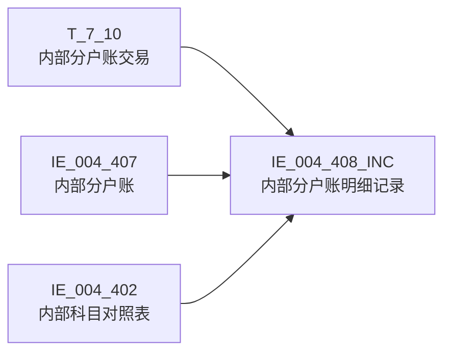

# 血缘-IE_004_408_INC-内部分户账明细记录-EAST5.0系统

## 页面边界

- 本页维护 `内部分户账明细记录` 从一表通来源表到 EAST5.0 目标表 `IE_004_408_INC` 的设计血缘。
- 证据为业务需求文档和 GBase SQL 草案（2026-05-05 重构后），尚未经过生产运行验证。
- 数据表字段定义见 [[数据表-IE_004_408_INC-内部分户账明细记录-EAST5.0系统]]；业务报送口径见 [[报表-IE_004_408_INC-内部分户账明细记录-EAST5.0系统]]。

## 系统边界

- 起始系统：一表通系统
- 目标系统：EAST5.0系统
- 是否跨系统血缘：是
- 目标对象：`IE_004_408_INC` `内部分户账明细记录`

## 业务链路摘要

- 按 `原始材料/业务需求/EAST5.0/023_内部分户账明细记录.md` 的字段映射，将一表通来源表加工为 EAST5.0 `内部分户账明细记录`。
- 表级规则：### 2.1 表级规则（Excel第 469 行） 主表：【内部分户账交易】 左关联：【EAST.内部分户账】 关联条件：【内部分户账交易】.【分户账号】 = 【EAST.内部分户账】.【分户账号】 左关联：【EAST.内部科目对照表】 关联条件：【客户存款账户交易表】【科目ID】，关联【EAST.内部科目对照表】的【会计科目编号】
- SQL 草案采用按 `P_DATA_DATE` 清理后重插；WHERE 过滤 `T_7_10.G100028 = V_DATA_DATE`。
- 2026-05-05 重构：消除 3 个 JOIN TODO，补齐 5 个码值 CASE，补齐日期格式转换。

## 直接上游对象

- [[数据表-T_7_10-内部分户账交易-一表通系统]]：一表通主源表。
- [[数据表-IE_004_407-内部分户账-EAST5.0系统]]：LEFT JOIN enrich，取 JRXKZH/NBJGH/YHJGMC/ZHMC。
- [[数据表-IE_004_402-内部科目对照表-EAST5.0系统]]：LEFT JOIN enrich（×2），取明细科目名称（T7）和对方科目名称（T8）。

## 直接下游对象

- 目标数据表：[[数据表-IE_004_408_INC-内部分户账明细记录-EAST5.0系统]]
- 报表业务口径页：[[报表-IE_004_408_INC-内部分户账明细记录-EAST5.0系统]]
- SQL 草案：`工作区/SQL开发/EAST5.0系统/PROC_EAST_IE_004_408_INC_NBFHZMX_草案.sql`

## Nodes

- [[数据表-T_7_10-内部分户账交易-一表通系统]]：一表通主源表。
- [[数据表-IE_004_407-内部分户账-EAST5.0系统]]：LEFT JOIN enrich。
- [[数据表-IE_004_402-内部科目对照表-EAST5.0系统]]：LEFT JOIN enrich（×2）。
- [[数据表-IE_004_408_INC-内部分户账明细记录-EAST5.0系统]]：EAST5.0 目标采集表。
- [[报表-IE_004_408_INC-内部分户账明细记录-EAST5.0系统]]：业务口径说明。

## 表级 Edge List

| From | To | Transform | Evidence |
| --- | --- | --- | --- |
| [[数据表-T_7_10-内部分户账交易-一表通系统]] | [[数据表-IE_004_408_INC-内部分户账明细记录-EAST5.0系统]] | 字段映射、码值/日期转换后装载 `IE_004_408_INC` | [[来源-EAST5.0系统-IE_004_408_INC-内部分户账明细记录]]；SQL 草案（2026-05-05 重构） |
| [[数据表-IE_004_407-内部分户账-EAST5.0系统]] | [[数据表-IE_004_408_INC-内部分户账明细记录-EAST5.0系统]] | LEFT JOIN enrich：JRXKZH/NBJGH/YHJGMC/ZHMC | SQL 草案（2026-05-05 重构） |
| [[数据表-IE_004_402-内部科目对照表-EAST5.0系统]] | [[数据表-IE_004_408_INC-内部分户账明细记录-EAST5.0系统]] | LEFT JOIN enrich ×2：MXKMMC（T7）+ DFKMMC（T8） | SQL 草案（2026-05-05 重构） |

## 字段级 Edge List

| 源对象 | 源字段 | 目标对象 | 目标字段 | 处理逻辑 | 关系类型 | 证据 |
| --- | --- | --- | --- | --- | --- | --- |
| [[数据表-T_7_10-内部分户账交易-一表通系统]] | `G100001` | [[数据表-IE_004_408_INC-内部分户账明细记录-EAST5.0系统]] | `JYXLH` | 直接映射 | 直接映射 | SQL 草案（2026-05-05 重构） |
| [[数据表-IE_004_407-内部分户账-EAST5.0系统]] | `JRXKZH` | [[数据表-IE_004_408_INC-内部分户账明细记录-EAST5.0系统]] | `JRXKZH` | LEFT JOIN 取 | 直接映射 | SQL 草案（2026-05-05 重构） |
| [[数据表-IE_004_407-内部分户账-EAST5.0系统]] | `NBJGH` | [[数据表-IE_004_408_INC-内部分户账明细记录-EAST5.0系统]] | `NBJGH` | LEFT JOIN 取 | 直接映射 | SQL 草案（2026-05-05 重构） |
| [[数据表-IE_004_407-内部分户账-EAST5.0系统]] | `YHJGMC` | [[数据表-IE_004_408_INC-内部分户账明细记录-EAST5.0系统]] | `YHJGMC` | LEFT JOIN 取 | 直接映射 | SQL 草案（2026-05-05 重构） |
| [[数据表-T_7_10-内部分户账交易-一表通系统]] | `G100007` | [[数据表-IE_004_408_INC-内部分户账明细记录-EAST5.0系统]] | `MXKMBH` | 直接映射 | 直接映射 | SQL 草案（2026-05-05 重构） |
| [[数据表-IE_004_402-内部科目对照表-EAST5.0系统]] | `KJKMMC` | [[数据表-IE_004_408_INC-内部分户账明细记录-EAST5.0系统]] | `MXKMMC` | LEFT JOIN（T7）取 | 直接映射 | SQL 草案（2026-05-05 重构） |
| [[数据表-IE_004_407-内部分户账-EAST5.0系统]] | `ZHMC` | [[数据表-IE_004_408_INC-内部分户账明细记录-EAST5.0系统]] | `ZHMC` | LEFT JOIN 取 | 直接映射 | SQL 草案（2026-05-05 重构） |
| [[数据表-T_7_10-内部分户账交易-一表通系统]] | `G100002` | [[数据表-IE_004_408_INC-内部分户账明细记录-EAST5.0系统]] | `NBFHZZH` | 直接映射 | 直接映射 | SQL 草案（2026-05-05 重构） |
| [[数据表-T_7_10-内部分户账交易-一表通系统]] | `G100003` | [[数据表-IE_004_408_INC-内部分户账明细记录-EAST5.0系统]] | `HXJYRQ` | `DATE_FORMAT(G100003, '%Y%m%d')` | 格式转换 | SQL 草案（2026-05-05 重构） |
| [[数据表-T_7_10-内部分户账交易-一表通系统]] | `G100004` | [[数据表-IE_004_408_INC-内部分户账明细记录-EAST5.0系统]] | `HXJYSJ` | `REPLACE(DATE_FORMAT(G100004, '%H:%i:%s'), ':', '')` | 格式转换 | SQL 草案（2026-05-05 重构） |
| [[数据表-T_7_10-内部分户账交易-一表通系统]] | `G100005` | [[数据表-IE_004_408_INC-内部分户账明细记录-EAST5.0系统]] | `BZ` | 直接映射 | 直接映射 | SQL 草案（2026-05-05 重构） |
| [[数据表-T_7_10-内部分户账交易-一表通系统]] | `G100006` | [[数据表-IE_004_408_INC-内部分户账明细记录-EAST5.0系统]] | `JYLX` | 15 分支 CASE + `00%` 通配 | 码值转换 | SQL 草案（2026-05-05 重构） |
| [[数据表-T_7_10-内部分户账交易-一表通系统]] | `G100009` | [[数据表-IE_004_408_INC-内部分户账明细记录-EAST5.0系统]] | `JYJDBZ` | 4 分支 CASE（借/贷/借贷并列/空） | 码值转换 | SQL 草案（2026-05-05 重构） |
| [[数据表-T_7_10-内部分户账交易-一表通系统]] | `G100010` | [[数据表-IE_004_408_INC-内部分户账明细记录-EAST5.0系统]] | `JYJE` | `CAST(NULLIF(TRIM(G100010), '') AS DECIMAL(20,2))` | 类型转换 | SQL 草案（2026-05-05 重构） |
| [[数据表-T_7_10-内部分户账交易-一表通系统]] | `G100012` | [[数据表-IE_004_408_INC-内部分户账明细记录-EAST5.0系统]] | `JFYE` | `CAST(NULLIF(TRIM(G100012), '') AS DECIMAL(20,2))` | 类型转换 | SQL 草案（2026-05-05 重构） |
| [[数据表-T_7_10-内部分户账交易-一表通系统]] | `G100013` | [[数据表-IE_004_408_INC-内部分户账明细记录-EAST5.0系统]] | `DFYE` | `CAST(NULLIF(TRIM(G100013), '') AS DECIMAL(20,2))` | 类型转换 | SQL 草案（2026-05-05 重构） |
| [[数据表-T_7_10-内部分户账交易-一表通系统]] | `G100014` | [[数据表-IE_004_408_INC-内部分户账明细记录-EAST5.0系统]] | `DFZH` | 直接映射 | 直接映射 | SQL 草案（2026-05-05 重构） |
| [[数据表-T_7_10-内部分户账交易-一表通系统]] | `G100023` | [[数据表-IE_004_408_INC-内部分户账明细记录-EAST5.0系统]] | `DFKMBH` | 直接映射（对方科目ID） | 直接映射 | SQL 草案（2026-05-05 重构） |
| [[数据表-IE_004_402-内部科目对照表-EAST5.0系统]] | `KJKMMC` | [[数据表-IE_004_408_INC-内部分户账明细记录-EAST5.0系统]] | `DFKMMC` | LEFT JOIN（T8）取 | 直接映射 | SQL 草案（2026-05-05 重构） |
| [[数据表-T_7_10-内部分户账交易-一表通系统]] | `G100015` | [[数据表-IE_004_408_INC-内部分户账明细记录-EAST5.0系统]] | `DFHM` | 直接映射 | 直接映射 | SQL 草案（2026-05-05 重构） |
| [[数据表-T_7_10-内部分户账交易-一表通系统]] | `G100016` | [[数据表-IE_004_408_INC-内部分户账明细记录-EAST5.0系统]] | `DFXH` | 直接映射 | 直接映射 | SQL 草案（2026-05-05 重构） |
| [[数据表-T_7_10-内部分户账交易-一表通系统]] | `G100017` | [[数据表-IE_004_408_INC-内部分户账明细记录-EAST5.0系统]] | `DFXM` | 直接映射 | 直接映射 | SQL 草案（2026-05-05 重构） |
| [[数据表-T_7_10-内部分户账交易-一表通系统]] | `G100018` | [[数据表-IE_004_408_INC-内部分户账明细记录-EAST5.0系统]] | `ZY` | 直接映射 | 直接映射 | SQL 草案（2026-05-05 重构） |
| [[数据表-T_7_10-内部分户账交易-一表通系统]] | `G100022` | [[数据表-IE_004_408_INC-内部分户账明细记录-EAST5.0系统]] | `CBMBZ` | 2 分支 CASE（正常/冲补抹） | 码值转换 | SQL 草案（2026-05-05 重构） |
| [[数据表-T_7_10-内部分户账交易-一表通系统]] | `G100019` | [[数据表-IE_004_408_INC-内部分户账明细记录-EAST5.0系统]] | `JYQD` | 8 分支 CASE + `07%`/`00%` 通配 | 码值转换 | SQL 草案（2026-05-05 重构） |
| [[数据表-T_7_10-内部分户账交易-一表通系统]] | `G100025` | [[数据表-IE_004_408_INC-内部分户账明细记录-EAST5.0系统]] | `XZBZ` | 3 分支 CASE（现/转/空） | 码值转换 | SQL 草案（2026-05-05 重构） |
| [[数据表-T_7_10-内部分户账交易-一表通系统]] | `G100020` | [[数据表-IE_004_408_INC-内部分户账明细记录-EAST5.0系统]] | `JYGYH` | `'自动'` → NULL，否则 TRIM | 加工映射 | SQL 草案（2026-05-05 重构） |
| [[数据表-T_7_10-内部分户账交易-一表通系统]] | `G100021` | [[数据表-IE_004_408_INC-内部分户账明细记录-EAST5.0系统]] | `SQGYH` | `'自动'` → NULL，否则 TRIM | 加工映射 | SQL 草案（2026-05-05 重构） |
| [[数据表-T_7_10-内部分户账交易-一表通系统]] | `G100026` | [[数据表-IE_004_408_INC-内部分户账明细记录-EAST5.0系统]] | `JZRQ` | `DATE_FORMAT(G100026, '%Y%m%d')` | 格式转换 | SQL 草案（2026-05-05 重构） |
| [[数据表-T_7_10-内部分户账交易-一表通系统]] | `G100027` | [[数据表-IE_004_408_INC-内部分户账明细记录-EAST5.0系统]] | `XZRQ` | `DATE_FORMAT(G100027, '%Y%m%d')` | 格式转换 | SQL 草案（2026-05-05 重构） |
| [[数据表-T_7_10-内部分户账交易-一表通系统]] | `G100030` | [[数据表-IE_004_408_INC-内部分户账明细记录-EAST5.0系统]] | `BBZ` | 直接映射 | 直接映射 | SQL 草案（2026-05-05 重构） |
| 参数 | `P_DATA_DATE` | [[数据表-IE_004_408_INC-内部分户账明细记录-EAST5.0系统]] | `CJRQ` | 直接映射 | 直接映射 | SQL 草案（2026-05-05 重构） |

## Graph-总览

## 回链检查

- 目标数据表页：已补 SQL 草案上游依赖摘要（2026-05-05 重构）。
- 报表业务口径页：已创建血缘回链。
- 一表通源表页：已补下游消费摘要（2026-05-05 重构）。
- IE_004_407 数据表页：已补下游消费（IE_004_408_INC LEFT JOIN enrich）。
- IE_004_402 数据表页：已补下游消费（IE_004_408_INC LEFT JOIN enrich ×2）。
- 当前字段级血缘基于业务需求和 SQL 草案（2026-05-05 重构），未运行验证，状态为待确认。

## 变更与冲突

- 2026-05-05 重构：消除 3 个"待确认"JOIN，补齐 LEFT JOIN IE_004_407 和 IE_004_402（×2）；32 条字段级边全部闭环（3 个缺口字段标记为 NULL）；补充表级 Edge List（3 条边）；补充 Graph-总览（4 节点）。
- 未发现需要将 `validated` 页面降级的情况；本页保持 `draft`。

## Open Questions

- WHERE 过滤仅有 `T_7_10.G100028 = V_DATA_DATE`，需求文档未给出终态纳入和排除条件的具体规则。
- 缺口字段 GSFZJG/SENSITIVEFLAG/DFKHLB 无映射来源，SQL 中置 NULL。
- 外部监管实体页 wikilink 待补。

## 缺口字段（2026-05-05 重构后）

| 目标字段 | 字段名称 | 缺口说明 |
| --- | --- | --- |
| `GSFZJG` | 归属分支机构 | 本地 DDL 存在，但业务需求映射表和 SQL 草案未能确认来源，字段级血缘标记为 NULL。 |
| `SENSITIVEFLAG` | 涉密标志 | 本地 DDL 存在，但业务需求映射表和 SQL 草案未能确认来源，字段级血缘标记为 NULL。 |
| `DFKHLB` | 对方客户类别 | 本地 DDL 存在，但业务需求映射表和 SQL 草案未能确认来源，字段级血缘标记为 NULL。 |
