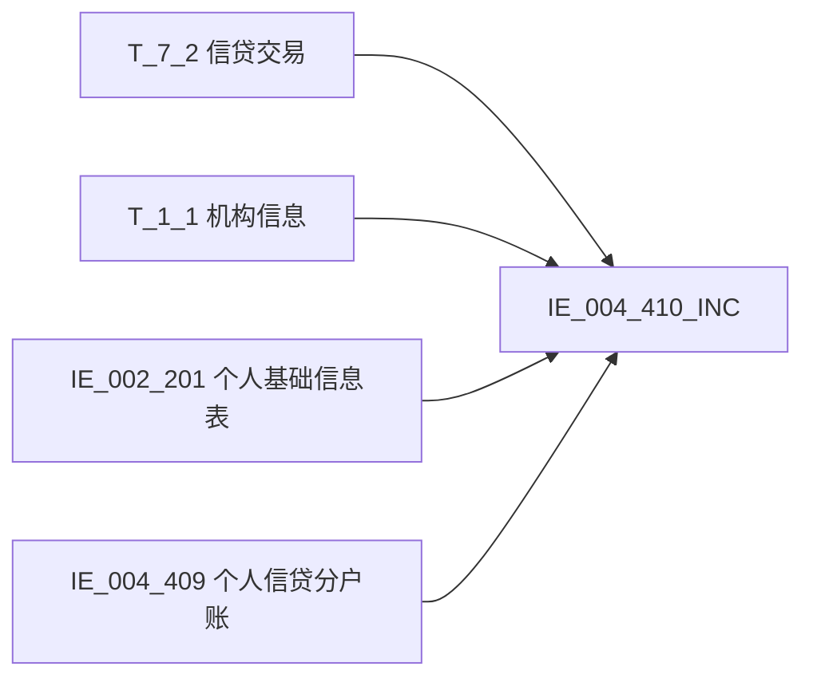

# 血缘-IE_004_410_INC-个人信贷分户账明细记录-EAST5.0系统

## 页面边界

- 本页维护 `个人信贷分户账明细记录` 从一表通来源表到 EAST5.0 目标表 `IE_004_410_INC` 的设计血缘。
- 证据为业务需求文档和工作区 GBase SQL 草案，尚未经过生产运行验证。
- 数据表字段定义见 [[数据表-IE_004_410_INC-个人信贷分户账明细记录-EAST5.0系统]]；业务报送口径见 [[报表-IE_004_410_INC-个人信贷分户账明细记录-EAST5.0系统]]。

## 系统边界

- 起始系统：一表通系统
- 目标系统：EAST5.0系统
- 是否跨系统血缘：是
- 目标对象：`IE_004_410_INC` `个人信贷分户账明细记录`

## 业务链路摘要

- 按 `原始材料/业务需求/EAST5.0/025_个人信贷分户账明细记录.md` 的字段映射，将一表通来源表加工为 EAST5.0 `个人信贷分户账明细记录`。
- 表级规则：### 2.1 表级规则（Excel第 525 行） 通过【信贷交易】的【分户账号】内关联已完成一表通转换的【个人信贷分户账】的【分户账号】，取【信贷交易】.【采集日期】为当月的数据
- SQL 草案采用按 `P_DATA_DATE` 清理后重插或增量边界过滤的方式；具体投产方式待验证。

## 直接上游对象

- [[数据表-T_7_2-信贷交易-一表通系统]]：一表通来源表，主数据源。
- [[数据表-T_1_1-机构信息-一表通系统]]：一表通来源表，机构维表。
- [[数据表-IE_002_201-个人基础信息表-EAST5.0系统]]：EAST5.0 个人基础信息表，取账户名称、证件类别、证件号码。
- [[数据表-IE_004_409-个人信贷分户账-EAST5.0系统]]：个人信贷分户账，驱动表，通过分户账号关联校验。

## 直接下游对象

- 目标数据表：[[数据表-IE_004_410_INC-个人信贷分户账明细记录-EAST5.0系统]]
- 报表业务口径页：[[报表-IE_004_410_INC-个人信贷分户账明细记录-EAST5.0系统]]
- SQL 草案：`工作区/SQL开发/EAST5.0系统/PROC_EAST_IE_004_410_INC_GRXDFHZMX_草案.sql`

## Nodes

- [[数据表-T_7_2-信贷交易-一表通系统]]：一表通来源表，主数据源。
- [[数据表-T_1_1-机构信息-一表通系统]]：一表通来源表，机构维表。
- [[数据表-IE_002_201-个人基础信息表-EAST5.0系统]]：EAST5.0 个人基础信息表，取账户名称、证件类别、证件号码。
- [[数据表-IE_004_409-个人信贷分户账-EAST5.0系统]]：个人信贷分户账，驱动表，通过分户账号关联校验。
- [[数据表-IE_004_410_INC-个人信贷分户账明细记录-EAST5.0系统]]：EAST5.0 目标采集表。
- [[报表-IE_004_410_INC-个人信贷分户账明细记录-EAST5.0系统]]：业务口径说明。

## 表级 Edge List

| From | To | Transform | Evidence |
| --- | --- | --- | --- |
| [[数据表-T_7_2-信贷交易-一表通系统]] | [[数据表-IE_004_410_INC-个人信贷分户账明细记录-EAST5.0系统]] | 字段映射、关联、过滤、码值/日期转换后装载 `IE_004_410_INC`，INNER JOIN `IE_004_409` 校验分户账号 | [[来源-EAST5.0系统-IE_004_410_INC-个人信贷分户账明细记录]]；SQL 草案 |
| [[数据表-T_1_1-机构信息-一表通系统]] | [[数据表-IE_004_410_INC-个人信贷分户账明细记录-EAST5.0系统]] | 字段映射、关联、过滤、码值/日期转换后装载 `IE_004_410_INC`，LEFT JOIN 取金融许可证号、银行机构名称 | [[来源-EAST5.0系统-IE_004_410_INC-个人信贷分户账明细记录]]；SQL 草案 |
| [[数据表-IE_002_201-个人基础信息表-EAST5.0系统]] | [[数据表-IE_004_410_INC-个人信贷分户账明细记录-EAST5.0系统]] | 加工映射，LEFT JOIN 取账户名称、证件类别、证件号码 | [[来源-EAST5.0系统-IE_004_410_INC-个人信贷分户账明细记录]]；SQL 草案 |
| [[数据表-IE_004_409-个人信贷分户账-EAST5.0系统]] | [[数据表-IE_004_410_INC-个人信贷分户账明细记录-EAST5.0系统]] | 表级驱动表，INNER JOIN 校验分户账号存在性 | [[来源-EAST5.0系统-IE_004_410_INC-个人信贷分户账明细记录]]；SQL 草案 |

## 字段级 Edge List

| 源对象 | 源字段 | 目标对象 | 目标字段 | 处理逻辑 | 关系类型 | 证据 |
| --- | --- | --- | --- | --- | --- | --- |
| [[数据表-T_7_2-信贷交易-一表通系统]] | `G020001` | [[数据表-IE_004_410_INC-个人信贷分户账明细记录-EAST5.0系统]] | `JYXLH` | 直接映射：取【信贷交易】.【交易ID】 | 直接映射 | [[来源-EAST5.0系统-IE_004_410_INC-个人信贷分户账明细记录]]；SQL 草案 |
| [[数据表-T_1_1-机构信息-一表通系统]] | `A010003` | [[数据表-IE_004_410_INC-个人信贷分户账明细记录-EAST5.0系统]] | `JRXKZH` | 加工规则：用【信贷交易】.【入账机构ID】关联【机构信息】.【机构ID】，取【机构信息】.【金融许可证号】 | 加工映射 | [[来源-EAST5.0系统-IE_004_410_INC-个人信贷分户账明细记录]]；SQL 草案 |
| [[数据表-T_7_2-信贷交易-一表通系统]] | `G020031` | [[数据表-IE_004_410_INC-个人信贷分户账明细记录-EAST5.0系统]] | `NBJGH` | 加工规则：从【信贷交易】.【入账机构ID】第12位开始截取。 | 加工映射 | [[来源-EAST5.0系统-IE_004_410_INC-个人信贷分户账明细记录]]；SQL 草案 |
| [[数据表-T_7_2-信贷交易-一表通系统]] | `G020005` | [[数据表-IE_004_410_INC-个人信贷分户账明细记录-EAST5.0系统]] | `YWBLJGH` | 加工规则：从【信贷交易】.【交易机构ID】第12位开始截取。 | 加工映射 | [[来源-EAST5.0系统-IE_004_410_INC-个人信贷分户账明细记录]]；SQL 草案 |
| [[数据表-T_1_1-机构信息-一表通系统]] | `A010005` | [[数据表-IE_004_410_INC-个人信贷分户账明细记录-EAST5.0系统]] | `YHJGMC` | 加工规则：用【信贷交易】.【入账机构ID】关联【机构信息】.【机构ID】，取【机构信息】.【银行机构名称】 | 加工映射 | [[来源-EAST5.0系统-IE_004_410_INC-个人信贷分户账明细记录]]；SQL 草案 |
| [[数据表-T_7_2-信贷交易-一表通系统]] | `G020013` | [[数据表-IE_004_410_INC-个人信贷分户账明细记录-EAST5.0系统]] | `MXKMBH` | 直接映射：取【信贷交易】.【科目ID】 | 直接映射 | [[来源-EAST5.0系统-IE_004_410_INC-个人信贷分户账明细记录]]；SQL 草案 |
| [[数据表-T_7_2-信贷交易-一表通系统]] | `G020014` | [[数据表-IE_004_410_INC-个人信贷分户账明细记录-EAST5.0系统]] | `MXKMMC` | 直接映射：取【信贷交易】.【科目名称】 | 直接映射 | [[来源-EAST5.0系统-IE_004_410_INC-个人信贷分户账明细记录]]；SQL 草案 |
| [[数据表-T_7_2-信贷交易-一表通系统]] | `G020004` | [[数据表-IE_004_410_INC-个人信贷分户账明细记录-EAST5.0系统]] | `KHTYBH` | 直接映射：取【信贷交易】.【客户ID】 | 直接映射 | [[来源-EAST5.0系统-IE_004_410_INC-个人信贷分户账明细记录]]；SQL 草案 |
| [[数据表-IE_002_201-个人基础信息表-EAST5.0系统]] | `KHXM` | [[数据表-IE_004_410_INC-个人信贷分户账明细记录-EAST5.0系统]] | `ZHMC` | 加工规则：用【信贷交易】.【客户统一编号】关联<EAST个人基础信息表>.<客户统一编号>，<EAST个人基础信息表>.<客户姓名> | 加工映射 | [[来源-EAST5.0系统-IE_004_410_INC-个人信贷分户账明细记录]]；SQL 草案 |
| [[数据表-IE_002_201-个人基础信息表-EAST5.0系统]] | `ZJLB` | [[数据表-IE_004_410_INC-个人信贷分户账明细记录-EAST5.0系统]] | `ZJLB` | 加工规则：用【信贷交易】.【客户统一编号】关联<EAST个人基础信息表>.<客户统一编号>，<EAST个人基础信息表>.<证件类别> | 加工映射 | [[来源-EAST5.0系统-IE_004_410_INC-个人信贷分户账明细记录]]；SQL 草案 |
| [[数据表-IE_002_201-个人基础信息表-EAST5.0系统]] | `ZJHM` | [[数据表-IE_004_410_INC-个人信贷分户账明细记录-EAST5.0系统]] | `ZJHM` | 加工规则：用【信贷交易】.【客户统一编号】关联<EAST个人基础信息表>.<客户统一编号>，<EAST个人基础信息表>.<证件号码> | 加工映射 | [[来源-EAST5.0系统-IE_004_410_INC-个人信贷分户账明细记录]]；SQL 草案 |
| [[数据表-T_7_2-信贷交易-一表通系统]] | `G020003` | [[数据表-IE_004_410_INC-个人信贷分户账明细记录-EAST5.0系统]] | `DKFHZH` | 直接映射：取【信贷交易】.【分户账号】 | 直接映射 | [[来源-EAST5.0系统-IE_004_410_INC-个人信贷分户账明细记录]]；SQL 草案 |
| [[数据表-T_7_2-信贷交易-一表通系统]] | `G020006` | [[数据表-IE_004_410_INC-个人信贷分户账明细记录-EAST5.0系统]] | `XDJJH` | 直接映射：取【信贷交易】.【借据ID】 | 直接映射 | [[来源-EAST5.0系统-IE_004_410_INC-个人信贷分户账明细记录]]；SQL 草案 |
| [[数据表-T_7_2-信贷交易-一表通系统]] | `G020007` | [[数据表-IE_004_410_INC-个人信贷分户账明细记录-EAST5.0系统]] | `HXJYRQ` | 格式转换：取【信贷交易】.【核心交易日期】，格式转为'YYYYMMDD',默认值99991231。 | 码值转换/格式转换 | [[来源-EAST5.0系统-IE_004_410_INC-个人信贷分户账明细记录]]；SQL 草案 |
| [[数据表-T_7_2-信贷交易-一表通系统]] | `G020008` | [[数据表-IE_004_410_INC-个人信贷分户账明细记录-EAST5.0系统]] | `HXJYSJ` | 格式转换：取【信贷交易】.【核心交易时间】，核心交易日期格式由HH:MM:SS转为：HHMMSS | 码值转换/格式转换 | [[来源-EAST5.0系统-IE_004_410_INC-个人信贷分户账明细记录]]；SQL 草案 |
| [[数据表-T_7_2-信贷交易-一表通系统]] | `G020012` | [[数据表-IE_004_410_INC-个人信贷分户账明细记录-EAST5.0系统]] | `JYLX` | 代码转化：取【信贷交易】.【信贷交易类型】，；若为'01'[发放],则赋值为'贷款发放';；若为'02'或'03'[收回],则赋值为'贷款还本';；若为'04'[收息],则赋值为'贷款还息';；若为'00-XX'[其他],则赋值为'其他-XX'。 | 码值转换/格式转换 | [[来源-EAST5.0系统-IE_004_410_INC-个人信贷分户账明细记录]]；SQL 草案 |
| [[数据表-T_7_2-信贷交易-一表通系统]] | `G020015` | [[数据表-IE_004_410_INC-个人信贷分户账明细记录-EAST5.0系统]] | `JYJDBZ` | 代码转化：取【信贷交易】.【借贷标识】，；若为'01'[借],则赋值为'借';；若为'02'[贷],则赋值为'贷'。 | 码值转换/格式转换 | [[来源-EAST5.0系统-IE_004_410_INC-个人信贷分户账明细记录]]；SQL 草案 |
| [[数据表-T_7_2-信贷交易-一表通系统]] | `G020011` | [[数据表-IE_004_410_INC-个人信贷分户账明细记录-EAST5.0系统]] | `BZ` | 直接映射：取【信贷交易】.【币种】 | 直接映射 | [[来源-EAST5.0系统-IE_004_410_INC-个人信贷分户账明细记录]]；SQL 草案 |
| [[数据表-T_7_2-信贷交易-一表通系统]] | `G020009` | [[数据表-IE_004_410_INC-个人信贷分户账明细记录-EAST5.0系统]] | `JYJE` | 直接映射：取【信贷交易】.【交易金额】 | 直接映射 | [[来源-EAST5.0系统-IE_004_410_INC-个人信贷分户账明细记录]]；SQL 草案 |
| [[数据表-T_7_2-信贷交易-一表通系统]] | `G020010` | [[数据表-IE_004_410_INC-个人信贷分户账明细记录-EAST5.0系统]] | `ZHYE` | 直接映射：取【信贷交易】.【账户余额】 | 直接映射 | [[来源-EAST5.0系统-IE_004_410_INC-个人信贷分户账明细记录]]；SQL 草案 |
| [[数据表-T_7_2-信贷交易-一表通系统]] | `G020017` | [[数据表-IE_004_410_INC-个人信贷分户账明细记录-EAST5.0系统]] | `DFZH` | 直接映射：取【信贷交易】.【对方账号】 | 直接映射 | [[来源-EAST5.0系统-IE_004_410_INC-个人信贷分户账明细记录]]；SQL 草案 |
| [[数据表-T_7_2-信贷交易-一表通系统]] | `G020018` | [[数据表-IE_004_410_INC-个人信贷分户账明细记录-EAST5.0系统]] | `DFHM` | 直接映射：取【信贷交易】.【对方户名】 | 直接映射 | [[来源-EAST5.0系统-IE_004_410_INC-个人信贷分户账明细记录]]；SQL 草案 |
| [[数据表-T_7_2-信贷交易-一表通系统]] | `G020019` | [[数据表-IE_004_410_INC-个人信贷分户账明细记录-EAST5.0系统]] | `DFXH` | 直接映射：取【信贷交易】.【对方账号行号】 | 直接映射 | [[来源-EAST5.0系统-IE_004_410_INC-个人信贷分户账明细记录]]；SQL 草案 |
| [[数据表-T_7_2-信贷交易-一表通系统]] | `G020020` | [[数据表-IE_004_410_INC-个人信贷分户账明细记录-EAST5.0系统]] | `DFXM` | 直接映射：取【信贷交易】.【对方行名】 | 直接映射 | [[来源-EAST5.0系统-IE_004_410_INC-个人信贷分户账明细记录]]；SQL 草案 |
| [[数据表-T_7_2-信贷交易-一表通系统]] | `G020029` | [[数据表-IE_004_410_INC-个人信贷分户账明细记录-EAST5.0系统]] | `ZY` | 直接映射：取【信贷交易】.【摘要】 | 直接映射 | [[来源-EAST5.0系统-IE_004_410_INC-个人信贷分户账明细记录]]；SQL 草案 |
| [[数据表-T_7_2-信贷交易-一表通系统]] | `G020024` | [[数据表-IE_004_410_INC-个人信贷分户账明细记录-EAST5.0系统]] | `JYQD` | 代码转化：通过【信贷交易】.【交易渠道】转换。；若为'01'[柜面],则赋值为'柜面';；若为'02'[ATM(自动柜员机)],则赋值为'ATM';；若为'03'[VTM（远程视频柜员机）)],则赋值为'VTM';；若为'04'[POS（销售终端）],则赋值为'POS';；若为'05'[网银],则赋值为'网银';；若为'06'[手机银行],则赋值为'手机银行';；若为'07-XX'[第三方支付],则赋值为'第三方支付-XX';；若为'0... | 码值转换/格式转换 | [[来源-EAST5.0系统-IE_004_410_INC-个人信贷分户账明细记录]]；SQL 草案 |
| [[数据表-T_7_2-信贷交易-一表通系统]] | `G020021` | [[数据表-IE_004_410_INC-个人信贷分户账明细记录-EAST5.0系统]] | `CBMBZ` | 代码转化：取【信贷交易】.【冲补抹标识】；若为'01'[正常],则赋值为'正常';；若为'02'[冲补抹],则赋值为'冲补抹'。 | 码值转换/格式转换 | [[来源-EAST5.0系统-IE_004_410_INC-个人信贷分户账明细记录]]；SQL 草案 |
| [[数据表-T_7_2-信贷交易-一表通系统]] | `G020025` | [[数据表-IE_004_410_INC-个人信贷分户账明细记录-EAST5.0系统]] | `DBRXM` | 直接映射：取【信贷交易】.【代办人姓名】 | 直接映射 | [[来源-EAST5.0系统-IE_004_410_INC-个人信贷分户账明细记录]]；SQL 草案 |
| [[数据表-T_7_2-信贷交易-一表通系统]] | `G020026` | [[数据表-IE_004_410_INC-个人信贷分户账明细记录-EAST5.0系统]] | `DBRZJLB` | 直接映射：取【信贷交易】.【代办人证件类型】 | 直接映射 | [[来源-EAST5.0系统-IE_004_410_INC-个人信贷分户账明细记录]]；SQL 草案 |
| [[数据表-T_7_2-信贷交易-一表通系统]] | `G020027` | [[数据表-IE_004_410_INC-个人信贷分户账明细记录-EAST5.0系统]] | `DBRZJHM` | 直接映射：取【信贷交易】.【代办人证件号码】 | 直接映射 | [[来源-EAST5.0系统-IE_004_410_INC-个人信贷分户账明细记录]]；SQL 草案 |
| [[数据表-T_7_2-信贷交易-一表通系统]] | `G020022` | [[数据表-IE_004_410_INC-个人信贷分户账明细记录-EAST5.0系统]] | `JYGYH` | 加工映射，取【信贷交易】.【经办员工ID】，如为“自动”则转为空，否则取原值 | 加工映射 | [[来源-EAST5.0系统-IE_004_410_INC-个人信贷分户账明细记录]]；SQL 草案 |
| [[数据表-T_7_2-信贷交易-一表通系统]] | `G020023` | [[数据表-IE_004_410_INC-个人信贷分户账明细记录-EAST5.0系统]] | `SQGYH` | 加工映射，取【信贷交易】.【授权员工ID】，如为“自动”则转为空，否则取原值 | 加工映射 | [[来源-EAST5.0系统-IE_004_410_INC-个人信贷分户账明细记录]]；SQL 草案 |
| [[数据表-T_7_2-信贷交易-一表通系统]] | `G020028` | [[数据表-IE_004_410_INC-个人信贷分户账明细记录-EAST5.0系统]] | `XZBZ` | 代码转化：取【信贷交易】.【现转标识】；若为'01'[现],则赋值为'现';；若为'02'[转],则赋值为'转'。 | 码值转换/格式转换 | [[来源-EAST5.0系统-IE_004_410_INC-个人信贷分户账明细记录]]；SQL 草案 |
| [[数据表-T_7_2-信贷交易-一表通系统]] | `G020032` | [[数据表-IE_004_410_INC-个人信贷分户账明细记录-EAST5.0系统]] | `BBZ` | 直接映射：【信贷交易】.【备注】 | 直接映射 | [[来源-EAST5.0系统-IE_004_410_INC-个人信贷分户账明细记录]]；SQL 草案 |
| [[数据表-T_7_2-信贷交易-一表通系统]] | `G020030` | [[数据表-IE_004_410_INC-个人信贷分户账明细记录-EAST5.0系统]] | `CJRQ` | 格式转换：取【信贷交易】.【采集日期】，格式转为'YYYYMMDD'。 | 码值转换/格式转换 | [[来源-EAST5.0系统-IE_004_410_INC-个人信贷分户账明细记录]]；SQL 草案 |

## Graph-总览

## 回链检查

- 目标数据表页：已补 SQL 草案上游依赖摘要或待本次批处理补齐。
- 报表业务口径页：已创建或补充血缘回链。
- 一表通源表页：已补下游消费摘要或待本次批处理补齐。
- 当前字段级血缘基于业务需求和 SQL 草案，未运行验证，状态为待确认。
- IE_002_201（个人基础信息表）和 IE_004_409（个人信贷分户账）已回链上游。

## 变更与冲突

- 本次为新增设计血缘或补齐草案血缘，不覆盖已验证生产血缘。
- 未发现需要将 `validated` 页面降级的情况；本页保持 `draft`。

## Open Questions

- GBase 草案中的复杂 JOIN、窗口去重、终态纳入和增量边界需要人工复核。
- 部分字段的码值 CASE 在草案中仍为待补，需要结合外部填报说明和跑数结果闭环。
- 外部监管实体页 wikilink 待补。

## 缺口字段（2026-05-05 已校准）

| 目标字段 | 字段名称 | 缺口说明 |
| --- | --- | --- |
| `DFKHLB` | 对方客户类别 | 本地 DDL 存在，但业务需求映射表和 SQL 草案未能确认来源，字段级血缘待补。 |
| `DBRKHLB` | 代办人客户类别 | 本地 DDL 存在，但业务需求映射表和 SQL 草案未能确认来源，字段级血缘待补。 |
| `SENSITIVEFLAG` | 涉密标志 | 本地 DDL 存在，但业务需求映射表和 SQL 草案未能确认来源，字段级血缘待补。 |
| `GSFZJG` | 归属分支机构 | 本地 DDL 存在，但业务需求映射表和 SQL 草案未能确认来源，字段级血缘待补。 |

> 2026-05-05 重新校准：`ZHMC`（账户名称）、`ZJLB`（证件类别）、`ZJHM`（证件号码）已补齐来源为 `IE_002_201`（个人基础信息表），不再属于缺口字段。
