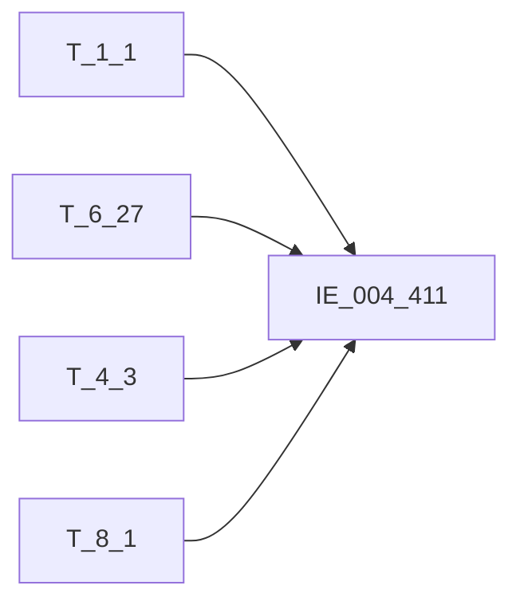

# 血缘-IE_004_411-对公信贷分户账-EAST5.0系统

## 页面边界

- 本页维护 `对公信贷分户账` 从一表通来源表到 EAST5.0 目标表 `IE_004_411` 的设计血缘。
- 证据为业务需求文档和工作区 GBase SQL 草案，尚未经过生产运行验证。
- 数据表字段定义见 [[数据表-IE_004_411-对公信贷分户账-EAST5.0系统]]；业务报送口径见 [[报表-IE_004_411-对公信贷分户账-EAST5.0系统]]。

## 系统边界

- 起始系统：一表通系统
- 目标系统：EAST5.0系统
- 是否跨系统血缘：是
- 目标对象：`IE_004_411` `对公信贷分户账`

## 业务链路摘要

- 按 `原始材料/业务需求/EAST5.0/026_对公信贷分户账.md` 的字段映射，将一表通来源表加工为 EAST5.0 `对公信贷分户账`。
- 表级规则：### 2.1 表级规则（Excel第 561 行） 通过【贷款协议补充信息】.【借据ID】关联【贷款借据】.【借据ID】，加总如下4个场景数据： 1、取上月末未终结：上月末【贷款借据】.【贷款状态】等于01、05 2、当月末未终结：当月末的【贷款借据】.【贷款状态】等于01、05 3、当月新发放贷款：【贷款协议补充信息】.【贷款实际发放日期】在当月 4、第三方平台跨月新发放：当月末【贷款借据】.【借据ID】在上月末的【贷款借据】.【借据ID】中不存在
- SQL 草案采用按 `P_DATA_DATE` 清理后重插或增量边界过滤的方式；具体投产方式待验证。
- 2026-05-05 重构：消除 4 个 `ON 1=1` JOIN TODO，补齐 4 场景 WHERE 过滤，补齐 2 个码值 CASE（DKZT/ZHZT），修正 DQRQ 来源为 T_6_27.F270018，修正 BBZ 为四表拼接。

## 直接上游对象

- [[数据表-T_1_1-机构信息-一表通系统]]：一表通来源表。
- [[数据表-T_6_27-贷款协议补充信息-一表通系统]]：一表通来源表。
- [[数据表-T_4_3-分户账信息-一表通系统]]：一表通来源表。
- [[数据表-T_8_1-贷款借据-一表通系统]]：一表通来源表。

## 直接下游对象

- 目标数据表：[[数据表-IE_004_411-对公信贷分户账-EAST5.0系统]]
- 报表业务口径页：[[报表-IE_004_411-对公信贷分户账-EAST5.0系统]]
- SQL 草案：`工作区/SQL开发/EAST5.0系统/PROC_EAST_IE_004_411_DGXDFHZ_草案.sql`

## Nodes

- [[数据表-T_1_1-机构信息-一表通系统]]：一表通来源表。
- [[数据表-T_6_27-贷款协议补充信息-一表通系统]]：一表通来源表。
- [[数据表-T_4_3-分户账信息-一表通系统]]：一表通来源表。
- [[数据表-T_8_1-贷款借据-一表通系统]]：一表通来源表。
- [[数据表-T_6_2-贷款协议-一表通系统]]：一表通来源表（备注字段）。
- [[数据表-IE_004_411-对公信贷分户账-EAST5.0系统]]：EAST5.0 目标采集表。
- [[报表-IE_004_411-对公信贷分户账-EAST5.0系统]]：业务口径说明。

## 表级 Edge List

| From | To | Transform | Evidence |
| --- | --- | --- | --- |
| [[数据表-T_1_1-机构信息-一表通系统]] | [[数据表-IE_004_411-对公信贷分户账-EAST5.0系统]] | 字段映射、关联、过滤、码值/日期转换后装载 `IE_004_411` | [[来源-EAST5.0系统-IE_004_411-对公信贷分户账]]；SQL 草案 |
| [[数据表-T_6_27-贷款协议补充信息-一表通系统]] | [[数据表-IE_004_411-对公信贷分户账-EAST5.0系统]] | 字段映射、关联、过滤、码值/日期转换后装载 `IE_004_411` | [[来源-EAST5.0系统-IE_004_411-对公信贷分户账]]；SQL 草案 |
| [[数据表-T_4_3-分户账信息-一表通系统]] | [[数据表-IE_004_411-对公信贷分户账-EAST5.0系统]] | 字段映射、关联、过滤、码值/日期转换后装载 `IE_004_411` | [[来源-EAST5.0系统-IE_004_411-对公信贷分户账]]；SQL 草案 |
| [[数据表-T_8_1-贷款借据-一表通系统]] | [[数据表-IE_004_411-对公信贷分户账-EAST5.0系统]] | 字段映射、关联、过滤、码值/日期转换后装载 `IE_004_411` | [[来源-EAST5.0系统-IE_004_411-对公信贷分户账]]；SQL 草案 |
| [[数据表-T_6_2-贷款协议-一表通系统]] | [[数据表-IE_004_411-对公信贷分户账-EAST5.0系统]] | 备注字段 F020062 拼接至 BBZ | [[来源-EAST5.0系统-IE_004_411-对公信贷分户账]]；SQL 草案 |

## 字段级 Edge List

| 源对象 | 源字段 | 目标对象 | 目标字段 | 处理逻辑 | 关系类型 | 证据 |
| --- | --- | --- | --- | --- | --- | --- |
| [[数据表-T_1_1-机构信息-一表通系统]] | `A010003` | [[数据表-IE_004_411-对公信贷分户账-EAST5.0系统]] | `JRXKZH` | 加工规则：用【贷款协议补充信息】.【机构ID】关联【机构信息】.【机构ID】，取【机构信息】.【金融许可证号】 | 加工映射 | [[来源-EAST5.0系统-IE_004_411-对公信贷分户账]]；SQL 草案 |
| [[数据表-T_6_27-贷款协议补充信息-一表通系统]] | `F270004` | [[数据表-IE_004_411-对公信贷分户账-EAST5.0系统]] | `NBJGH` | 加工规则：从【贷款协议补充信息】.【机构ID】第12位开始截取。 | 加工映射 | [[来源-EAST5.0系统-IE_004_411-对公信贷分户账]]；SQL 草案 |
| [[数据表-T_1_1-机构信息-一表通系统]] | `A010005` | [[数据表-IE_004_411-对公信贷分户账-EAST5.0系统]] | `YHJGMC` | 加工规则：用【贷款协议补充信息】.【机构ID】关联【机构信息】.【机构ID】，取【机构信息】.【银行机构名称】 | 加工映射 | [[来源-EAST5.0系统-IE_004_411-对公信贷分户账]]；SQL 草案 |
| [[数据表-T_6_27-贷款协议补充信息-一表通系统]] | `F270007` | [[数据表-IE_004_411-对公信贷分户账-EAST5.0系统]] | `MXKMBH` | 直接映射：【贷款协议补充信息】.【科目ID】 | 直接映射 | [[来源-EAST5.0系统-IE_004_411-对公信贷分户账]]；SQL 草案 |
| [[数据表-T_6_27-贷款协议补充信息-一表通系统]] | `F270008` | [[数据表-IE_004_411-对公信贷分户账-EAST5.0系统]] | `MXKMMC` | 直接映射：【贷款协议补充信息】.【科目名称】 | 直接映射 | [[来源-EAST5.0系统-IE_004_411-对公信贷分户账]]；SQL 草案 |
| [[数据表-T_6_27-贷款协议补充信息-一表通系统]] | `F270002` | [[数据表-IE_004_411-对公信贷分户账-EAST5.0系统]] | `KHTYBH` | 直接映射：【贷款协议补充信息】.【客户ID】 | 直接映射 | [[来源-EAST5.0系统-IE_004_411-对公信贷分户账]]；SQL 草案 |
| [[数据表-T_4_3-分户账信息-一表通系统]] | `D030004` | [[数据表-IE_004_411-对公信贷分户账-EAST5.0系统]] | `ZHMC` | 加工映射：通过【贷款协议补充信息】.【分户账号】关联【分户账信息】.【分户账号】，取【分户账信息】.【分户账名称】 | 加工映射 | [[来源-EAST5.0系统-IE_004_411-对公信贷分户账]]；SQL 草案 |
| [[数据表-T_6_27-贷款协议补充信息-一表通系统]] | `F270005` | [[数据表-IE_004_411-对公信贷分户账-EAST5.0系统]] | `DKFHZH` | 直接映射：【贷款协议补充信息】.【分户账号】 | 直接映射 | [[来源-EAST5.0系统-IE_004_411-对公信贷分户账]]；SQL 草案 |
| [[数据表-T_6_27-贷款协议补充信息-一表通系统]] | `F270003` | [[数据表-IE_004_411-对公信贷分户账-EAST5.0系统]] | `XDHTH` | 直接映射：【贷款协议补充信息】.【协议ID】 | 直接映射 | [[来源-EAST5.0系统-IE_004_411-对公信贷分户账]]；SQL 草案 |
| [[数据表-T_6_27-贷款协议补充信息-一表通系统]] | `F270001` | [[数据表-IE_004_411-对公信贷分户账-EAST5.0系统]] | `XDJJH` | 直接映射：【贷款协议补充信息】.【借据ID】 | 直接映射 | [[来源-EAST5.0系统-IE_004_411-对公信贷分户账]]；SQL 草案 |
| [[数据表-T_8_1-贷款借据-一表通系统]] | `H010021` | [[数据表-IE_004_411-对公信贷分户账-EAST5.0系统]] | `SJLL` | 加工映射：通过【贷款协议补充信息】.【借据ID】关联【贷款借据】.【借据ID】，取【贷款借据】.【贷款利率】 | 加工映射 | [[来源-EAST5.0系统-IE_004_411-对公信贷分户账]]；SQL 草案 |
| [[数据表-T_6_27-贷款协议补充信息-一表通系统]] | `F270006` | [[数据表-IE_004_411-对公信贷分户账-EAST5.0系统]] | `BZ` | 直接映射：【贷款协议补充信息】.【币种】 | 直接映射 | [[来源-EAST5.0系统-IE_004_411-对公信贷分户账]]；SQL 草案 |
| [[数据表-T_6_27-贷款协议补充信息-一表通系统]] | `F270009` | [[数据表-IE_004_411-对公信贷分户账-EAST5.0系统]] | `DKJE` | 加工规则：汇总同一【贷款协议补充信息】.【分户账号】下的【贷款协议补充信息】.【借款金额】。 | 加工映射 | [[来源-EAST5.0系统-IE_004_411-对公信贷分户账]]；SQL 草案 |
| [[数据表-T_8_1-贷款借据-一表通系统]] | `H010010` | [[数据表-IE_004_411-对公信贷分户账-EAST5.0系统]] | `DKYE` | 加工规则：用【贷款协议补充信息】.【借据ID】关联【贷款借据】.【借据ID】，汇总同一【贷款协议补充信息】.【分户账号】下的【贷款借据】.【借款余额】。 | 加工映射 | [[来源-EAST5.0系统-IE_004_411-对公信贷分户账]]；SQL 草案 |
| [[数据表-T_6_27-贷款协议补充信息-一表通系统]] | `F270016` | [[数据表-IE_004_411-对公信贷分户账-EAST5.0系统]] | `FFRQ` | 加工规则：取同一【贷款协议补充信息】.【分户账号】下，最小的【贷款协议补充信息】.【贷款实际发放日期】。转字符格式'YYYYMMDD'。 | 加工映射 | [[来源-EAST5.0系统-IE_004_411-对公信贷分户账]]；SQL 草案 |
| [[数据表-T_6_27-贷款协议补充信息-一表通系统]] | `F270018` | [[数据表-IE_004_411-对公信贷分户账-EAST5.0系统]] | `DQRQ` | 直接映射：【贷款协议补充信息】.【协议调整后到期日期】，转 YYYYMMDD | 直接映射 | [[来源-EAST5.0系统-IE_004_411-对公信贷分户账]]；SQL 草案 |
| [[数据表-T_4_3-分户账信息-一表通系统]] | `D030011` | [[数据表-IE_004_411-对公信贷分户账-EAST5.0系统]] | `KHRQ` | 格式转换：用【贷款协议补充信息】.【分户账号】关联【分户账信息】.【分户账号】，取【分户账信息】.【开户日期】。转字符格式'YYYYMMDD'，若取不到或为空，则赋默认值99991231。 | 码值转换/格式转换 | [[来源-EAST5.0系统-IE_004_411-对公信贷分户账]]；SQL 草案 |
| [[数据表-T_4_3-分户账信息-一表通系统]] | `D030012` | [[数据表-IE_004_411-对公信贷分户账-EAST5.0系统]] | `XHRQ` | 格式转换：用【贷款协议补充信息】.【分户账号】关联【分户账信息】.【分户账号】，取【分户账信息】.【销户日期】。转字符格式'YYYYMMDD'，若取不到或为空，则赋默认值99991231。 | 码值转换/格式转换 | [[来源-EAST5.0系统-IE_004_411-对公信贷分户账]]；SQL 草案 |
| [[数据表-T_8_1-贷款借据-一表通系统]] | `H010019` | [[数据表-IE_004_411-对公信贷分户账-EAST5.0系统]] | `DKZT` | 代码转化：；用【贷款协议补充信息】.【借据ID】关联【贷款借据】.【借据ID】，取【贷款借据】.【贷款状态】进行代码转化：；若为'01'[正常],则赋值为'正常';；若为'02'[核销],则赋值为'核销';；若为'03'[转让],则赋值为'转让';；若为'04'[结清],则赋值为'结清';；若为'05'[逾期],则赋值为'逾期';；若为'00-其他',则赋值为'其他-XX'。 | 码值转换/格式转换 | [[来源-EAST5.0系统-IE_004_411-对公信贷分户账]]；SQL 草案 |
| [[数据表-T_4_3-分户账信息-一表通系统]] | `D030013` | [[数据表-IE_004_411-对公信贷分户账-EAST5.0系统]] | `ZHZT` | 代码转化：用【贷款协议补充信息】.【分户账号】关联【分户账信息】.【分户账号】，取【分户账信息】.【账户状态】进行代码转化：；若【分户账信息】.【账户状态】为'01'[正常]，则赋值为'正常'； ；若【分户账信息】.【账户状态】为'02'[预销户]，则赋值为'预销户'; ；若【分户账信息】.【账户状态】为'03'[销户]，则赋值为'销户'； ；若【分户账信息】.【账户状态】为'04'[冻结]，则赋值为'冻结'；；若【分户账信息】.【账户... | 码值转换/格式转换 | [[来源-EAST5.0系统-IE_004_411-对公信贷分户账]]；SQL 草案 |
| [[数据表-T_4_3-分户账信息-一表通系统]] | `D030014` | [[数据表-IE_004_411-对公信贷分户账-EAST5.0系统]] | `BBZ` | 加工映射：取一表通【分户账信息】、【贷款协议补充信息】、【贷款借据】、【贷款协议】的【备注】，以";"拼接。 | 加工映射 | [[来源-EAST5.0系统-IE_004_411-对公信贷分户账]]；SQL 草案 |
| [[数据表-T_6_27-贷款协议补充信息-一表通系统]] | `F270068` | [[数据表-IE_004_411-对公信贷分户账-EAST5.0系统]] | `BBZ` | 加工映射：备注拼接来源之一 | 加工映射 | [[来源-EAST5.0系统-IE_004_411-对公信贷分户账]]；SQL 草案 |
| [[数据表-T_8_1-贷款借据-一表通系统]] | `H010030` | [[数据表-IE_004_411-对公信贷分户账-EAST5.0系统]] | `BBZ` | 加工映射：备注拼接来源之一 | 加工映射 | [[来源-EAST5.0系统-IE_004_411-对公信贷分户账]]；SQL 草案 |
| [[数据表-T_6_2-贷款协议-一表通系统]] | `F020062` | [[数据表-IE_004_411-对公信贷分户账-EAST5.0系统]] | `BBZ` | 加工映射：备注拼接来源之一 | 加工映射 | [[来源-EAST5.0系统-IE_004_411-对公信贷分户账]]；SQL 草案 |
| [[数据表-T_6_27-贷款协议补充信息-一表通系统]] | `F270069` | [[数据表-IE_004_411-对公信贷分户账-EAST5.0系统]] | `CJRQ` | 格式转换：取【贷款协议补充信息】.【采集日期】，格式转为'YYYYMMDD'。 | 码值转换/格式转换 | [[来源-EAST5.0系统-IE_004_411-对公信贷分户账]]；SQL 草案 |

## Graph-总览

## 回链检查

- 目标数据表页：已补 SQL 草案上游依赖摘要或待本次批处理补齐。
- 报表业务口径页：已创建或补充血缘回链。
- 一表通源表页：已补下游消费摘要或待本次批处理补齐。
- 当前字段级血缘基于业务需求和 SQL 草案，未运行验证，状态为待确认。

## 变更与冲突

- 本次为新增设计血缘或补齐草案血缘，不覆盖已验证生产血缘。
- 未发现需要将 `validated` 页面降级的情况；本页保持 `draft`。

## Open Questions

- GBase 草案中的复杂 JOIN、窗口去重、终态纳入和增量边界需要人工复核。
- 部分字段的码值 CASE 在草案中仍为待补，需要结合外部填报说明和跑数结果闭环。
- 外部监管实体页 wikilink 待补。

## 缺口字段（2026-05-04）

| 目标字段 | 字段名称 | 缺口说明 |
| --- | --- | --- |
| `GSFZJG` | 归属分支机构 | 本地 DDL 存在，但业务需求映射表和 SQL 草案未能确认来源，字段级血缘待补。 |
| `SENSITIVEFLAG` | 涉密标志 | 本地 DDL 存在，但业务需求映射表和 SQL 草案未能确认来源，字段级血缘待补。 |
