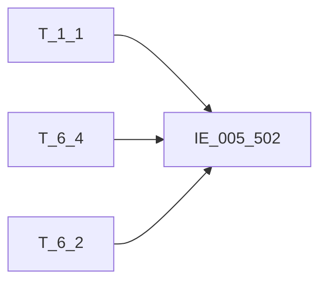

# 血缘-IE_005_502-互联网贷款合同附加表-EAST5.0系统

## 页面边界

- 本页维护 `互联网贷款合同附加表` 从一表通来源表到 EAST5.0 目标表 `IE_005_502` 的设计血缘。
- 证据为业务需求文档和工作区 GBase SQL 草案，尚未经过生产运行验证。
- 数据表字段定义见 [[数据表-IE_005_502-互联网贷款合同附加表-EAST5.0系统]]；业务报送口径见 [[报表-IE_005_502-互联网贷款合同附加表-EAST5.0系统]]。

## 系统边界

- 起始系统：一表通系统
- 目标系统：EAST5.0系统
- 是否跨系统血缘：是
- 目标对象：`IE_005_502` `互联网贷款合同附加表`

## 业务链路摘要

- 按 `原始材料/业务需求/EAST5.0/029_互联网贷款合同附加表.md` 的字段映射，将一表通来源表加工为 EAST5.0 `互联网贷款合同附加表`。
- 表级规则：### 2.1 表级规则（Excel第 634 行） 主表：【互联网贷款协议】（和<EAST信贷合同表>内关联后，按【机构ID】、【协议ID】、【合作协议ID】、【业务模式】、【合作方负有担保责任的金额】、【客户数据授权书编号】、【授权生效日期】、【授权终止日期】、【备注】、【采集日期】 去重） 内关联：<EAST信贷合同表> 关联条件 : 【互联网贷款协议】.【协议ID】= <EAST信贷合同表> .信贷合同号。限制【采集日期】为当日 左关联：【贷款协议】 关联条件 : 【互联网贷款协议】.【协议ID】= 【贷款协议】 .【协议ID】。限制【采集日期】为当日 左关联：【机构信息】 关联条件 : 【互联网贷款协议】.【机构ID】= 【机构信息】.【机构ID】。限制【采集日期】为当日 左关联：<EAST对公客户信息表> 关联条件：【贷款协议】 .【客户ID】 = <EAST对公客户信息表> .客户统一编号。限制【采集日期】为当日 左关联：<EAST个人基础信息表> 关联条件：【贷款协议】 .【客户ID】 = <EAST个人基础信息表> .客户统一编号。限制【采集日期】为当日 过滤条件：限制【互联网贷款协议】.【采集日期】为当日
- SQL 草案采用按 `P_DATA_DATE` 清理后重插或增量边界过滤的方式；具体投产方式待验证。

## 直接上游对象

- [[数据表-T_1_1-机构信息-一表通系统]]：一表通来源表。
- [[数据表-T_6_4-互联网贷款协议-一表通系统]]：一表通来源表。
- [[数据表-T_6_2-贷款协议-一表通系统]]：一表通来源表。

## 直接下游对象

- 目标数据表：[[数据表-IE_005_502-互联网贷款合同附加表-EAST5.0系统]]
- 报表业务口径页：[[报表-IE_005_502-互联网贷款合同附加表-EAST5.0系统]]
- SQL 草案：`工作区/SQL开发/EAST5.0系统/PROC_EAST_IE_005_502_HLWDKHTFJB_草案.sql`

## Nodes

- [[数据表-T_1_1-机构信息-一表通系统]]：一表通来源表。
- [[数据表-T_6_4-互联网贷款协议-一表通系统]]：一表通来源表。
- [[数据表-T_6_2-贷款协议-一表通系统]]：一表通来源表。
- [[数据表-IE_005_502-互联网贷款合同附加表-EAST5.0系统]]：EAST5.0 目标采集表。
- [[报表-IE_005_502-互联网贷款合同附加表-EAST5.0系统]]：业务口径说明。

## 表级 Edge List

| From | To | Transform | Evidence |
| --- | --- | --- | --- |
| [[数据表-T_1_1-机构信息-一表通系统]] | [[数据表-IE_005_502-互联网贷款合同附加表-EAST5.0系统]] | 字段映射、关联、过滤、码值/日期转换后装载 `IE_005_502` | [[来源-EAST5.0系统-IE_005_502-互联网贷款合同附加表]]；SQL 草案 |
| [[数据表-T_6_4-互联网贷款协议-一表通系统]] | [[数据表-IE_005_502-互联网贷款合同附加表-EAST5.0系统]] | 字段映射、关联、过滤、码值/日期转换后装载 `IE_005_502` | [[来源-EAST5.0系统-IE_005_502-互联网贷款合同附加表]]；SQL 草案 |
| [[数据表-T_6_2-贷款协议-一表通系统]] | [[数据表-IE_005_502-互联网贷款合同附加表-EAST5.0系统]] | 字段映射、关联、过滤、码值/日期转换后装载 `IE_005_502` | [[来源-EAST5.0系统-IE_005_502-互联网贷款合同附加表]]；SQL 草案 |

## 字段级 Edge List

| 源对象 | 源字段 | 目标对象 | 目标字段 | 处理逻辑 | 关系类型 | 证据 |
| --- | --- | --- | --- | --- | --- | --- |
| [[数据表-T_1_1-机构信息-一表通系统]] | `A010003` | [[数据表-IE_005_502-互联网贷款合同附加表-EAST5.0系统]] | `JRXKZH` | 加工规则：用【互联网贷款协议】.【机构ID】关联【机构信息】.【机构ID】，取【机构信息】.【金融许可证号】 | 加工映射 | [[来源-EAST5.0系统-IE_005_502-互联网贷款合同附加表]]；SQL 草案 |
| [[数据表-T_6_4-互联网贷款协议-一表通系统]] | `F040001` | [[数据表-IE_005_502-互联网贷款合同附加表-EAST5.0系统]] | `NBJGH` | 加工规则：从【互联网贷款协议】.【机构ID】第12位开始截取。 | 加工映射 | [[来源-EAST5.0系统-IE_005_502-互联网贷款合同附加表]]；SQL 草案 |
| [[数据表-T_1_1-机构信息-一表通系统]] | `A010005` | [[数据表-IE_005_502-互联网贷款合同附加表-EAST5.0系统]] | `YHJGMC` | 加工规则：用【互联网贷款协议】.【机构ID】关联【机构信息】.【机构ID】，取【机构信息】.【银行机构名称】 | 加工映射 | [[来源-EAST5.0系统-IE_005_502-互联网贷款合同附加表]]；SQL 草案 |
| [[数据表-T_6_4-互联网贷款协议-一表通系统]] | `F040002` | [[数据表-IE_005_502-互联网贷款合同附加表-EAST5.0系统]] | `XDHTH` | 直接映射 | 直接映射 | [[来源-EAST5.0系统-IE_005_502-互联网贷款合同附加表]]；SQL 草案 |
| [[数据表-T_6_4-互联网贷款协议-一表通系统]] | `F040005` | [[数据表-IE_005_502-互联网贷款合同附加表-EAST5.0系统]] | `YWMS` | 加工规则：若【互联网贷款协议】.【业务模式】为'04'[本机构独立开展互联网贷款业务]，则赋值为'独立'；否则赋'合作'。 | 加工映射 | [[来源-EAST5.0系统-IE_005_502-互联网贷款合同附加表]]；SQL 草案 |
| [[数据表-T_6_4-互联网贷款协议-一表通系统]] | `F040004` | [[数据表-IE_005_502-互联网贷款合同附加表-EAST5.0系统]] | `HZXYBH` | 加工规则：取【互联网贷款协议】.【合作协议ID】；若为空，则赋值为'无'。 | 加工映射 | [[来源-EAST5.0系统-IE_005_502-互联网贷款合同附加表]]；SQL 草案 |
| [[数据表-T_6_2-贷款协议-一表通系统]] | `F020007` | [[数据表-IE_005_502-互联网贷款合同附加表-EAST5.0系统]] | `BZ` | 加工规则：用【互联网贷款协议】.【协议ID】关联【贷款协议】.【协议ID】，取【贷款协议】.【协议币种】 | 加工映射 | [[来源-EAST5.0系统-IE_005_502-互联网贷款合同附加表]]；SQL 草案 |
| [[数据表-T_6_4-互联网贷款协议-一表通系统]] | `F040017` | [[数据表-IE_005_502-互联网贷款合同附加表-EAST5.0系统]] | `HZFZRJE` | 直接映射 | 直接映射 | [[来源-EAST5.0系统-IE_005_502-互联网贷款合同附加表]]；SQL 草案 |
| [[数据表-T_6_4-互联网贷款协议-一表通系统]] | `F040018` | [[数据表-IE_005_502-互联网贷款合同附加表-EAST5.0系统]] | `LXDH` | 直接映射 | 直接映射 | [[来源-EAST5.0系统-IE_005_502-互联网贷款合同附加表]]；SQL 草案 |
| [[数据表-T_6_4-互联网贷款协议-一表通系统]] | `F040009` | [[数据表-IE_005_502-互联网贷款合同附加表-EAST5.0系统]] | `SQSBH` | 直接映射 | 直接映射 | [[来源-EAST5.0系统-IE_005_502-互联网贷款合同附加表]]；SQL 草案 |
| [[数据表-T_6_4-互联网贷款协议-一表通系统]] | `F040010` | [[数据表-IE_005_502-互联网贷款合同附加表-EAST5.0系统]] | `SXRQ` | 格式转换：转字符格式'YYYYMMDD'，若取不到或为空，则赋默认值99991231。 | 码值转换/格式转换 | [[来源-EAST5.0系统-IE_005_502-互联网贷款合同附加表]]；SQL 草案 |
| [[数据表-T_6_4-互联网贷款协议-一表通系统]] | `F040011` | [[数据表-IE_005_502-互联网贷款合同附加表-EAST5.0系统]] | `ZZRQ` | 格式转换：转字符格式'YYYYMMDD'，若取不到或为空，则赋默认值99991231。 | 码值转换/格式转换 | [[来源-EAST5.0系统-IE_005_502-互联网贷款合同附加表]]；SQL 草案 |
| [[数据表-T_6_2-贷款协议-一表通系统]] | `F020061` | [[数据表-IE_005_502-互联网贷款合同附加表-EAST5.0系统]] | `HTZT` | 代码转化：；用【互联网贷款协议】.【协议ID】关联【贷款协议】.【协议ID】，取【贷款协议】.【合同状态】进行代码转化：；若为'01'[正常],则赋值为'有效';；若为'02'[待生效],则赋值为'未生效';；若为'03'[中止],则赋值为'其他-中止';；若为'04'[终止],则赋值为'终结';；若为'05'[撤销],则赋值为'撤销';；若为'06'[无效],则赋值为'其他-无效';；若为'00-XX',则赋值为'其他-XX'。 | 码值转换/格式转换 | [[来源-EAST5.0系统-IE_005_502-互联网贷款合同附加表]]；SQL 草案 |
| [[数据表-T_6_4-互联网贷款协议-一表通系统]] | `F040015` | [[数据表-IE_005_502-互联网贷款合同附加表-EAST5.0系统]] | `BBZ` | EAST《互联网贷款合同附加表》除机构数据和客户数据外，还从一表通《表6.4互联网贷款协议》、《表6.2贷款协议》备注，以“;”拼接。 | 加工映射 | [[来源-EAST5.0系统-IE_005_502-互联网贷款合同附加表]]；SQL 草案 |
| [[数据表-T_6_4-互联网贷款协议-一表通系统]] | `F040016` | [[数据表-IE_005_502-互联网贷款合同附加表-EAST5.0系统]] | `CJRQ` | 格式转换：格式转为'YYYYMMDD'。 | 码值转换/格式转换 | [[来源-EAST5.0系统-IE_005_502-互联网贷款合同附加表]]；SQL 草案 |

## Graph-总览

## 回链检查

- 目标数据表页：已补 SQL 草案上游依赖摘要（2026-05-06 更新）。
- 报表业务口径页：已创建或补充血缘回链。
- 一表通源表页：已补下游消费摘要或待本次批处理补齐。
- 当前字段级血缘基于业务需求和 SQL 草案，2026-05-06 已实现 JOIN 条件、码值转换和备注拼接，但尚未运行验证，状态保持 `draft`。

## 变更与冲突

- 本次为新增设计血缘或补齐草案血缘，不覆盖已验证生产血缘。
- 未发现需要将 `validated` 页面降级的情况；本页保持 `draft`。

## Open Questions

- 表级规则要求与 `<EAST信贷合同表>` 内关联去重，但本仓库尚未存储该表结构；当前以 T_6_4 为唯一数据源，未执行去重，需确认是否需要在 GBase 环境中引入该表。
- T_6_4 主键包含 F040003（借据ID），同一协议ID可能对应多条借据记录，是否需要按业务键去重待跑数确认。
- "上一采集日至采集日期间终态纳入"规则，当前通过采集日期过滤实现；若需精确按上一采集日边界过滤，需在 GBase 环境中确认。
- 外部监管实体页 wikilink 待补。

## 缺口字段（2026-05-04）

| 目标字段 | 字段名称 | 缺口说明 |
| --- | --- | --- |
| `SENSITIVEFLAG` | 涉密标志 | 本地 DDL 存在，但业务需求映射表和 SQL 草案未能确认来源，字段级血缘待补。 |
| `GSFZJG` | 归属分支机构 | 本地 DDL 存在，但业务需求映射表和 SQL 草案未能确认来源，字段级血缘待补。 |
