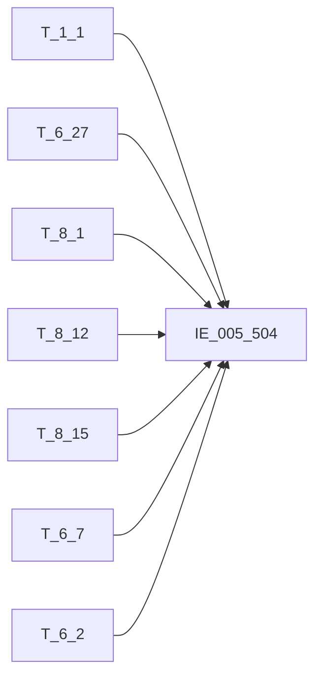

# 血缘-IE_005_504-对公信贷业务借据表-EAST5.0系统

## 页面边界

- 本页维护 `对公信贷业务借据表` 从一表通来源表到 EAST5.0 目标表 `IE_005_504` 的设计血缘。
- 证据为业务需求文档和工作区 GBase SQL 草案，尚未经过生产运行验证。
- 数据表字段定义见 [[数据表-IE_005_504-对公信贷业务借据表-EAST5.0系统]]；业务报送口径见 [[报表-IE_005_504-对公信贷业务借据表-EAST5.0系统]]。

## 系统边界

- 起始系统：一表通系统
- 目标系统：EAST5.0系统
- 是否跨系统血缘：是
- 目标对象：`IE_005_504` `对公信贷业务借据表`

## 业务链路摘要

- 按 `原始材料/业务需求/EAST5.0/031_对公信贷业务借据表.md` 的 56 条字段映射规则，将一表通来源表加工为 EAST5.0 `对公信贷业务借据表`。
- 表级规则：### 2.1 表级规则（Excel第 709 行） 取日期在当月且通过分户账号和币种关联贷款协议补充信息来筛选数据范围
- 2026-05-06 重构校准：消除全部 10 个 `ON 1=1` JOIN TODO，补齐 14 个码值 CASE 转换（信贷业务种类/贷款发放类型/放款方式/贷款五级分类/利率类型/还款方式/计息方式/是否互联网贷款/是否涉农贷款/是否绿色贷款/是否普惠型涉农贷款/是否科技贷款/贷款状态/采集日期），6 个日期格式转换（贷款发放日期/贷款到期日期/终结日期/欠本日期/欠息日期/下期还款日期/采集日期），备注多表拼接，授信情况窗口去重，展期次数聚合，行业门类公共代码关联。
- SQL 草案采用按 `P_DATA_DATE` 清理后重插或增量边界过滤的方式；具体投产方式待验证。

## 直接上游对象

- [[数据表-T_1_1-机构信息-一表通系统]]：一表通来源表，提供机构名称和金融许可证号。
- [[数据表-T_6_27-贷款协议补充信息-一表通系统]]：一表通来源表（主表），驱动数据粒度。
- [[数据表-T_8_1-贷款借据-一表通系统]]：一表通来源表，提供贷款余额、实际利率、贷款状态。
- [[数据表-T_8_12-五级分类状态-一表通系统]]：一表通来源表，窗口去重取最新五级分类。
- [[数据表-T_8_15-还款状态-一表通系统]]：一表通来源表，提供还款/欠款/日期字段。
- [[数据表-T_6_7-贷款展期协议-一表通系统]]：一表通来源表，按借据ID分组汇总展期次数。
- [[数据表-T_6_2-贷款协议-一表通系统]]：一表通来源表，提供管户员工ID和备注。
- [[数据表-T_10_1-公共代码-一表通系统]]：一表通来源表，行业门类码值转码。
- [[数据表-T_8_13-授信情况-一表通系统]]：一表通来源表，窗口去重取最新授信额度。
- [[数据表-T_2_1-对公客户基本情况-一表通系统]]：一表通来源表，提供客户名称。

## 直接下游对象

- 目标数据表：[[数据表-IE_005_504-对公信贷业务借据表-EAST5.0系统]]
- 报表业务口径页：[[报表-IE_005_504-对公信贷业务借据表-EAST5.0系统]]
- SQL 草案：`工作区/SQL开发/EAST5.0系统/PROC_EAST_IE_005_504_DGXDYWJJB_草案.sql`

## Nodes

- [[数据表-T_1_1-机构信息-一表通系统]]：一表通来源表。
- [[数据表-T_6_27-贷款协议补充信息-一表通系统]]：一表通来源表（主表）。
- [[数据表-T_8_1-贷款借据-一表通系统]]：一表通来源表。
- [[数据表-T_8_12-五级分类状态-一表通系统]]：一表通来源表。
- [[数据表-T_8_15-还款状态-一表通系统]]：一表通来源表。
- [[数据表-T_6_7-贷款展期协议-一表通系统]]：一表通来源表。
- [[数据表-T_6_2-贷款协议-一表通系统]]：一表通来源表。
- [[数据表-T_10_1-公共代码-一表通系统]]：一表通来源表（行业门类转码）。
- [[数据表-T_8_13-授信情况-一表通系统]]：一表通来源表（授信额度）。
- [[数据表-T_2_1-对公客户基本情况-一表通系统]]：一表通来源表（客户名称）。
- [[数据表-IE_005_504-对公信贷业务借据表-EAST5.0系统]]：EAST5.0 目标采集表。
- [[报表-IE_005_504-对公信贷业务借据表-EAST5.0系统]]：业务口径说明。

## 表级 Edge List

| From | To | Transform | Evidence |
| --- | --- | --- | --- |
| [[数据表-T_1_1-机构信息-一表通系统]] | [[数据表-IE_005_504-对公信贷业务借据表-EAST5.0系统]] | LEFT JOIN 取机构名称、金融许可证号 | [[来源-EAST5.0系统-IE_005_504-对公信贷业务借据表]]；SQL 草案 2026-05-06 |
| [[数据表-T_6_27-贷款协议补充信息-一表通系统]] | [[数据表-IE_005_504-对公信贷业务借据表-EAST5.0系统]] | 主表驱动，40+ 字段直接映射 + CASE 码值 + 日期转换 | [[来源-EAST5.0系统-IE_005_504-对公信贷业务借据表]]；SQL 草案 2026-05-06 |
| [[数据表-T_8_1-贷款借据-一表通系统]] | [[数据表-IE_005_504-对公信贷业务借据表-EAST5.0系统]] | LEFT JOIN 取贷款余额、利率、状态、备注 | [[来源-EAST5.0系统-IE_005_504-对公信贷业务借据表]]；SQL 草案 2026-05-06 |
| [[数据表-T_8_12-五级分类状态-一表通系统]] | [[数据表-IE_005_504-对公信贷业务借据表-EAST5.0系统]] | CTE 窗口去重取最新五级分类 + CASE 码值转换 | [[来源-EAST5.0系统-IE_005_504-对公信贷业务借据表]]；SQL 草案 2026-05-06 |
| [[数据表-T_8_15-还款状态-一表通系统]] | [[数据表-IE_005_504-对公信贷业务借据表-EAST5.0系统]] | LEFT JOIN 取还款/欠款/日期字段（20+ 字段） | [[来源-EAST5.0系统-IE_005_504-对公信贷业务借据表]]；SQL 草案 2026-05-06 |
| [[数据表-T_6_7-贷款展期协议-一表通系统]] | [[数据表-IE_005_504-对公信贷业务借据表-EAST5.0系统]] | CTE 按借据ID分组SUM展期次数 | [[来源-EAST5.0系统-IE_005_504-对公信贷业务借据表]]；SQL 草案 2026-05-06 |
| [[数据表-T_6_2-贷款协议-一表通系统]] | [[数据表-IE_005_504-对公信贷业务借据表-EAST5.0系统]] | LEFT JOIN 取管户员工ID和备注 | [[来源-EAST5.0系统-IE_005_504-对公信贷业务借据表]]；SQL 草案 2026-05-06 |
| [[数据表-T_10_1-公共代码-一表通系统]] | [[数据表-IE_005_504-对公信贷业务借据表-EAST5.0系统]] | LEFT JOIN 行业门类码值转码 | [[来源-EAST5.0系统-IE_005_504-对公信贷业务借据表]]；SQL 草案 2026-05-06 |
| [[数据表-T_8_13-授信情况-一表通系统]] | [[数据表-IE_005_504-对公信贷业务借据表-EAST5.0系统]] | CTE 窗口去重取最新授信额度 | [[来源-EAST5.0系统-IE_005_504-对公信贷业务借据表]]；SQL 草案 2026-05-06 |
| [[数据表-T_2_1-对公客户基本情况-一表通系统]] | [[数据表-IE_005_504-对公信贷业务借据表-EAST5.0系统]] | LEFT JOIN 取客户名称 | [[来源-EAST5.0系统-IE_005_504-对公信贷业务借据表]]；SQL 草案 2026-05-06 |

## 字段级 Edge List

| 源对象 | 源字段 | 目标对象 | 目标字段 | 处理逻辑 | 关系类型 | 证据 |
| --- | --- | --- | --- | --- | --- | --- |
| [[数据表-T_1_1-机构信息-一表通系统]] | `A010003` | [[数据表-IE_005_504-对公信贷业务借据表-EAST5.0系统]] | `JRXKZH` | 加工规则：用【贷款协议补充信息】.【机构ID】关联【机构信息】.【机构ID】，取【机构信息】.【金融许可证号】 | 加工映射 | [[来源-EAST5.0系统-IE_005_504-对公信贷业务借据表]]；SQL 草案 |
| [[数据表-T_6_27-贷款协议补充信息-一表通系统]] | `F270004` | [[数据表-IE_005_504-对公信贷业务借据表-EAST5.0系统]] | `NBJGH` | 加工规则：从【贷款协议补充信息】.【机构ID】第12位开始截取。 | 加工映射 | [[来源-EAST5.0系统-IE_005_504-对公信贷业务借据表]]；SQL 草案 |
| [[数据表-T_1_1-机构信息-一表通系统]] | `A010005` | [[数据表-IE_005_504-对公信贷业务借据表-EAST5.0系统]] | `YHJGMC` | 加工规则：用【贷款协议补充信息】.【机构ID】关联【机构信息】.【机构ID】，取【机构信息】.【银行机构名称】 | 加工映射 | [[来源-EAST5.0系统-IE_005_504-对公信贷业务借据表]]；SQL 草案 |
| [[数据表-T_6_27-贷款协议补充信息-一表通系统]] | `F270007` | [[数据表-IE_005_504-对公信贷业务借据表-EAST5.0系统]] | `MXKMBH` | 直接映射 | 直接映射 | [[来源-EAST5.0系统-IE_005_504-对公信贷业务借据表]]；SQL 草案 |
| [[数据表-T_6_27-贷款协议补充信息-一表通系统]] | `F270008` | [[数据表-IE_005_504-对公信贷业务借据表-EAST5.0系统]] | `MXKMMC` | 直接映射 | 直接映射 | [[来源-EAST5.0系统-IE_005_504-对公信贷业务借据表]]；SQL 草案 |
| [[数据表-T_6_27-贷款协议补充信息-一表通系统]] | `F270002` | [[数据表-IE_005_504-对公信贷业务借据表-EAST5.0系统]] | `KHTYBH` | 直接映射 | 直接映射 | [[来源-EAST5.0系统-IE_005_504-对公信贷业务借据表]]；SQL 草案 |
| [[数据表-T_2_1-对公客户基本情况-一表通系统]] | `B010001` | [[数据表-IE_005_504-对公信贷业务借据表-EAST5.0系统]] | `KHMC` | 客户名称 | LEFT JOIN T_2_1 ON 客户ID + 数据日期，取 B010001 | [[来源-EAST5.0系统-IE_005_504-对公信贷业务借据表]]；SQL 草案 2026-05-06 |
| [[数据表-T_6_27-贷款协议补充信息-一表通系统]] | `F270003` | [[数据表-IE_005_504-对公信贷业务借据表-EAST5.0系统]] | `XDHTH` | 直接映射 | 直接映射 | [[来源-EAST5.0系统-IE_005_504-对公信贷业务借据表]]；SQL 草案 |
| [[数据表-T_6_27-贷款协议补充信息-一表通系统]] | `F270001` | [[数据表-IE_005_504-对公信贷业务借据表-EAST5.0系统]] | `XDJJH` | 直接映射 | 直接映射 | [[来源-EAST5.0系统-IE_005_504-对公信贷业务借据表]]；SQL 草案 |
| [[数据表-T_6_27-贷款协议补充信息-一表通系统]] | `F270005` | [[数据表-IE_005_504-对公信贷业务借据表-EAST5.0系统]] | `DKFHZH` | 直接映射 | 直接映射 | [[来源-EAST5.0系统-IE_005_504-对公信贷业务借据表]]；SQL 草案 |
| [[数据表-T_6_27-贷款协议补充信息-一表通系统]] | `F270025` | [[数据表-IE_005_504-对公信贷业务借据表-EAST5.0系统]] | `XDYWZL` | 代码转化：21 个精确分支（01~21）+ '00' 通配 + ELSE，覆盖流动资金贷款/法人账户透支/项目贷款/一般固定资产贷款/住房按揭贷款/个人经营性贷款/商用房贷款/汽车贷款/助学贷款/消费贷款/票据贴现/买断式转贴现/贸易融资业务/融资租赁业务/垫款/委托贷款等 | 码值转换/格式转换 | [[来源-EAST5.0系统-IE_005_504-对公信贷业务借据表]]；SQL 草案 2026-05-06 |
| [[数据表-T_6_27-贷款协议补充信息-一表通系统]] | `F270010` | [[数据表-IE_005_504-对公信贷业务借据表-EAST5.0系统]] | `DKFFLX` | 代码转化：'01'→'新增','02'→'借新还旧','03'→'重组贷款','04'→'无还本续贷','00'→'其他-自定义'，ELSE 原值 | 码值转换/格式转换 | [[来源-EAST5.0系统-IE_005_504-对公信贷业务借据表]]；SQL 草案 2026-05-06 |
| [[数据表-T_6_27-贷款协议补充信息-一表通系统]] | `F270037` | [[数据表-IE_005_504-对公信贷业务借据表-EAST5.0系统]] | `FKFS` | 代码转化：'01'→'自主支付','02'→'受托支付','03'→'混合支付','00'→'其他-自定义'，ELSE 原值 | 码值转换/格式转换 | [[来源-EAST5.0系统-IE_005_504-对公信贷业务借据表]]；SQL 草案 2026-05-06 |
| [[数据表-T_6_27-贷款协议补充信息-一表通系统]] | `F270006` | [[数据表-IE_005_504-对公信贷业务借据表-EAST5.0系统]] | `BZ` | 直接映射 | 直接映射 | [[来源-EAST5.0系统-IE_005_504-对公信贷业务借据表]]；SQL 草案 |
| [[数据表-T_6_27-贷款协议补充信息-一表通系统]] | `F270009` | [[数据表-IE_005_504-对公信贷业务借据表-EAST5.0系统]] | `DKJE` | 直接映射 | 直接映射 | [[来源-EAST5.0系统-IE_005_504-对公信贷业务借据表]]；SQL 草案 |
| [[数据表-T_8_1-贷款借据-一表通系统]] | `H010010` | [[数据表-IE_005_504-对公信贷业务借据表-EAST5.0系统]] | `DKYE` | 直接映射：用【贷款协议补充信息】.【借据ID】关联【贷款借据】.【借据ID】，取【贷款借据】.【借款余额】。 | 直接映射 | [[来源-EAST5.0系统-IE_005_504-对公信贷业务借据表]]；SQL 草案 |
| [[数据表-T_8_12-五级分类状态-一表通系统]] | `H120002`, `H120005`, `H120015` | [[数据表-IE_005_504-对公信贷业务借据表-EAST5.0系统]] | `DKWJFL`, `BBZ` 片段 | CTE 窗口去重（PARTITION BY H120002 ORDER BY H120004 DESC）取 rn=1，CASE '01'→'正常','02'→'关注','03'→'次级','04'→'可疑','05'→'损失','00'→''，ELSE 原值 | 码值转换/格式转换 | [[来源-EAST5.0系统-IE_005_504-对公信贷业务借据表]]；SQL 草案 2026-05-06 |
| [[数据表-T_8_15-还款状态-一表通系统]] | `H150007` | [[数据表-IE_005_504-对公信贷业务借据表-EAST5.0系统]] | `ZQS` | 直接映射：用【贷款协议补充信息】.【借据ID】关联【还款状态】.【细分资产ID】（筛选【细分资产ID】不为空的数据），取【还款状态】.【计划还款期数】。 | 直接映射 | [[来源-EAST5.0系统-IE_005_504-对公信贷业务借据表]]；SQL 草案 |
| [[数据表-T_8_15-还款状态-一表通系统]] | `H150006` | [[数据表-IE_005_504-对公信贷业务借据表-EAST5.0系统]] | `DQQS` | 直接映射：用【贷款协议补充信息】.【借据ID】关联【还款状态】.【细分资产ID】（筛选【细分资产ID】不为空的数据），取【还款状态】.【本期还款期数】。 | 直接映射 | [[来源-EAST5.0系统-IE_005_504-对公信贷业务借据表]]；SQL 草案 |
| [[数据表-T_6_7-贷款展期协议-一表通系统]] | `F070002`, `F070003`, `F070010` | [[数据表-IE_005_504-对公信贷业务借据表-EAST5.0系统]] | `ZQCS`, `BBZ` 片段 | CTE 按 F070002（借据ID）分组 SUM(COALESCE(F070003,0))，LEFT JOIN 于借据ID，空值 COALESCE(..., 0) | 加工映射 | [[来源-EAST5.0系统-IE_005_504-对公信贷业务借据表]]；SQL 草案 2026-05-06 |
| [[数据表-T_6_27-贷款协议补充信息-一表通系统]] | `F270016` | [[数据表-IE_005_504-对公信贷业务借据表-EAST5.0系统]] | `DKFFRQ` | 格式转换：转字符格式'YYYYMMDD'，若取不到或为空，则赋默认值99991231。 | 码值转换/格式转换 | [[来源-EAST5.0系统-IE_005_504-对公信贷业务借据表]]；SQL 草案 |
| [[数据表-T_6_27-贷款协议补充信息-一表通系统]] | `F270018` | [[数据表-IE_005_504-对公信贷业务借据表-EAST5.0系统]] | `DKDQRQ` | 格式转换：转字符格式'YYYYMMDD'，若取不到或为空，则赋默认值99991231。 | 码值转换/格式转换 | [[来源-EAST5.0系统-IE_005_504-对公信贷业务借据表]]；SQL 草案 |
| [[数据表-T_8_15-还款状态-一表通系统]] | `H150025` | [[数据表-IE_005_504-对公信贷业务借据表-EAST5.0系统]] | `ZJRQ` | 格式转换：用【贷款协议补充信息】.【借据ID】关联【还款状态】.【细分资产ID】（筛选【细分资产ID】不为空的数据），取【还款状态】.【终结日期】，转字符格式'YYYYMMDD'，若取不到或为空，则赋默认值99991231。 | 码值转换/格式转换 | [[来源-EAST5.0系统-IE_005_504-对公信贷业务借据表]]；SQL 草案 |
| [[数据表-T_8_15-还款状态-一表通系统]] | `H150020` | [[数据表-IE_005_504-对公信贷业务借据表-EAST5.0系统]] | `QBJE` | 直接映射：用【贷款协议补充信息】.【借据ID】关联【还款状态】.【细分资产ID】（筛选【细分资产ID】不为空的数据），取【还款状态】.【欠本金额】。 | 直接映射 | [[来源-EAST5.0系统-IE_005_504-对公信贷业务借据表]]；SQL 草案 |
| [[数据表-T_8_15-还款状态-一表通系统]] | `H150023` | [[数据表-IE_005_504-对公信贷业务借据表-EAST5.0系统]] | `QBRQ` | 格式转换：用【贷款协议补充信息】.【借据ID】关联【还款状态】.【细分资产ID】（筛选【细分资产ID】不为空的数据），取【还款状态】.【欠本日期】，转字符格式'YYYYMMDD'，若取不到或为空，则赋默认值99991231。 | 码值转换/格式转换 | [[来源-EAST5.0系统-IE_005_504-对公信贷业务借据表]]；SQL 草案 |
| [[数据表-T_8_15-还款状态-一表通系统]] | `H150021` | [[数据表-IE_005_504-对公信贷业务借据表-EAST5.0系统]] | `BNQXYE` | 直接映射：用【贷款协议补充信息】.【借据ID】关联【还款状态】.【细分资产ID】（筛选【细分资产ID】不为空的数据），取【还款状态】.【表内欠款利息】。 | 直接映射 | [[来源-EAST5.0系统-IE_005_504-对公信贷业务借据表]]；SQL 草案 |
| [[数据表-T_8_15-还款状态-一表通系统]] | `H150022` | [[数据表-IE_005_504-对公信贷业务借据表-EAST5.0系统]] | `BWQXYE` | 直接映射：用【贷款协议补充信息】.【借据ID】关联【还款状态】.【细分资产ID】（筛选【细分资产ID】不为空的数据），取【还款状态】.【表外欠款利息】。 | 直接映射 | [[来源-EAST5.0系统-IE_005_504-对公信贷业务借据表]]；SQL 草案 |
| [[数据表-T_8_15-还款状态-一表通系统]] | `H150024` | [[数据表-IE_005_504-对公信贷业务借据表-EAST5.0系统]] | `QXRQ` | 格式转换：用【贷款协议补充信息】.【借据ID】关联【还款状态】.【细分资产ID】（筛选【细分资产ID】不为空的数据），取【还款状态】.【欠息日期】，转字符格式'YYYYMMDD'，若取不到或为空，则赋默认值99991231。 | 码值转换/格式转换 | [[来源-EAST5.0系统-IE_005_504-对公信贷业务借据表]]；SQL 草案 |
| [[数据表-T_8_15-还款状态-一表通系统]] | `H150018` | [[数据表-IE_005_504-对公信贷业务借据表-EAST5.0系统]] | `LXQKQS` | 直接映射：用【贷款协议补充信息】.【借据ID】关联【还款状态】.【细分资产ID】（筛选【细分资产ID】不为空的数据），取【还款状态】.【连续欠款期数】。 | 直接映射 | [[来源-EAST5.0系统-IE_005_504-对公信贷业务借据表]]；SQL 草案 |
| [[数据表-T_8_15-还款状态-一表通系统]] | `H150019` | [[数据表-IE_005_504-对公信贷业务借据表-EAST5.0系统]] | `LJQKQS` | 直接映射：用【贷款协议补充信息】.【借据ID】关联【还款状态】.【细分资产ID】（筛选【细分资产ID】不为空的数据），取【还款状态】.【累计欠款期数】。 | 直接映射 | [[来源-EAST5.0系统-IE_005_504-对公信贷业务借据表]]；SQL 草案 |
| [[数据表-T_6_27-贷款协议补充信息-一表通系统]] | `F270067` | [[数据表-IE_005_504-对公信贷业务借据表-EAST5.0系统]] | `SBXDJJH` | 加工映射：取【贷款协议补充信息】.【上笔信贷借据号】截取前100位，为空置‘’ | 加工映射 | [[来源-EAST5.0系统-IE_005_504-对公信贷业务借据表]]；SQL 草案 |
| [[数据表-T_6_27-贷款协议补充信息-一表通系统]] | `F270011` | [[数据表-IE_005_504-对公信贷业务借据表-EAST5.0系统]] | `DKRZZH` | 直接映射 | 直接映射 | [[来源-EAST5.0系统-IE_005_504-对公信贷业务借据表]]；SQL 草案 |
| [[数据表-T_6_27-贷款协议补充信息-一表通系统]] | `F270012` | [[数据表-IE_005_504-对公信贷业务借据表-EAST5.0系统]] | `DKRZHM` | 直接映射 | 直接映射 | [[来源-EAST5.0系统-IE_005_504-对公信贷业务借据表]]；SQL 草案 |
| [[数据表-T_6_27-贷款协议补充信息-一表通系统]] | `F270013` | [[数据表-IE_005_504-对公信贷业务借据表-EAST5.0系统]] | `RZZHSSHMC` | 直接映射 | 直接映射 | [[来源-EAST5.0系统-IE_005_504-对公信贷业务借据表]]；SQL 草案 |
| [[数据表-T_6_27-贷款协议补充信息-一表通系统]] | `F270060` | [[数据表-IE_005_504-对公信贷业务借据表-EAST5.0系统]] | `LLLX` | 代码转化：'02'→'LPR'，ELSE→'非LPR' | 码值转换/格式转换 | [[来源-EAST5.0系统-IE_005_504-对公信贷业务借据表]]；SQL 草案 2026-05-06 |
| [[数据表-T_8_1-贷款借据-一表通系统]] | `H010021` | [[数据表-IE_005_504-对公信贷业务借据表-EAST5.0系统]] | `SJLL` | 直接映射：用【贷款协议补充信息】.【借据ID】关联【贷款借据】.【借据ID】，取【贷款借据】.【贷款利率】。 | 直接映射 | [[来源-EAST5.0系统-IE_005_504-对公信贷业务借据表]]；SQL 草案 |
| [[数据表-T_8_15-还款状态-一表通系统]] | `H150011` | [[数据表-IE_005_504-对公信贷业务借据表-EAST5.0系统]] | `HKFS` | 代码转化：'01'→'按月','02'→'按季','03'→'按半年','04'→'按年','05'→'其他-到期一次还本','06'→'其他-按进度还款','00'→'其他-自定义'，ELSE 原值（需求文档中'(码值代码待定)'分支暂按已知码值处理） | 码值转换/格式转换 | [[来源-EAST5.0系统-IE_005_504-对公信贷业务借据表]]；SQL 草案 2026-05-06 |
| [[数据表-T_6_27-贷款协议补充信息-一表通系统]] | `F270014` | [[数据表-IE_005_504-对公信贷业务借据表-EAST5.0系统]] | `HKZH` | 直接映射 | 直接映射 | [[来源-EAST5.0系统-IE_005_504-对公信贷业务借据表]]；SQL 草案 |
| [[数据表-T_6_27-贷款协议补充信息-一表通系统]] | `F270015` | [[数据表-IE_005_504-对公信贷业务借据表-EAST5.0系统]] | `HKZHSSHMC` | 直接映射 | 直接映射 | [[来源-EAST5.0系统-IE_005_504-对公信贷业务借据表]]；SQL 草案 |
| [[数据表-T_6_27-贷款协议补充信息-一表通系统]] | `F270059` | [[数据表-IE_005_504-对公信贷业务借据表-EAST5.0系统]] | `JXFS` | 代码转化：'01'→'按月结息','02'→'按季结息','03'→'按半年结息','04'→'按年结息','05'→'不定期结息','06'→'不记利息','07'→'利随本清','00'→'其他-自定义'，ELSE 原值 | 码值转换/格式转换 | [[来源-EAST5.0系统-IE_005_504-对公信贷业务借据表]]；SQL 草案 2026-05-06 |
| [[数据表-T_8_15-还款状态-一表通系统]] | `H150008` | [[数据表-IE_005_504-对公信贷业务借据表-EAST5.0系统]] | `XQHKRQ` | 格式转换：用【贷款协议补充信息】.【借据ID】关联【还款状态】.【细分资产ID】（筛选【细分资产ID】不为空的数据），取【还款状态】.【本期计划还款日期】，转字符格式'YYYYMMDD'，若取不到或为空，则赋默认值99991231。 | 码值转换/格式转换 | [[来源-EAST5.0系统-IE_005_504-对公信贷业务借据表]]；SQL 草案 |
| [[数据表-T_8_15-还款状态-一表通系统]] | `H150009` | [[数据表-IE_005_504-对公信贷业务借据表-EAST5.0系统]] | `XQYHBJ` | 直接映射：用【贷款协议补充信息】.【借据ID】关联【还款状态】.【细分资产ID】（筛选【细分资产ID】不为空的数据），取【还款状态】.【本期计划归还本金金额】。 | 直接映射 | [[来源-EAST5.0系统-IE_005_504-对公信贷业务借据表]]；SQL 草案 |
| [[数据表-T_8_15-还款状态-一表通系统]] | `H150010` | [[数据表-IE_005_504-对公信贷业务借据表-EAST5.0系统]] | `XQYHLX` | 直接映射：用【贷款协议补充信息】.【借据ID】关联【还款状态】.【细分资产ID】（筛选【细分资产ID】不为空的数据），取【还款状态】.【本期计划归还利息金额】。 | 直接映射 | [[来源-EAST5.0系统-IE_005_504-对公信贷业务借据表]]；SQL 草案 |
| [[数据表-T_6_27-贷款协议补充信息-一表通系统]] | `F270019` | [[数据表-IE_005_504-对公信贷业务借据表-EAST5.0系统]] | `JJDKYT` | 直接映射 | 直接映射 | [[来源-EAST5.0系统-IE_005_504-对公信贷业务借据表]]；SQL 草案 |
| [[数据表-T_6_27-贷款协议补充信息-一表通系统]] | `F270063` | [[数据表-IE_005_504-对公信贷业务借据表-EAST5.0系统]] | `DKTXDQ` | 直接映射 | 直接映射 | [[来源-EAST5.0系统-IE_005_504-对公信贷业务借据表]]；SQL 草案 |
| [[数据表-T_6_27-贷款协议补充信息-一表通系统]], [[数据表-T_10_1-公共代码-一表通系统]] | `F270033`, `F270025`, `F270023`, 代码, 中文含义 | [[数据表-IE_005_504-对公信贷业务借据表-EAST5.0系统]] | `DKTXHY` | 复杂规则：境内外标识='02'→'3.对境外贷款'；信贷业务种类='15'→'2.22买断式转贴现'；'21'→'2.23买断其他票据类资产'；ELSE 用行业类型第1位 LEFT JOIN 公共代码（表名='通用', 字段名='行业门类'）取中文含义 | 码值转换/格式转换 | [[来源-EAST5.0系统-IE_005_504-对公信贷业务借据表]]；SQL 草案 2026-05-06 |
| [[数据表-T_6_27-贷款协议补充信息-一表通系统]] | `F270031` | [[数据表-IE_005_504-对公信贷业务借据表-EAST5.0系统]] | `SFHLWDK` | 代码转化：'1'→'是'，ELSE→'否' | 码值转换/格式转换 | [[来源-EAST5.0系统-IE_005_504-对公信贷业务借据表]]；SQL 草案 2026-05-06 |
| [[数据表-T_6_27-贷款协议补充信息-一表通系统]] | `F270040` | [[数据表-IE_005_504-对公信贷业务借据表-EAST5.0系统]] | `SFLSDK` | 加工规则：NOT NULL AND TRIM != '' AND TRIM != '0' → '是'，ELSE → '否' | 加工映射 | [[来源-EAST5.0系统-IE_005_504-对公信贷业务借据表]]；SQL 草案 2026-05-06 |
| [[数据表-T_6_27-贷款协议补充信息-一表通系统]] | `F270042` | [[数据表-IE_005_504-对公信贷业务借据表-EAST5.0系统]] | `SFSNDK` | 代码转化：'1'→'是'，ELSE→'否' | 码值转换/格式转换 | [[来源-EAST5.0系统-IE_005_504-对公信贷业务借据表]]；SQL 草案 2026-05-06 |
| [[数据表-T_6_27-贷款协议补充信息-一表通系统]] | `F270046` | [[数据表-IE_005_504-对公信贷业务借据表-EAST5.0系统]] | `SFPHXSNDK` | '01'→'是','02'→'是'，ELSE→'否' | 加工映射 | [[来源-EAST5.0系统-IE_005_504-对公信贷业务借据表]]；SQL 草案 2026-05-06 |
| [[数据表-T_6_27-贷款协议补充信息-一表通系统]], [[数据表-T_8_13-授信情况-一表通系统]] | `F270043`, H130002, H130025, H130029 | [[数据表-IE_005_504-对公信贷业务借据表-EAST5.0系统]] | `SFPHXXWQYDK` | CTE 窗口去重（PARTITION BY H130002 ORDER BY H130022 DESC, H130012 DESC）取 rn=1；'01'+授信≤1000万→'是'；'03'+经营授信≤1000万→'是'；ELSE→'否' | 加工映射 | [[来源-EAST5.0系统-IE_005_504-对公信贷业务借据表]]；SQL 草案 2026-05-06 |
| [[数据表-T_6_27-贷款协议补充信息-一表通系统]] | `F270028`, `F270041` | [[数据表-IE_005_504-对公信贷业务借据表-EAST5.0系统]] | `SFKJDK` | 复杂规则：科技企业类型='02'→'否'；科技相关产业类型前4位任一为'1'→'是'；ELSE→'否'（需求文档中"科技相关产业类型"和"科技企业类型"在 T_6_27 中的字段映射待确认具体字段名，草案按 F270028/F270041 处理） | 加工映射 | [[来源-EAST5.0系统-IE_005_504-对公信贷业务借据表]]；SQL 草案 2026-05-06 |
| [[数据表-T_6_2-贷款协议-一表通系统]] | `F020058`, `F020062` | [[数据表-IE_005_504-对公信贷业务借据表-EAST5.0系统]] | `XDYGH`, `BBZ` 片段 | LEFT JOIN 于协议ID + 数据日期，取管户员工ID和备注；备注与 T_6_27/F270068, T_8_1/H010030, T_8_12/H120015, T_8_15/H150028, T_6_7/F070010 以 ";" 拼接 | 直接映射 | [[来源-EAST5.0系统-IE_005_504-对公信贷业务借据表]]；SQL 草案 2026-05-06 |
| [[数据表-T_8_1-贷款借据-一表通系统]] | `H010019` | [[数据表-IE_005_504-对公信贷业务借据表-EAST5.0系统]] | `DKZT` | 代码转化：'01'→'正常','02'→'核销','03'→'转让','04'→'结清','05'→'逾期','00'→'其他-自定义'，ELSE 原值；WHERE 过滤：上月末和当期 H010019 均为 '01' 或 '05' | 码值转换/格式转换 | [[来源-EAST5.0系统-IE_005_504-对公信贷业务借据表]]；SQL 草案 2026-05-06 |
| [[数据表-T_6_27-贷款协议补充信息-一表通系统]], [[数据表-T_8_1-贷款借据-一表通系统]], [[数据表-T_8_12-五级分类状态-一表通系统]], [[数据表-T_8_15-还款状态-一表通系统]], [[数据表-T_6_2-贷款协议-一表通系统]], [[数据表-T_6_7-贷款展期协议-一表通系统]] | `F270068`, `H010030`, `H120015`, `H150028`, `F020062`, `F070010` | [[数据表-IE_005_504-对公信贷业务借据表-EAST5.0系统]] | `BBZ` | CONCAT_WS(';', T_6_27.F270068, T_8_1.H010030, T_8_12.H120015, T_8_15.H150028, T_6_2.F020062, T_6_7.F070010)，6 个来源表备注以 ";" 拼接 | 加工映射 | [[来源-EAST5.0系统-IE_005_504-对公信贷业务借据表]]；SQL 草案 2026-05-06 |
| [[数据表-T_6_27-贷款协议补充信息-一表通系统]] | `F270069` | [[数据表-IE_005_504-对公信贷业务借据表-EAST5.0系统]] | `CJRQ` | 格式转换：DATE → CONCAT(YEAR, LPAD(MONTH), LPAD(DAY))，输出 YYYYMMDD | 码值转换/格式转换 | [[来源-EAST5.0系统-IE_005_504-对公信贷业务借据表]]；SQL 草案 2026-05-06 |

## Graph-总览

## 回链检查

- 目标数据表页：已补 SQL 草案上游依赖摘要或待本次批处理补齐。
- 报表业务口径页：已创建或补充血缘回链。
- 一表通源表页：已补下游消费摘要或待本次批处理补齐。
- 当前字段级血缘基于业务需求和 SQL 草案，未运行验证，状态为待确认。

## 变更与冲突

- 本次为新增设计血缘或补齐草案血缘，不覆盖已验证生产血缘。
- 未发现需要将 `validated` 页面降级的情况；本页保持 `draft`。

## Open Questions

- GBase 草案中的复杂 JOIN、窗口去重、终态纳入和增量边界需要人工复核。
- 部分字段的码值 CASE 在草案中仍为待补，需要结合外部填报说明和跑数结果闭环。
- 外部监管实体页 wikilink 待补。

## 缺口字段（2026-05-04）

| 目标字段 | 字段名称 | 缺口说明 |
| --- | --- | --- |
| `KHLB` | 客户类别 | 本地 DDL 存在，但业务需求映射表和 SQL 草案未能确认来源，字段级血缘待补。 |
| `GSFZJG` | 归属分支机构 | 本地 DDL 存在，但业务需求映射表和 SQL 草案未能确认来源，字段级血缘待补。 |
| `SENSITIVEFLAG` | 涉密标志 | 本地 DDL 存在，但业务需求映射表和 SQL 草案未能确认来源，字段级血缘待补。 |
