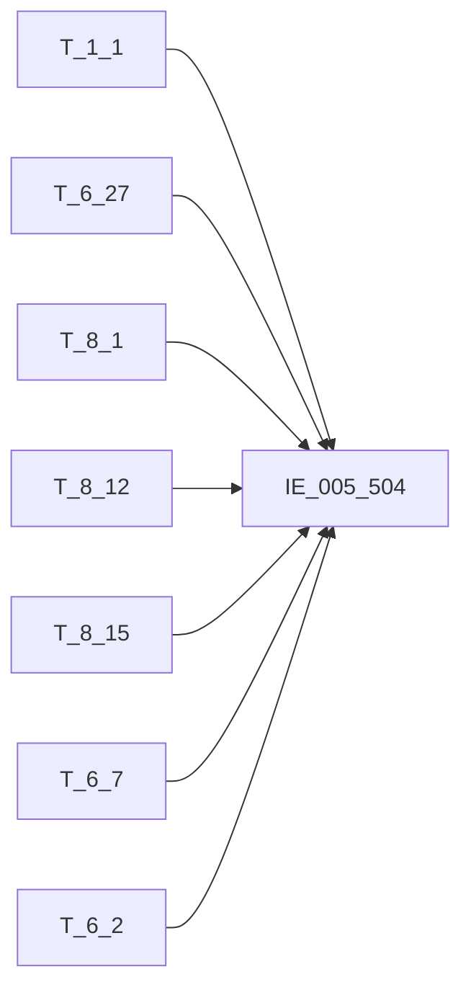

# 血缘-IE_005_504-对公信贷业务借据表-EAST5.0系统

## 页面边界

- 本页维护 `对公信贷业务借据表` 从一表通来源表到 EAST5.0 目标表 `IE_005_504` 的设计血缘。
- 证据为业务需求文档和工作区 GBase SQL 草案，尚未经过生产运行验证。
- 数据表字段定义见 [[数据表-IE_005_504-对公信贷业务借据表-EAST5.0系统]]；业务报送口径见 [[报表-IE_005_504-对公信贷业务借据表-EAST5.0系统]]。

## 系统边界

- 起始系统：一表通系统
- 目标系统：EAST5.0系统
- 是否跨系统血缘：是
- 目标对象：`IE_005_504` `对公信贷业务借据表`

## 业务链路摘要

- 按 `原始材料/业务需求/EAST5.0/031_对公信贷业务借据表.md` 的字段映射，将一表通来源表加工为 EAST5.0 `对公信贷业务借据表`。
- 表级规则：### 2.1 表级规则（Excel第 709 行） 取日期在当月且通过分户账号和币种关联贷款协议补充信息来筛选数据范围
- SQL 草案采用按 `P_DATA_DATE` 清理后重插或增量边界过滤的方式；具体投产方式待验证。

## 直接上游对象

- [[数据表-T_1_1-机构信息-一表通系统]]：一表通来源表。
- [[数据表-T_6_27-贷款协议补充信息-一表通系统]]：一表通来源表。
- [[数据表-T_8_1-贷款借据-一表通系统]]：一表通来源表。
- [[数据表-T_8_12-五级分类状态-一表通系统]]：一表通来源表。
- [[数据表-T_8_15-还款状态-一表通系统]]：一表通来源表。
- [[数据表-T_6_7-贷款展期协议-一表通系统]]：一表通来源表。
- [[数据表-T_6_2-贷款协议-一表通系统]]：一表通来源表。

## 直接下游对象

- 目标数据表：[[数据表-IE_005_504-对公信贷业务借据表-EAST5.0系统]]
- 报表业务口径页：[[报表-IE_005_504-对公信贷业务借据表-EAST5.0系统]]
- SQL 草案：`工作区/SQL开发/EAST5.0系统/PROC_EAST_IE_005_504_DGXDYWJJB_草案.sql`

## Nodes

- [[数据表-T_1_1-机构信息-一表通系统]]：一表通来源表。
- [[数据表-T_6_27-贷款协议补充信息-一表通系统]]：一表通来源表。
- [[数据表-T_8_1-贷款借据-一表通系统]]：一表通来源表。
- [[数据表-T_8_12-五级分类状态-一表通系统]]：一表通来源表。
- [[数据表-T_8_15-还款状态-一表通系统]]：一表通来源表。
- [[数据表-T_6_7-贷款展期协议-一表通系统]]：一表通来源表。
- [[数据表-T_6_2-贷款协议-一表通系统]]：一表通来源表。
- [[数据表-IE_005_504-对公信贷业务借据表-EAST5.0系统]]：EAST5.0 目标采集表。
- [[报表-IE_005_504-对公信贷业务借据表-EAST5.0系统]]：业务口径说明。

## 表级 Edge List

| From | To | Transform | Evidence |
| --- | --- | --- | --- |
| [[数据表-T_1_1-机构信息-一表通系统]] | [[数据表-IE_005_504-对公信贷业务借据表-EAST5.0系统]] | 字段映射、关联、过滤、码值/日期转换后装载 `IE_005_504` | [[来源-EAST5.0系统-IE_005_504-对公信贷业务借据表]]；SQL 草案 |
| [[数据表-T_6_27-贷款协议补充信息-一表通系统]] | [[数据表-IE_005_504-对公信贷业务借据表-EAST5.0系统]] | 字段映射、关联、过滤、码值/日期转换后装载 `IE_005_504` | [[来源-EAST5.0系统-IE_005_504-对公信贷业务借据表]]；SQL 草案 |
| [[数据表-T_8_1-贷款借据-一表通系统]] | [[数据表-IE_005_504-对公信贷业务借据表-EAST5.0系统]] | 字段映射、关联、过滤、码值/日期转换后装载 `IE_005_504` | [[来源-EAST5.0系统-IE_005_504-对公信贷业务借据表]]；SQL 草案 |
| [[数据表-T_8_12-五级分类状态-一表通系统]] | [[数据表-IE_005_504-对公信贷业务借据表-EAST5.0系统]] | 字段映射、关联、过滤、码值/日期转换后装载 `IE_005_504` | [[来源-EAST5.0系统-IE_005_504-对公信贷业务借据表]]；SQL 草案 |
| [[数据表-T_8_15-还款状态-一表通系统]] | [[数据表-IE_005_504-对公信贷业务借据表-EAST5.0系统]] | 字段映射、关联、过滤、码值/日期转换后装载 `IE_005_504` | [[来源-EAST5.0系统-IE_005_504-对公信贷业务借据表]]；SQL 草案 |
| [[数据表-T_6_7-贷款展期协议-一表通系统]] | [[数据表-IE_005_504-对公信贷业务借据表-EAST5.0系统]] | 字段映射、关联、过滤、码值/日期转换后装载 `IE_005_504` | [[来源-EAST5.0系统-IE_005_504-对公信贷业务借据表]]；SQL 草案 |
| [[数据表-T_6_2-贷款协议-一表通系统]] | [[数据表-IE_005_504-对公信贷业务借据表-EAST5.0系统]] | 字段映射、关联、过滤、码值/日期转换后装载 `IE_005_504` | [[来源-EAST5.0系统-IE_005_504-对公信贷业务借据表]]；SQL 草案 |

## 字段级 Edge List

| 源对象 | 源字段 | 目标对象 | 目标字段 | 处理逻辑 | 关系类型 | 证据 |
| --- | --- | --- | --- | --- | --- | --- |
| [[数据表-T_1_1-机构信息-一表通系统]] | `A010003` | [[数据表-IE_005_504-对公信贷业务借据表-EAST5.0系统]] | `JRXKZH` | 加工规则：用【贷款协议补充信息】.【机构ID】关联【机构信息】.【机构ID】，取【机构信息】.【金融许可证号】 | 加工映射 | [[来源-EAST5.0系统-IE_005_504-对公信贷业务借据表]]；SQL 草案 |
| [[数据表-T_6_27-贷款协议补充信息-一表通系统]] | `F270004` | [[数据表-IE_005_504-对公信贷业务借据表-EAST5.0系统]] | `NBJGH` | 加工规则：从【贷款协议补充信息】.【机构ID】第12位开始截取。 | 加工映射 | [[来源-EAST5.0系统-IE_005_504-对公信贷业务借据表]]；SQL 草案 |
| [[数据表-T_1_1-机构信息-一表通系统]] | `A010005` | [[数据表-IE_005_504-对公信贷业务借据表-EAST5.0系统]] | `YHJGMC` | 加工规则：用【贷款协议补充信息】.【机构ID】关联【机构信息】.【机构ID】，取【机构信息】.【银行机构名称】 | 加工映射 | [[来源-EAST5.0系统-IE_005_504-对公信贷业务借据表]]；SQL 草案 |
| [[数据表-T_6_27-贷款协议补充信息-一表通系统]] | `F270007` | [[数据表-IE_005_504-对公信贷业务借据表-EAST5.0系统]] | `MXKMBH` | 直接映射 | 直接映射 | [[来源-EAST5.0系统-IE_005_504-对公信贷业务借据表]]；SQL 草案 |
| [[数据表-T_6_27-贷款协议补充信息-一表通系统]] | `F270008` | [[数据表-IE_005_504-对公信贷业务借据表-EAST5.0系统]] | `MXKMMC` | 直接映射 | 直接映射 | [[来源-EAST5.0系统-IE_005_504-对公信贷业务借据表]]；SQL 草案 |
| [[数据表-T_6_27-贷款协议补充信息-一表通系统]] | `F270002` | [[数据表-IE_005_504-对公信贷业务借据表-EAST5.0系统]] | `KHTYBH` | 直接映射 | 直接映射 | [[来源-EAST5.0系统-IE_005_504-对公信贷业务借据表]]；SQL 草案 |
| 待确认 | `待确认` | [[数据表-IE_005_504-对公信贷业务借据表-EAST5.0系统]] | `KHMC` | 客户姓名 | 直接映射 | [[来源-EAST5.0系统-IE_005_504-对公信贷业务借据表]]；SQL 草案 |
| [[数据表-T_6_27-贷款协议补充信息-一表通系统]] | `F270003` | [[数据表-IE_005_504-对公信贷业务借据表-EAST5.0系统]] | `XDHTH` | 直接映射 | 直接映射 | [[来源-EAST5.0系统-IE_005_504-对公信贷业务借据表]]；SQL 草案 |
| [[数据表-T_6_27-贷款协议补充信息-一表通系统]] | `F270001` | [[数据表-IE_005_504-对公信贷业务借据表-EAST5.0系统]] | `XDJJH` | 直接映射 | 直接映射 | [[来源-EAST5.0系统-IE_005_504-对公信贷业务借据表]]；SQL 草案 |
| [[数据表-T_6_27-贷款协议补充信息-一表通系统]] | `F270005` | [[数据表-IE_005_504-对公信贷业务借据表-EAST5.0系统]] | `DKFHZH` | 直接映射 | 直接映射 | [[来源-EAST5.0系统-IE_005_504-对公信贷业务借据表]]；SQL 草案 |
| [[数据表-T_6_27-贷款协议补充信息-一表通系统]] | `F270025` | [[数据表-IE_005_504-对公信贷业务借据表-EAST5.0系统]] | `XDYWZL` | 代码转化：；若为'01'[流动资金贷款]，则赋值为'流动资金贷款'；；若为'02'[法人账户透支]，则赋值为'法人账户透支'；；若为'03'[项目贷款]，则赋值为'项目贷款'；；若为'04'[项目贷款（银团）]，则赋值为'项目贷款（银团）'；；若为'05'[一般固定资产贷款]，则赋值为'一般固定资产贷款'；；若为'06'[住房按揭贷款（公转商）]、'07'[住房按揭贷款（非公转商）]，则赋值为'住房按揭贷款'；；若为'08'[个人经营性... | 码值转换/格式转换 | [[来源-EAST5.0系统-IE_005_504-对公信贷业务借据表]]；SQL 草案 |
| [[数据表-T_6_27-贷款协议补充信息-一表通系统]] | `F270010` | [[数据表-IE_005_504-对公信贷业务借据表-EAST5.0系统]] | `DKFFLX` | 代码转化：；若为'01'[新增],则赋值为'新增';；若为'02'[借新还旧],则赋值为'借新还旧';；若为'03'[重组贷款],则赋值为'重组贷款';；若为'04'[无还本续贷],则赋值为'无还本续贷';；若为'00-自定义',则赋值为'其他-自定义'。 | 码值转换/格式转换 | [[来源-EAST5.0系统-IE_005_504-对公信贷业务借据表]]；SQL 草案 |
| [[数据表-T_6_27-贷款协议补充信息-一表通系统]] | `F270037` | [[数据表-IE_005_504-对公信贷业务借据表-EAST5.0系统]] | `FKFS` | 加工规则：；若【贷款协议补充信息】.【受托支付类型】为'01'[自主支付],则赋值为'自主支付';；若【贷款协议补充信息】.【受托支付类型】为'02'[受托支付],则赋值为'受托支付';；若【贷款协议补充信息】.【受托支付类型】为'03'[混合支付],则赋值为'混合支付';；若为'00-XX'，则赋值为'其他-XX'，其中'XX'为银行自定义。 | 加工映射 | [[来源-EAST5.0系统-IE_005_504-对公信贷业务借据表]]；SQL 草案 |
| [[数据表-T_6_27-贷款协议补充信息-一表通系统]] | `F270006` | [[数据表-IE_005_504-对公信贷业务借据表-EAST5.0系统]] | `BZ` | 直接映射 | 直接映射 | [[来源-EAST5.0系统-IE_005_504-对公信贷业务借据表]]；SQL 草案 |
| [[数据表-T_6_27-贷款协议补充信息-一表通系统]] | `F270009` | [[数据表-IE_005_504-对公信贷业务借据表-EAST5.0系统]] | `DKJE` | 直接映射 | 直接映射 | [[来源-EAST5.0系统-IE_005_504-对公信贷业务借据表]]；SQL 草案 |
| [[数据表-T_8_1-贷款借据-一表通系统]] | `H010010` | [[数据表-IE_005_504-对公信贷业务借据表-EAST5.0系统]] | `DKYE` | 直接映射：用【贷款协议补充信息】.【借据ID】关联【贷款借据】.【借据ID】，取【贷款借据】.【借款余额】。 | 直接映射 | [[来源-EAST5.0系统-IE_005_504-对公信贷业务借据表]]；SQL 草案 |
| [[数据表-T_8_12-五级分类状态-一表通系统]] | `H120005` | [[数据表-IE_005_504-对公信贷业务借据表-EAST5.0系统]] | `DKWJFL` | 代码转化：；用【贷款协议补充信息】.【借据ID】关联【五级分类状态】.【细分资产ID】（筛选【细分资产ID】不为空的数据，按【细分资产ID】分组按【调整日期】降序排序取第一条），取【五级分类状态】.【当前五级分类】进行代码转化：；若为'01'[正常],则赋值为'正常';；若为'02'[关注],则赋值为'关注';；若为'03'[次级],则赋值为'次级';；若为'04'[可疑],则赋值为'可疑';；若为'05'[损失],则赋值为'损失';；... | 码值转换/格式转换 | [[来源-EAST5.0系统-IE_005_504-对公信贷业务借据表]]；SQL 草案 |
| [[数据表-T_8_15-还款状态-一表通系统]] | `H150007` | [[数据表-IE_005_504-对公信贷业务借据表-EAST5.0系统]] | `ZQS` | 直接映射：用【贷款协议补充信息】.【借据ID】关联【还款状态】.【细分资产ID】（筛选【细分资产ID】不为空的数据），取【还款状态】.【计划还款期数】。 | 直接映射 | [[来源-EAST5.0系统-IE_005_504-对公信贷业务借据表]]；SQL 草案 |
| [[数据表-T_8_15-还款状态-一表通系统]] | `H150006` | [[数据表-IE_005_504-对公信贷业务借据表-EAST5.0系统]] | `DQQS` | 直接映射：用【贷款协议补充信息】.【借据ID】关联【还款状态】.【细分资产ID】（筛选【细分资产ID】不为空的数据），取【还款状态】.【本期还款期数】。 | 直接映射 | [[来源-EAST5.0系统-IE_005_504-对公信贷业务借据表]]；SQL 草案 |
| [[数据表-T_6_7-贷款展期协议-一表通系统]] | `F070003` | [[数据表-IE_005_504-对公信贷业务借据表-EAST5.0系统]] | `ZQCS` | 加工规则：用【贷款协议补充信息】.【借据ID】关联【贷款展期协议】.【借据ID】 (按【借据ID】分组汇总【展期次数】)，取按借据粒度汇总后的【贷款展期协议】.【展期次数】；若为空，则置0。 | 加工映射 | [[来源-EAST5.0系统-IE_005_504-对公信贷业务借据表]]；SQL 草案 |
| [[数据表-T_6_27-贷款协议补充信息-一表通系统]] | `F270016` | [[数据表-IE_005_504-对公信贷业务借据表-EAST5.0系统]] | `DKFFRQ` | 格式转换：转字符格式'YYYYMMDD'，若取不到或为空，则赋默认值99991231。 | 码值转换/格式转换 | [[来源-EAST5.0系统-IE_005_504-对公信贷业务借据表]]；SQL 草案 |
| [[数据表-T_6_27-贷款协议补充信息-一表通系统]] | `F270018` | [[数据表-IE_005_504-对公信贷业务借据表-EAST5.0系统]] | `DKDQRQ` | 格式转换：转字符格式'YYYYMMDD'，若取不到或为空，则赋默认值99991231。 | 码值转换/格式转换 | [[来源-EAST5.0系统-IE_005_504-对公信贷业务借据表]]；SQL 草案 |
| [[数据表-T_8_15-还款状态-一表通系统]] | `H150025` | [[数据表-IE_005_504-对公信贷业务借据表-EAST5.0系统]] | `ZJRQ` | 格式转换：用【贷款协议补充信息】.【借据ID】关联【还款状态】.【细分资产ID】（筛选【细分资产ID】不为空的数据），取【还款状态】.【终结日期】，转字符格式'YYYYMMDD'，若取不到或为空，则赋默认值99991231。 | 码值转换/格式转换 | [[来源-EAST5.0系统-IE_005_504-对公信贷业务借据表]]；SQL 草案 |
| [[数据表-T_8_15-还款状态-一表通系统]] | `H150020` | [[数据表-IE_005_504-对公信贷业务借据表-EAST5.0系统]] | `QBJE` | 直接映射：用【贷款协议补充信息】.【借据ID】关联【还款状态】.【细分资产ID】（筛选【细分资产ID】不为空的数据），取【还款状态】.【欠本金额】。 | 直接映射 | [[来源-EAST5.0系统-IE_005_504-对公信贷业务借据表]]；SQL 草案 |
| [[数据表-T_8_15-还款状态-一表通系统]] | `H150023` | [[数据表-IE_005_504-对公信贷业务借据表-EAST5.0系统]] | `QBRQ` | 格式转换：用【贷款协议补充信息】.【借据ID】关联【还款状态】.【细分资产ID】（筛选【细分资产ID】不为空的数据），取【还款状态】.【欠本日期】，转字符格式'YYYYMMDD'，若取不到或为空，则赋默认值99991231。 | 码值转换/格式转换 | [[来源-EAST5.0系统-IE_005_504-对公信贷业务借据表]]；SQL 草案 |
| [[数据表-T_8_15-还款状态-一表通系统]] | `H150021` | [[数据表-IE_005_504-对公信贷业务借据表-EAST5.0系统]] | `BNQXYE` | 直接映射：用【贷款协议补充信息】.【借据ID】关联【还款状态】.【细分资产ID】（筛选【细分资产ID】不为空的数据），取【还款状态】.【表内欠款利息】。 | 直接映射 | [[来源-EAST5.0系统-IE_005_504-对公信贷业务借据表]]；SQL 草案 |
| [[数据表-T_8_15-还款状态-一表通系统]] | `H150022` | [[数据表-IE_005_504-对公信贷业务借据表-EAST5.0系统]] | `BWQXYE` | 直接映射：用【贷款协议补充信息】.【借据ID】关联【还款状态】.【细分资产ID】（筛选【细分资产ID】不为空的数据），取【还款状态】.【表外欠款利息】。 | 直接映射 | [[来源-EAST5.0系统-IE_005_504-对公信贷业务借据表]]；SQL 草案 |
| [[数据表-T_8_15-还款状态-一表通系统]] | `H150024` | [[数据表-IE_005_504-对公信贷业务借据表-EAST5.0系统]] | `QXRQ` | 格式转换：用【贷款协议补充信息】.【借据ID】关联【还款状态】.【细分资产ID】（筛选【细分资产ID】不为空的数据），取【还款状态】.【欠息日期】，转字符格式'YYYYMMDD'，若取不到或为空，则赋默认值99991231。 | 码值转换/格式转换 | [[来源-EAST5.0系统-IE_005_504-对公信贷业务借据表]]；SQL 草案 |
| [[数据表-T_8_15-还款状态-一表通系统]] | `H150018` | [[数据表-IE_005_504-对公信贷业务借据表-EAST5.0系统]] | `LXQKQS` | 直接映射：用【贷款协议补充信息】.【借据ID】关联【还款状态】.【细分资产ID】（筛选【细分资产ID】不为空的数据），取【还款状态】.【连续欠款期数】。 | 直接映射 | [[来源-EAST5.0系统-IE_005_504-对公信贷业务借据表]]；SQL 草案 |
| [[数据表-T_8_15-还款状态-一表通系统]] | `H150019` | [[数据表-IE_005_504-对公信贷业务借据表-EAST5.0系统]] | `LJQKQS` | 直接映射：用【贷款协议补充信息】.【借据ID】关联【还款状态】.【细分资产ID】（筛选【细分资产ID】不为空的数据），取【还款状态】.【累计欠款期数】。 | 直接映射 | [[来源-EAST5.0系统-IE_005_504-对公信贷业务借据表]]；SQL 草案 |
| [[数据表-T_6_27-贷款协议补充信息-一表通系统]] | `F270067` | [[数据表-IE_005_504-对公信贷业务借据表-EAST5.0系统]] | `SBXDJJH` | 加工映射：取【贷款协议补充信息】.【上笔信贷借据号】截取前100位，为空置‘’ | 加工映射 | [[来源-EAST5.0系统-IE_005_504-对公信贷业务借据表]]；SQL 草案 |
| [[数据表-T_6_27-贷款协议补充信息-一表通系统]] | `F270011` | [[数据表-IE_005_504-对公信贷业务借据表-EAST5.0系统]] | `DKRZZH` | 直接映射 | 直接映射 | [[来源-EAST5.0系统-IE_005_504-对公信贷业务借据表]]；SQL 草案 |
| [[数据表-T_6_27-贷款协议补充信息-一表通系统]] | `F270012` | [[数据表-IE_005_504-对公信贷业务借据表-EAST5.0系统]] | `DKRZHM` | 直接映射 | 直接映射 | [[来源-EAST5.0系统-IE_005_504-对公信贷业务借据表]]；SQL 草案 |
| [[数据表-T_6_27-贷款协议补充信息-一表通系统]] | `F270013` | [[数据表-IE_005_504-对公信贷业务借据表-EAST5.0系统]] | `RZZHSSHMC` | 直接映射 | 直接映射 | [[来源-EAST5.0系统-IE_005_504-对公信贷业务借据表]]；SQL 草案 |
| [[数据表-T_6_27-贷款协议补充信息-一表通系统]] | `F270060` | [[数据表-IE_005_504-对公信贷业务借据表-EAST5.0系统]] | `LLLX` | 代码转化：；若为'02'[以LPR为定价基础],则赋值为'LPR';；否则赋值为'非LPR'。 | 码值转换/格式转换 | [[来源-EAST5.0系统-IE_005_504-对公信贷业务借据表]]；SQL 草案 |
| [[数据表-T_8_1-贷款借据-一表通系统]] | `H010021` | [[数据表-IE_005_504-对公信贷业务借据表-EAST5.0系统]] | `SJLL` | 直接映射：用【贷款协议补充信息】.【借据ID】关联【贷款借据】.【借据ID】，取【贷款借据】.【贷款利率】。 | 直接映射 | [[来源-EAST5.0系统-IE_005_504-对公信贷业务借据表]]；SQL 草案 |
| [[数据表-T_8_15-还款状态-一表通系统]] | `待确认` | [[数据表-IE_005_504-对公信贷业务借据表-EAST5.0系统]] | `HKFS` | 转换映射 | 直接映射 | [[来源-EAST5.0系统-IE_005_504-对公信贷业务借据表]]；SQL 草案 |
| [[数据表-T_6_27-贷款协议补充信息-一表通系统]] | `F270014` | [[数据表-IE_005_504-对公信贷业务借据表-EAST5.0系统]] | `HKZH` | 直接映射 | 直接映射 | [[来源-EAST5.0系统-IE_005_504-对公信贷业务借据表]]；SQL 草案 |
| [[数据表-T_6_27-贷款协议补充信息-一表通系统]] | `F270015` | [[数据表-IE_005_504-对公信贷业务借据表-EAST5.0系统]] | `HKZHSSHMC` | 直接映射 | 直接映射 | [[来源-EAST5.0系统-IE_005_504-对公信贷业务借据表]]；SQL 草案 |
| [[数据表-T_6_27-贷款协议补充信息-一表通系统]] | `F270059` | [[数据表-IE_005_504-对公信贷业务借据表-EAST5.0系统]] | `JXFS` | 代码转化：取【贷款协议补充信息】.【计息方式】进行码值转化：；若为'01'[按月结息],则赋值为'按月结息';；若为'02'[按季结息],则赋值为'按季结息';；若为'03'[按半年结息],则赋值为'按半年结息';；若为'04'[按年结息],则赋值为'按年结息';；若为'05'[不定期结息],则赋值为'不定期结息';；若为'06'[不记利息],则赋值为'不记利息';；若为'07'[利随本清],则赋值为'利随本清';；若为'00-XX',... | 码值转换/格式转换 | [[来源-EAST5.0系统-IE_005_504-对公信贷业务借据表]]；SQL 草案 |
| [[数据表-T_8_15-还款状态-一表通系统]] | `H150008` | [[数据表-IE_005_504-对公信贷业务借据表-EAST5.0系统]] | `XQHKRQ` | 格式转换：用【贷款协议补充信息】.【借据ID】关联【还款状态】.【细分资产ID】（筛选【细分资产ID】不为空的数据），取【还款状态】.【本期计划还款日期】，转字符格式'YYYYMMDD'，若取不到或为空，则赋默认值99991231。 | 码值转换/格式转换 | [[来源-EAST5.0系统-IE_005_504-对公信贷业务借据表]]；SQL 草案 |
| [[数据表-T_8_15-还款状态-一表通系统]] | `H150009` | [[数据表-IE_005_504-对公信贷业务借据表-EAST5.0系统]] | `XQYHBJ` | 直接映射：用【贷款协议补充信息】.【借据ID】关联【还款状态】.【细分资产ID】（筛选【细分资产ID】不为空的数据），取【还款状态】.【本期计划归还本金金额】。 | 直接映射 | [[来源-EAST5.0系统-IE_005_504-对公信贷业务借据表]]；SQL 草案 |
| [[数据表-T_8_15-还款状态-一表通系统]] | `H150010` | [[数据表-IE_005_504-对公信贷业务借据表-EAST5.0系统]] | `XQYHLX` | 直接映射：用【贷款协议补充信息】.【借据ID】关联【还款状态】.【细分资产ID】（筛选【细分资产ID】不为空的数据），取【还款状态】.【本期计划归还利息金额】。 | 直接映射 | [[来源-EAST5.0系统-IE_005_504-对公信贷业务借据表]]；SQL 草案 |
| [[数据表-T_6_27-贷款协议补充信息-一表通系统]] | `F270019` | [[数据表-IE_005_504-对公信贷业务借据表-EAST5.0系统]] | `JJDKYT` | 直接映射 | 直接映射 | [[来源-EAST5.0系统-IE_005_504-对公信贷业务借据表]]；SQL 草案 |
| [[数据表-T_6_27-贷款协议补充信息-一表通系统]] | `F270063` | [[数据表-IE_005_504-对公信贷业务借据表-EAST5.0系统]] | `DKTXDQ` | 直接映射 | 直接映射 | [[来源-EAST5.0系统-IE_005_504-对公信贷业务借据表]]；SQL 草案 |
| 待确认 | `待确认` | [[数据表-IE_005_504-对公信贷业务借据表-EAST5.0系统]] | `DKTXHY` | 行业类型（按贷款投向划分）\ | 直接映射 | [[来源-EAST5.0系统-IE_005_504-对公信贷业务借据表]]；SQL 草案 |
| [[数据表-T_6_27-贷款协议补充信息-一表通系统]] | `F270031` | [[数据表-IE_005_504-对公信贷业务借据表-EAST5.0系统]] | `SFHLWDK` | 代码转化：若为'1'[是],则赋值为'是';否则赋值为'否'。 | 码值转换/格式转换 | [[来源-EAST5.0系统-IE_005_504-对公信贷业务借据表]]；SQL 草案 |
| [[数据表-T_6_27-贷款协议补充信息-一表通系统]] | `F270040` | [[数据表-IE_005_504-对公信贷业务借据表-EAST5.0系统]] | `SFLSDK` | 加工规则：若【贷款协议补充信息】.【绿色融资类型】为空或全为0,则赋值为'否';否则赋值为'是'。 | 加工映射 | [[来源-EAST5.0系统-IE_005_504-对公信贷业务借据表]]；SQL 草案 |
| [[数据表-T_6_27-贷款协议补充信息-一表通系统]] | `F270042` | [[数据表-IE_005_504-对公信贷业务借据表-EAST5.0系统]] | `SFSNDK` | 代码转化：若为'1'[是],则赋值为'是';否则赋值为'否'。 | 码值转换/格式转换 | [[来源-EAST5.0系统-IE_005_504-对公信贷业务借据表]]；SQL 草案 |
| [[数据表-T_6_27-贷款协议补充信息-一表通系统]] | `F270046` | [[数据表-IE_005_504-对公信贷业务借据表-EAST5.0系统]] | `SFPHXSNDK` | 若【贷款协议补充信息】.【普惠型涉农贷款标识（大类）】为'01'[普惠型农户经营性贷款]或'02'[普惠型涉农小微企业法人贷款]，则赋值为'是'。 | 加工映射 | [[来源-EAST5.0系统-IE_005_504-对公信贷业务借据表]]；SQL 草案 |
| 待确认 | `待确认` | [[数据表-IE_005_504-对公信贷业务借据表-EAST5.0系统]] | `SFPHXXWQYDK` | 客户ID\ | 直接映射 | [[来源-EAST5.0系统-IE_005_504-对公信贷业务借据表]]；SQL 草案 |
| 待确认 | `待确认` | [[数据表-IE_005_504-对公信贷业务借据表-EAST5.0系统]] | `SFKJDK` | 科技企业类型 | 直接映射 | [[来源-EAST5.0系统-IE_005_504-对公信贷业务借据表]]；SQL 草案 |
| [[数据表-T_6_2-贷款协议-一表通系统]] | `F020058` | [[数据表-IE_005_504-对公信贷业务借据表-EAST5.0系统]] | `XDYGH` | 直接映射：用【贷款协议补充信息】.【协议ID】关联【贷款协议】.【协议ID】，取【贷款协议】.【管户员工ID】。 | 直接映射 | [[来源-EAST5.0系统-IE_005_504-对公信贷业务借据表]]；SQL 草案 |
| [[数据表-T_8_1-贷款借据-一表通系统]] | `H010019` | [[数据表-IE_005_504-对公信贷业务借据表-EAST5.0系统]] | `DKZT` | 代码转化：；用【贷款协议补充信息】.【借据ID】关联【贷款借据】.【借据ID】，取【贷款借据】.【贷款状态】进行代码转化：；若为'01'[正常],则赋值为'正常';；若为'02'[核销],则赋值为'核销';；若为'03'[转让],则赋值为'转让';；若为'04'[结清],则赋值为'结清';；若为'05'[逾期],则赋值为'逾期';；若为'00-XX',则赋值为'其他-XX'，其中'XX'为银行自定义。 | 码值转换/格式转换 | [[来源-EAST5.0系统-IE_005_504-对公信贷业务借据表]]；SQL 草案 |
| [[数据表-T_6_27-贷款协议补充信息-一表通系统]] | `F270068` | [[数据表-IE_005_504-对公信贷业务借据表-EAST5.0系统]] | `BBZ` | 加工映射：提取一表通《6.2贷款协议》、《6.7贷款展期协议》、《6.27贷款协议补充信息》、《8.1贷款借据》、《8.12五级分类状态》、《8.15还款状态》备注，以“;”拼接。 | 加工映射 | [[来源-EAST5.0系统-IE_005_504-对公信贷业务借据表]]；SQL 草案 |
| [[数据表-T_6_27-贷款协议补充信息-一表通系统]] | `F270069` | [[数据表-IE_005_504-对公信贷业务借据表-EAST5.0系统]] | `CJRQ` | 格式转换：格式转为'YYYYMMDD'。 | 码值转换/格式转换 | [[来源-EAST5.0系统-IE_005_504-对公信贷业务借据表]]；SQL 草案 |

## Graph-总览

## 回链检查

- 目标数据表页：已补 SQL 草案上游依赖摘要或待本次批处理补齐。
- 报表业务口径页：已创建或补充血缘回链。
- 一表通源表页：已补下游消费摘要或待本次批处理补齐。
- 当前字段级血缘基于业务需求和 SQL 草案，未运行验证，状态为待确认。

## 变更与冲突

- 本次为新增设计血缘或补齐草案血缘，不覆盖已验证生产血缘。
- 未发现需要将 `validated` 页面降级的情况；本页保持 `draft`。

## Open Questions

- GBase 草案中的复杂 JOIN、窗口去重、终态纳入和增量边界需要人工复核。
- 部分字段的码值 CASE 在草案中仍为待补，需要结合外部填报说明和跑数结果闭环。
- 外部监管实体页 wikilink 待补。

## 缺口字段（2026-05-04）

| 目标字段 | 字段名称 | 缺口说明 |
| --- | --- | --- |
| `KHLB` | 客户类别 | 本地 DDL 存在，但业务需求映射表和 SQL 草案未能确认来源，字段级血缘待补。 |
| `GSFZJG` | 归属分支机构 | 本地 DDL 存在，但业务需求映射表和 SQL 草案未能确认来源，字段级血缘待补。 |
| `SENSITIVEFLAG` | 涉密标志 | 本地 DDL 存在，但业务需求映射表和 SQL 草案未能确认来源，字段级血缘待补。 |
