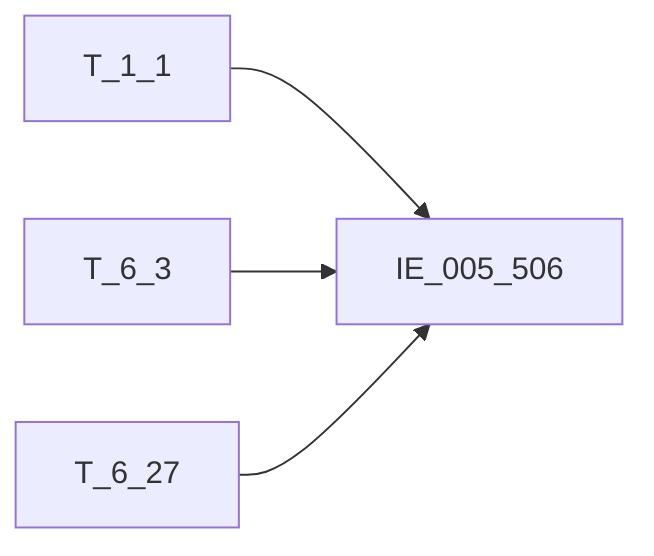

# 血缘-IE_005_506-项目贷款信息表-EAST5.0系统

## 页面边界

- 本页维护 `项目贷款信息表` 从一表通来源表到 EAST5.0 目标表 `IE_005_506` 的设计血缘。
- 证据为业务需求文档和工作区 GBase SQL 草案，尚未经过生产运行验证。
- 数据表字段定义见 [[数据表-IE_005_506-项目贷款信息表-EAST5.0系统]]；业务报送口径见 [[报表-IE_005_506-项目贷款信息表-EAST5.0系统]]。

## 系统边界

- 起始系统：一表通系统
- 目标系统：EAST5.0系统
- 是否跨系统血缘：是
- 目标对象：`IE_005_506` `项目贷款信息表`

## 业务链路摘要

- 按 `原始材料/业务需求/EAST5.0/033_项目贷款信息表.md` 的字段映射，将一表通来源表加工为 EAST5.0 `项目贷款信息表`。
- 表级规则：### 2.1 表级规则（Excel第 781 行） 取日期在当月且通过信贷合同号关联生成EAST对公信贷业务借据表，借据号关联贷款补充协议信息表来筛选范围
- SQL 草案采用按 `P_DATA_DATE` 清理后重插；具体投产方式待验证。
- **关联键已补齐（2026-05-06）**：
  - T_1_1 ↔ T_6_3：`A010001 = F030001`（机构ID）+ `A010020 = F030021`（采集日期）
  - T_6_3 ↔ T_6_27：`F030023 = F270001`（借据ID）+ `F030021 = F270069`（采集日期）

## 直接上游对象

- [[数据表-T_1_1-机构信息-一表通系统]]：一表通来源表。
- [[数据表-T_6_3-项目贷款协议-一表通系统]]：一表通来源表。
- [[数据表-T_6_27-贷款协议补充信息-一表通系统]]：一表通来源表。

## 直接下游对象

- 目标数据表：[[数据表-IE_005_506-项目贷款信息表-EAST5.0系统]]
- 报表业务口径页：[[报表-IE_005_506-项目贷款信息表-EAST5.0系统]]
- SQL 草案：`工作区/SQL开发/EAST5.0系统/PROC_EAST_IE_005_506_XMDKXXB_草案.sql`

## Nodes

- [[数据表-T_1_1-机构信息-一表通系统]]：一表通来源表。
- [[数据表-T_6_3-项目贷款协议-一表通系统]]：一表通来源表。
- [[数据表-T_6_27-贷款协议补充信息-一表通系统]]：一表通来源表。
- [[数据表-IE_005_506-项目贷款信息表-EAST5.0系统]]：EAST5.0 目标采集表。
- [[报表-IE_005_506-项目贷款信息表-EAST5.0系统]]：业务口径说明。

## 表级 Edge List

| From | To | Transform | Evidence |
| --- | --- | --- | --- |
| [[数据表-T_1_1-机构信息-一表通系统]] | [[数据表-IE_005_506-项目贷款信息表-EAST5.0系统]] | 字段映射、关联、过滤、码值/日期转换后装载 `IE_005_506` | [[来源-EAST5.0系统-IE_005_506-项目贷款信息表]]；SQL 草案 |
| [[数据表-T_6_3-项目贷款协议-一表通系统]] | [[数据表-IE_005_506-项目贷款信息表-EAST5.0系统]] | 字段映射、关联、过滤、码值/日期转换后装载 `IE_005_506` | [[来源-EAST5.0系统-IE_005_506-项目贷款信息表]]；SQL 草案 |
| [[数据表-T_6_27-贷款协议补充信息-一表通系统]] | [[数据表-IE_005_506-项目贷款信息表-EAST5.0系统]] | 字段映射、关联、过滤、码值/日期转换后装载 `IE_005_506` | [[来源-EAST5.0系统-IE_005_506-项目贷款信息表]]；SQL 草案 |

## 字段级 Edge List

| 源对象 | 源字段 | 目标对象 | 目标字段 | 处理逻辑 | 关系类型 | 证据 |
| --- | --- | --- | --- | --- | --- | --- |
| [[数据表-T_1_1-机构信息-一表通系统]] | `A010003` | [[数据表-IE_005_506-项目贷款信息表-EAST5.0系统]] | `JRXKZH` | 直接映射 | 直接映射 | [[来源-EAST5.0系统-IE_005_506-项目贷款信息表]]；SQL 草案 |
| [[数据表-T_1_1-机构信息-一表通系统]] | `A010005` | [[数据表-IE_005_506-项目贷款信息表-EAST5.0系统]] | `YHJGMC` | 直接映射 | 直接映射 | [[来源-EAST5.0系统-IE_005_506-项目贷款信息表]]；SQL 草案 |
| [[数据表-T_6_3-项目贷款协议-一表通系统]] | `F030001` | [[数据表-IE_005_506-项目贷款信息表-EAST5.0系统]] | `NBJGH` | 加工映射：SUBSTR(机构ID,12) | 加工映射 | [[来源-EAST5.0系统-IE_005_506-项目贷款信息表]]；SQL 草案 |
| [[数据表-T_6_3-项目贷款协议-一表通系统]] | `F030002` | [[数据表-IE_005_506-项目贷款信息表-EAST5.0系统]] | `XDHTH` | 直接映射 | 直接映射 | [[来源-EAST5.0系统-IE_005_506-项目贷款信息表]]；SQL 草案 |
| [[数据表-T_6_3-项目贷款协议-一表通系统]] | `F030023` | [[数据表-IE_005_506-项目贷款信息表-EAST5.0系统]] | `XDJJH` | 直接映射（借据ID） | 直接映射 | [[来源-EAST5.0系统-IE_005_506-项目贷款信息表]]；SQL 草案 |
| [[数据表-T_6_3-项目贷款协议-一表通系统]] | `F030003` | [[数据表-IE_005_506-项目贷款信息表-EAST5.0系统]] | `XMLX` | 加工映射：CASE码值转换（'01'→基础设施建设项目等） | 加工映射 | [[来源-EAST5.0系统-IE_005_506-项目贷款信息表]]；SQL 草案 |
| [[数据表-T_6_3-项目贷款协议-一表通系统]] | `F030004` | [[数据表-IE_005_506-项目贷款信息表-EAST5.0系统]] | `XMMC` | 直接映射 | 直接映射 | [[来源-EAST5.0系统-IE_005_506-项目贷款信息表]]；SQL 草案 |
| [[数据表-T_6_27-贷款协议补充信息-一表通系统]] | `F270039` | [[数据表-IE_005_506-项目贷款信息表-EAST5.0系统]] | `SFYT` | 加工映射：CASE码值转换（1→是，0→否） | 加工映射 | [[来源-EAST5.0系统-IE_005_506-项目贷款信息表]]；SQL 草案 |
| [[数据表-T_6_3-项目贷款协议-一表通系统]] | `F030005` | [[数据表-IE_005_506-项目贷款信息表-EAST5.0系统]] | `XMZTZ` | 加工映射：CAST+COALESCE，空值置0 | 加工映射 | [[来源-EAST5.0系统-IE_005_506-项目贷款信息表]]；SQL 草案 |
| [[数据表-T_6_3-项目贷款协议-一表通系统]] | `F030006` | [[数据表-IE_005_506-项目贷款信息表-EAST5.0系统]] | `XMZBJ` | 加工映射：CAST+COALESCE，空值置0 | 加工映射 | [[来源-EAST5.0系统-IE_005_506-项目贷款信息表]]；SQL 草案 |
| [[数据表-T_6_3-项目贷款协议-一表通系统]] | `F030007` | [[数据表-IE_005_506-项目贷款信息表-EAST5.0系统]] | `PWWH` | 加工映射：LEFT(批文文号,60) | 加工映射 | [[来源-EAST5.0系统-IE_005_506-项目贷款信息表]]；SQL 草案 |
| [[数据表-T_6_3-项目贷款协议-一表通系统]] | `F030008` | [[数据表-IE_005_506-项目贷款信息表-EAST5.0系统]] | `LXPW` | 加工映射：LEFT(立项批文,60) | 加工映射 | [[来源-EAST5.0系统-IE_005_506-项目贷款信息表]]；SQL 草案 |
| [[数据表-T_6_3-项目贷款协议-一表通系统]] | `F030009` | [[数据表-IE_005_506-项目贷款信息表-EAST5.0系统]] | `TDSYZBH` | 直接映射 | 直接映射 | [[来源-EAST5.0系统-IE_005_506-项目贷款信息表]]；SQL 草案 |
| [[数据表-T_6_3-项目贷款协议-一表通系统]] | `F030010` | [[数据表-IE_005_506-项目贷款信息表-EAST5.0系统]] | `TDSYZRQ` | 加工映射：DATE→yyyymmdd字符串 | 加工映射 | [[来源-EAST5.0系统-IE_005_506-项目贷款信息表]]；SQL 草案 |
| [[数据表-T_6_3-项目贷款协议-一表通系统]] | `F030011` | [[数据表-IE_005_506-项目贷款信息表-EAST5.0系统]] | `YDGHXKZBH` | 直接映射 | 直接映射 | [[来源-EAST5.0系统-IE_005_506-项目贷款信息表]]；SQL 草案 |
| [[数据表-T_6_3-项目贷款协议-一表通系统]] | `F030012` | [[数据表-IE_005_506-项目贷款信息表-EAST5.0系统]] | `YDGHXKZRQ` | 加工映射：DATE→yyyymmdd字符串 | 加工映射 | [[来源-EAST5.0系统-IE_005_506-项目贷款信息表]]；SQL 草案 |
| [[数据表-T_6_3-项目贷款协议-一表通系统]] | `F030015` | [[数据表-IE_005_506-项目贷款信息表-EAST5.0系统]] | `GCGHXKZBH` | 直接映射 | 直接映射 | [[来源-EAST5.0系统-IE_005_506-项目贷款信息表]]；SQL 草案 |
| [[数据表-T_6_3-项目贷款协议-一表通系统]] | `F030016` | [[数据表-IE_005_506-项目贷款信息表-EAST5.0系统]] | `GCGHXKZRQ` | 加工映射：DATE→yyyymmdd字符串 | 加工映射 | [[来源-EAST5.0系统-IE_005_506-项目贷款信息表]]；SQL 草案 |
| [[数据表-T_6_3-项目贷款协议-一表通系统]] | `F030013` | [[数据表-IE_005_506-项目贷款信息表-EAST5.0系统]] | `SGXKZBH` | 直接映射 | 直接映射 | [[来源-EAST5.0系统-IE_005_506-项目贷款信息表]]；SQL 草案 |
| [[数据表-T_6_3-项目贷款协议-一表通系统]] | `F030014` | [[数据表-IE_005_506-项目贷款信息表-EAST5.0系统]] | `SGXKZRQ` | 加工映射：DATE→yyyymmdd字符串 | 加工映射 | [[来源-EAST5.0系统-IE_005_506-项目贷款信息表]]；SQL 草案 |
| [[数据表-T_6_3-项目贷款协议-一表通系统]] | `F030017` | [[数据表-IE_005_506-项目贷款信息表-EAST5.0系统]] | `QTXKZ` | 加工映射：LEFT(其他许可证,150) | 加工映射 | [[来源-EAST5.0系统-IE_005_506-项目贷款信息表]]；SQL 草案 |
| [[数据表-T_6_3-项目贷款协议-一表通系统]] | `F030018` | [[数据表-IE_005_506-项目贷款信息表-EAST5.0系统]] | `QTXKZBH` | 直接映射 | 直接映射 | [[来源-EAST5.0系统-IE_005_506-项目贷款信息表]]；SQL 草案 |
| [[数据表-T_6_3-项目贷款协议-一表通系统]] | `F030019` | [[数据表-IE_005_506-项目贷款信息表-EAST5.0系统]] | `KGRQ` | 加工映射：DATE→yyyymmdd字符串 | 加工映射 | [[来源-EAST5.0系统-IE_005_506-项目贷款信息表]]；SQL 草案 |
| [[数据表-T_6_3-项目贷款协议-一表通系统]] | `F030020` | [[数据表-IE_005_506-项目贷款信息表-EAST5.0系统]] | `BBZ` | 加工映射：提取一表通《6.3项目贷款协议》备注。 | 加工映射 | [[来源-EAST5.0系统-IE_005_506-项目贷款信息表]]；SQL 草案 |
| [[数据表-T_6_3-项目贷款协议-一表通系统]] | `F030021` | [[数据表-IE_005_506-项目贷款信息表-EAST5.0系统]] | `CJRQ` | 加工映射：DATE→yyyymmdd字符串，默认P_DATA_DATE | 加工映射 | [[来源-EAST5.0系统-IE_005_506-项目贷款信息表]]；SQL 草案 |

## Graph-总览

## 回链检查

- 目标数据表页：已补 SQL 草案上游依赖摘要或待本次批处理补齐。
- 报表业务口径页：已创建或补充血缘回链。
- 一表通源表页：已补下游消费摘要或待本次批处理补齐。
- 当前字段级血缘基于业务需求和 SQL 草案，未运行验证，状态为待确认。

## 变更与冲突

- 本次为新增设计血缘或补齐草案血缘，不覆盖已验证生产血缘。
- 2026-05-06：JOIN 键已补齐（T_1_1↔T_6_3、T_6_3↔T_6_27），XDJJH 来源从"待确认"更新为 T_6_3.F030023，BZ/DKYE/JKRBH/JKRMC/DKJE/DKZT 缺口字段清单更新。
- 未发现需要将 `validated` 页面降级的情况；本页保持 `draft`。

## Open Questions

- GBase 草案中的终态纳入逻辑（结清/失效/终结）需结合贷款状态字段进一步精确化。
- 外部监管实体页 wikilink 待补。

## 缺口字段（2026-05-06）

| 目标字段 | 字段名称 | 缺口说明 |
| --- | --- | --- |
| `GSFZJG` | 归属分支机构 | 本地 DDL 存在，但业务需求映射表和 SQL 草案未能确认来源，字段级血缘待补。 |
| `SENSITIVEFLAG` | 涉密标志 | 本地 DDL 存在，但业务需求映射表和 SQL 草案未能确认来源，字段级血缘待补。 |
| `BZ` | 币种 | 业务需求标注来源为"EAST对公信贷业务借据表.币种"，该表不在当前可用源表中；暂置 NULL。 |
| `DKYE` | 贷款余额 | 业务需求标注来源为"EAST对公信贷业务借据表.贷款余额"，暂置 NULL。 |
| `JKRBH` | 借款人编号 | 业务需求标注来源为"EAST对公信贷业务借据表.客户统一编号"，暂置 NULL。 |
| `JKRMC` | 借款人名称 | 业务需求标注来源为"EAST对公信贷业务借据表.客户名称"，暂置 NULL。 |
| `DKJE` | 贷款金额 | 业务需求标注来源为"EAST对公信贷业务借据表.贷款金额"，暂置 NULL。 |
| `DKZT` | 贷款状态 | 业务需求标注来源为"EAST对公信贷业务借据表.贷款状态"，暂置 NULL。 |
