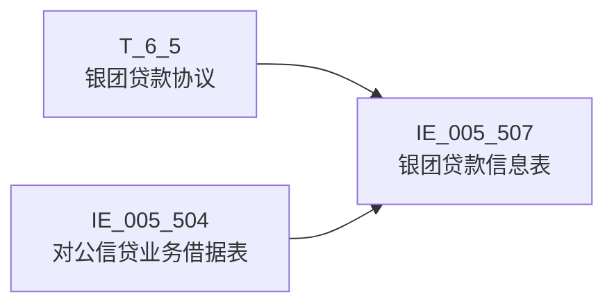

# 血缘-IE_005_507-银团贷款信息表-EAST5.0系统

## 页面边界

- 本页维护 `银团贷款信息表` 从一表通来源表和 EAST5.0 借据表到目标采集表 `IE_005_507` 的设计血缘。
- 证据为业务需求文档 `原始材料/业务需求/EAST5.0/034_银团贷款信息表.md` 和 GBase SQL 草案 `工作区/SQL开发/EAST5.0系统/PROC_EAST_IE_005_507_YTDKXXB_草案.sql`，尚未经过生产运行验证。
- 数据表字段定义见 [[数据表-IE_005_507-银团贷款信息表-EAST5.0系统]]；业务报送口径见 [[报表-IE_005_507-银团贷款信息表-EAST5.0系统]]。

## 系统边界

- 起始系统：一表通系统、EAST5.0系统（跨系统血缘）
- 目标系统：EAST5.0系统
- 目标对象：`IE_005_507` `银团贷款信息表`

## 业务链路摘要

- 按 `原始材料/业务需求/EAST5.0/034_银团贷款信息表.md` 的字段映射，将一表通来源表 `T_6_5`（银团贷款协议）和 EAST5.0 借据表 `IE_005_504`（对公信贷业务借据表）加工为 EAST5.0 `银团贷款信息表`。
- 表级规则：取日期在当月且通过信贷合同号关联生成 EAST 对公信贷业务借据表来筛选范围。
- SQL 草案采用按 `P_DATA_DATE` 清理后重插方式；具体投产方式待验证。
- 报送模式：全量表，截至采集日有效的数据 + 上一采集日至采集日期间结清/失效/终结等终态数据。

## 直接上游对象

- [[数据表-T_6_5-银团贷款协议-一表通系统]]：一表通来源表（银团贷款协议）。
- [[数据表-IE_005_504-对公信贷业务借据表-EAST5.0系统]]：EAST 对公信贷业务借据表（通过信贷合同号关联）。

## 直接下游对象

- 目标数据表：[[数据表-IE_005_507-银团贷款信息表-EAST5.0系统]]
- 报表业务口径页：[[报表-IE_005_507-银团贷款信息表-EAST5.0系统]]
- SQL 草案：`工作区/SQL开发/EAST5.0系统/PROC_EAST_IE_005_507_YTDKXXB_草案.sql`

## Nodes

- [[数据表-T_6_5-银团贷款协议-一表通系统]]：一表通来源表。
- [[数据表-IE_005_504-对公信贷业务借据表-EAST5.0系统]]：EAST 对公信贷业务借据表。
- [[数据表-IE_005_507-银团贷款信息表-EAST5.0系统]]：EAST5.0 目标采集表。
- [[报表-IE_005_507-银团贷款信息表-EAST5.0系统]]：业务口径说明。

## 表级 Edge List

| From | To | Transform | Evidence |
| --- | --- | --- | --- |
| [[数据表-T_6_5-银团贷款协议-一表通系统]] | [[数据表-IE_005_507-银团贷款信息表-EAST5.0系统]] | 字段映射、码值转换（YTCYLX）、日期格式转换（CJRQ）、金额字段按币种逻辑处理 | [[来源-EAST5.0系统-IE_005_507-银团贷款信息表]]；SQL 草案 |
| [[数据表-IE_005_504-对公信贷业务借据表-EAST5.0系统]] | [[数据表-IE_005_507-银团贷款信息表-EAST5.0系统]] | 通过信贷合同号（XDHTH）关联，取借据级字段：XDJJH、JKRMC、JKRBH、JJJE、JJYE、DKZT、NBJGH、JRXKZH、YHJGMC 等 | [[来源-EAST5.0系统-IE_005_507-银团贷款信息表]]；SQL 草案 |

## 字段级 Edge List

| 源对象 | 源字段 | 目标对象 | 目标字段 | 处理逻辑 | 关系类型 | 证据 |
| --- | --- | --- | --- | --- | --- | --- |
| [[数据表-T_6_5-银团贷款协议-一表通系统]] | `F050001`（协议ID） | [[数据表-IE_005_507-银团贷款信息表-EAST5.0系统]] | `XDHTH`（信贷合同号） | 直接映射；通过此字段关联 IE_005_504 | 直接映射 | SQL 草案；业务需求表第4行 |
| [[数据表-T_6_5-银团贷款协议-一表通系统]] | `F050014`（采集日期） | [[数据表-IE_005_507-银团贷款信息表-EAST5.0系统]] | `CJRQ`（采集日期） | 格式转换：date → yyyymmdd；过滤条件：当月范围 | 加工映射 | SQL 草案；业务需求表第24行 |
| [[数据表-T_6_5-银团贷款协议-一表通系统]] | `F050002`（牵头行行名） | [[数据表-IE_005_507-银团贷款信息表-EAST5.0系统]] | `QTHHM`（牵头行行名） | 直接映射 | 直接映射 | SQL 草案；业务需求表第9行 |
| [[数据表-T_6_5-银团贷款协议-一表通系统]] | `F050003`（牵头行行号） | [[数据表-IE_005_507-银团贷款信息表-EAST5.0系统]] | `QTHHH`（牵头行行号） | 直接映射 | 直接映射 | SQL 草案；业务需求表第8行 |
| [[数据表-T_6_5-银团贷款协议-一表通系统]] | `F050004`（参加行行名） | [[数据表-IE_005_507-银团贷款信息表-EAST5.0系统]] | `CJHHM`（参加行行名） | 直接映射 | 直接映射 | SQL 草案；业务需求表第11行 |
| [[数据表-T_6_5-银团贷款协议-一表通系统]] | `F050005`（参加行行号） | [[数据表-IE_005_507-银团贷款信息表-EAST5.0系统]] | `CJHHH`（参加行行号） | 直接映射 | 直接映射 | SQL 草案；业务需求表第10行 |
| [[数据表-T_6_5-银团贷款协议-一表通系统]] | `F050006`（代理行行名） | [[数据表-IE_005_507-银团贷款信息表-EAST5.0系统]] | `DLHHM`（代理行行名） | 直接映射 | 直接映射 | SQL 草案；业务需求表第13行 |
| [[数据表-T_6_5-银团贷款协议-一表通系统]] | `F050007`（代理行行号） | [[数据表-IE_005_507-银团贷款信息表-EAST5.0系统]] | `DLHHH`（代理行行号） | 直接映射 | 直接映射 | SQL 草案；业务需求表第12行 |
| [[数据表-T_6_5-银团贷款协议-一表通系统]] | `F050008`（银团成员类型） | [[数据表-IE_005_507-银团贷款信息表-EAST5.0系统]] | `YTCYLX`（银团成员类型） | 码值转换：'01'→'牵头行'/'02'→'代理行'/'03'→'参加行'/'00-XX'→'其他-XX'（XX为银行自定义）；多个类型用分号分隔 | 码值转换/格式转换 | SQL 草案；业务需求表第14行 |
| [[数据表-T_6_5-银团贷款协议-一表通系统]] | `F050013`（备注） | [[数据表-IE_005_507-银团贷款信息表-EAST5.0系统]] | `BBZ`（备注） | 直接映射；提取一表通《6.5银团贷款协议》备注 | 加工映射 | SQL 草案；业务需求表第23行 |
| [[数据表-T_6_5-银团贷款协议-一表通系统]] | `F050009`（银团贷款总金额） | [[数据表-IE_005_507-银团贷款信息表-EAST5.0系统]] | `YTDKZJE`（银团贷款总金额） | 按币种逻辑：BZ='BWB'则关联汇率折算，否则直接取 | 加工映射 | SQL 草案；业务需求表第16行 |
| [[数据表-T_6_5-银团贷款协议-一表通系统]] | `F050011`（已发放银团贷款金额） | [[数据表-IE_005_507-银团贷款信息表-EAST5.0系统]] | `YFFDKJE`（已发放银团贷款金额） | 按币种逻辑：BZ='BWB'则关联汇率折算，否则直接取 | 加工映射 | SQL 草案；业务需求表第17行 |
| [[数据表-T_6_5-银团贷款协议-一表通系统]] | `F050010`（承担贷款金额） | [[数据表-IE_005_507-银团贷款信息表-EAST5.0系统]] | `CDDKJE`（承担贷款金额） | 按币种逻辑：BZ='BWB'则关联汇率折算，否则直接取 | 加工映射 | SQL 草案；业务需求表第18行 |
| [[数据表-T_6_5-银团贷款协议-一表通系统]] | `F050015`（已发放承担银团贷款金额） | [[数据表-IE_005_507-银团贷款信息表-EAST5.0系统]] | `YFFCDDKJE`（已发放承担贷款金额） | 按币种逻辑：BZ='BWB'则关联汇率折算，否则直接取 | 加工映射 | SQL 草案；业务需求表第19行 |
| [[数据表-T_6_5-银团贷款协议-一表通系统]] | `F050017`（银团贷款总金额币种） | [[数据表-IE_005_507-银团贷款信息表-EAST5.0系统]] | `BZ`（币种） | 参与币种计算子查询：① F050017='BWB'→'BWB'；② 单借据且币种一致→F050017，否则'BWB'；③ 多借据且币种一致→F050017，否则'BWB' | 加工映射（派生） | SQL 草案；业务需求表第15行 |
| [[数据表-IE_005_504-对公信贷业务借据表-EAST5.0系统]] | `XDJJH`（信贷借据号） | [[数据表-IE_005_507-银团贷款信息表-EAST5.0系统]] | `XDJJH`（信贷借据号） | 直接映射；以借据为最小颗粒报送 | 直接映射 | SQL 草案；业务需求表第5行 |
| [[数据表-IE_005_504-对公信贷业务借据表-EAST5.0系统]] | `KHMC`（客户名称） | [[数据表-IE_005_507-银团贷款信息表-EAST5.0系统]] | `JKRMC`（借款人名称） | 直接映射；对私客户需隐私变形 | 直接映射 | SQL 草案；业务需求表第7行 |
| [[数据表-IE_005_504-对公信贷业务借据表-EAST5.0系统]] | `KHTYBH`（客户统一编号） | [[数据表-IE_005_507-银团贷款信息表-EAST5.0系统]] | `JKRBH`（借款人编号） | 直接映射；关联对公客户信息表.客户统一编号 | 直接映射 | SQL 草案；业务需求表第6行 |
| [[数据表-IE_005_504-对公信贷业务借据表-EAST5.0系统]] | `DKYE`（贷款余额） | [[数据表-IE_005_507-银团贷款信息表-EAST5.0系统]] | `JJYE`（借据余额） | 按币种逻辑：BZ='BWB'则按IE_005_504.BZ关联汇率利率表折算为人民币，否则直接取 | 加工映射 | SQL 草案；业务需求表第21行 |
| [[数据表-IE_005_504-对公信贷业务借据表-EAST5.0系统]] | `DKJE`（贷款金额） | [[数据表-IE_005_507-银团贷款信息表-EAST5.0系统]] | `JJJE`（借据金额） | 按币种逻辑：BZ='BWB'则按IE_005_504.BZ关联汇率利率表折算为人民币，否则直接取 | 加工映射 | SQL 草案；业务需求表第20行 |
| [[数据表-IE_005_504-对公信贷业务借据表-EAST5.0系统]] | `DKZT`（贷款状态） | [[数据表-IE_005_507-银团贷款信息表-EAST5.0系统]] | `DKZT`（贷款状态） | 直接映射；用于终态纳入判断（非'结清'/'核销'） | 直接映射 | SQL 草案；业务需求表第22行 |
| [[数据表-IE_005_504-对公信贷业务借据表-EAST5.0系统]] | `NBJGH`（内部机构号） | [[数据表-IE_005_507-银团贷款信息表-EAST5.0系统]] | `NBJGH`（内部机构号） | 直接映射；关联数据项：机构信息表.内部机构号 | 直接映射 | SQL 草案；业务需求表第2行 |
| [[数据表-IE_005_504-对公信贷业务借据表-EAST5.0系统]] | `JRXKZH`（金融许可证号） | [[数据表-IE_005_507-银团贷款信息表-EAST5.0系统]] | `JRXKZH`（金融许可证号） | 直接映射；营业机构、管理机构必须填报 | 直接映射 | SQL 草案；业务需求表第1行 |
| [[数据表-IE_005_504-对公信贷业务借据表-EAST5.0系统]] | `YHJGMC`（银行机构名称） | [[数据表-IE_005_507-银团贷款信息表-EAST5.0系统]] | `YHJGMC`（银行机构名称） | 直接映射；需填写全称，与金融许可证一致 | 直接映射 | SQL 草案；业务需求表第3行 |
| [[数据表-IE_005_504-对公信贷业务借据表-EAST5.0系统]] | `BZ`（币种） | [[数据表-IE_005_507-银团贷款信息表-EAST5.0系统]] | `BZ`（币种） | 参与币种计算子查询，判断合同下借据币种一致性；BZ='BWB'时作为汇率折算依据 | 加工映射（派生） | SQL 草案；业务需求表第15行 |
| [[数据表-IE_005_504-对公信贷业务借据表-EAST5.0系统]] | `ZJRQ`（终结日期） | [[数据表-IE_005_507-银团贷款信息表-EAST5.0系统]] | （过滤条件） | 用于终态纳入判断：ZJRQ >= 上一采集日 | 过滤条件 | SQL 草案 |
| — | （无来源） | [[数据表-IE_005_507-银团贷款信息表-EAST5.0系统]] | `GSFZJG`（归属分支机构） | 业务需求映射表未给来源，暂置 NULL | 缺口字段 | SQL 草案；业务需求表无对应行 |
| — | （无来源） | [[数据表-IE_005_507-银团贷款信息表-EAST5.0系统]] | `JKRKHLB`（借款人客户类别） | 业务需求映射表未给来源，暂置 NULL | 缺口字段 | SQL 草案；业务需求表无对应行 |
| — | （无来源） | [[数据表-IE_005_507-银团贷款信息表-EAST5.0系统]] | `SENSITIVEFLAG`（涉密标志） | 业务需求映射表未给来源，暂置 NULL | 缺口字段 | SQL 草案；业务需求表无对应行 |

## Graph-总览

## 关联键说明

| 关联方向 | 关联字段 | 业务含义 |
| --- | --- | --- |
| T_6_5 → IE_005_504 | `F050001 = XDHTH`（协议ID = 信贷合同号） | 通过信贷合同号关联银团协议与借据明细 |
| IE_005_504 子查询 → T_6_5 | `j2.XDHTH = t2.F050001` | 币种一致性计算：统计同一合同下借据币种是否一致 |

## 过滤条件说明

| 条件 | 来源表 | 字段 | 逻辑 |
| --- | --- | --- | --- |
| 当月范围 | T_6_5 | `F050014`（采集日期） | >= 当月首日 AND < 下月首日 |
| 有效数据 | IE_005_504 | `DKZT`（贷款状态） | 非'结清'/'核销' |
| 终态纳入 | IE_005_504 | `ZJRQ`（终结日期） | ZJRQ >= 上一采集日 |

## 回链检查

- 目标数据表页：已补 SQL 草案上游依赖摘要。
- 报表业务口径页：已创建或补充血缘回链。
- 一表通源表页（T_6_5）：已补下游消费摘要。
- IE_005_504 源表页：已补下游消费摘要。
- 当前字段级血缘基于业务需求和 SQL 草案，未运行验证，状态为 `draft`。

## 变更与冲突

- 2026-05-06：依据原始业务需求《034_银团贷款信息表.md》全面修订，补齐 IE_005_504 关联和全部字段级血缘边；修订 YTCYLX 码值（增加'00-XX'→其他）、BZ 派生逻辑（三场景）、金额字段汇率折算依据、JKRMC/JKRBH/NBJGH/JRXKZH/YHJGMC 关联说明。
- 2026-05-06：依据原始业务需求《034_银团贷款信息表.md》修订，确认 IE_005_504 关联和全部字段级血缘边。
- 未发现需要将 `validated` 页面降级的情况；本页保持 `draft`。

## Open Questions

- GBase 草案中的汇率利率表关联逻辑待确认（BZ='BWB'时的折算，2026-05-06 依据业务需求文档已明确折算规则，但汇率表来源仍需确认）。
- 部分缺口字段（GSFZJG、JKRKHLB、SENSITIVEFLAG）需确认是否为监管必报。
- IE_005_504 的 DKZT 码值全集需结合外部填报说明确认终态判断条件。
- T_6_5 的 F050017（银团贷款总金额币种）码值全集待确认。
- 外部监管实体页 wikilink 待补。

## 缺口字段（2026-05-06）

| 目标字段 | 字段名称 | 缺口说明 |
| --- | --- | --- |
| `GSFZJG` | 归属分支机构 | 本地 DDL 存在，但业务需求映射表和 SQL 草案未能确认来源。 |
| `JKRKHLB` | 借款人客户类别 | 本地 DDL 存在，但业务需求映射表和 SQL 草案未能确认来源。 |
| `SENSITIVEFLAG` | 涉密标志 | 本地 DDL 存在，但业务需求映射表和 SQL 草案未能确认来源。 |
