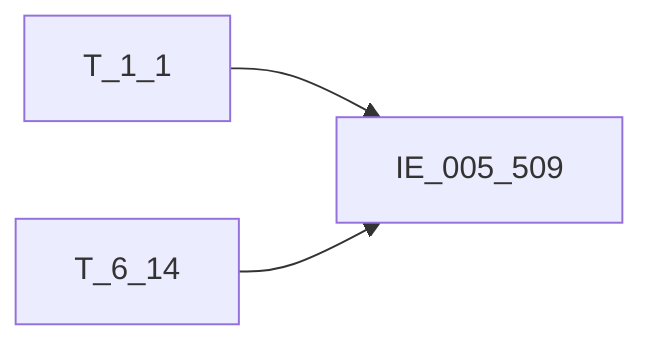

# 血缘-IE_005_509-票据转贴现表-EAST5.0系统

## 页面边界

- 本页维护 `票据转贴现表` 从一表通来源表到 EAST5.0 目标表 `IE_005_509` 的设计血缘。
- 证据为业务需求文档和工作区 GBase SQL 草案，尚未经过生产运行验证。
- 数据表字段定义见 [[数据表-IE_005_509-票据转贴现表-EAST5.0系统]]；业务报送口径见 [[报表-IE_005_509-票据转贴现表-EAST5.0系统]]。

## 系统边界

- 起始系统：一表通系统
- 目标系统：EAST5.0系统
- 是否跨系统血缘：是
- 目标对象：`IE_005_509` `票据转贴现表`

## 业务链路摘要

- 按 `原始材料/业务需求/EAST5.0/036_票据转贴现表.md` 的字段映射，将一表通来源表加工为 EAST5.0 `票据转贴现表`。
- 表级规则：### 2.1 表级规则（Excel第 864 行） 取日期在当月且剔除上月状态为失效的数据
- SQL 草案采用按 `P_DATA_DATE` 清理后重插或增量边界过滤的方式；具体投产方式待验证。

## 直接上游对象

- [[数据表-T_1_1-机构信息-一表通系统]]：一表通来源表。
- [[数据表-T_6_14-票据转贴现协议-一表通系统]]：一表通来源表。

## 直接下游对象

- 目标数据表：[[数据表-IE_005_509-票据转贴现表-EAST5.0系统]]
- 报表业务口径页：[[报表-IE_005_509-票据转贴现表-EAST5.0系统]]
- SQL 草案：`工作区/SQL开发/EAST5.0系统/PROC_EAST_IE_005_509_PJZTXB_草案.sql`

## Nodes

- [[数据表-T_1_1-机构信息-一表通系统]]：一表通来源表。
- [[数据表-T_6_14-票据转贴现协议-一表通系统]]：一表通来源表。
- [[数据表-IE_005_509-票据转贴现表-EAST5.0系统]]：EAST5.0 目标采集表。
- [[报表-IE_005_509-票据转贴现表-EAST5.0系统]]：业务口径说明。

## 表级 Edge List

| From | To | Transform | Evidence |
| --- | --- | --- | --- |
| [[数据表-T_1_1-机构信息-一表通系统]] | [[数据表-IE_005_509-票据转贴现表-EAST5.0系统]] | 字段映射、关联、过滤、码值/日期转换后装载 `IE_005_509` | [[来源-EAST5.0系统-IE_005_509-票据转贴现表]]；SQL 草案 |
| [[数据表-T_6_14-票据转贴现协议-一表通系统]] | [[数据表-IE_005_509-票据转贴现表-EAST5.0系统]] | 字段映射、关联、过滤、码值/日期转换后装载 `IE_005_509` | [[来源-EAST5.0系统-IE_005_509-票据转贴现表]]；SQL 草案 |

## 字段级 Edge List

| 源对象 | 源字段 | 目标对象 | 目标字段 | 处理逻辑 | 关系类型 | 证据 |
| --- | --- | --- | --- | --- | --- | --- |
| [[数据表-T_1_1-机构信息-一表通系统]] | `A010003` | [[数据表-IE_005_509-票据转贴现表-EAST5.0系统]] | `JRXKZH` | 直接映射 | 直接映射 | [[来源-EAST5.0系统-IE_005_509-票据转贴现表]]；SQL 草案 |
| [[数据表-T_6_14-票据转贴现协议-一表通系统]] | `F140002` | [[数据表-IE_005_509-票据转贴现表-EAST5.0系统]] | `NBJGH` | 加工映射：SUBSTR(机构ID,12) | 加工映射 | [[来源-EAST5.0系统-IE_005_509-票据转贴现表]]；SQL 草案 |
| [[数据表-T_1_1-机构信息-一表通系统]] | `A010005` | [[数据表-IE_005_509-票据转贴现表-EAST5.0系统]] | `YHJGMC` | 直接映射 | 直接映射 | [[来源-EAST5.0系统-IE_005_509-票据转贴现表]]；SQL 草案 |
| [[数据表-T_6_14-票据转贴现协议-一表通系统]] | `F140001` | [[数据表-IE_005_509-票据转贴现表-EAST5.0系统]] | `XDHTH` | 直接映射 | 直接映射 | [[来源-EAST5.0系统-IE_005_509-票据转贴现表]]；SQL 草案 |
| [[数据表-T_6_14-票据转贴现协议-一表通系统]] | `F140037` | [[数据表-IE_005_509-票据转贴现表-EAST5.0系统]] | `XDJJH` | 直接映射 | 直接映射 | [[来源-EAST5.0系统-IE_005_509-票据转贴现表]]；SQL 草案 |
| [[数据表-T_6_14-票据转贴现协议-一表通系统]] | `F140003` | [[数据表-IE_005_509-票据转贴现表-EAST5.0系统]] | `PJHM` | 直接映射 | 直接映射 | [[来源-EAST5.0系统-IE_005_509-票据转贴现表]]；SQL 草案 |
| [[数据表-T_6_14-票据转贴现协议-一表通系统]] | `F140004` | [[数据表-IE_005_509-票据转贴现表-EAST5.0系统]] | `PJLX` | 加工映射：CASE WHEN T1.票据类型 = '01' THEN '银行承兑汇票'； WHEN T1.票据类型 = '02' THEN '商业承兑汇票'； WHEN T1.票据类型 = '03' THEN '财务公司承兑汇票'； ELSE '' END | 加工映射 | [[来源-EAST5.0系统-IE_005_509-票据转贴现表]]；SQL 草案 |
| [[数据表-T_6_14-票据转贴现协议-一表通系统]] | `F140005` | [[数据表-IE_005_509-票据转贴现表-EAST5.0系统]] | `BZ` | 直接映射 | 直接映射 | [[来源-EAST5.0系统-IE_005_509-票据转贴现表]]；SQL 草案 |
| [[数据表-T_6_14-票据转贴现协议-一表通系统]] | `F140006` | [[数据表-IE_005_509-票据转贴现表-EAST5.0系统]] | `PMJE` | 直接映射 | 直接映射 | [[来源-EAST5.0系统-IE_005_509-票据转贴现表]]；SQL 草案 |
| [[数据表-T_6_14-票据转贴现协议-一表通系统]] | `F140007` | [[数据表-IE_005_509-票据转贴现表-EAST5.0系统]] | `PJCPRQ` | 加工映射：日期转YYYYMMDD格式 | 加工映射 | [[来源-EAST5.0系统-IE_005_509-票据转贴现表]]；SQL 草案 |
| [[数据表-T_6_14-票据转贴现协议-一表通系统]] | `F140008` | [[数据表-IE_005_509-票据转贴现表-EAST5.0系统]] | `PJDQRQ` | 加工映射：日期转YYYYMMDD格式 | 加工映射 | [[来源-EAST5.0系统-IE_005_509-票据转贴现表]]；SQL 草案 |
| [[数据表-T_6_14-票据转贴现协议-一表通系统]] | `F140009` | [[数据表-IE_005_509-票据转贴现表-EAST5.0系统]] | `CPRMC` | 直接映射 | 直接映射 | [[来源-EAST5.0系统-IE_005_509-票据转贴现表]]；SQL 草案 |
| [[数据表-T_6_14-票据转贴现协议-一表通系统]] | `F140010` | [[数据表-IE_005_509-票据转贴现表-EAST5.0系统]] | `CDRMC` | 直接映射 | 直接映射 | [[来源-EAST5.0系统-IE_005_509-票据转贴现表]]；SQL 草案 |
| [[数据表-T_6_14-票据转贴现协议-一表通系统]] | `F140011` | [[数据表-IE_005_509-票据转贴现表-EAST5.0系统]] | `TXRMC` | 直接映射 | 直接映射 | [[来源-EAST5.0系统-IE_005_509-票据转贴现表]]；SQL 草案 |
| [[数据表-T_6_14-票据转贴现协议-一表通系统]] | `F140012` | [[数据表-IE_005_509-票据转贴现表-EAST5.0系统]] | `TXRQ` | 加工映射：日期转YYYYMMDD格式 | 加工映射 | [[来源-EAST5.0系统-IE_005_509-票据转贴现表]]；SQL 草案 |
| [[数据表-T_6_14-票据转贴现协议-一表通系统]] | `F140013` | [[数据表-IE_005_509-票据转贴现表-EAST5.0系统]] | `JYFX` | 代码转化：CASE WHEN T1.JYFX = '01' THEN '买入'； WHEN T1.JYFX = '02' THEN '卖出'； ELSE '' END | 码值转换/格式转换 | [[来源-EAST5.0系统-IE_005_509-票据转贴现表]]；SQL 草案 |
| [[数据表-T_6_14-票据转贴现协议-一表通系统]] | `F140014` | [[数据表-IE_005_509-票据转贴现表-EAST5.0系统]] | `ZTXLB` | 代码转化：CASE WHEN T1.F140014 = '01' THEN '转贴现买断'； WHEN T1.F140014 = '02' THEN '转贴现卖断'； WHEN T1.F140014 = '03' THEN '质押式回购正回购'； WHEN T1.F140014 = '04' THEN '质押式回购逆回购'； WHEN T1.F140014 = '05' THEN '买断式回购正回购'； WHEN T1.F140014 = '06' THEN '买断式回购逆回购'； WHEN T1.F140014 = '07' THEN '再贴现'； ELSE '' END | 码值转换/格式转换 | [[来源-EAST5.0系统-IE_005_509-票据转贴现表]]；SQL 草案 |
| [[数据表-T_6_14-票据转贴现协议-一表通系统]] | `F140017` | [[数据表-IE_005_509-票据转贴现表-EAST5.0系统]] | `ZTXRQ` | 加工映射：日期转YYYYMMDD格式 | 加工映射 | [[来源-EAST5.0系统-IE_005_509-票据转贴现表]]；SQL 草案 |
| [[数据表-T_6_14-票据转贴现协议-一表通系统]] | `F140018` | [[数据表-IE_005_509-票据转贴现表-EAST5.0系统]] | `ZTXJE` | 直接映射 | 直接映射 | [[来源-EAST5.0系统-IE_005_509-票据转贴现表]]；SQL 草案 |
| [[数据表-T_6_14-票据转贴现协议-一表通系统]] | `F140019` | [[数据表-IE_005_509-票据转贴现表-EAST5.0系统]] | `ZTXJXTS` | 直接映射 | 直接映射 | [[来源-EAST5.0系统-IE_005_509-票据转贴现表]]；SQL 草案 |
| [[数据表-T_6_14-票据转贴现协议-一表通系统]] | `F140020` | [[数据表-IE_005_509-票据转贴现表-EAST5.0系统]] | `ZTXLL` | 直接映射 | 直接映射 | [[来源-EAST5.0系统-IE_005_509-票据转贴现表]]；SQL 草案 |
| [[数据表-T_6_14-票据转贴现协议-一表通系统]] | `F140021` | [[数据表-IE_005_509-票据转贴现表-EAST5.0系统]] | `ZTXLX` | 直接映射 | 直接映射 | [[来源-EAST5.0系统-IE_005_509-票据转贴现表]]；SQL 草案 |
| [[数据表-T_6_14-票据转贴现协议-一表通系统]] | `F140022` | [[数据表-IE_005_509-票据转贴现表-EAST5.0系统]] | `HGRQ` | 加工映射：日期转YYYYMMDD格式 | 加工映射 | [[来源-EAST5.0系统-IE_005_509-票据转贴现表]]；SQL 草案 |
| [[数据表-T_6_14-票据转贴现协议-一表通系统]] | `F140023` | [[数据表-IE_005_509-票据转贴现表-EAST5.0系统]] | `HGJE` | 直接映射 | 直接映射 | [[来源-EAST5.0系统-IE_005_509-票据转贴现表]]；SQL 草案 |
| [[数据表-T_6_14-票据转贴现协议-一表通系统]] | `F140024` | [[数据表-IE_005_509-票据转贴现表-EAST5.0系统]] | `HGLV` | 直接映射 | 直接映射 | [[来源-EAST5.0系统-IE_005_509-票据转贴现表]]；SQL 草案 |
| [[数据表-T_6_14-票据转贴现协议-一表通系统]] | `F140025` | [[数据表-IE_005_509-票据转贴现表-EAST5.0系统]] | `HGLX` | 直接映射 | 直接映射 | [[来源-EAST5.0系统-IE_005_509-票据转贴现表]]；SQL 草案 |
| [[数据表-T_6_14-票据转贴现协议-一表通系统]] | `F140026` | [[数据表-IE_005_509-票据转贴现表-EAST5.0系统]] | `JYDSMC` | 直接映射 | 直接映射 | [[来源-EAST5.0系统-IE_005_509-票据转贴现表]]；SQL 草案 |
| [[数据表-T_6_14-票据转贴现协议-一表通系统]] | `F140027` | [[数据表-IE_005_509-票据转贴现表-EAST5.0系统]] | `JYDSHH` | 直接映射 | 直接映射 | [[来源-EAST5.0系统-IE_005_509-票据转贴现表]]；SQL 草案 |
| [[数据表-T_6_14-票据转贴现协议-一表通系统]] | `F140033` | [[数据表-IE_005_509-票据转贴现表-EAST5.0系统]] | `PJZT` | 代码转化：CASE WHEN T1.PJZT = '01' THEN '正常'； WHEN T1.PJZT = '02' THEN '卖断'； WHEN T1.PJZT = '03' THEN '解付'； WHEN T1.PJZT = '04' THEN '垫款'； WHEN T1.PJZT = '05' THEN '核销'； WHEN T1.PJZT = '00-XX' THEN '其他-XX；XX为银行自定义 | 码值转换/格式转换 | [[来源-EAST5.0系统-IE_005_509-票据转贴现表]]；SQL 草案 |
| [[数据表-T_6_14-票据转贴现协议-一表通系统]] | `F140034` | [[数据表-IE_005_509-票据转贴现表-EAST5.0系统]] | `BBZ` | 提取一表通《表6.14票据转贴现协议》备注，以“;”拼接。 | 加工映射 | [[来源-EAST5.0系统-IE_005_509-票据转贴现表]]；SQL 草案 |
| [[数据表-T_6_14-票据转贴现协议-一表通系统]] | `F140035` | [[数据表-IE_005_509-票据转贴现表-EAST5.0系统]] | `CJRQ` | 加工映射：日期转YYYYMMDD格式 | 加工映射 | [[来源-EAST5.0系统-IE_005_509-票据转贴现表]]；SQL 草案 |

## Graph-总览

## 回链检查

- 目标数据表页：已更新 SQL 草案上游依赖摘要（2026-05-08 重构校准）。
- 报表业务口径页：已创建或补充血缘回链。
- 一表通源表页：已补下游消费摘要。
- 当前字段级血缘基于业务需求和 SQL 草案，未运行验证，状态为待确认。
- 2026-05-08 重构校准：`ZTXLB` 来源字段从"待确认"更新为 `T_6_14.F140014`（转贴现类型），JOIN 键、码值 CASE、日期转换、WHERE 过滤均已实现。

## 变更与冲突

- 本次为新增设计血缘或补齐草案血缘，不覆盖已验证生产血缘。
- 未发现需要将 `validated` 页面降级的情况；本页保持 `draft`。

## Open Questions

- GBase 草案中表级规则"剔除上月状态为失效的数据"仅按采集日期过滤代理，终态纳入规则待需求方确认。
- 3 个码值 CASE 转换（PJLX、JYFX、PJZT）和 1 个 ZTXLB 码值转换已实现，需结合外部填报说明和跑数结果闭环验证。
- 外部监管实体页 wikilink 待补。
- `SENSITIVEFLAG`（涉密标志）和 `GSFZJG`（归属分支机构）无映射来源，SQL 中置 NULL。

## 缺口字段（2026-05-04）

| 目标字段 | 字段名称 | 缺口说明 |
| --- | --- | --- |
| `SENSITIVEFLAG` | 涉密标志 | 本地 DDL 存在，但业务需求映射表和 SQL 草案未能确认来源，字段级血缘待补。 |
| `GSFZJG` | 归属分支机构 | 本地 DDL 存在，但业务需求映射表和 SQL 草案未能确认来源，字段级血缘待补。 |
