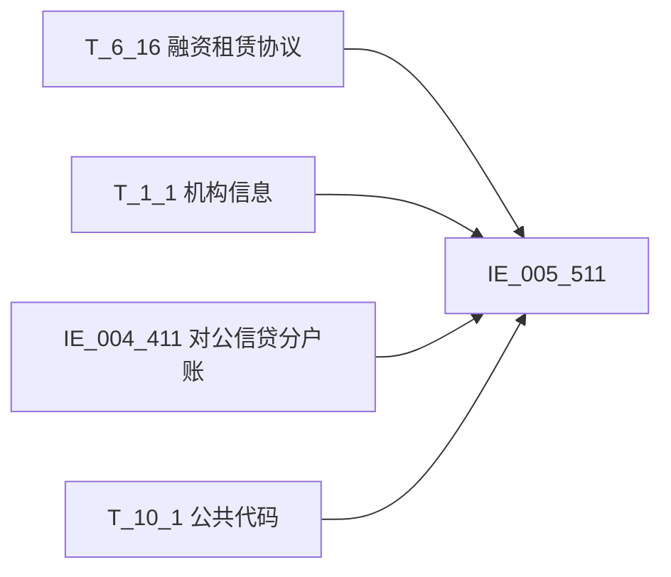

# 血缘-IE_005_511-融资租赁业务表-EAST5.0系统

## 页面边界

- 本页维护 `融资租赁业务表` 从一表通来源表到 EAST5.0 目标表 `IE_005_511` 的设计血缘。
- 证据为业务需求文档和工作区 GBase SQL 草案，尚未经过生产运行验证。
- 数据表字段定义见 [[数据表-IE_005_511-融资租赁业务表-EAST5.0系统]]；业务报送口径见 [[报表-IE_005_511-融资租赁业务表-EAST5.0系统]]。
- 2026-05-08 重构校准后，所有 28 个业务需求字段的字段级血缘已闭环；4 个缺口字段（SENSITIVEFLAG/CZRKHLB/GSFZJG/XDJJH）标记为待补。

## 系统边界

- 起始系统：一表通系统
- 目标系统：EAST5.0系统
- 是否跨系统血缘：是
- 目标对象：`IE_005_511` `融资租赁业务表`

## 业务链路摘要

- 按 `原始材料/业务需求/EAST5.0/038_融资租赁业务表.md` 的字段映射，将一表通来源表加工为 EAST5.0 `融资租赁业务表`。
- 表级规则：取日期在当月且通过信贷合同号关联 EAST 对公信贷分户账来筛选范围。
- SQL 草案采用按 `P_DATA_DATE` 清理后重插方式；WHERE 过滤 `src.F160028 = V_DATA_DATE`（当月采集日期）。

## 直接上游对象

- [[数据表-T_6_16-融资租赁协议-一表通系统]]：一表通主表，23 个字段来源。
- [[数据表-T_1_1-机构信息-一表通系统]]：一表通维表，2 个字段来源（JRXKZH/YHJGMC）。
- [[数据表-IE_004_411-对公信贷分户账-EAST5.0系统]]：EAST 内部表，2 个字段来源（DKZT/XYZYE）。
- [[数据表-T_10_1-公共代码-一表通系统]]：一表通码值表，1 个字段来源（ZLGSZJLB）。

## 直接下游对象

- 目标数据表：[[数据表-IE_005_511-融资租赁业务表-EAST5.0系统]]
- 报表业务口径页：[[报表-IE_005_511-融资租赁业务表-EAST5.0系统]]
- SQL 草案：`工作区/SQL开发/EAST5.0系统/PROC_EAST_IE_005_511_RZZLYWB_草案.sql`

## Nodes

- [[数据表-T_6_16-融资租赁协议-一表通系统]]：一表通主表。
- [[数据表-T_1_1-机构信息-一表通系统]]：一表通维表。
- [[数据表-IE_004_411-对公信贷分户账-EAST5.0系统]]：EAST 内部表。
- [[数据表-T_10_1-公共代码-一表通系统]]：一表通码值表。
- [[数据表-IE_005_511-融资租赁业务表-EAST5.0系统]]：EAST5.0 目标采集表。
- [[报表-IE_005_511-融资租赁业务表-EAST5.0系统]]：业务口径说明。

## 表级 Edge List

| From | To | Transform | Evidence |
| --- | --- | --- | --- |
| [[数据表-T_6_16-融资租赁协议-一表通系统]] | [[数据表-IE_005_511-融资租赁业务表-EAST5.0系统]] | 23 个字段直接映射/转换，WHERE 当月采集日期过滤 | [[来源-EAST5.0系统-IE_005_511-融资租赁业务表]]；SQL 草案 |
| [[数据表-T_1_1-机构信息-一表通系统]] | [[数据表-IE_005_511-融资租赁业务表-EAST5.0系统]] | SUBSTR(TRIM(F160002),12)=A010001 + A010020=F160028 关联，获取 JRXKZH/YHJGMC | SQL 草案 |
| [[数据表-IE_004_411-对公信贷分户账-EAST5.0系统]] | [[数据表-IE_005_511-融资租赁业务表-EAST5.0系统]] | TRIM(F160001)=TRIM(XDHTH) + CJRQ=P_DATA_DATE 关联，获取 DKZT/XYZYE | SQL 草案 |
| [[数据表-T_10_1-公共代码-一表通系统]] | [[数据表-IE_005_511-融资租赁业务表-EAST5.0系统]] | TRIM(F160015)=K010004 + K010002='融资租赁协议' + K010003='租赁公司证件类型' 关联，获取 ZLGSZJLB | SQL 草案 |

## 字段级 Edge List

| 源对象 | 源字段 | 目标对象 | 目标字段 | 处理逻辑 | 关系类型 | 证据 |
| --- | --- | --- | --- | --- | --- | --- |
| [[数据表-IE_004_411-对公信贷分户账-EAST5.0系统]] | `DKZT` | [[数据表-IE_005_511-融资租赁业务表-EAST5.0系统]] | `DKZT` | 直接映射 | 直接映射 | SQL 草案 |
| [[数据表-T_6_16-融资租赁协议-一表通系统]] | `F160028` | [[数据表-IE_005_511-融资租赁业务表-EAST5.0系统]] | `CJRQ` | DATE→VARCHAR(8) YYYYMMDD，空值默认 '99991231' | 日期格式转换 | SQL 草案 |
| [[数据表-T_6_16-融资租赁协议-一表通系统]] | `F160012` | [[数据表-IE_005_511-融资租赁业务表-EAST5.0系统]] | `HTYDRQ` | DATE→VARCHAR(8) YYYYMMDD，空值默认 '99991231' | 日期格式转换 | SQL 草案 |
| [[数据表-T_6_16-融资租赁协议-一表通系统]] | `F160021` | [[数据表-IE_005_511-融资租赁业务表-EAST5.0系统]] | `BZJJE` | CAST+NULLIF → DECIMAL(20,2) | 类型转换 | SQL 草案 |
| [[数据表-T_6_16-融资租赁协议-一表通系统]] | `F160002` | [[数据表-IE_005_511-融资租赁业务表-EAST5.0系统]] | `NBJGH` | SUBSTR(TRIM(...), 12) | 加工映射 | SQL 草案 |
| [[数据表-T_6_16-融资租赁协议-一表通系统]] | `F160001` | [[数据表-IE_005_511-融资租赁业务表-EAST5.0系统]] | `XDHTH` | 直接映射 | 直接映射 | SQL 草案 |
| [[数据表-T_6_16-融资租赁协议-一表通系统]] | `F160003` | [[数据表-IE_005_511-融资租赁业务表-EAST5.0系统]] | `RZZLLX` | '01'→经营性租赁，'02'→融资性租赁，ELSE→原值 | 码值转换 | SQL 草案 |
| [[数据表-T_6_16-融资租赁协议-一表通系统]] | `F160010` | [[数据表-IE_005_511-融资租赁业务表-EAST5.0系统]] | `XYZBZDM` | 直接映射 | 直接映射 | SQL 草案 |
| [[数据表-IE_004_411-对公信贷分户账-EAST5.0系统]] | `DKYE` | [[数据表-IE_005_511-融资租赁业务表-EAST5.0系统]] | `XYZYE` | 直接映射 | 直接映射 | SQL 草案 |
| [[数据表-T_6_16-融资租赁协议-一表通系统]] | `F160013` | [[数据表-IE_005_511-融资租赁业务表-EAST5.0系统]] | `HTDQRQ` | DATE→VARCHAR(8) YYYYMMDD，空值默认 '99991231' | 日期格式转换 | SQL 草案 |
| [[数据表-T_6_16-融资租赁协议-一表通系统]] | `F160008` | [[数据表-IE_005_511-融资租赁业务表-EAST5.0系统]] | `CZRZH` | 直接映射 | 直接映射 | SQL 草案 |
| [[数据表-T_6_16-融资租赁协议-一表通系统]] | `F160015` + [[数据表-T_10_1-公共代码-一表通系统]] | `K010005` | [[数据表-IE_005_511-融资租赁业务表-EAST5.0系统]] | `ZLGSZJLB` | '00-XX'→其他-XX；ELSE→K010005 中文含义 | 码值转换 | SQL 草案 |
| [[数据表-T_6_16-融资租赁协议-一表通系统]] | `F160017` | [[数据表-IE_005_511-融资租赁业务表-EAST5.0系统]] | `SXFJE` | CAST+NULLIF → DECIMAL(20,2) | 类型转换 | SQL 草案 |
| [[数据表-T_6_16-融资租赁协议-一表通系统]] | `F160020` | [[数据表-IE_005_511-融资租赁业务表-EAST5.0系统]] | `BZJBZ` | 直接映射 | 直接映射 | SQL 草案 |
| [[数据表-T_1_1-机构信息-一表通系统]] | `A010003` | [[数据表-IE_005_511-融资租赁业务表-EAST5.0系统]] | `JRXKZH` | 直接映射 | 直接映射 | SQL 草案 |
| [[数据表-T_1_1-机构信息-一表通系统]] | `A010005` | [[数据表-IE_005_511-融资租赁业务表-EAST5.0系统]] | `YHJGMC` | 直接映射 | 直接映射 | SQL 草案 |
| [[数据表-T_6_16-融资租赁协议-一表通系统]] | `F160005` | [[数据表-IE_005_511-融资租赁业务表-EAST5.0系统]] | `ZLBDW` | 直接映射 | 直接映射 | SQL 草案 |
| [[数据表-T_6_16-融资租赁协议-一表通系统]] | `F160011` | [[数据表-IE_005_511-融资租赁业务表-EAST5.0系统]] | `XYZJE` | CAST+NULLIF → DECIMAL(20,2) | 类型转换 | SQL 草案 |
| [[数据表-T_6_16-融资租赁协议-一表通系统]] | `F160006` | [[数据表-IE_005_511-融资租赁业务表-EAST5.0系统]] | `CZRBH` | 直接映射 | 直接映射 | SQL 草案 |
| [[数据表-T_6_16-融资租赁协议-一表通系统]] | `F160007` | [[数据表-IE_005_511-融资租赁业务表-EAST5.0系统]] | `CZRMC` | 直接映射 | 直接映射 | SQL 草案 |
| [[数据表-T_6_16-融资租赁协议-一表通系统]] | `F160009` | [[数据表-IE_005_511-融资租赁业务表-EAST5.0系统]] | `CZRKHHMC` | 直接映射 | 直接映射 | SQL 草案 |
| [[数据表-T_6_16-融资租赁协议-一表通系统]] | `F160014` | [[数据表-IE_005_511-融资租赁业务表-EAST5.0系统]] | `ZLGSMC` | 直接映射 | 直接映射 | SQL 草案 |
| [[数据表-T_6_16-融资租赁协议-一表通系统]] | `F160016` | [[数据表-IE_005_511-融资租赁业务表-EAST5.0系统]] | `ZLGSZJHM` | 直接映射 | 直接映射 | SQL 草案 |
| [[数据表-T_6_16-融资租赁协议-一表通系统]] | `F160018` | [[数据表-IE_005_511-融资租赁业务表-EAST5.0系统]] | `SXFBZ` | 直接映射 | 直接映射 | SQL 草案 |
| [[数据表-T_6_16-融资租赁协议-一表通系统]] | `F160022` | [[数据表-IE_005_511-融资租赁业务表-EAST5.0系统]] | `BZJBL` | CAST+NULLIF → DECIMAL(20,2) | 类型转换 | SQL 草案 |
| [[数据表-T_6_16-融资租赁协议-一表通系统]] | `F160019` | [[数据表-IE_005_511-融资租赁业务表-EAST5.0系统]] | `BZJZH` | 直接映射 | 直接映射 | SQL 草案 |
| [[数据表-T_6_16-融资租赁协议-一表通系统]] | `F160027` | [[数据表-IE_005_511-融资租赁业务表-EAST5.0系统]] | `BBZ` | 直接映射 | 直接映射 | SQL 草案 |

## 缺口字段

| 目标字段 | 字段名称 | 缺口说明 |
| --- | --- | --- |
| `SENSITIVEFLAG` | 涉密标志 | 本地 DDL 存在，但业务需求映射表和 SQL 草案未能确认来源，字段级血缘待补。 |
| `CZRKHLB` | 承租人客户类别 | 本地 DDL 存在，但业务需求映射表和 SQL 草案未能确认来源，字段级血缘待补。 |
| `GSFZJG` | 归属分支机构 | 本地 DDL 存在，但业务需求映射表和 SQL 草案未能确认来源，字段级血缘待补。 |
| `XDJJH` | 信贷借据号 | 需求映射为"融资租赁协议.借据ID"，但 T_6_16 DDL 中无此字段，字段级血缘待补。 |

## Graph-总览

## 回链检查

- 目标数据表页：已补 SQL 草案上游依赖摘要（2026-05-08 重构校准）。
- 报表业务口径页：已创建或补充血缘回链。
- 一表通源表页：已补下游消费摘要或待本次批处理补齐。
- 当前字段级血缘基于业务需求和 SQL 草案，2026-05-08 重构校准后 28 个字段已闭环，状态为待验证。

## 变更与冲突

- 2026-05-08 重构校准：
  - `DKZT` 来源从"待确认"更新为 `IE_004_411.DKZT`
  - `XYZYE` 来源从"待确认"更新为 `IE_004_411.DKYE`
  - `ZLGSZJLB` 来源从"待确认"更新为 `T_6_16.F160015 + T_10_1.K010005`
  - `NBJGH` 处理逻辑从"直接映射"更新为 `SUBSTR(TRIM(F160002), 12)`
  - `RZZLLX` 处理逻辑从"直接映射"更新为码值 CASE 转换
  - 新增 `IE_004_411` 和 `T_10_1` 为表级 Edge
  - `XDJJH` 新增为缺口字段（源表无对应字段）
- 本次不覆盖已验证生产血缘；本页保持 `draft`。

## Open Questions

- GBase 草案中的窗口去重、终态纳入和增量边界需要人工复核。
- 外部监管实体页 wikilink 待补。
- `XDJJH`（信贷借据号）一表通源表缺口需确认。
