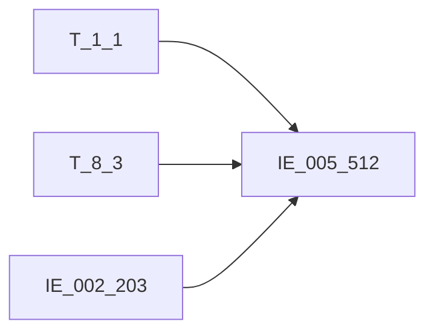

# 血缘-IE_005_512-垫款登记表-EAST5.0系统

## 页面边界

- 本页维护 `垫款登记表` 从一表通来源表到 EAST5.0 目标表 `IE_005_512` 的设计血缘。
- 证据为业务需求文档和工作区 GBase SQL 草案，尚未经过生产运行验证。
- 数据表字段定义见 [[数据表-IE_005_512-垫款登记表-EAST5.0系统]]；业务报送口径见 [[报表-IE_005_512-垫款登记表-EAST5.0系统]]。

## 系统边界

- 起始系统：一表通系统
- 目标系统：EAST5.0系统
- 是否跨系统血缘：是
- 目标对象：`IE_005_512` `垫款登记表`

## 业务链路摘要

- 按 `原始材料/业务需求/EAST5.0/039_垫款登记表.md` 的字段映射，将一表通来源表加工为 EAST5.0 `垫款登记表`。
- 表级规则：### 2.1 表级规则（Excel第 951 行） 取日期在当月且通过信贷借据号关联生成对公信贷业务借据表来筛选范围
- SQL 草案采用按 `P_DATA_DATE` 清理后重插或增量边界过滤的方式；具体投产方式待验证。

## 直接上游对象

- [[数据表-T_1_1-机构信息-一表通系统]]：一表通来源表，提供金融许可证号和银行机构名称。
- [[数据表-T_8_3-垫款状态-一表通系统]]：一表通来源表，垫款数据主源。
- [[数据表-IE_002_203-对公客户信息表-EAST5.0系统]]：EAST 对公客户信息表，提供客户名称 KHMC enrich。

## 直接下游对象

- 目标数据表：[[数据表-IE_005_512-垫款登记表-EAST5.0系统]]
- 报表业务口径页：[[报表-IE_005_512-垫款登记表-EAST5.0系统]]
- SQL 草案：`工作区/SQL开发/EAST5.0系统/PROC_EAST_IE_005_512_DKDJB_草案.sql`

## Nodes

- [[数据表-T_1_1-机构信息-一表通系统]]：一表通来源表。
- [[数据表-T_8_3-垫款状态-一表通系统]]：一表通来源表。
- [[数据表-IE_002_203-对公客户信息表-EAST5.0系统]]：EAST 对公客户信息表。
- [[数据表-IE_005_512-垫款登记表-EAST5.0系统]]：EAST5.0 目标采集表。
- [[报表-IE_005_512-垫款登记表-EAST5.0系统]]：业务口径说明。

## 表级 Edge List

| From | To | Transform | Evidence |
| --- | --- | --- | --- |
| [[数据表-T_1_1-机构信息-一表通系统]] | [[数据表-IE_005_512-垫款登记表-EAST5.0系统]] | LEFT JOIN：SUBSTR(TRIM(H030003),12)=TRIM(A010002) + 采集日期过滤，提供 JRXKZH/YHJGMC | [[来源-EAST5.0系统-IE_005_512-垫款登记表]]；SQL 草案 |
| [[数据表-T_8_3-垫款状态-一表通系统]] | [[数据表-IE_005_512-垫款登记表-EAST5.0系统]] | 主源：WHERE H030013=V_DATA_DATE + 17 字段直接映射/码值 CASE/日期转换后装载 | [[来源-EAST5.0系统-IE_005_512-垫款登记表]]；SQL 草案 |
| [[数据表-IE_002_203-对公客户信息表-EAST5.0系统]] | [[数据表-IE_005_512-垫款登记表-EAST5.0系统]] | LEFT JOIN：TRIM(H030002)=TRIM(KHTYBH) + 采集日期过滤，提供 KHMC | [[来源-EAST5.0系统-IE_005_512-垫款登记表]]；SQL 草案 |

## 字段级 Edge List

| 源对象 | 源字段 | 目标对象 | 目标字段 | 处理逻辑 | 关系类型 | 证据 |
| --- | --- | --- | --- | --- | --- | --- |
| [[数据表-T_8_3-垫款状态-一表通系统]] | `H030009` | [[数据表-IE_005_512-垫款登记表-EAST5.0系统]] | `DKYE` | CAST(NULLIF(TRIM(H030009),'') AS DECIMAL(20,2)) | 加工映射 | [[来源-EAST5.0系统-IE_005_512-垫款登记表]]；SQL 草案 |
| - | - | [[数据表-IE_005_512-垫款登记表-EAST5.0系统]] | `KHLB` | 业务需求未给来源，SQL 置 NULL | 缺口 | [[来源-EAST5.0系统-IE_005_512-垫款登记表]]；SQL 草案 |
| - | - | [[数据表-IE_005_512-垫款登记表-EAST5.0系统]] | `CJRQ` | 直接赋入参 P_DATA_DATE（VARCHAR(8) YYYYMMDD） | 参数赋值 | [[来源-EAST5.0系统-IE_005_512-垫款登记表]]；SQL 草案 |
| - | - | [[数据表-IE_005_512-垫款登记表-EAST5.0系统]] | `GSFZJG` | 业务需求未给来源，SQL 置 NULL | 缺口 | [[来源-EAST5.0系统-IE_005_512-垫款登记表]]；SQL 草案 |
| - | - | [[数据表-IE_005_512-垫款登记表-EAST5.0系统]] | `SENSITIVEFLAG` | 业务需求未给来源，SQL 置 NULL | 缺口 | [[来源-EAST5.0系统-IE_005_512-垫款登记表]]；SQL 草案 |
| [[数据表-T_8_3-垫款状态-一表通系统]] | `H030003` | [[数据表-IE_005_512-垫款登记表-EAST5.0系统]] | `NBJGH` | SUBSTR(TRIM(H030003), 12)；从第12位开始截取 | 加工映射 | [[来源-EAST5.0系统-IE_005_512-垫款登记表]]；SQL 草案 |
| [[数据表-T_8_3-垫款状态-一表通系统]] | `H030001` | [[数据表-IE_005_512-垫款登记表-EAST5.0系统]] | `XDHTH` | 直接映射 | 直接映射 | [[来源-EAST5.0系统-IE_005_512-垫款登记表]]；SQL 草案 |
| [[数据表-T_8_3-垫款状态-一表通系统]] | `H030007` | [[数据表-IE_005_512-垫款登记表-EAST5.0系统]] | `DKLX` | CASE：精确匹配 7 个码值 + '00'→'其他' + 模式匹配 `LEFT(...,3)='00-'` 取 SUBSTRING 拼接'其他-XX'（XX 为银行自定义变量，非字面量）+ ELSE→'' | 码值转换 | [[来源-EAST5.0系统-IE_005_512-垫款登记表]]；SQL 草案 |
| [[数据表-T_8_3-垫款状态-一表通系统]] | `H030006` | [[数据表-IE_005_512-垫款登记表-EAST5.0系统]] | `BZ` | 直接映射 | 直接映射 | [[来源-EAST5.0系统-IE_005_512-垫款登记表]]；SQL 草案 |
| [[数据表-T_1_1-机构信息-一表通系统]] | `A010003` | [[数据表-IE_005_512-垫款登记表-EAST5.0系统]] | `JRXKZH` | LEFT JOIN T_1_1 ON SUBSTR(TRIM(H030003),12)=TRIM(A010002) AND A010020=V_DATA_DATE | 加工映射 | [[来源-EAST5.0系统-IE_005_512-垫款登记表]]；SQL 草案 |
| [[数据表-T_1_1-机构信息-一表通系统]] | `A010005` | [[数据表-IE_005_512-垫款登记表-EAST5.0系统]] | `YHJGMC` | LEFT JOIN T_1_1 ON SUBSTR(TRIM(H030003),12)=TRIM(A010002) AND A010020=V_DATA_DATE | 加工映射 | [[来源-EAST5.0系统-IE_005_512-垫款登记表]]；SQL 草案 |
| [[数据表-T_8_3-垫款状态-一表通系统]] | `H030004` | [[数据表-IE_005_512-垫款登记表-EAST5.0系统]] | `XDJJH` | 直接映射 | 直接映射 | [[来源-EAST5.0系统-IE_005_512-垫款登记表]]；SQL 草案 |
| [[数据表-T_8_3-垫款状态-一表通系统]] | `H030005` | [[数据表-IE_005_512-垫款登记表-EAST5.0系统]] | `YHTBH` | 直接映射 | 直接映射 | [[来源-EAST5.0系统-IE_005_512-垫款登记表]]；SQL 草案 |
| [[数据表-T_8_3-垫款状态-一表通系统]] | `H030008` | [[数据表-IE_005_512-垫款登记表-EAST5.0系统]] | `DKJE` | CAST(NULLIF(TRIM(H030008),'') AS DECIMAL(20,2)) | 加工映射 | [[来源-EAST5.0系统-IE_005_512-垫款登记表]]；SQL 草案 |
| [[数据表-T_8_3-垫款状态-一表通系统]] | `H030002` | [[数据表-IE_005_512-垫款登记表-EAST5.0系统]] | `KHTYBH` | 直接映射 | 直接映射 | [[来源-EAST5.0系统-IE_005_512-垫款登记表]]；SQL 草案 |
| [[数据表-T_8_3-垫款状态-一表通系统]] | `H030010` | [[数据表-IE_005_512-垫款登记表-EAST5.0系统]] | `DKRQ` | CASE WHEN H030010 IS NULL THEN '99991231' ELSE REPLACE(CAST(H030010 AS CHAR),'-','') | 格式转换 | [[来源-EAST5.0系统-IE_005_512-垫款登记表]]；SQL 草案 |
| [[数据表-T_8_3-垫款状态-一表通系统]] | `H030011` | [[数据表-IE_005_512-垫款登记表-EAST5.0系统]] | `DKZT` | CASE：精确匹配 4 个码值 + '00'→'其他' + 模式匹配 `LEFT(...,3)='00-'` 取 SUBSTRING 拼接'其他-XX'（XX 为银行自定义变量，非字面量）+ ELSE→'' | 码值转换 | [[来源-EAST5.0系统-IE_005_512-垫款登记表]]；SQL 草案 |
| [[数据表-T_8_3-垫款状态-一表通系统]] | `H030012` | [[数据表-IE_005_512-垫款登记表-EAST5.0系统]] | `BBZ` | 直接映射（单表无多源拼接，2026-05-09 确认垫款数据仅来自 T_8_3；若后续需多源拼接则重构） | 直接映射 | [[来源-EAST5.0系统-IE_005_512-垫款登记表]]；SQL 草案 |
| [[数据表-IE_002_203-对公客户信息表-EAST5.0系统]] | `KHMC` | [[数据表-IE_005_512-垫款登记表-EAST5.0系统]] | `KHMC` | LEFT JOIN IE_002_203 ON TRIM(H030002)=TRIM(KHTYBH) AND CJRQ=P_DATA_DATE | 加工映射 | [[来源-EAST5.0系统-IE_005_512-垫款登记表]]；SQL 草案 |

## Graph-总览

## 回链检查

- 目标数据表页：2026-05-08 已更新 SQL 草案上游依赖（3 个上游表细化）。
- 报表业务口径页：已存在血缘回链。
- 一表通源表页：T_8_3 和 T_1_1 下游消费摘要已存在。
- IE_002_203 新增下游消费：KHMC 字段 enrich，待回链该表页。
- 当前字段级血缘基于业务需求和 2026-05-08 重构校准后的 SQL 草案，未运行验证，状态为 draft。

## 变更与冲突

- 本次为新增设计血缘或补齐草案血缘，不覆盖已验证生产血缘。
- 未发现需要将 `validated` 页面降级的情况；本页保持 `draft`。

## Open Questions

- 终态纳入规则："垫款状态为'结清'、'转让'、'核销'的，在报送最后状态的次月可不再报送"的具体实现逻辑待需求方确认。
- 表级规则"通过信贷借据号关联生成对公信贷业务借据表来筛选范围"的具体筛选条件待确认（当前仅按采集日期过滤）。
- IE_002_203.KHTYBH 与 T_8_3.H030002（客户ID）的字段语义一致性需现场确认。
- '00' 通配策略：需求文档写"若为'00-XX'，则赋值为'其他-XX'"，XX 是银行自定义变量代号（如 '00-01'、'00-信托'），不是字面量。草案已改为 `LEFT(...,3)='00-'` 模式匹配，取 SUBSTRING 拼接。
- 表级规则"通过信贷借据号关联生成对公信贷业务借据表来筛选范围"的具体实现逻辑待需求方确认（当前仅按采集日期过滤，未实现信贷借据号关联）。
- 外部监管实体页 wikilink 待补。

## 缺口字段（2026-05-04）

| 目标字段 | 字段名称 | 缺口说明 |
| --- | --- | --- |
| `KHLB` | 客户类别 | 本地 DDL 存在，但业务需求映射表和 SQL 草案未能确认来源，字段级血缘待补。 |
| `GSFZJG` | 归属分支机构 | 本地 DDL 存在，但业务需求映射表和 SQL 草案未能确认来源，字段级血缘待补。 |
| `SENSITIVEFLAG` | 涉密标志 | 本地 DDL 存在，但业务需求映射表和 SQL 草案未能确认来源，字段级血缘待补。 |
