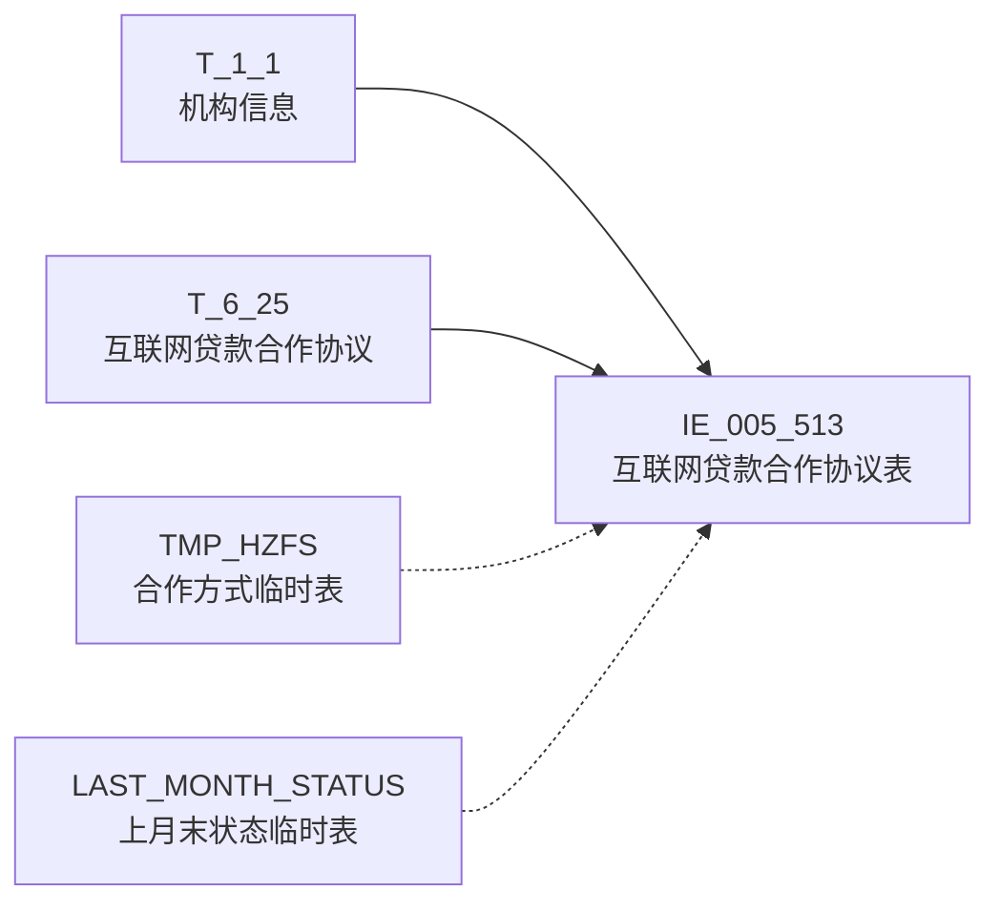

# 血缘-IE_005_513-互联网贷款合作协议表-EAST5.0系统

## 页面边界

- 本页维护 `互联网贷款合作协议表` 从一表通来源表到 EAST5.0 目标表 `IE_005_513` 的设计血缘。
- 证据为业务需求文档和工作区 GBase SQL 草案，尚未经过生产运行验证。
- 数据表字段定义见 [[数据表-IE_005_513-互联网贷款合作协议表-EAST5.0系统]]；业务报送口径见 [[报表-IE_005_513-互联网贷款合作协议表-EAST5.0系统]]。
- 2026-05-09 重构校准后，所有 17 条字段级边已闭环（2 个缺口字段 SENSITIVEFLAG/GSFZJG 仍标记缺口）。

## 系统边界

- 起始系统：一表通系统
- 目标系统：EAST5.0系统
- 是否跨系统血缘：是
- 目标对象：`IE_005_513` `互联网贷款合作协议表`

## 业务链路摘要

- 按 `原始材料/业务需求/EAST5.0/040_互联网贷款合作协议表.md` 的字段映射，将一表通来源表加工为 EAST5.0 `互联网贷款合作协议表`。
- 表级规则：### 2.1 表级规则（Excel第 968 行） 主表：【互联网贷款合作协议】 左关联：【机构信息】。关联条件：【机构信息】.【机构ID】关联【互联网贷款合作协议】.【机构ID】。限制【采集日期】为当日 左关联：临时表 TMP_HZFS （ SELECT T.F250002 ,取T.F250007即拆出来【互联网贷款合作协议】.【合作方式】 按降序排列后用'+'拼接： ( 当 T.F250007= '01' 则赋值 '营销获客' 当 T.F250007= '02' 则赋值 '联合贷款' 当 T.F250007= '03' 则赋值 '支付结算' 当 T.F250007= '04' 则赋值 '风险分担' 当 T.F250007= '05' 则赋值 '担保增信' 当 T.F250007= '06' 则赋值 '信息科技' 当 T.F250007= '07' 则赋值 '逾期清收' 当 T.F250007= '08' 则赋值 '其他-客户筛选' 当 T.F250007= '09' 则赋值 '其他-部分风险评价' 当 T.F250007= '10' 则赋值 '其他-无合作方' 当 T.F250007= '00-xx' 则赋值 '其他-xx' ) AS F250007 FROM (SELECT P1 .F250002, P1 .F250007 FROM (SELECT 【互联网贷款合作协议】.【协议ID】 AS F250002 ,UNNEST(STRING_TO_ARRAY(【互联网贷款合作协议】.【合作方式】,';')) AS F250007 /*合作方式 按分号将字段行转列*/ FROM 【互联网贷款合作协议】 T1 WHERE 【互联网贷款合作协议】.【采集日期】 = 当日 ) P1 GROUP BY 1,2 ) T GROUP BY F250002） 关联条件：TMP_HZFS.F250002关联【互联网贷款合作协议】.【协议ID】 左关联：【互联网贷款合作协议】（取上月末）。关联条件：上月末【互联网贷款合作协议】.【协议ID】关联本期【互联网贷款合作协议】.【协议ID】。 左关联：【代码映射表】 （用于证件类别转码，对【互联网贷款合作协议】.【合作方证件类型】进行转码）关联条件：用【互联网贷款合作协议】.【合作方证件类型】关联【代码映射表】.【源字段代码值】，筛选【代码映射表】.【转换规则编号】为'YBT-EAST-ZJLX'。 筛选条件：满足以下条件之一： 1、上月末【互联网贷款合作协议】.【协议状态】为'01'[正常]； 2、本期【互联网贷款合作协议】.【贷款状态】为'01'[正常]； 3、本期【互联网贷款合作协议】. 【合作协议起始日期】在本月。
- SQL 草案采用按 `P_DATA_DATE` 清理后重插或增量边界过滤的方式；具体投产方式待验证。

## 直接上游对象

- [[数据表-T_1_1-机构信息-一表通系统]]：一表通来源表。
- [[数据表-T_6_25-互联网贷款合作协议-一表通系统]]：一表通来源表。

## 直接下游对象

- 目标数据表：[[数据表-IE_005_513-互联网贷款合作协议表-EAST5.0系统]]
- 报表业务口径页：[[报表-IE_005_513-互联网贷款合作协议表-EAST5.0系统]]
- SQL 草案：`工作区/SQL开发/EAST5.0系统/PROC_EAST_IE_005_513_HLWDKHZXYB_草案.sql`

## Nodes

- [[数据表-T_1_1-机构信息-一表通系统]]：一表通来源表。
- [[数据表-T_6_25-互联网贷款合作协议-一表通系统]]：一表通来源表。
- [[数据表-IE_005_513-互联网贷款合作协议表-EAST5.0系统]]：EAST5.0 目标采集表。
- [[报表-IE_005_513-互联网贷款合作协议表-EAST5.0系统]]：业务口径说明。

## 表级 Edge List

| From | To | Transform | Evidence |
| --- | --- | --- | --- |
| [[数据表-T_1_1-机构信息-一表通系统]] | [[数据表-IE_005_513-互联网贷款合作协议表-EAST5.0系统]] | LEFT JOIN 按机构ID+采集日期关联，enrich 金融许可证号和银行机构名称 | [[来源-EAST5.0系统-IE_005_513-互联网贷款合作协议表]]；SQL 草案（2026-05-09 重构） |
| [[数据表-T_6_25-互联网贷款合作协议-一表通系统]] | [[数据表-IE_005_513-互联网贷款合作协议表-EAST5.0系统]] | 字段映射、码值 CASE 转换、日期格式转换、合作方式 UNNEST+拼接、3 场景终态纳入过滤 | [[来源-EAST5.0系统-IE_005_513-互联网贷款合作协议表]]；SQL 草案（2026-05-09 重构） |

## 字段级 Edge List

| 源对象 | 源字段 | 目标对象 | 目标字段 | 处理逻辑 | 关系类型 | 证据 |
| --- | --- | --- | --- | --- | --- | --- |
| [[数据表-T_1_1-机构信息-一表通系统]] | `A010003` | [[数据表-IE_005_513-互联网贷款合作协议表-EAST5.0系统]] | `JRXKZH` | LEFT JOIN 按 `TRIM(src.F250001)=TRIM(s1.A010001)` + `s1.A010020=V_DATA_DATE`，取金融许可证号 | 加工映射 | [[来源-EAST5.0系统-IE_005_513-互联网贷款合作协议表]]；SQL 草案（2026-05-09 重构） |
| [[数据表-T_6_25-互联网贷款合作协议-一表通系统]] | `F250005` | [[数据表-IE_005_513-互联网贷款合作协议表-EAST5.0系统]] | `HZFZJHM` | 直接映射 | 直接映射 | [[来源-EAST5.0系统-IE_005_513-互联网贷款合作协议表]]；SQL 草案 |
| [[数据表-T_6_25-互联网贷款合作协议-一表通系统]] | `F250015` | [[数据表-IE_005_513-互联网贷款合作协议表-EAST5.0系统]] | `BBZ` | 直接映射 | 直接映射 | [[来源-EAST5.0系统-IE_005_513-互联网贷款合作协议表]]；SQL 草案 |
| [[数据表-T_6_25-互联网贷款合作协议-一表通系统]] | `F250013` | [[数据表-IE_005_513-互联网贷款合作协议表-EAST5.0系统]] | `XZBZ` | CASE `TRIM(F250013)`: '1'→'是'，'0'→'否'，ELSE 原值 | 码值转换 | [[来源-EAST5.0系统-IE_005_513-互联网贷款合作协议表]]；SQL 草案（2026-05-09 重构） |
| [[数据表-T_6_25-互联网贷款合作协议-一表通系统]] | `F250011` | [[数据表-IE_005_513-互联网贷款合作协议表-EAST5.0系统]] | `XYDQRQ` | `CASE WHEN F250011 IS NULL THEN '99991231' ELSE REPLACE(CAST(F250011 AS CHAR),'-','')` | 格式转换 | [[来源-EAST5.0系统-IE_005_513-互联网贷款合作协议表]]；SQL 草案（2026-05-09 重构） |
| [[数据表-T_6_25-互联网贷款合作协议-一表通系统]] | `F250009` | [[数据表-IE_005_513-互联网贷款合作协议表-EAST5.0系统]] | `XZQHDM` | 直接映射 | 直接映射 | [[来源-EAST5.0系统-IE_005_513-互联网贷款合作协议表]]；SQL 草案 |
| [[数据表-T_6_25-互联网贷款合作协议-一表通系统]] | `F250001` | [[数据表-IE_005_513-互联网贷款合作协议表-EAST5.0系统]] | `NBJGH` | `SUBSTR(TRIM(F250001), 12)`，从第12位截取内部机构号 | 加工映射 | [[来源-EAST5.0系统-IE_005_513-互联网贷款合作协议表]]；SQL 草案 |
| [[数据表-T_6_25-互联网贷款合作协议-一表通系统]] | `F250002` | [[数据表-IE_005_513-互联网贷款合作协议表-EAST5.0系统]] | `HZXYBH` | 直接映射 | 直接映射 | [[来源-EAST5.0系统-IE_005_513-互联网贷款合作协议表]]；SQL 草案 |
| [[数据表-T_6_25-互联网贷款合作协议-一表通系统]] | `F250004` | [[数据表-IE_005_513-互联网贷款合作协议表-EAST5.0系统]] | `HZFZJLB` | CASE: '1999-自定义'→'其他-自定义'，'2999-自定义'→'其他-自定义'，ELSE 原值 | 加工映射 | [[来源-EAST5.0系统-IE_005_513-互联网贷款合作协议表]]；SQL 草案（2026-05-09 重构） |
| [[数据表-T_6_25-互联网贷款合作协议-一表通系统]] | `F250003` | [[数据表-IE_005_513-互联网贷款合作协议表-EAST5.0系统]] | `HZFMC` | 直接映射 | 直接映射 | [[来源-EAST5.0系统-IE_005_513-互联网贷款合作协议表]]；SQL 草案 |
| [[数据表-T_6_25-互联网贷款合作协议-一表通系统]] | `F250016` | [[数据表-IE_005_513-互联网贷款合作协议表-EAST5.0系统]] | `CJRQ` | `REPLACE(CAST(F250016 AS CHAR),'-','')`，DATE→YYYYMMDD | 格式转换 | [[来源-EAST5.0系统-IE_005_513-互联网贷款合作协议表]]；SQL 草案（2026-05-09 重构） |
| [[数据表-T_6_25-互联网贷款合作协议-一表通系统]] | `F250014` | [[数据表-IE_005_513-互联网贷款合作协议表-EAST5.0系统]] | `XYZT` | CASE: '01'→'有效','02'→'其他-待生效','03'→'其他-中止','04'→'终结','05'→'撤销','06'→'其他-无效','00-自定义'→'其他-自定义' | 码值转换 | [[来源-EAST5.0系统-IE_005_513-互联网贷款合作协议表]]；SQL 草案（2026-05-09 重构） |
| [[数据表-T_6_25-互联网贷款合作协议-一表通系统]] | `F250012` | [[数据表-IE_005_513-互联网贷款合作协议表-EAST5.0系统]] | `SJZZRQ` | `CASE WHEN F250012 IS NULL THEN '99991231' ELSE REPLACE(CAST(F250012 AS CHAR),'-','')` | 格式转换 | [[来源-EAST5.0系统-IE_005_513-互联网贷款合作协议表]]；SQL 草案（2026-05-09 重构） |
| [[数据表-T_6_25-互联网贷款合作协议-一表通系统]] | `F250010` | [[数据表-IE_005_513-互联网贷款合作协议表-EAST5.0系统]] | `XYQSRQ` | `CASE WHEN F250010 IS NULL THEN '99991231' ELSE REPLACE(CAST(F250010 AS CHAR),'-','')` | 格式转换 | [[来源-EAST5.0系统-IE_005_513-互联网贷款合作协议表]]；SQL 草案（2026-05-09 重构） |
| [[数据表-T_6_25-互联网贷款合作协议-一表通系统]] + `TMP_HZFS` | `F250006` + TMP_HZFS.HZFS | [[数据表-IE_005_513-互联网贷款合作协议表-EAST5.0系统]] | `HZFS` | CASE: 合作方类型='00'→'其他-无合作方'；否则取 TMP_HZFS 拼接结果；全空→'其他-其他'。TMP_HZFS 内部：UNNEST 行转列 → CASE 码值映射 → GROUP_CONCAT '+' 拼接 → 其他-置顶 | 码值转换/格式转换 | [[来源-EAST5.0系统-IE_005_513-互联网贷款合作协议表]]；SQL 草案（2026-05-09 重构） |
| [[数据表-T_6_25-互联网贷款合作协议-一表通系统]] | `F250006` | [[数据表-IE_005_513-互联网贷款合作协议表-EAST5.0系统]] | `HZFLX` | CASE: '01'→'银行业金融机构','02'→'其他-信托公司','03'→'其他-消费金融公司','04'→'小额贷款公司','05'→'其他-其他银行业金融机构','06'→'保险公司','07'→'融资担保公司','08'→'电子商务公司','09'→'非银行支付机构','10'→'信息科技公司','00-自定义'→'其他-自定义','11'→'其他-无合作方' | 码值转换 | [[来源-EAST5.0系统-IE_005_513-互联网贷款合作协议表]]；SQL 草案（2026-05-09 重构） |
| [[数据表-T_1_1-机构信息-一表通系统]] | `A010005` | [[数据表-IE_005_513-互联网贷款合作协议表-EAST5.0系统]] | `YHJGMC` | LEFT JOIN 按 `TRIM(src.F250001)=TRIM(s1.A010001)` + `s1.A010020=V_DATA_DATE`，取银行机构名称 | 加工映射 | [[来源-EAST5.0系统-IE_005_513-互联网贷款合作协议表]]；SQL 草案（2026-05-09 重构） |

## Graph-总览

## 回链检查

- 目标数据表页：已补 SQL 草案上游依赖摘要（2026-05-09 重构校准说明）。
- 报表业务口径页：已补充血缘回链。
- 一表通源表页：T_6_25 已补下游消费摘要（2026-05-04 初始化）；T_1_1 待补充。
- 当前字段级血缘基于业务需求和 SQL 草案，2026-05-09 重构后 17 条边全部闭环（2 个缺口字段仍标记缺口）。

## 变更与冲突

- 2026-05-09 重构校准（第 1 轮）：消除 `ON 1=1` JOIN TODO，补齐 4 个码值 CASE 转换、合作方式复杂加工逻辑、日期格式转换、WHERE 终态纳入规则。
- 2026-05-09 重构校准（第 2 轮）：依据《040_互联网贷款合作协议表.md》逐项校准，修正 3 处码值 CASE 偏差（HZFLX/XYZT/HZFS 均删除需求文档未定义的 `'00'` 分支）、修正 HZFS 合作方类型判断 `'00'→'11'`、修正 LAST_MONTH_STATUS 临时表 GROUP BY 字段、补充需求文档笔误注释。
- 本页保持 `draft`：SQL 草案尚未在 GBase 环境执行验证。

## Open Questions

- GBase 8a 中 `UNNEST` 替代方案（SUBSTRING_INDEX + numbers 表）的性能和正确性待跑数验证。
- `LAST_DAY()` 函数在 GBase 8a 的支持性待确认。
- 合作方式 TMP_HZFS 临时表中 `GROUP_CONCAT` 的 `ORDER BY sort_key` 在 GBase 8a 中的行为待验证。
- 3 场景终态纳入规则中"本期合作协议起始日期在本月"的日期边界（含首不含尾）待需求方确认。
- 外部监管实体页 wikilink 待补。
- 代码映射表 YBT-EAST-ZJLX（证件类别转码）未在当前源表中，HZFZJLB 字段暂用硬编码 CASE 替代，待补充代码映射表关联。

## 缺口字段（2026-05-04）

| 目标字段 | 字段名称 | 缺口说明 |
| --- | --- | --- |
| `SENSITIVEFLAG` | 涉密标志 | 本地 DDL 存在，但业务需求映射表和 SQL 草案未能确认来源，字段级血缘待补。 |
| `GSFZJG` | 归属分支机构 | 本地 DDL 存在，但业务需求映射表和 SQL 草案未能确认来源，字段级血缘待补。 |
