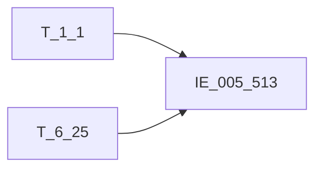

# 血缘-IE_005_513-互联网贷款合作协议表-EAST5.0系统

## 页面边界

- 本页维护 `互联网贷款合作协议表` 从一表通来源表到 EAST5.0 目标表 `IE_005_513` 的设计血缘。
- 证据为业务需求文档和工作区 GBase SQL 草案，尚未经过生产运行验证。
- 数据表字段定义见 [[数据表-IE_005_513-互联网贷款合作协议表-EAST5.0系统]]；业务报送口径见 [[报表-IE_005_513-互联网贷款合作协议表-EAST5.0系统]]。

## 系统边界

- 起始系统：一表通系统
- 目标系统：EAST5.0系统
- 是否跨系统血缘：是
- 目标对象：`IE_005_513` `互联网贷款合作协议表`

## 业务链路摘要

- 按 `原始材料/业务需求/EAST5.0/040_互联网贷款合作协议表.md` 的字段映射，将一表通来源表加工为 EAST5.0 `互联网贷款合作协议表`。
- 表级规则：### 2.1 表级规则（Excel第 968 行） 主表：【互联网贷款合作协议】 左关联：【机构信息】。关联条件：【机构信息】.【机构ID】关联【互联网贷款合作协议】.【机构ID】。限制【采集日期】为当日 左关联：临时表 TMP_HZFS （ SELECT T.F250002 ,取T.F250007即拆出来【互联网贷款合作协议】.【合作方式】 按降序排列后用'+'拼接： ( 当 T.F250007= '01' 则赋值 '营销获客' 当 T.F250007= '02' 则赋值 '联合贷款' 当 T.F250007= '03' 则赋值 '支付结算' 当 T.F250007= '04' 则赋值 '风险分担' 当 T.F250007= '05' 则赋值 '担保增信' 当 T.F250007= '06' 则赋值 '信息科技' 当 T.F250007= '07' 则赋值 '逾期清收' 当 T.F250007= '08' 则赋值 '其他-客户筛选' 当 T.F250007= '09' 则赋值 '其他-部分风险评价' 当 T.F250007= '10' 则赋值 '其他-无合作方' 当 T.F250007= '00-xx' 则赋值 '其他-xx' ) AS F250007 FROM (SELECT P1 .F250002, P1 .F250007 FROM (SELECT 【互联网贷款合作协议】.【协议ID】 AS F250002 ,UNNEST(STRING_TO_ARRAY(【互联网贷款合作协议】.【合作方式】,';')) AS F250007 /*合作方式 按分号将字段行转列*/ FROM 【互联网贷款合作协议】 T1 WHERE 【互联网贷款合作协议】.【采集日期】 = 当日 ) P1 GROUP BY 1,2 ) T GROUP BY F250002） 关联条件：TMP_HZFS.F250002关联【互联网贷款合作协议】.【协议ID】 左关联：【互联网贷款合作协议】（取上月末）。关联条件：上月末【互联网贷款合作协议】.【协议ID】关联本期【互联网贷款合作协议】.【协议ID】。 左关联：【代码映射表】 （用于证件类别转码，对【互联网贷款合作协议】.【合作方证件类型】进行转码）关联条件：用【互联网贷款合作协议】.【合作方证件类型】关联【代码映射表】.【源字段代码值】，筛选【代码映射表】.【转换规则编号】为'YBT-EAST-ZJLX'。 筛选条件：满足以下条件之一： 1、上月末【互联网贷款合作协议】.【协议状态】为'01'[正常]； 2、本期【互联网贷款合作协议】.【贷款状态】为'01'[正常]； 3、本期【互联网贷款合作协议】. 【合作协议起始日期】在本月。
- SQL 草案采用按 `P_DATA_DATE` 清理后重插或增量边界过滤的方式；具体投产方式待验证。

## 直接上游对象

- [[数据表-T_1_1-机构信息-一表通系统]]：一表通来源表。
- [[数据表-T_6_25-互联网贷款合作协议-一表通系统]]：一表通来源表。

## 直接下游对象

- 目标数据表：[[数据表-IE_005_513-互联网贷款合作协议表-EAST5.0系统]]
- 报表业务口径页：[[报表-IE_005_513-互联网贷款合作协议表-EAST5.0系统]]
- SQL 草案：`工作区/SQL开发/EAST5.0系统/PROC_EAST_IE_005_513_HLWDKHZXYB_草案.sql`

## Nodes

- [[数据表-T_1_1-机构信息-一表通系统]]：一表通来源表。
- [[数据表-T_6_25-互联网贷款合作协议-一表通系统]]：一表通来源表。
- [[数据表-IE_005_513-互联网贷款合作协议表-EAST5.0系统]]：EAST5.0 目标采集表。
- [[报表-IE_005_513-互联网贷款合作协议表-EAST5.0系统]]：业务口径说明。

## 表级 Edge List

| From | To | Transform | Evidence |
| --- | --- | --- | --- |
| [[数据表-T_1_1-机构信息-一表通系统]] | [[数据表-IE_005_513-互联网贷款合作协议表-EAST5.0系统]] | 字段映射、关联、过滤、码值/日期转换后装载 `IE_005_513` | [[来源-EAST5.0系统-IE_005_513-互联网贷款合作协议表]]；SQL 草案 |
| [[数据表-T_6_25-互联网贷款合作协议-一表通系统]] | [[数据表-IE_005_513-互联网贷款合作协议表-EAST5.0系统]] | 字段映射、关联、过滤、码值/日期转换后装载 `IE_005_513` | [[来源-EAST5.0系统-IE_005_513-互联网贷款合作协议表]]；SQL 草案 |

## 字段级 Edge List

| 源对象 | 源字段 | 目标对象 | 目标字段 | 处理逻辑 | 关系类型 | 证据 |
| --- | --- | --- | --- | --- | --- | --- |
| [[数据表-T_1_1-机构信息-一表通系统]] | `A010003` | [[数据表-IE_005_513-互联网贷款合作协议表-EAST5.0系统]] | `JRXKZH` | 加工规则：用【互联网贷款合作协议】.【机构ID】关联【机构信息】.【机构ID】，取【机构信息】.【金融许可证号】 | 加工映射 | [[来源-EAST5.0系统-IE_005_513-互联网贷款合作协议表]]；SQL 草案 |
| [[数据表-T_6_25-互联网贷款合作协议-一表通系统]] | `F250001` | [[数据表-IE_005_513-互联网贷款合作协议表-EAST5.0系统]] | `NBJGH` | 加工规则：从【互联网贷款合作协议】.【机构ID】第12位开始截取。 | 加工映射 | [[来源-EAST5.0系统-IE_005_513-互联网贷款合作协议表]]；SQL 草案 |
| [[数据表-T_1_1-机构信息-一表通系统]] | `A010005` | [[数据表-IE_005_513-互联网贷款合作协议表-EAST5.0系统]] | `YHJGMC` | 加工规则：用【互联网贷款合作协议】.【机构ID】关联【机构信息】.【机构ID】，取【机构信息】.【银行机构名称】 | 加工映射 | [[来源-EAST5.0系统-IE_005_513-互联网贷款合作协议表]]；SQL 草案 |
| [[数据表-T_6_25-互联网贷款合作协议-一表通系统]] | `F250002` | [[数据表-IE_005_513-互联网贷款合作协议表-EAST5.0系统]] | `HZXYBH` | 直接映射 | 直接映射 | [[来源-EAST5.0系统-IE_005_513-互联网贷款合作协议表]]；SQL 草案 |
| [[数据表-T_6_25-互联网贷款合作协议-一表通系统]] | `F250003` | [[数据表-IE_005_513-互联网贷款合作协议表-EAST5.0系统]] | `HZFMC` | 直接映射 | 直接映射 | [[来源-EAST5.0系统-IE_005_513-互联网贷款合作协议表]]；SQL 草案 |
| [[数据表-T_6_25-互联网贷款合作协议-一表通系统]] | `F250004` | [[数据表-IE_005_513-互联网贷款合作协议表-EAST5.0系统]] | `HZFZJLB` | 加工映射:【互联网贷款合作协议】.【合作方证件类型】根据‘YBT-EAST-ZJLX’代码映射表映射为中文；'1999-自定义'转为'其他-自定义'（个人），'2999-自定义'转为'其他-自定义'（对公） | 加工映射 | [[来源-EAST5.0系统-IE_005_513-互联网贷款合作协议表]]；SQL 草案 |
| [[数据表-T_6_25-互联网贷款合作协议-一表通系统]] | `F250005` | [[数据表-IE_005_513-互联网贷款合作协议表-EAST5.0系统]] | `HZFZJHM` | 直接映射 | 直接映射 | [[来源-EAST5.0系统-IE_005_513-互联网贷款合作协议表]]；SQL 草案 |
| [[数据表-T_6_25-互联网贷款合作协议-一表通系统]] | `F250006` | [[数据表-IE_005_513-互联网贷款合作协议表-EAST5.0系统]] | `HZFLX` | 代码转化：；若为'01'[商业银行]，则赋值为'银行业金融机构'；；若为'02'[信托公司]，则赋值为'其他-信托公司'；；若为'03'[消费金融公司]，则赋值为'其他-消费金融公司'；；若为'04'[小额贷款公司]，则赋值为'小额贷款公司'；；若为'05'[其他银行业金融机构]，则赋值为'其他-其他银行业金融机构'；；若为'06'[保险业金融机构]，则赋值为'保险公司'；；若为'07'[融资担保公司]，则赋值为'融资担保公司'；；若为... | 码值转换/格式转换 | [[来源-EAST5.0系统-IE_005_513-互联网贷款合作协议表]]；SQL 草案 |
| [[数据表-T_6_25-互联网贷款合作协议-一表通系统]] | `F250007` | [[数据表-IE_005_513-互联网贷款合作协议表-EAST5.0系统]] | `HZFS` | 加工规则：；若【互联网贷款合作协议】.【合作方类型】为'00'[无合作方],则赋值为'其他-无合作方'；；否则将【互联网贷款合作协议】.【合作方式】按以下码值进行映射：；若为'01'[营销获客],则赋值为'营销获客';；若为'02'[联合贷款],则赋值为'联合贷款';；若为'03'[支付结算],则赋值为'支付结算';；若为'04'[风险分担],则赋值为'风险分担';；若为'05'[担保增信],则赋值为'担保增信';；若为'06'[信息科... | 码值转换/格式转换 | [[来源-EAST5.0系统-IE_005_513-互联网贷款合作协议表]]；SQL 草案 |
| [[数据表-T_6_25-互联网贷款合作协议-一表通系统]] | `F250010` | [[数据表-IE_005_513-互联网贷款合作协议表-EAST5.0系统]] | `XYQSRQ` | 格式转换：转字符格式'YYYYMMDD'，若取不到或为空，则赋默认值99991231。 | 码值转换/格式转换 | [[来源-EAST5.0系统-IE_005_513-互联网贷款合作协议表]]；SQL 草案 |
| [[数据表-T_6_25-互联网贷款合作协议-一表通系统]] | `F250011` | [[数据表-IE_005_513-互联网贷款合作协议表-EAST5.0系统]] | `XYDQRQ` | 格式转换：转字符格式'YYYYMMDD'，若取不到或为空，则赋默认值99991231。 | 码值转换/格式转换 | [[来源-EAST5.0系统-IE_005_513-互联网贷款合作协议表]]；SQL 草案 |
| [[数据表-T_6_25-互联网贷款合作协议-一表通系统]] | `F250012` | [[数据表-IE_005_513-互联网贷款合作协议表-EAST5.0系统]] | `SJZZRQ` | 格式转换：转字符格式'YYYYMMDD'，若取不到或为空，则赋默认值99991231。 | 码值转换/格式转换 | [[来源-EAST5.0系统-IE_005_513-互联网贷款合作协议表]]；SQL 草案 |
| [[数据表-T_6_25-互联网贷款合作协议-一表通系统]] | `F250009` | [[数据表-IE_005_513-互联网贷款合作协议表-EAST5.0系统]] | `XZQHDM` | 直接映射 | 直接映射 | [[来源-EAST5.0系统-IE_005_513-互联网贷款合作协议表]]；SQL 草案 |
| [[数据表-T_6_25-互联网贷款合作协议-一表通系统]] | `F250013` | [[数据表-IE_005_513-互联网贷款合作协议表-EAST5.0系统]] | `XZBZ` | 代码转化：；若为'1'[是],则赋值为'是';；若为'0'[否],则赋值为'否'。 | 码值转换/格式转换 | [[来源-EAST5.0系统-IE_005_513-互联网贷款合作协议表]]；SQL 草案 |
| [[数据表-T_6_25-互联网贷款合作协议-一表通系统]] | `F250014` | [[数据表-IE_005_513-互联网贷款合作协议表-EAST5.0系统]] | `XYZT` | 代码转化：；若为'01'[正常],则赋值为'有效';；若为'02'[待生效],则赋值为'其他-待生效';；若为'03'[中止],则赋值为'其他-中止';；若为'04'[终止],则赋值为'终结';；若为'05'[撤销],则赋值为'撤销';；若为'06'[无效],则赋值为'其他-无效';；若为'00-自定义',则赋值为'其他-自定义'。 | 码值转换/格式转换 | [[来源-EAST5.0系统-IE_005_513-互联网贷款合作协议表]]；SQL 草案 |
| [[数据表-T_6_25-互联网贷款合作协议-一表通系统]] | `F250015` | [[数据表-IE_005_513-互联网贷款合作协议表-EAST5.0系统]] | `BBZ` | 直接映射 | 直接映射 | [[来源-EAST5.0系统-IE_005_513-互联网贷款合作协议表]]；SQL 草案 |
| [[数据表-T_6_25-互联网贷款合作协议-一表通系统]] | `F250016` | [[数据表-IE_005_513-互联网贷款合作协议表-EAST5.0系统]] | `CJRQ` | 格式转换：格式转为'YYYYMMDD'。 | 码值转换/格式转换 | [[来源-EAST5.0系统-IE_005_513-互联网贷款合作协议表]]；SQL 草案 |

## Graph-总览

## 回链检查

- 目标数据表页：已补 SQL 草案上游依赖摘要或待本次批处理补齐。
- 报表业务口径页：已创建或补充血缘回链。
- 一表通源表页：已补下游消费摘要或待本次批处理补齐。
- 当前字段级血缘基于业务需求和 SQL 草案，未运行验证，状态为待确认。

## 变更与冲突

- 本次为新增设计血缘或补齐草案血缘，不覆盖已验证生产血缘。
- 未发现需要将 `validated` 页面降级的情况；本页保持 `draft`。

## Open Questions

- GBase 草案中的复杂 JOIN、窗口去重、终态纳入和增量边界需要人工复核。
- 部分字段的码值 CASE 在草案中仍为待补，需要结合外部填报说明和跑数结果闭环。
- 外部监管实体页 wikilink 待补。

## 缺口字段（2026-05-04）

| 目标字段 | 字段名称 | 缺口说明 |
| --- | --- | --- |
| `SENSITIVEFLAG` | 涉密标志 | 本地 DDL 存在，但业务需求映射表和 SQL 草案未能确认来源，字段级血缘待补。 |
| `GSFZJG` | 归属分支机构 | 本地 DDL 存在，但业务需求映射表和 SQL 草案未能确认来源，字段级血缘待补。 |
