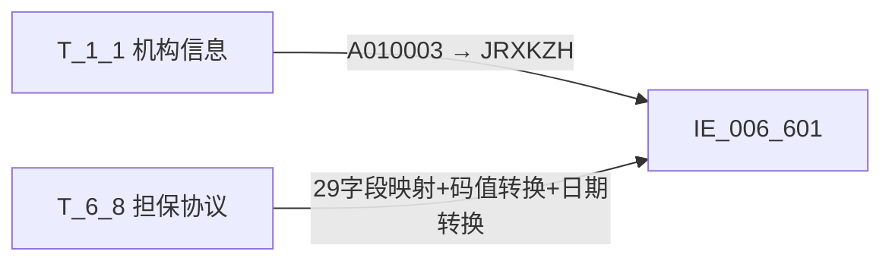

# 血缘-IE_006_601-表内外业务担保合同表-EAST5.0系统

## 页面边界

- 本页维护 `表内外业务担保合同表` 从一表通来源表到 EAST5.0 目标表 `IE_006_601` 的设计血缘。
- 证据为业务需求文档和数据字典原文，以及重构后的 GBase SQL 草案，尚未经过生产运行验证。
- 数据表字段定义见 [[数据表-IE_006_601-表内外业务担保合同表-EAST5.0系统]]；业务报送口径见 [[报表-IE_006_601-表内外业务担保合同表-EAST5.0系统]]。

## 系统边界

- 起始系统：一表通系统
- 目标系统：EAST5.0系统
- 是否跨系统血缘：是
- 目标对象：`IE_006_601` `表内外业务担保合同表`

## 业务链路摘要

- 按 `原始材料/业务需求/EAST5.0/041_表内外业务担保合同表.md` 的字段映射，将一表通来源表加工为 EAST5.0 `表内外业务担保合同表`。
- 表级规则：### 2.1 表级规则（Excel第 986 行） 取报送日期为当月，且剔除上月失效数据，通过抵质押类型且担保协议ID不为空的数据，或不为抵质押类型当期仍然生效的协议，关联9.3的担保协议ID，取不为保证金的数据作为报送范围
- SQL 草案采用按 `P_DATA_DATE` 清理后重插，WHERE 条件过滤当月数据、剔除上月失效数据、排除保证金类型。

## 直接上游对象

- [[数据表-T_1_1-机构信息-一表通系统]]：一表通来源表，提供金融许可证号。
- [[数据表-T_6_8-担保协议-一表通系统]]：一表通来源表，提供担保协议全量字段。

## 直接下游对象

- 目标数据表：[[数据表-IE_006_601-表内外业务担保合同表-EAST5.0系统]]
- 报表业务口径页：[[报表-IE_006_601-表内外业务担保合同表-EAST5.0系统]]
- SQL 草案：`工作区/SQL开发/EAST5.0系统/PROC_EAST_IE_006_601_BNWYWDBHTB_草案.sql`

## Nodes

- [[数据表-T_1_1-机构信息-一表通系统]]：一表通来源表。
- [[数据表-T_6_8-担保协议-一表通系统]]：一表通来源表。
- [[数据表-IE_006_601-表内外业务担保合同表-EAST5.0系统]]：EAST5.0 目标采集表。
- [[报表-IE_006_601-表内外业务担保合同表-EAST5.0系统]]：业务口径说明。

## 表级 Edge List

| From | To | Transform | Evidence |
| --- | --- | --- | --- |
| [[数据表-T_1_1-机构信息-一表通系统]] | [[数据表-IE_006_601-表内外业务担保合同表-EAST5.0系统]] | 按 `T_6_8.F080002 = T_1_1.A010001` 关联，提取 `A010003`（金融许可证号）装载 `JRXKZH` | [[来源-EAST5.0系统-IE_006_601-表内外业务担保合同表]]；SQL 草案 |
| [[数据表-T_6_8-担保协议-一表通系统]] | [[数据表-IE_006_601-表内外业务担保合同表-EAST5.0系统]] | 字段映射、码值 CASE 转换、日期格式转换、金额类型转换、WHERE 过滤后装载 `IE_006_601` | [[来源-EAST5.0系统-IE_006_601-表内外业务担保合同表]]；SQL 草案 |

## 字段级 Edge List

| 源对象 | 源字段 | 目标对象 | 目标字段 | 处理逻辑 | 关系类型 | 证据 |
| --- | --- | --- | --- | --- | --- | --- |
| [[数据表-T_1_1-机构信息-一表通系统]] | `A010003` | [[数据表-IE_006_601-表内外业务担保合同表-EAST5.0系统]] | `JRXKZH` | 直接映射，通过 `T_6_8.F080002 = T_1_1.A010001` 关联 | 直接映射 | SQL 草案 |
| [[数据表-T_6_8-担保协议-一表通系统]] | `F080002` | [[数据表-IE_006_601-表内外业务担保合同表-EAST5.0系统]] | `NBJGH` | 加工映射：`SUBSTR(F080002, 12)`，截取第12位起 | 加工映射 | SQL 草案 |
| [[数据表-T_6_8-担保协议-一表通系统]] | `F080003` | [[数据表-IE_006_601-表内外业务担保合同表-EAST5.0系统]] | `BDBHTH` | 直接映射 | 直接映射 | SQL 草案 |
| [[数据表-T_6_8-担保协议-一表通系统]] | `F080006` | [[数据表-IE_006_601-表内外业务担保合同表-EAST5.0系统]] | `BDBYWLX` | 码值转换：'01'→'表内信贷'/'02'→'承兑汇票'/'03'→'保函'/'04'→'信用证'/'05'→'贷款承诺'/'06'→'委托贷款'/'07'→'自营投资'/'00'→'其他'/'00-XX'通配→LEFT(TRIM(...),3)='00-' THEN '其他-'+SUBSTRING(...,4)/ELSE→'' | 码值转换 | SQL 草案 |
| [[数据表-T_6_8-担保协议-一表通系统]] | `F080001` | [[数据表-IE_006_601-表内外业务担保合同表-EAST5.0系统]] | `DBHTH` | 直接映射 | 直接映射 | SQL 草案 |
| [[数据表-T_6_8-担保协议-一表通系统]] | `F080007` | [[数据表-IE_006_601-表内外业务担保合同表-EAST5.0系统]] | `DBHTLX` | 码值转换：'01'→'一般担保合同'/'02'→'最高额担保合同'/ELSE→'' | 码值转换 | SQL 草案 |
| [[数据表-T_6_8-担保协议-一表通系统]] | `F080004` | [[数据表-IE_006_601-表内外业务担保合同表-EAST5.0系统]] | `DBLX` | 码值转换：'01'→'抵押'/'02'→'质押'/'03'/'04'/'05'/'06'→'保证'/'07'→'混合'/'00'→'其他'/'00-XX'通配→LEFT(TRIM(...),3)='00-' THEN '其他-'+SUBSTRING(...,4)/ELSE→'' | 码值转换 | SQL 草案 |
| [[数据表-T_6_8-担保协议-一表通系统]] | `F080016` | [[数据表-IE_006_601-表内外业务担保合同表-EAST5.0系统]] | `DBBZ` | 直接映射 | 直接映射 | SQL 草案 |
| [[数据表-T_6_8-担保协议-一表通系统]] | `F080015` | [[数据表-IE_006_601-表内外业务担保合同表-EAST5.0系统]] | `DBJE` | 类型转换：`CAST(NULLIF(TRIM(F080015), '') AS DECIMAL(20,2))` | 类型转换 | SQL 草案 |
| [[数据表-T_6_8-担保协议-一表通系统]] | `F080013` | [[数据表-IE_006_601-表内外业务担保合同表-EAST5.0系统]] | `DBQSRQ` | 格式转换：DATE→YYYYMMDD，NULL 默认 '99991231' | 格式转换 | SQL 草案 |
| [[数据表-T_6_8-担保协议-一表通系统]] | `F080014` | [[数据表-IE_006_601-表内外业务担保合同表-EAST5.0系统]] | `DBDQRQ` | 格式转换：DATE→YYYYMMDD，NULL 默认 '99991231' | 格式转换 | SQL 草案 |
| [[数据表-T_6_8-担保协议-一表通系统]] | `F080020` | [[数据表-IE_006_601-表内外业务担保合同表-EAST5.0系统]] | `JBRGH` | 直接映射 | 直接映射 | SQL 草案 |
| [[数据表-T_6_8-担保协议-一表通系统]] | `F080019` | [[数据表-IE_006_601-表内外业务担保合同表-EAST5.0系统]] | `DBHTZT` | 码值转换：'01'→'有效'/ELSE→'失效' | 码值转换 | SQL 草案 |
| [[数据表-T_6_8-担保协议-一表通系统]] | `F080024` | [[数据表-IE_006_601-表内外业务担保合同表-EAST5.0系统]] | `BBZ` | 直接映射 | 直接映射 | SQL 草案 |
| [[数据表-T_6_8-担保协议-一表通系统]] | `F080025` | [[数据表-IE_006_601-表内外业务担保合同表-EAST5.0系统]] | `CJRQ` | 格式转换：DATE→YYYYMMDD | 格式转换 | SQL 草案 |

## Graph-总览

## 回链检查

- 目标数据表页：已补 SQL 草案上游依赖摘要。
- 报表业务口径页：已创建并补充血缘回链。
- 一表通源表页：已补下游消费摘要。
- 当前字段级血缘基于业务需求、数据字典和 SQL 草案，未运行验证，状态为 `draft`。

## 变更与冲突

- 2026-05-09 重构：将 NBJGH 源字段从 `待确认` 更正为 `T_6_8.F080002`（截取第12位）；所有码值 CASE 转换从占位改为完整实现；补齐 JOIN 条件和 WHERE 过滤条件。
- 未发现需要将 `validated` 页面降级的情况；本页保持 `draft`。

## Open Questions

- GBase 草案中的 WHERE 条件（尤其是"剔除上月失效数据"的精确逻辑）需要与业务确认。
- 需求文档中"通过抵质押类型"和"关联9.3的担保协议ID"的具体含义需与原文核对。
- "取不为保证金的数据"中保证金的具体码值需与业务确认，当前草案使用 `NOT IN ('保证金')` 作为占位。
- 外部监管实体页和填报说明 wikilink 待补。
- 数据字典码表 `EAST_BDGYWLX` 中未列出 '00' 码值，但需求文档写明 '00-XX' 通配分支，'00' 应映射为 '其他'——需与原始码值表核对。

## 缺口字段（2026-05-09）

| 目标字段 | 字段名称 | 缺口说明 |
| --- | --- | --- |
| `GSFZJG` | 归属分支机构 | 本地 DDL 存在，但业务需求映射表和 SQL 草案均未能确认来源，SQL 中置 NULL。 |
| `SENSITIVEFLAG` | 涉密标志 | 本地 DDL 存在，但业务需求映射表和 SQL 草案均未能确认来源，SQL 中置 NULL。 |
