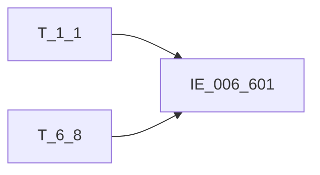

# 血缘-IE_006_601-表内外业务担保合同表-EAST5.0系统

## 页面边界

- 本页维护 `表内外业务担保合同表` 从一表通来源表到 EAST5.0 目标表 `IE_006_601` 的设计血缘。
- 证据为业务需求文档和工作区 GBase SQL 草案，尚未经过生产运行验证。
- 数据表字段定义见 [[数据表-IE_006_601-表内外业务担保合同表-EAST5.0系统]]；业务报送口径见 [[报表-IE_006_601-表内外业务担保合同表-EAST5.0系统]]。

## 系统边界

- 起始系统：一表通系统
- 目标系统：EAST5.0系统
- 是否跨系统血缘：是
- 目标对象：`IE_006_601` `表内外业务担保合同表`

## 业务链路摘要

- 按 `原始材料/业务需求/EAST5.0/041_表内外业务担保合同表.md` 的字段映射，将一表通来源表加工为 EAST5.0 `表内外业务担保合同表`。
- 表级规则：### 2.1 表级规则（Excel第 986 行） 取报送日期为当月，且剔除上月失效数据，通过抵质押类型且担保协议ID不为空的数据，或不为抵质押类型当期仍然生效的协议，关联9.3的担保协议ID，取不为保证金的数据作为报送范围
- SQL 草案采用按 `P_DATA_DATE` 清理后重插或增量边界过滤的方式；具体投产方式待验证。

## 直接上游对象

- [[数据表-T_1_1-机构信息-一表通系统]]：一表通来源表。
- [[数据表-T_6_8-担保协议-一表通系统]]：一表通来源表。

## 直接下游对象

- 目标数据表：[[数据表-IE_006_601-表内外业务担保合同表-EAST5.0系统]]
- 报表业务口径页：[[报表-IE_006_601-表内外业务担保合同表-EAST5.0系统]]
- SQL 草案：`工作区/SQL开发/EAST5.0系统/PROC_EAST_IE_006_601_BNWYWDBHTB_草案.sql`

## Nodes

- [[数据表-T_1_1-机构信息-一表通系统]]：一表通来源表。
- [[数据表-T_6_8-担保协议-一表通系统]]：一表通来源表。
- [[数据表-IE_006_601-表内外业务担保合同表-EAST5.0系统]]：EAST5.0 目标采集表。
- [[报表-IE_006_601-表内外业务担保合同表-EAST5.0系统]]：业务口径说明。

## 表级 Edge List

| From | To | Transform | Evidence |
| --- | --- | --- | --- |
| [[数据表-T_1_1-机构信息-一表通系统]] | [[数据表-IE_006_601-表内外业务担保合同表-EAST5.0系统]] | 字段映射、关联、过滤、码值/日期转换后装载 `IE_006_601` | [[来源-EAST5.0系统-IE_006_601-表内外业务担保合同表]]；SQL 草案 |
| [[数据表-T_6_8-担保协议-一表通系统]] | [[数据表-IE_006_601-表内外业务担保合同表-EAST5.0系统]] | 字段映射、关联、过滤、码值/日期转换后装载 `IE_006_601` | [[来源-EAST5.0系统-IE_006_601-表内外业务担保合同表]]；SQL 草案 |

## 字段级 Edge List

| 源对象 | 源字段 | 目标对象 | 目标字段 | 处理逻辑 | 关系类型 | 证据 |
| --- | --- | --- | --- | --- | --- | --- |
| [[数据表-T_1_1-机构信息-一表通系统]] | `A010003` | [[数据表-IE_006_601-表内外业务担保合同表-EAST5.0系统]] | `JRXKZH` | 直接映射，通过【担保协议】.【机构ID】=【机构信息】.【机构ID】关联。 | 直接映射 | [[来源-EAST5.0系统-IE_006_601-表内外业务担保合同表]]；SQL 草案 |
| [[数据表-T_6_8-担保协议-一表通系统]] | `待确认` | [[数据表-IE_006_601-表内外业务担保合同表-EAST5.0系统]] | `NBJGH` | 加工映射：截取第12位起 | 加工映射 | [[来源-EAST5.0系统-IE_006_601-表内外业务担保合同表]]；SQL 草案 |
| [[数据表-T_6_8-担保协议-一表通系统]] | `F080003` | [[数据表-IE_006_601-表内外业务担保合同表-EAST5.0系统]] | `BDBHTH` | 直接映射 | 直接映射 | [[来源-EAST5.0系统-IE_006_601-表内外业务担保合同表]]；SQL 草案 |
| [[数据表-T_6_8-担保协议-一表通系统]] | `F080006` | [[数据表-IE_006_601-表内外业务担保合同表-EAST5.0系统]] | `BDBYWLX` | 代码转换：；‘01’赋值为’表内信贷’ ；‘02’赋值为’承兑汇票’；‘03’赋值为’保函’ ；‘04’赋值为’信用证’ ；‘05’赋值为’贷款承诺‘；‘06’赋值为’委托贷款’ ；‘07’赋值为’自营投资’ ；‘00-XX’赋值为’其他-XX’；XX为银行自定义 | 码值转换/格式转换 | [[来源-EAST5.0系统-IE_006_601-表内外业务担保合同表]]；SQL 草案 |
| [[数据表-T_6_8-担保协议-一表通系统]] | `F080001` | [[数据表-IE_006_601-表内外业务担保合同表-EAST5.0系统]] | `DBHTH` | 直接映射 | 直接映射 | [[来源-EAST5.0系统-IE_006_601-表内外业务担保合同表]]；SQL 草案 |
| [[数据表-T_6_8-担保协议-一表通系统]] | `F080007` | [[数据表-IE_006_601-表内外业务担保合同表-EAST5.0系统]] | `DBHTLX` | 代码转换：01转为“一般担保合同”，02转为“最高额担保合同” | 码值转换/格式转换 | [[来源-EAST5.0系统-IE_006_601-表内外业务担保合同表]]；SQL 草案 |
| [[数据表-T_6_8-担保协议-一表通系统]] | `F080004` | [[数据表-IE_006_601-表内外业务担保合同表-EAST5.0系统]] | `DBLX` | 代码转换：；’01’转为’抵押’；’02’转为’质押’ ；’03、04、05、06’转为’保证’，；’07’转为’混合’，；’00-XX’转为’其他-XX’。；XX为银行自定义 | 码值转换/格式转换 | [[来源-EAST5.0系统-IE_006_601-表内外业务担保合同表]]；SQL 草案 |
| [[数据表-T_6_8-担保协议-一表通系统]] | `F080016` | [[数据表-IE_006_601-表内外业务担保合同表-EAST5.0系统]] | `DBBZ` | 直接映射 | 直接映射 | [[来源-EAST5.0系统-IE_006_601-表内外业务担保合同表]]；SQL 草案 |
| [[数据表-T_6_8-担保协议-一表通系统]] | `F080015` | [[数据表-IE_006_601-表内外业务担保合同表-EAST5.0系统]] | `DBJE` | 直接映射 | 直接映射 | [[来源-EAST5.0系统-IE_006_601-表内外业务担保合同表]]；SQL 草案 |
| [[数据表-T_6_8-担保协议-一表通系统]] | `F080013` | [[数据表-IE_006_601-表内外业务担保合同表-EAST5.0系统]] | `DBQSRQ` | 加工映射：需转成'YYYYMMDD'格式 | 加工映射 | [[来源-EAST5.0系统-IE_006_601-表内外业务担保合同表]]；SQL 草案 |
| [[数据表-T_6_8-担保协议-一表通系统]] | `F080014` | [[数据表-IE_006_601-表内外业务担保合同表-EAST5.0系统]] | `DBDQRQ` | 加工映射：需转成'YYYYMMDD'格式 | 加工映射 | [[来源-EAST5.0系统-IE_006_601-表内外业务担保合同表]]；SQL 草案 |
| [[数据表-T_6_8-担保协议-一表通系统]] | `F080020` | [[数据表-IE_006_601-表内外业务担保合同表-EAST5.0系统]] | `JBRGH` | 直接映射 | 直接映射 | [[来源-EAST5.0系统-IE_006_601-表内外业务担保合同表]]；SQL 草案 |
| [[数据表-T_6_8-担保协议-一表通系统]] | `F080019` | [[数据表-IE_006_601-表内外业务担保合同表-EAST5.0系统]] | `DBHTZT` | 代码转换：01转有效，其他转失效 | 码值转换/格式转换 | [[来源-EAST5.0系统-IE_006_601-表内外业务担保合同表]]；SQL 草案 |
| [[数据表-T_6_8-担保协议-一表通系统]] | `F080024` | [[数据表-IE_006_601-表内外业务担保合同表-EAST5.0系统]] | `BBZ` | 提取一表通《表6.8担保协议》备注，以“;”拼接。 | 加工映射 | [[来源-EAST5.0系统-IE_006_601-表内外业务担保合同表]]；SQL 草案 |
| [[数据表-T_6_8-担保协议-一表通系统]] | `F080025` | [[数据表-IE_006_601-表内外业务担保合同表-EAST5.0系统]] | `CJRQ` | 格式转换：格式转为'YYYYMMDD'。 | 码值转换/格式转换 | [[来源-EAST5.0系统-IE_006_601-表内外业务担保合同表]]；SQL 草案 |

## Graph-总览

## 回链检查

- 目标数据表页：已补 SQL 草案上游依赖摘要或待本次批处理补齐。
- 报表业务口径页：已创建或补充血缘回链。
- 一表通源表页：已补下游消费摘要或待本次批处理补齐。
- 当前字段级血缘基于业务需求和 SQL 草案，未运行验证，状态为待确认。

## 变更与冲突

- 本次为新增设计血缘或补齐草案血缘，不覆盖已验证生产血缘。
- 未发现需要将 `validated` 页面降级的情况；本页保持 `draft`。

## Open Questions

- GBase 草案中的复杂 JOIN、窗口去重、终态纳入和增量边界需要人工复核。
- 部分字段的码值 CASE 在草案中仍为待补，需要结合外部填报说明和跑数结果闭环。
- 外部监管实体页 wikilink 待补。

## 缺口字段（2026-05-04）

| 目标字段 | 字段名称 | 缺口说明 |
| --- | --- | --- |
| `GSFZJG` | 归属分支机构 | 本地 DDL 存在，但业务需求映射表和 SQL 草案未能确认来源，字段级血缘待补。 |
| `SENSITIVEFLAG` | 涉密标志 | 本地 DDL 存在，但业务需求映射表和 SQL 草案未能确认来源，字段级血缘待补。 |
