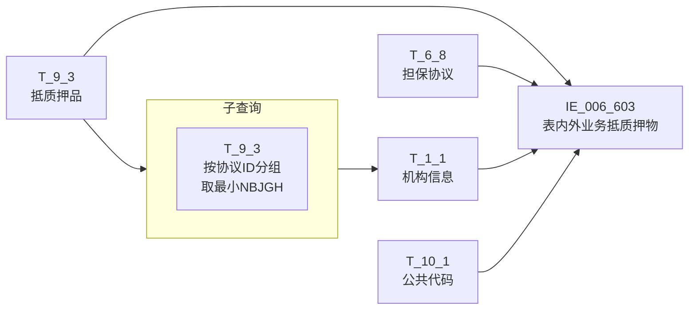
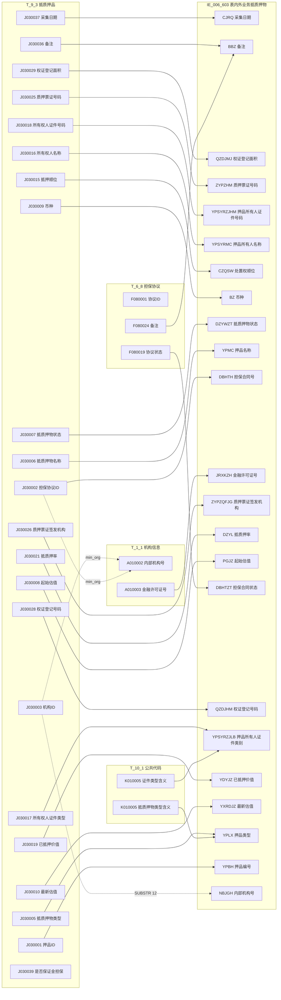

# 血缘-IE_006_603-表内外业务抵质押物-EAST5.0系统

## 页面边界

- 本页维护 `表内外业务抵质押物` 从一表通来源表到 EAST5.0 目标表 `IE_006_603` 的设计血缘。
- 证据为业务需求文档和工作区 GBase SQL 草案（2026-05-09 重构版），尚未经过生产运行验证。
- 数据表字段定义见 [[数据表-IE_006_603-表内外业务抵质押物-EAST5.0系统]]；业务报送口径见 [[报表-IE_006_603-表内外业务抵质押物-EAST5.0系统]]。

## 系统边界

- 起始系统：一表通系统
- 目标系统：EAST5.0系统
- 是否跨系统血缘：是
- 目标对象：`IE_006_603` `表内外业务抵质押物`

## 业务链路摘要

- 按 `原始材料/业务需求/EAST5.0/043_表内外业务抵质押物.md` 的字段映射，将一表通来源表加工为 EAST5.0 `表内外业务抵质押物`。
- 表级规则：取报送日期为当月，通过担保协议ID关联生成担保合同号，取不为保证金担保的数据作为报送范围。
- SQL 草案采用按 `P_DATA_DATE` 删除后重插的全量重跑方式。

## 校准说明（2026-05-09）

2026-05-09 依据 DDL 逐字段核对后，发现以下校准：

| 问题 | 旧版本 | 校准后 |
| --- | --- | --- |
| JOIN 键 | `ON 1=1` 占位 | T_9_3.J030002 = T_6_8.F080001；子查询 min_org；T_1_1 关联 |
| WHERE 条件 | 无 | `J030037=V_DATA_DATE` + 排除保证金 `J030039 NOT IN ('1','Y')` |
| CASE 码值 | 均为直接映射 | 全部补齐：DZYWZT、CZQSW、YPLX、YPSYRZJLB、YPBH |
| NBJGH | NULL | SUBSTR(J030003, 12) |
| JRXKZH | ON 1=1 占位 | 子查询 min NBJGH per 协议ID + T_1_1 关联 |
| ZYPZHM | NULL | T_9_3.J030025（原需求标注为"担保协议\|抵质押品"，实际 T_9_3 含本字段） |
| BBZ | 仅取 J030036 | CONCAT_WS(J030036, F080024) |
| CZQSW 来源 | 按 '01'/'02'/'03' 匹配 | DDL 确认 char(1) 实际值为 '1'/'2'/'3'，同时兼容双字符 |
| YPSYRZJLB 来源 | 按 '1999-XX' 字面匹配 | DDL 确认 char(4)，按 '1999'/'2999' 前缀 IN 匹配 |
| YPLX 码值 | 无映射 | 补充 T_10_1 码值映射（YBT-EAST-DZYWLX） |
| YPSYRZJLB 码值 | 无映射 | 补充 T_10_1 码值映射 |

## 直接上游对象

- [[数据表-T_1_1-机构信息-一表通系统]]：一表通来源表，提供 JRXKZH（A010003）。
- [[数据表-T_9_3-抵质押品-一表通系统]]：一表通来源表，主驱动表，提供 20+ 个字段。
- [[数据表-T_6_8-担保协议-一表通系统]]：一表通来源表，提供 DBHTZT（F080019）和 BBZ（F080024）。
- [[数据表-T_10_1-公共代码-一表通系统]]：一表通码值映射表，提供 YPLX、YPSYRZJLB 的中文含义。

## 直接下游对象

- 目标数据表：[[数据表-IE_006_603-表内外业务抵质押物-EAST5.0系统]]
- 报表业务口径页：[[报表-IE_006_603-表内外业务抵质押物-EAST5.0系统]]
- SQL 草案：`工作区/SQL开发/EAST5.0系统/PROC_EAST_IE_006_603_BNWYWDZYW_草案.sql`

## Nodes

- [[数据表-T_1_1-机构信息-一表通系统]]：一表通来源表（JRXKZH）。
- [[数据表-T_9_3-抵质押品-一表通系统]]：一表通来源表（主驱动）。
- [[数据表-T_6_8-担保协议-一表通系统]]：一表通来源表（DBHTZT、BBZ）。
- [[数据表-T_10_1-公共代码-一表通系统]]：一表通码值映射表（YPLX、YPSYRZJLB）。
- [[数据表-IE_006_603-表内外业务抵质押物-EAST5.0系统]]：EAST5.0 目标采集表。
- [[报表-IE_006_603-表内外业务抵质押物-EAST5.0系统]]：业务口径说明。

## 表级 Edge List

| From | To | Transform | Evidence |
| --- | --- | --- | --- |
| [[数据表-T_9_3-抵质押品-一表通系统]] | [[数据表-IE_006_603-表内外业务抵质押物-EAST5.0系统]] | 字段映射、关联、过滤、码值/日期转换后装载 `IE_006_603` | [[来源-EAST5.0系统-IE_006_603-表内外业务抵质押物]]；SQL 草案（2026-05-09 重构） |
| [[数据表-T_6_8-担保协议-一表通系统]] | [[数据表-IE_006_603-表内外业务抵质押物-EAST5.0系统]] | LEFT JOIN ON J030002=F080001，提供 DBHTZT、BBZ | SQL 草案（2026-05-09 重构） |
| [[数据表-T_1_1-机构信息-一表通系统]] | [[数据表-IE_006_603-表内外业务抵质押物-EAST5.0系统]] | LEFT JOIN（通过 min NBJGH 子查询），提供 JRXKZH | SQL 草案（2026-05-09 重构） |
| [[数据表-T_10_1-公共代码-一表通系统]] | [[数据表-IE_006_603-表内外业务抵质押物-EAST5.0系统]] | LEFT JOIN 码值映射，提供 YPLX、YPSYRZJLB 中文含义 | SQL 草案（2026-05-09 重构） |

## 字段级 Edge List

| 源对象 | 源字段 | 目标对象 | 目标字段 | 处理逻辑 | 关系类型 | 证据 |
| --- | --- | --- | --- | --- | --- | --- |
| [[数据表-T_9_3-抵质押品-一表通系统]] | `J030037` | [[数据表-IE_006_603-表内外业务抵质押物-EAST5.0系统]] | `CJRQ` | DATE→'YYYYMMDD' 格式转换，见 V_DATA_DATE 入参 | 码值转换/格式转换 | SQL 草案 |
| [[数据表-T_9_3-抵质押品-一表通系统]] | `J030036` | [[数据表-IE_006_603-表内外业务抵质押物-EAST5.0系统]] | `BBZ` | 与 T_6_8.F080024 用';'拼接 | 加工映射 | SQL 草案 |
| [[数据表-T_6_8-担保协议-一表通系统]] | `F080024` | [[数据表-IE_006_603-表内外业务抵质押物-EAST5.0系统]] | `BBZ` | 与 T_9_3.J030036 用';'拼接 | 加工映射 | SQL 草案 |
| [[数据表-T_9_3-抵质押品-一表通系统]] | `J030029` | [[数据表-IE_006_603-表内外业务抵质押物-EAST5.0系统]] | `QZDJMJ` | 直接映射，varchar→DECIMAL(20,2) | 直接映射 | SQL 草案 |
| [[数据表-T_9_3-抵质押品-一表通系统]] | `J030025` | [[数据表-IE_006_603-表内外业务抵质押物-EAST5.0系统]] | `ZYPZHM` | 直接映射。⚠️ 需求文档标注"担保协议\|抵质押品"，但 T_9_3 已含 J030025（质押票证号码） | 直接映射 | SQL 草案 |
| [[数据表-T_9_3-抵质押品-一表通系统]] | `J030018` | [[数据表-IE_006_603-表内外业务抵质押物-EAST5.0系统]] | `YPSYRZJHM` | 直接映射 | 直接映射 | SQL 草案 |
| [[数据表-T_9_3-抵质押品-一表通系统]] | `J030016` | [[数据表-IE_006_603-表内外业务抵质押物-EAST5.0系统]] | `YPSYRMC` | 直接映射 | 直接映射 | SQL 草案 |
| [[数据表-T_9_3-抵质押品-一表通系统]] | `J030015` | [[数据表-IE_006_603-表内外业务抵质押物-EAST5.0系统]] | `CZQSW` | 码值转换：'1/01'→第一顺位, '2/02'→第二顺位, '3/03'→第三顺位, '0-XX'→XX。⚠️ DDL char(1)，实际单字符 | 码值转换/格式转换 | SQL 草案 |
| [[数据表-T_9_3-抵质押品-一表通系统]] | `J030009` | [[数据表-IE_006_603-表内外业务抵质押物-EAST5.0系统]] | `BZ` | 直接映射 | 直接映射 | SQL 草案 |
| [[数据表-T_9_3-抵质押品-一表通系统]] | `J030007` | [[数据表-IE_006_603-表内外业务抵质押物-EAST5.0系统]] | `DZYWZT` | 码值转换：'01'→正常, '02'→冻结, '03'→查封, '04'→扣押, '00-XX'→其他-XX | 码值转换/格式转换 | SQL 草案 |
| [[数据表-T_9_3-抵质押品-一表通系统]] | `J030006` | [[数据表-IE_006_603-表内外业务抵质押物-EAST5.0系统]] | `YPMC` | 直接映射 | 直接映射 | SQL 草案 |
| [[数据表-T_9_3-抵质押品-一表通系统]] | `J030002` | [[数据表-IE_006_603-表内外业务抵质押物-EAST5.0系统]] | `DBHTH` | 直接映射 | 直接映射 | SQL 草案 |
| [[数据表-T_1_1-机构信息-一表通系统]] | `A010003` | [[数据表-IE_006_603-表内外业务抵质押物-EAST5.0系统]] | `JRXKZH` | 通过 min_org 子查询（按 J030002 分组取 min SUBSTR(J030003,12)），再关联 T_1_1.A010002 取 A010003 | 加工映射 | SQL 草案 |
| [[数据表-T_9_3-抵质押品-一表通系统]] | `J030026` | [[数据表-IE_006_603-表内外业务抵质押物-EAST5.0系统]] | `ZYPZQFJG` | 直接映射 | 直接映射 | SQL 草案 |
| [[数据表-T_9_3-抵质押品-一表通系统]] | `J030021` | [[数据表-IE_006_603-表内外业务抵质押物-EAST5.0系统]] | `DZYL` | 直接映射，varchar→DECIMAL(20,2) | 直接映射 | SQL 草案 |
| [[数据表-T_9_3-抵质押品-一表通系统]] | `J030008` | [[数据表-IE_006_603-表内外业务抵质押物-EAST5.0系统]] | `PGJZ` | 直接映射，varchar→DECIMAL(20,2) | 直接映射 | SQL 草案 |
| [[数据表-T_6_8-担保协议-一表通系统]] | `F080019` | [[数据表-IE_006_603-表内外业务抵质押物-EAST5.0系统]] | `DBHTZT` | 直接映射（LEFT JOIN ON J030002=F080001）。加工映射要求"按担保合同号分组取最大"，当前按单条映射 | 直接映射 | SQL 草案 |
| [[数据表-T_9_3-抵质押品-一表通系统]] | `J030028` | [[数据表-IE_006_603-表内外业务抵质押物-EAST5.0系统]] | `QZDJHM` | 直接映射 | 直接映射 | SQL 草案 |
| [[数据表-T_9_3-抵质押品-一表通系统]] | `J030017` | [[数据表-IE_006_603-表内外业务抵质押物-EAST5.0系统]] | `YPSYRZJLB` | 加工映射：'1999'/'2999'→'其他'，其余通过 T_10_1 映射。⚠️ DDL char(4)，'1999-XX' 格式为需求文档表述 | 加工映射 | SQL 草案 |
| [[数据表-T_10_1-公共代码-一表通系统]] | `K010005` | [[数据表-IE_006_603-表内外业务抵质押物-EAST5.0系统]] | `YPSYRZJLB` | T_10_1 码值映射（抵质押品.抵质押物所有权人证件类型） | 码值映射 | SQL 草案 |
| [[数据表-T_9_3-抵质押品-一表通系统]] | `J030019` | [[数据表-IE_006_603-表内外业务抵质押物-EAST5.0系统]] | `YDYJZ` | 直接映射，varchar→DECIMAL(20,2) | 直接映射 | SQL 草案 |
| [[数据表-T_9_3-抵质押品-一表通系统]] | `J030010` | [[数据表-IE_006_603-表内外业务抵质押物-EAST5.0系统]] | `YXRDJZ` | 直接映射，varchar→DECIMAL(20,2) | 直接映射 | SQL 草案 |
| [[数据表-T_9_3-抵质押品-一表通系统]] | `J030005` | [[数据表-IE_006_603-表内外业务抵质押物-EAST5.0系统]] | `YPLX` | 加工映射：'00-XX'→'其他-XX'，其余通过 T_10_1 映射 | 加工映射 | SQL 草案 |
| [[数据表-T_10_1-公共代码-一表通系统]] | `K010005` | [[数据表-IE_006_603-表内外业务抵质押物-EAST5.0系统]] | `YPLX` | T_10_1 码值映射（抵质押品.抵质押物类型，YBT-EAST-DZYWLX） | 码值映射 | SQL 草案 |
| [[数据表-T_9_3-抵质押品-一表通系统]] | `J030001` | [[数据表-IE_006_603-表内外业务抵质押物-EAST5.0系统]] | `YPBH` | 加工映射：含'_'时取前段，否则直接取 | 加工映射 | SQL 草案 |
| [[数据表-T_9_3-抵质押品-一表通系统]] | `J030003` | [[数据表-IE_006_603-表内外业务抵质押物-EAST5.0系统]] | `NBJGH` | 提取 SUBSTR(J030003, 12)。⚠️ 需求文档标注来源为"机构id"，实际从 J030003 提取第12位起 | 加工映射 | SQL 草案 |

## Graph-总览

## Graph-详细字段级

## 回链检查

- 目标数据表页：已补 SQL 草案上游依赖摘要。
- 报表业务口径页：已创建或补充血缘回链。
- 一表通源表页（T_9_3、T_6_8、T_1_1、T_10_1）：需补充下游消费记录。
- 当前字段级血缘基于业务需求和 SQL 草案（2026-05-09 重构），未运行验证，状态为待确认。

## 变更与冲突

- 2026-05-09：依据 DDL 逐字段核对后全面校准了字段来源、JOIN 键、CASE 码值、NBJGH/JRXKZH 逻辑和 BBZ 拼接。
- 发现字段来源冲突：J030015 DDL char(1) vs 需求文档写 '01'/'02'/'03'；ZYPZHM 需求文档标注来源模糊。
- 未发现需要将 `validated` 页面降级的情况；本页保持 `draft`。

## Open Questions

- T_10_1 中 '抵质押品.抵质押物类型' 和 '抵质押品.抵质押物所有权人证件类型' 的实际码值列表需外部填报说明确认。
- DBHTZT 当前取单条 T_6_8.F080019 值，但需求文档要求"按担保合同号分组取最大的担保合同状态"，需验证是否同一合同号对应多条协议记录。
- 终态纳入规则（上一采集日至采集日期间结清/失效/终结的记录）当前未实现跨月回算逻辑。
- GBase 环境执行验证待完成。

## 缺口字段

| 目标字段 | 字段名称 | 缺口说明 |
| --- | --- | --- |
| `SENSITIVEFLAG` | 涉密标志 | 本地 DDL 存在，但业务需求映射表和 SQL 草案未能确认来源，字段级血缘待补。 |
| `YPSYRKHLB` | 押品所有人客户类别 | 本地 DDL 存在，但业务需求映射表和 SQL 草案未能确认来源，字段级血缘待补。 |
| `GSFZJG` | 归属分支机构 | 本地 DDL 存在，但业务需求映射表和 SQL 草案未能确认来源，字段级血缘待补。 |
