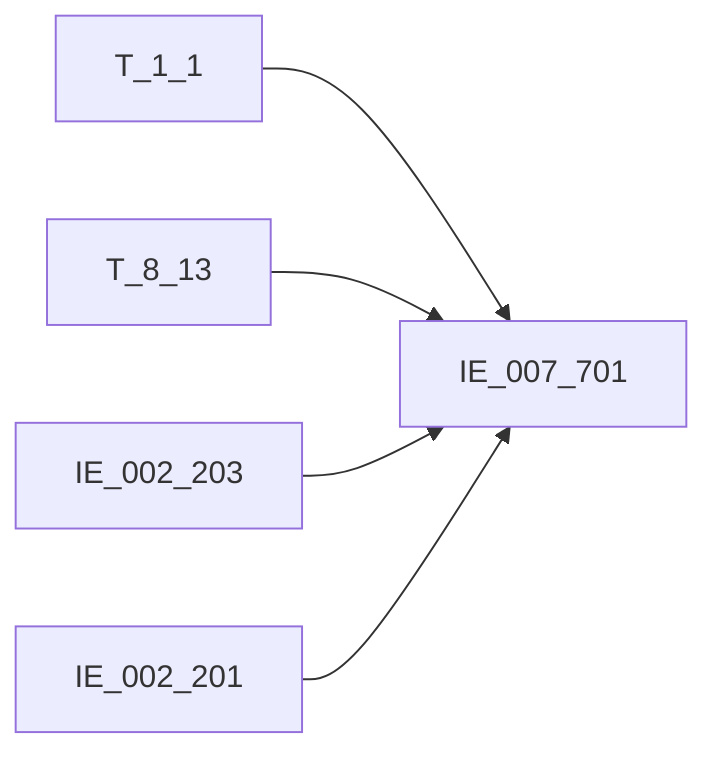

# 血缘-IE_007_701-授信信息表-EAST5.0系统

## 页面边界

- 本页维护 `授信信息表` 从一表通来源表到 EAST5.0 目标表 `IE_007_701` 的设计血缘。
- 证据为业务需求文档 `044_授信信息表.md` 和 `PROC_EAST_IE_007_701_SXXXB_重构.sql`。
- 数据表字段定义见 [[数据表-IE_007_701-授信信息表-EAST5.0系统]]；业务报送口径见 [[报表-IE_007_701-授信信息表-EAST5.0系统]]。

## 系统边界

- 起始系统：一表通系统（T_8_13, T_1_1） + EAST5.0系统（IE_002_203, IE_002_201）
- 目标系统：EAST5.0系统
- 是否跨系统血缘：是
- 目标对象：`IE_007_701` `授信信息表`

## 业务链路摘要

- 按 `原始材料/业务需求/EAST5.0/044_授信信息表.md` 的字段映射，将一表通来源表加工为 EAST5.0 `授信信息表`。
- 表级规则：### 2.1 表级规则（Excel第 1039 行） 转换时从【授信情况】出，剔除如下三部分数据： 1、【授信情况】.【授信种类】等于'06' 2、【授信情况】.【客户类别】等于'02'的数据 3、【授信情况】.【授信失效日期】小于上月的数据
- SQL 重构后采用 DELETE + INSERT 全量重跑模式，按 `P_DATA_DATE` 清洗目标表后重新插入。

## 直接上游对象

- [[数据表-T_8_13-授信情况-一表通系统]]：主源表，提供授信明细
- [[数据表-T_1_1-机构信息-一表通系统]]：LEFT JOIN，提供银行机构代码/金融许可证号
- [[数据表-IE_002_203-对公客户信息表-EAST5.0系统]]：LEFT JOIN，提供客户名称/证件类别/证件号码（优先）
- [[数据表-IE_002_201-个人基础信息表-EAST5.0系统]]：LEFT JOIN，提供客户姓名/证件类别/证件号码（次选）

## 直接下游对象

- 目标数据表：[[数据表-IE_007_701-授信信息表-EAST5.0系统]]
- 报表业务口径页：[[报表-IE_007_701-授信信息表-EAST5.0系统]]
- SQL 重构稿：`工作区/SQL开发/EAST5.0系统/PROC_EAST_IE_007_701_SXXXB_重构.sql`

## Nodes

- [[数据表-T_1_1-机构信息-一表通系统]]
- [[数据表-T_8_13-授信情况-一表通系统]]
- [[数据表-IE_002_203-对公客户信息表-EAST5.0系统]]
- [[数据表-IE_002_201-个人基础信息表-EAST5.0系统]]
- [[数据表-IE_007_701-授信信息表-EAST5.0系统]]
- [[报表-IE_007_701-授信信息表-EAST5.0系统]]

## 表级 Edge List

| From | To | Transform | Evidence |
| --- | --- | --- | --- |
| [[数据表-T_8_13-授信情况-一表通系统]] | [[数据表-IE_007_701-授信信息表-EAST5.0系统]] | 字段映射、关联、过滤、码值/日期转换后装载 `IE_007_701` | [[来源-EAST5.0系统-IE_007_701-授信信息表]]；`PROC_EAST_IE_007_701_SXXXB_重构.sql` |
| [[数据表-T_1_1-机构信息-一表通系统]] | [[数据表-IE_007_701-授信信息表-EAST5.0系统]] | LEFT JOIN ON src.H130003=s1.A010001，提供银行机构代码/金融许可证号 | `PROC_EAST_IE_007_701_SXXXB_重构.sql` |
| [[数据表-IE_002_203-对公客户信息表-EAST5.0系统]] | [[数据表-IE_007_701-授信信息表-EAST5.0系统]] | LEFT JOIN ON src.H130002=dg.KHTYBH，提供客户名称/证件类别/证件号码（优先） | `PROC_EAST_IE_007_701_SXXXB_重构.sql` |
| [[数据表-IE_002_201-个人基础信息表-EAST5.0系统]] | [[数据表-IE_007_701-授信信息表-EAST5.0系统]] | LEFT JOIN ON src.H130002=gr.KHTYBH，提供客户姓名/证件类别/证件号码（次选） | `PROC_EAST_IE_007_701_SXXXB_重构.sql` |

## 字段级 Edge List

| 源对象 | 源字段 | 目标对象 | 目标字段 | 处理逻辑 | 关系类型 | 证据 |
| --- | --- | --- | --- | --- | --- | --- |
| [[数据表-T_1_1-机构信息-一表通系统]] | `A010006` | [[数据表-IE_007_701-授信信息表-EAST5.0系统]] | `YHJGDM` | 直接映射，通过src.H130003=s1.A010001关联 | 直接映射 | 重构SQL |
| [[数据表-T_1_1-机构信息-一表通系统]] | `A010003` | [[数据表-IE_007_701-授信信息表-EAST5.0系统]] | `JRXKZH` | 直接映射，通过src.H130003=s1.A010001关联 | 直接映射 | 重构SQL |
| [[数据表-T_8_13-授信情况-一表通系统]] | `H130003` | [[数据表-IE_007_701-授信信息表-EAST5.0系统]] | `NBJGH` | SUBSTR(TRIM(src.H130003), 12)截取第12位起 | 加工映射 | 重构SQL |
| [[数据表-T_8_13-授信情况-一表通系统]] | `H130002` | [[数据表-IE_007_701-授信信息表-EAST5.0系统]] | `KHTYBH` | 直接映射：src.H130002 | 直接映射 | 重构SQL |
| [[数据表-IE_002_203-对公客户信息表-EAST5.0系统]] | `KHMC` | [[数据表-IE_007_701-授信信息表-EAST5.0系统]] | `KHMC` | COALESCE(dg.KHMC, gr.KHXM, '') 优先对公 | 加工映射 | 重构SQL |
| [[数据表-IE_002_201-个人基础信息表-EAST5.0系统]] | `KHXM` | [[数据表-IE_007_701-授信信息表-EAST5.0系统]] | `KHMC` | COALESCE(dg.KHMC, gr.KHXM, '') 对公为空时取个人 | 加工映射 | 重构SQL |
| [[数据表-IE_002_203-对公客户信息表-EAST5.0系统]] | `ZJLB` | [[数据表-IE_007_701-授信信息表-EAST5.0系统]] | `KHZJLB` | COALESCE(dg.ZJLB, gr.ZJLB, '') 优先对公 | 加工映射 | 重构SQL |
| [[数据表-IE_002_201-个人基础信息表-EAST5.0系统]] | `ZJLB` | [[数据表-IE_007_701-授信信息表-EAST5.0系统]] | `KHZJLB` | COALESCE(dg.ZJLB, gr.ZJLB, '') 对公为空时取个人 | 加工映射 | 重构SQL |
| [[数据表-IE_002_203-对公客户信息表-EAST5.0系统]] | `ZJHM` | [[数据表-IE_007_701-授信信息表-EAST5.0系统]] | `KHZJHM` | COALESCE(dg.ZJHM, gr.ZJHM, '') 优先对公 | 加工映射 | 重构SQL |
| [[数据表-IE_002_201-个人基础信息表-EAST5.0系统]] | `ZJHM` | [[数据表-IE_007_701-授信信息表-EAST5.0系统]] | `KHZJHM` | COALESCE(dg.ZJHM, gr.ZJHM, '') 对公为空时取个人 | 加工映射 | 重构SQL |
| [[数据表-T_8_13-授信情况-一表通系统]] | `H130001` | [[数据表-IE_007_701-授信信息表-EAST5.0系统]] | `SXXYH` | 直接映射：src.H130001 | 直接映射 | 重构SQL |
| [[数据表-T_8_13-授信情况-一表通系统]] | `H130026` | [[数据表-IE_007_701-授信信息表-EAST5.0系统]] | `SXXYMC` | 直接映射：src.H130026 | 直接映射 | 重构SQL |
| [[数据表-T_8_13-授信情况-一表通系统]] | `H130010` | [[数据表-IE_007_701-授信信息表-EAST5.0系统]] | `EDSQRQ` | REPLACE(CAST(H130010 AS CHAR), '-', '') | 加工映射 | 重构SQL |
| [[数据表-T_8_13-授信情况-一表通系统]] | `H130005` | [[数据表-IE_007_701-授信信息表-EAST5.0系统]] | `SXZTZL` | CASE码值转换：01→单一法人授信,03→同业客户授信,04→供应链融资,05/06→个人客户授信,其他→其他-XX | 码值转换 | 重构SQL |
| [[数据表-T_8_13-授信情况-一表通系统]] | `H130006` | [[数据表-IE_007_701-授信信息表-EAST5.0系统]] | `SXZL` | CASE码值转换：01→综合额度授信,02→低风险额度授信,03→信用卡额度授信,04→临时额度授信,05→专项额度授信,其他→其他-XX | 码值转换 | 重构SQL |
| [[数据表-T_8_13-授信情况-一表通系统]] | `H130008` | [[数据表-IE_007_701-授信信息表-EAST5.0系统]] | `SXED` | CAST(NULLIF(TRIM(H130008),'') AS DECIMAL(20,2)) | 直接映射 | 重构SQL |
| [[数据表-T_8_13-授信情况-一表通系统]] | `H130015` | [[数据表-IE_007_701-授信信息表-EAST5.0系统]] | `YYED` | CAST(NULLIF(TRIM(H130015),'') AS DECIMAL(20,2)) | 直接映射 | 重构SQL |
| [[数据表-T_8_13-授信情况-一表通系统]] | `H130007` | [[数据表-IE_007_701-授信信息表-EAST5.0系统]] | `BZ` | 直接映射：src.H130007 | 直接映射 | 重构SQL |
| [[数据表-T_8_13-授信情况-一表通系统]] | `H130011` | [[数据表-IE_007_701-授信信息表-EAST5.0系统]] | `SXKSRQ` | REPLACE(CAST(H130011 AS CHAR), '-', '') | 加工映射 | 重构SQL |
| [[数据表-T_8_13-授信情况-一表通系统]] | `H130012` | [[数据表-IE_007_701-授信信息表-EAST5.0系统]] | `SXDQRQ` | REPLACE(CAST(H130012 AS CHAR), '-', '') | 加工映射 | 重构SQL |
| [[数据表-T_8_13-授信情况-一表通系统]] | `H130019` | [[数据表-IE_007_701-授信信息表-EAST5.0系统]] | `SXJCYJ` | 直接映射：src.H130019 | 直接映射 | 重构SQL |
| [[数据表-T_8_13-授信情况-一表通系统]] | `H130021` | [[数据表-IE_007_701-授信信息表-EAST5.0系统]] | `SPRGH` | CASE WHEN '自动' THEN NULL ELSE src.H130021 END | 加工映射 | 重构SQL |
| [[数据表-T_8_13-授信情况-一表通系统]] | `H130020` | [[数据表-IE_007_701-授信信息表-EAST5.0系统]] | `JBRGH` | CASE WHEN '自动' THEN NULL ELSE src.H130020 END | 加工映射 | 重构SQL |
| [[数据表-T_8_13-授信情况-一表通系统]] | `H130022` | [[数据表-IE_007_701-授信信息表-EAST5.0系统]] | `SXZT` | CASE码值转换：1→有效, 0→无效 | 码值转换 | 重构SQL |
| [[数据表-T_8_13-授信情况-一表通系统]] | `H130033` | [[数据表-IE_007_701-授信信息表-EAST5.0系统]] | `BBZ` | 直接映射：src.H130033 | 直接映射 | 重构SQL |
| 入参 | `P_DATA_DATE` | [[数据表-IE_007_701-授信信息表-EAST5.0系统]] | `CJRQ` | 入参P_DATA_DATE直接赋值，非源表H130023 | 参数映射 | 重构SQL |
| - | - | [[数据表-IE_007_701-授信信息表-EAST5.0系统]] | `KHLB` | 缺口字段，SQL置NULL | 未映射 | 待确认 |
| - | - | [[数据表-IE_007_701-授信信息表-EAST5.0系统]] | `SENSITIVEFLAG` | 缺口字段，SQL置NULL | 未映射 | 待确认 |
| - | - | [[数据表-IE_007_701-授信信息表-EAST5.0系统]] | `GSFZJG` | 缺口字段，SQL置NULL | 未映射 | 待确认 |

## Graph-总览

## 回链检查

- 目标数据表页：已回链。
- 报表业务口径页：已回链。
- 一表通源表页：T_8_13和T_1_1页已记录本表为下游消费。

## 变更与冲突

- 2026-05-09：按重构SQL补齐字段级血缘，23/26字段已闭环。
- 3个缺口字段（KHLB/SENSITIVEFLAG/GSFZJG）未纳入血缘。

## Open Questions

- 缺口字段的最终来源待业务确认。
- CJRQ使用入参P_DATA_DATE，若现场要求使用源表H130023需调整。
