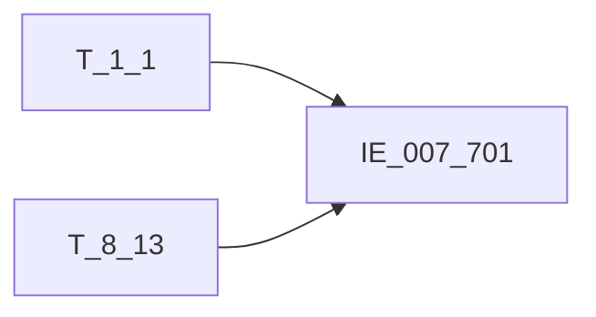

# 血缘-IE_007_701-授信信息表-EAST5.0系统

## 页面边界

- 本页维护 `授信信息表` 从一表通来源表到 EAST5.0 目标表 `IE_007_701` 的设计血缘。
- 证据为业务需求文档和工作区 GBase SQL 草案，尚未经过生产运行验证。
- 数据表字段定义见 [[数据表-IE_007_701-授信信息表-EAST5.0系统]]；业务报送口径见 [[报表-IE_007_701-授信信息表-EAST5.0系统]]。

## 系统边界

- 起始系统：一表通系统
- 目标系统：EAST5.0系统
- 是否跨系统血缘：是
- 目标对象：`IE_007_701` `授信信息表`

## 业务链路摘要

- 按 `原始材料/业务需求/EAST5.0/044_授信信息表.md` 的字段映射，将一表通来源表加工为 EAST5.0 `授信信息表`。
- 表级规则：### 2.1 表级规则（Excel第 1039 行） 转换时从【授信情况】出，剔除如下三部分数据： 1、【授信情况】.【授信种类】等于'06' 2、【授信情况】.【客户类别】等于'02'的数据 3、【授信情况】.【授信失效日期】小于上月的数据
- SQL 草案采用按 `P_DATA_DATE` 清理后重插或增量边界过滤的方式；具体投产方式待验证。

## 直接上游对象

- [[数据表-T_1_1-机构信息-一表通系统]]：一表通来源表。
- [[数据表-T_8_13-授信情况-一表通系统]]：一表通来源表。

## 直接下游对象

- 目标数据表：[[数据表-IE_007_701-授信信息表-EAST5.0系统]]
- 报表业务口径页：[[报表-IE_007_701-授信信息表-EAST5.0系统]]
- SQL 草案：`工作区/SQL开发/EAST5.0系统/PROC_EAST_IE_007_701_SXXXB_草案.sql`

## Nodes

- [[数据表-T_1_1-机构信息-一表通系统]]：一表通来源表。
- [[数据表-T_8_13-授信情况-一表通系统]]：一表通来源表。
- [[数据表-IE_007_701-授信信息表-EAST5.0系统]]：EAST5.0 目标采集表。
- [[报表-IE_007_701-授信信息表-EAST5.0系统]]：业务口径说明。

## 表级 Edge List

| From | To | Transform | Evidence |
| --- | --- | --- | --- |
| [[数据表-T_1_1-机构信息-一表通系统]] | [[数据表-IE_007_701-授信信息表-EAST5.0系统]] | 字段映射、关联、过滤、码值/日期转换后装载 `IE_007_701` | [[来源-EAST5.0系统-IE_007_701-授信信息表]]；SQL 草案 |
| [[数据表-T_8_13-授信情况-一表通系统]] | [[数据表-IE_007_701-授信信息表-EAST5.0系统]] | 字段映射、关联、过滤、码值/日期转换后装载 `IE_007_701` | [[来源-EAST5.0系统-IE_007_701-授信信息表]]；SQL 草案 |

## 字段级 Edge List

| 源对象 | 源字段 | 目标对象 | 目标字段 | 处理逻辑 | 关系类型 | 证据 |
| --- | --- | --- | --- | --- | --- | --- |
| [[数据表-T_1_1-机构信息-一表通系统]] | `A010006` | [[数据表-IE_007_701-授信信息表-EAST5.0系统]] | `YHJGDM` | 直接映射，通过【授信情况】.【机构ID】关联【机构信息】.【机构ID】关联，获取【机构信息】.【支付行号】。 | 直接映射 | [[来源-EAST5.0系统-IE_007_701-授信信息表]]；SQL 草案 |
| [[数据表-T_1_1-机构信息-一表通系统]] | `A010003` | [[数据表-IE_007_701-授信信息表-EAST5.0系统]] | `JRXKZH` | 直接映射，通过【授信情况】.【机构ID】关联【机构信息】.【机构ID】关联，获取【机构信息】.【金融许可证号】。 | 直接映射 | [[来源-EAST5.0系统-IE_007_701-授信信息表]]；SQL 草案 |
| [[数据表-T_8_13-授信情况-一表通系统]] | `H130003` | [[数据表-IE_007_701-授信信息表-EAST5.0系统]] | `NBJGH` | 加工映射：【授信情况】.【机构ID】截取第12位起 | 加工映射 | [[来源-EAST5.0系统-IE_007_701-授信信息表]]；SQL 草案 |
| [[数据表-T_8_13-授信情况-一表通系统]] | `H130002` | [[数据表-IE_007_701-授信信息表-EAST5.0系统]] | `KHTYBH` | 直接映射：【授信情况】.客户ID | 直接映射 | [[来源-EAST5.0系统-IE_007_701-授信信息表]]；SQL 草案 |
| 待确认 | `待确认` | [[数据表-IE_007_701-授信信息表-EAST5.0系统]] | `KHMC` | 客户姓名 | 直接映射 | [[来源-EAST5.0系统-IE_007_701-授信信息表]]；SQL 草案 |
| 待确认 | `待确认` | [[数据表-IE_007_701-授信信息表-EAST5.0系统]] | `KHZJLB` | 加工映射 | 直接映射 | [[来源-EAST5.0系统-IE_007_701-授信信息表]]；SQL 草案 |
| 待确认 | `待确认` | [[数据表-IE_007_701-授信信息表-EAST5.0系统]] | `KHZJHM` | 加工映射 | 直接映射 | [[来源-EAST5.0系统-IE_007_701-授信信息表]]；SQL 草案 |
| [[数据表-T_8_13-授信情况-一表通系统]] | `H130001` | [[数据表-IE_007_701-授信信息表-EAST5.0系统]] | `SXXYH` | 直接映射：【授信情况】.【授信ID】 | 直接映射 | [[来源-EAST5.0系统-IE_007_701-授信信息表]]；SQL 草案 |
| [[数据表-T_8_13-授信情况-一表通系统]] | `H130026` | [[数据表-IE_007_701-授信信息表-EAST5.0系统]] | `SXXYMC` | 直接映射：【授信情况】.【授信协议名称】 | 直接映射 | [[来源-EAST5.0系统-IE_007_701-授信信息表]]；SQL 草案 |
| [[数据表-T_8_13-授信情况-一表通系统]] | `H130010` | [[数据表-IE_007_701-授信信息表-EAST5.0系统]] | `EDSQRQ` | 加工映射：取【授信情况】.【额度申请日期】，把字段中的'-'替换为'' | 加工映射 | [[来源-EAST5.0系统-IE_007_701-授信信息表]]；SQL 草案 |
| [[数据表-T_8_13-授信情况-一表通系统]] | `H130005` | [[数据表-IE_007_701-授信信息表-EAST5.0系统]] | `SXZTZL` | 码值转换：取【授信情况】.【客户类别】，码值转换：01转“单一法人授信” ，剔除02， 03转“同业客户授信” ，04转“供应链融资”，05转“个人客户授信”，06转“个人客户授信”，07-XX转“其他-XX” | 码值转换/格式转换 | [[来源-EAST5.0系统-IE_007_701-授信信息表]]；SQL 草案 |
| [[数据表-T_8_13-授信情况-一表通系统]] | `H130006` | [[数据表-IE_007_701-授信信息表-EAST5.0系统]] | `SXZL` | 码值转换：取【授信情况】.【授信种类】，码值转换：01转“综合额度授信”；02转“低风险额度授信”；03转“信用卡额度授信”；04转“临时额度授信”；05转“专项额度授信”；00-XX转“其他-XX” | 码值转换/格式转换 | [[来源-EAST5.0系统-IE_007_701-授信信息表]]；SQL 草案 |
| [[数据表-T_8_13-授信情况-一表通系统]] | `H130008` | [[数据表-IE_007_701-授信信息表-EAST5.0系统]] | `SXED` | 直接映射：【授信情况】.【授信额度】 | 直接映射 | [[来源-EAST5.0系统-IE_007_701-授信信息表]]；SQL 草案 |
| [[数据表-T_8_13-授信情况-一表通系统]] | `H130015` | [[数据表-IE_007_701-授信信息表-EAST5.0系统]] | `YYED` | 直接映射：【授信情况】.【已用额度】 | 直接映射 | [[来源-EAST5.0系统-IE_007_701-授信信息表]]；SQL 草案 |
| [[数据表-T_8_13-授信情况-一表通系统]] | `H130007` | [[数据表-IE_007_701-授信信息表-EAST5.0系统]] | `BZ` | 直接映射：【授信情况】.【授信币种】 | 直接映射 | [[来源-EAST5.0系统-IE_007_701-授信信息表]]；SQL 草案 |
| [[数据表-T_8_13-授信情况-一表通系统]] | `H130011` | [[数据表-IE_007_701-授信信息表-EAST5.0系统]] | `SXKSRQ` | 加工映射：【授信情况】.【授信起始日期】，把字段中的'-'替换为'' | 加工映射 | [[来源-EAST5.0系统-IE_007_701-授信信息表]]；SQL 草案 |
| [[数据表-T_8_13-授信情况-一表通系统]] | `H130012` | [[数据表-IE_007_701-授信信息表-EAST5.0系统]] | `SXDQRQ` | 加工映射：【授信情况】.【授信到期日期】，把字段中的'-'替换为'' | 加工映射 | [[来源-EAST5.0系统-IE_007_701-授信信息表]]；SQL 草案 |
| [[数据表-T_8_13-授信情况-一表通系统]] | `H130019` | [[数据表-IE_007_701-授信信息表-EAST5.0系统]] | `SXJCYJ` | 直接映射：【授信情况】.【授信审批意见】 | 直接映射 | [[来源-EAST5.0系统-IE_007_701-授信信息表]]；SQL 草案 |
| [[数据表-T_8_13-授信情况-一表通系统]] | `H130021` | [[数据表-IE_007_701-授信信息表-EAST5.0系统]] | `SPRGH` | 加工映射：【授信情况】.【审批员工ID】，如为“自动”则转为空，否则取原值 | 加工映射 | [[来源-EAST5.0系统-IE_007_701-授信信息表]]；SQL 草案 |
| [[数据表-T_8_13-授信情况-一表通系统]] | `H130020` | [[数据表-IE_007_701-授信信息表-EAST5.0系统]] | `JBRGH` | 加工映射：【授信情况】.【经办员工ID】，如为“自动”则转为空，否则取原值 | 加工映射 | [[来源-EAST5.0系统-IE_007_701-授信信息表]]；SQL 草案 |
| [[数据表-T_8_13-授信情况-一表通系统]] | `H130022` | [[数据表-IE_007_701-授信信息表-EAST5.0系统]] | `SXZT` | 码值转换：【授信情况】.【授信状态】，码值转换1转有效，0转无效 | 码值转换/格式转换 | [[来源-EAST5.0系统-IE_007_701-授信信息表]]；SQL 草案 |
| [[数据表-T_8_13-授信情况-一表通系统]] | `H130033` | [[数据表-IE_007_701-授信信息表-EAST5.0系统]] | `BBZ` | 直接映射：取一表通【授信情况】.【备注】 | 直接映射 | [[来源-EAST5.0系统-IE_007_701-授信信息表]]；SQL 草案 |
| [[数据表-T_8_13-授信情况-一表通系统]] | `H130023` | [[数据表-IE_007_701-授信信息表-EAST5.0系统]] | `CJRQ` | 加工映射：取【授信情况】.【采集日期】，把字段中的'-'替换为'' | 加工映射 | [[来源-EAST5.0系统-IE_007_701-授信信息表]]；SQL 草案 |

## Graph-总览

## 回链检查

- 目标数据表页：已补 SQL 草案上游依赖摘要或待本次批处理补齐。
- 报表业务口径页：已创建或补充血缘回链。
- 一表通源表页：已补下游消费摘要或待本次批处理补齐。
- 当前字段级血缘基于业务需求和 SQL 草案，未运行验证，状态为待确认。

## 变更与冲突

- 本次为新增设计血缘或补齐草案血缘，不覆盖已验证生产血缘。
- 未发现需要将 `validated` 页面降级的情况；本页保持 `draft`。

## Open Questions

- GBase 草案中的复杂 JOIN、窗口去重、终态纳入和增量边界需要人工复核。
- 部分字段的码值 CASE 在草案中仍为待补，需要结合外部填报说明和跑数结果闭环。
- 外部监管实体页 wikilink 待补。

## 缺口字段（2026-05-04）

| 目标字段 | 字段名称 | 缺口说明 |
| --- | --- | --- |
| `KHLB` | 客户类别 | 本地 DDL 存在，但业务需求映射表和 SQL 草案未能确认来源，字段级血缘待补。 |
| `SENSITIVEFLAG` | 涉密标志 | 本地 DDL 存在，但业务需求映射表和 SQL 草案未能确认来源，字段级血缘待补。 |
| `GSFZJG` | 归属分支机构 | 本地 DDL 存在，但业务需求映射表和 SQL 草案未能确认来源，字段级血缘待补。 |
