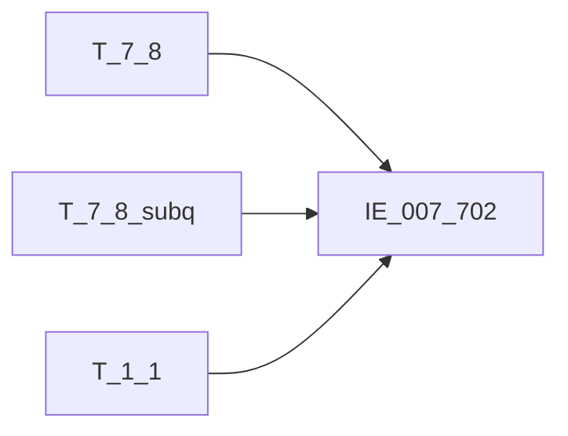

# 血缘-IE_007_702-资产核销表-EAST5.0系统

## 页面边界

- 本页维护 `资产核销表` 从一表通来源表到 EAST5.0 目标表 `IE_007_702` 的设计血缘。
- 证据为业务需求文档和工作区 GBase SQL 草案，尚未经过生产运行验证。
- 数据表字段定义见 [[数据表-IE_007_702-资产核销表-EAST5.0系统]]；业务报送口径见 [[报表-IE_007_702-资产核销表-EAST5.0系统]]。

## 系统边界

- 起始系统：一表通系统
- 目标系统：EAST5.0系统
- 是否跨系统血缘：是
- 目标对象：`IE_007_702` `资产核销表`

## 业务链路摘要

- 按 `原始材料/业务需求/EAST5.0/045_资产核销表.md` 的字段映射，将一表通来源表加工为 EAST5.0 `资产核销表`。
- 表级规则：### 2.1 表级规则（Excel第 1063 行） 主表：【一表通】【不良资产处置】 子查询：主表【一表通】【不良资产处置】（查询【细分资产ID】、【协议ID】、【币种】、【资产类型】，【处置收回日期】、【收回标识】，【处置状态】、【收回员工ID】、【备注】，按【细分资产ID、协议ID、币种、资产类型】汇总【收回资产金额】，按【细分资产ID、协议ID、币种、资产类型】汇总【收回表内利息金额+收回表外利息金额】，按【细分资产ID、协议ID、币种、资产类型】分组对【采集日期】降序、【处置收回日期】降序排列，过滤条件：（（【采集日期】小于等于跑批日期且大于等于20250101且【处置类型】为'70'已核销收回）或【采集日期】为19001231） 左关联：子查询 关联条件：主表【不良资产处置】.【细分资产ID】=子查询【细分资产ID】 且主表【不良资产处置】.【协议ID】=子查询【协议ID】 且主表【不良资产处置】.【币种】=子查询【币种】 且主表【不良资产处置】.【资产类型】=子查询【资产类型】 且子查询【排序】=1 左关联：【一表通】【机构信息】 关联条件：主表【不良资产处置】.【机构ID】从第12位开始截取=【机构信息】.【机构ID】从第12位开始截取 且【机构信息】.【采集日期】等于跑批日期
- SQL 草案采用按 `P_DATA_DATE` 清理后重插或增量边界过滤的方式；具体投产方式待验证。

## 直接上游对象

- [[数据表-T_7_8-不良资产处置-一表通系统]]：一表通来源表（主表）。
- [[数据表-T_1_1-机构信息-一表通系统]]：一表通机构信息表（获取金融许可证号）。
- T_7_8 子查询 subq_agg：T_7_8 自关联子查询（按细分资产ID/协议ID/币种/资产类型分组，取已核销收回最新记录，汇总收回金额）。

## 直接下游对象

- 目标数据表：[[数据表-IE_007_702-资产核销表-EAST5.0系统]]
- 报表业务口径页：[[报表-IE_007_702-资产核销表-EAST5.0系统]]
- SQL 草案：`工作区/SQL开发/EAST5.0系统/PROC_EAST_IE_007_702_ZCHXB_草案.sql`

## Nodes

- [[数据表-T_7_8-不良资产处置-一表通系统]]：一表通来源表（主表）。
- [[数据表-T_1_1-机构信息-一表通系统]]：一表通机构信息表。
- [[数据表-IE_007_702-资产核销表-EAST5.0系统]]：EAST5.0 目标采集表。
- [[报表-IE_007_702-资产核销表-EAST5.0系统]]：业务口径说明。
- T_7_8 子查询 subq_agg：自关联子查询（已核销收回汇总）。

## 表级 Edge List

| From | To | Transform | Evidence |
| --- | --- | --- | --- |
| [[数据表-T_7_8-不良资产处置-一表通系统]] | [[数据表-IE_007_702-资产核销表-EAST5.0系统]] | 字段映射、关联、过滤、码值/日期转换后装载 `IE_007_702` | [[来源-EAST5.0系统-IE_007_702-资产核销表]]；`PROC_EAST_IE_007_702_ZCHXB_重构.sql` |
| [[数据表-T_1_1-机构信息-一表通系统]] | [[数据表-IE_007_702-资产核销表-EAST5.0系统]] | 机构ID截取关联，取金融许可证号 | [[来源-EAST5.0系统-IE_007_702-资产核销表]]；`PROC_EAST_IE_007_702_ZCHXB_重构.sql` |
| T_7_8 子查询 subq_agg | [[数据表-IE_007_702-资产核销表-EAST5.0系统]] | 自关联子查询，按四字段分组取最新记录，汇总收回金额 | [[来源-EAST5.0系统-IE_007_702-资产核销表]]；`PROC_EAST_IE_007_702_ZCHXB_重构.sql` |

## 字段级 Edge List

| 源对象 | 源字段 | 目标对象 | 目标字段 | 处理逻辑 | 关系类型 | 证据 |
| --- | --- | --- | --- | --- | --- | --- |
| [[数据表-T_1_1-机构信息-一表通系统]] | `A010003`(JRXKZH) | [[数据表-IE_007_702-资产核销表-EAST5.0系统]] | `JRXKZH` | 加工映射：主表不良资产处置机构ID从第12位截取左关联机构信息机构ID从第12位截取，取金融许可证号 | 加工映射 | [[来源-EAST5.0系统-IE_007_702-资产核销表]]；`PROC_EAST_IE_007_702_ZCHXB_重构.sql` |
| [[数据表-T_7_8-不良资产处置-一表通系统]] | `G080002` | [[数据表-IE_007_702-资产核销表-EAST5.0系统]] | `NBJGH` | 加工映射：将主表不良资产处置的机构ID从第12位开始截取 | 加工映射 | [[来源-EAST5.0系统-IE_007_702-资产核销表]]；`PROC_EAST_IE_007_702_ZCHXB_重构.sql` |
| [[数据表-T_7_8-不良资产处置-一表通系统]] | `G080005` | [[数据表-IE_007_702-资产核销表-EAST5.0系统]] | `KHTYBH` | 直接映射：主表不良资产处置.客户ID | 直接映射 | [[来源-EAST5.0系统-IE_007_702-资产核销表]]；`PROC_EAST_IE_007_702_ZCHXB_重构.sql` |
| 待确认 | `待确认` | [[数据表-IE_007_702-资产核销表-EAST5.0系统]] | `KHMC` | 加工映射：需关联EAST对公客户信息表和EAST个人客户信息表获取；当前暂置NULL | 加工映射 | [[来源-EAST5.0系统-IE_007_702-资产核销表]]；`PROC_EAST_IE_007_702_ZCHXB_重构.sql` |
| [[数据表-T_7_8-不良资产处置-一表通系统]] | `G080006` | [[数据表-IE_007_702-资产核销表-EAST5.0系统]] | `ZCLX` | 码值转换：01→个人贷款, 02→对公贷款, 03/04→信用卡贷款, ELSE→非信贷类债权 | 码值转换 | [[来源-EAST5.0系统-IE_007_702-资产核销表]]；`PROC_EAST_IE_007_702_ZCHXB_重构.sql` |
| [[数据表-T_7_8-不良资产处置-一表通系统]] | `G080004` | [[数据表-IE_007_702-资产核销表-EAST5.0系统]] | `HTH` | 直接映射：主表不良资产处置.协议ID | 直接映射 | [[来源-EAST5.0系统-IE_007_702-资产核销表]]；`PROC_EAST_IE_007_702_ZCHXB_重构.sql` |
| [[数据表-T_7_8-不良资产处置-一表通系统]] | `G080003` | [[数据表-IE_007_702-资产核销表-EAST5.0系统]] | `JJH` | 直接映射：主表不良资产处置.细分资产ID | 直接映射 | [[来源-EAST5.0系统-IE_007_702-资产核销表]]；`PROC_EAST_IE_007_702_ZCHXB_重构.sql` |
| [[数据表-T_7_8-不良资产处置-一表通系统]] | `G080022` | [[数据表-IE_007_702-资产核销表-EAST5.0系统]] | `BZ` | 直接映射：主表不良资产处置.币种 | 直接映射 | [[来源-EAST5.0系统-IE_007_702-资产核销表]]；`PROC_EAST_IE_007_702_ZCHXB_重构.sql` |
| [[数据表-T_7_8-不良资产处置-一表通系统]] | `G080009` | [[数据表-IE_007_702-资产核销表-EAST5.0系统]] | `HXBJ` | 直接映射：主表不良资产处置.处置本金金额，CAST DECIMAL(20,2) | 直接映射 | [[来源-EAST5.0系统-IE_007_702-资产核销表]]；`PROC_EAST_IE_007_702_ZCHXB_重构.sql` |
| [[数据表-T_7_8-不良资产处置-一表通系统]] | `G080010` | [[数据表-IE_007_702-资产核销表-EAST5.0系统]] | `SHBNLX` | 直接映射：主表不良资产处置.处置表内利息金额，CAST DECIMAL(20,2) | 直接映射 | [[来源-EAST5.0系统-IE_007_702-资产核销表]]；`PROC_EAST_IE_007_702_ZCHXB_重构.sql` |
| [[数据表-T_7_8-不良资产处置-一表通系统]] | `G080011` | [[数据表-IE_007_702-资产核销表-EAST5.0系统]] | `SHBWLX` | 直接映射：主表不良资产处置.处置表外利息金额，CAST DECIMAL(20,2) | 直接映射 | [[来源-EAST5.0系统-IE_007_702-资产核销表]]；`PROC_EAST_IE_007_702_ZCHXB_重构.sql` |
| [[数据表-T_7_8-不良资产处置-一表通系统]] | `G080008` | [[数据表-IE_007_702-资产核销表-EAST5.0系统]] | `HXRQ` | 加工映射：主表不良资产处置.处置日期，格式转为YYYYMMDD，为空时取99991231 | 加工映射 | [[来源-EAST5.0系统-IE_007_702-资产核销表]]；`PROC_EAST_IE_007_702_ZCHXB_重构.sql` |
| [[数据表-T_7_8-不良资产处置-一表通系统]] | `G080013`（子查询SUM） | [[数据表-IE_007_702-资产核销表-EAST5.0系统]] | `SHBJ` | 加工映射：子查询收回资产金额汇总，为空时置0；41~45核销场景默认0 | 加工映射 | [[来源-EAST5.0系统-IE_007_702-资产核销表]]；`PROC_EAST_IE_007_702_ZCHXB_重构.sql` |
| [[数据表-T_7_8-不良资产处置-一表通系统]] | `G080014`+`G080015`（子查询SUM） | [[数据表-IE_007_702-资产核销表-EAST5.0系统]] | `SHLX` | 加工映射：子查询收回表内利息+收回表外利息汇总，为空时置0；41~45核销场景默认0 | 加工映射 | [[来源-EAST5.0系统-IE_007_702-资产核销表]]；`PROC_EAST_IE_007_702_ZCHXB_重构.sql` |
| [[数据表-T_7_8-不良资产处置-一表通系统]] | `G080020`（子查询） | [[数据表-IE_007_702-资产核销表-EAST5.0系统]] | `SHRQ` | 加工映射：子查询处置收回日期，格式转为YYYYMMDD，为空时取99991231；41~45核销场景默认99991231 | 加工映射 | [[来源-EAST5.0系统-IE_007_702-资产核销表]]；`PROC_EAST_IE_007_702_ZCHXB_重构.sql` |
| [[数据表-T_7_8-不良资产处置-一表通系统]] | `G080018`（子查询） | [[数据表-IE_007_702-资产核销表-EAST5.0系统]] | `SHBZ` | 码值转换：子查询收回标识，01→未收回, 02→部分收回, 03→完全收回, ELSE/空→未收回；41~45核销→未收回 | 码值转换 | [[来源-EAST5.0系统-IE_007_702-资产核销表]]；`PROC_EAST_IE_007_702_ZCHXB_重构.sql` |
| [[数据表-T_7_8-不良资产处置-一表通系统]] | `G080019`（子查询） | [[数据表-IE_007_702-资产核销表-EAST5.0系统]] | `SHYGH` | 加工映射：子查询收回员工ID，为空时置''；41~45核销置'' | 加工映射 | [[来源-EAST5.0系统-IE_007_702-资产核销表]]；`PROC_EAST_IE_007_702_ZCHXB_重构.sql` |
| [[数据表-T_7_8-不良资产处置-一表通系统]] | `G080021`（优先子查询，回退主表） | [[数据表-IE_007_702-资产核销表-EAST5.0系统]] | `HXZT` | 码值转换：COALESCE(子查询处置状态, 主表处置状态)，03→账销案存, 04→完全终结, ELSE→空 | 码值转换 | [[来源-EAST5.0系统-IE_007_702-资产核销表]]；`PROC_EAST_IE_007_702_ZCHXB_重构.sql` |
| [[数据表-T_7_8-不良资产处置-一表通系统]] | `G080026`（优先子查询，回退主表） | [[数据表-IE_007_702-资产核销表-EAST5.0系统]] | `BBZ` | 直接映射：COALESCE(子查询备注, 主表备注) | 直接映射 | [[来源-EAST5.0系统-IE_007_702-资产核销表]]；`PROC_EAST_IE_007_702_ZCHXB_重构.sql` |
| 无来源（固定值） | 跑批日期 | [[数据表-IE_007_702-资产核销表-EAST5.0系统]] | `CJRQ` | 加工映射：跑批日期P_DATA_DATE直接赋值，格式YYYYMMDD | 加工映射 | [[来源-EAST5.0系统-IE_007_702-资产核销表]]；`PROC_EAST_IE_007_702_ZCHXB_重构.sql` |

## Graph-总览

## 回链检查

- 目标数据表页：已补 SQL 草案上游依赖摘要或待本次批处理补齐。
- 报表业务口径页：已创建或补充血缘回链。
- 一表通源表页：已补下游消费摘要或待本次批处理补齐。
- 当前字段级血缘基于业务需求和 SQL 草案，未运行验证，状态为待确认。

## 变更与冲突

- 本次为新增设计血缘或补齐草案血缘，不覆盖已验证生产血缘。
- 未发现需要将 `validated` 页面降级的情况；本页保持 `draft`。

## Open Questions

- 2026-05-09 重构后：KHMC 需关联 EAST 客户信息表获取，当前暂置 NULL 待补 JOIN。
- SENSITIVEFLAG、KHLB、GSFZJG 三个字段在 DDL 中存在但业务需求映射表未给来源，SQL 中置 NULL。
- GBase 8a 中 DATE_FORMAT 函数兼容性需跑数验证；如不支持需替换为 CONCAT(YEAR,LPAD(MONTH,2,'0'),LPAD(DAY,2,'0')) 模式。
- ROW_NUMBER() 窗口函数在 GBase 8a 中的行为需在目标环境验证。
- 重构后 SQL 尚未在 GBase 环境执行验证。
- 外部监管实体页 wikilink 待补。

## 缺口字段（2026-05-04）

| 目标字段 | 字段名称 | 缺口说明 |
| --- | --- | --- |
| `SENSITIVEFLAG` | 涉密标志 | 本地 DDL 存在，但业务需求映射表和 SQL 草案未能确认来源，字段级血缘待补。 |
| `KHLB` | 客户类别 | 本地 DDL 存在，但业务需求映射表和 SQL 草案未能确认来源，字段级血缘待补。 |
| `GSFZJG` | 归属分支机构 | 本地 DDL 存在，但业务需求映射表和 SQL 草案未能确认来源，字段级血缘待补。 |
