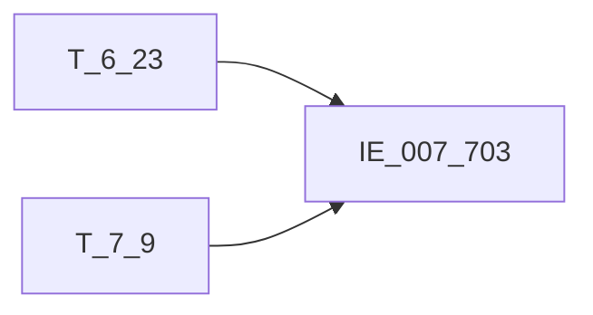

# 血缘-IE_007_703-信贷资产转让表-EAST5.0系统

## 页面边界

- 本页维护 `信贷资产转让表` 从一表通来源表到 EAST5.0 目标表 `IE_007_703` 的设计血缘。
- 证据为业务需求文档和工作区 GBase SQL 草案，尚未经过生产运行验证。
- 数据表字段定义见 [[数据表-IE_007_703-信贷资产转让表-EAST5.0系统]]；业务报送口径见 [[报表-IE_007_703-信贷资产转让表-EAST5.0系统]]。

## 系统边界

- 起始系统：一表通系统
- 目标系统：EAST5.0系统
- 是否跨系统血缘：是
- 目标对象：`IE_007_703` `信贷资产转让表`

## 业务链路摘要

- 按 `原始材料/业务需求/EAST5.0/046_信贷资产转让表.md` 的字段映射，将一表通来源表加工为 EAST5.0 `信贷资产转让表`。
- 表级规则：### 2.1 表级规则（Excel第 1084 行） 主表：【一表通】【信贷资产转让协议】 左关联：【一表通】【信贷资产转让】，对【信贷资产转让】.【协议ID】、【信贷资产转让】.【资产转让方向】、【信贷资产转让】.【对方户名】、【信贷资产转让】.【核心交易日期】进行去重后，按【信贷资产转让】.【协议ID】、【信贷资产转让】.【资产转让方向】进行分组，对【信贷资产转让】.【核心交易日期】升序排列 关联条件：【信贷资产转让协议】.【协议ID】=【信贷资产转让】.【协议ID】 【信贷资产转让协议】.【资产转让方向】=【信贷资产转让】.【资产转让方向】 【信贷资产转让】.采集日期<=跑批日期 排序=1 左关联：【一表通】【机构信息】 关联条件：【信贷资产转让】.【机构ID】从第12位开始截取=【机构信息】.【机构ID】从第12位开始截取 【机构信息】.采集日期为跑批日期 左关联：【一表通】【信贷资产转让协议】 关联条件：左关联【一表通】【信贷资产转让协议】.采集日期为跑批日期上月末 左关联【一表通】【信贷资产转让协议】.【协议ID】= 主表【一表通】【信贷资产转让协议】.【协议ID】 左关联【一表通】【信贷资产转让协议】.【资产转让方向】= 主表【一表通】【信贷资产转让协议】.【资产转让方向】 过滤条件：主表【一表通】【信贷资产转让协议】.采集日期为跑批日期 且（优先取左关联【一表通】【信贷资产转让协议】.【协议状态】，关联不上时置为''）在('01','02','')中）（即：上月有效或未生效或不存在）
- SQL 草案采用按 `P_DATA_DATE` 清理后重插或增量边界过滤的方式；具体投产方式待验证。

## 直接上游对象

- [[数据表-T_6_23-信贷资产转让协议-一表通系统]]：一表通来源表。
- [[数据表-T_7_9-信贷资产转让-一表通系统]]：一表通来源表。

## 直接下游对象

- 目标数据表：[[数据表-IE_007_703-信贷资产转让表-EAST5.0系统]]
- 报表业务口径页：[[报表-IE_007_703-信贷资产转让表-EAST5.0系统]]
- SQL 草案：`工作区/SQL开发/EAST5.0系统/PROC_EAST_IE_007_703_XDZCZRB_草案.sql`

## Nodes

- [[数据表-T_6_23-信贷资产转让协议-一表通系统]]：一表通来源表。
- [[数据表-T_7_9-信贷资产转让-一表通系统]]：一表通来源表。
- [[数据表-IE_007_703-信贷资产转让表-EAST5.0系统]]：EAST5.0 目标采集表。
- [[报表-IE_007_703-信贷资产转让表-EAST5.0系统]]：业务口径说明。

## 表级 Edge List

| From | To | Transform | Evidence |
| --- | --- | --- | --- |
| [[数据表-T_6_23-信贷资产转让协议-一表通系统]] | [[数据表-IE_007_703-信贷资产转让表-EAST5.0系统]] | 字段映射、关联、过滤、码值/日期转换后装载 `IE_007_703` | [[来源-EAST5.0系统-IE_007_703-信贷资产转让表]]；SQL 草案 |
| [[数据表-T_7_9-信贷资产转让-一表通系统]] | [[数据表-IE_007_703-信贷资产转让表-EAST5.0系统]] | 字段映射、关联、过滤、码值/日期转换后装载 `IE_007_703` | [[来源-EAST5.0系统-IE_007_703-信贷资产转让表]]；SQL 草案 |

## 字段级 Edge List

| 源对象 | 源字段 | 目标对象 | 目标字段 | 处理逻辑 | 关系类型 | 证据 |
| --- | --- | --- | --- | --- | --- | --- |
| 待确认 | `待确认` | [[数据表-IE_007_703-信贷资产转让表-EAST5.0系统]] | `JRXKZH` | 金融许可证号 | 直接映射 | [[来源-EAST5.0系统-IE_007_703-信贷资产转让表]]；SQL 草案 |
| [[数据表-T_6_23-信贷资产转让协议-一表通系统]] | `F230002` | [[数据表-IE_007_703-信贷资产转让表-EAST5.0系统]] | `NBJGH` | 加工映射：将【一表通】【信贷资产转让协议】的【机构id】从第12位开始截取 | 加工映射 | [[来源-EAST5.0系统-IE_007_703-信贷资产转让表]]；SQL 草案 |
| [[数据表-T_6_23-信贷资产转让协议-一表通系统]] | `F230001` | [[数据表-IE_007_703-信贷资产转让表-EAST5.0系统]] | `ZRHTH` | 直接映射 | 直接映射 | [[来源-EAST5.0系统-IE_007_703-信贷资产转让表]]；SQL 草案 |
| [[数据表-T_6_23-信贷资产转让协议-一表通系统]] | `F230024` | [[数据表-IE_007_703-信贷资产转让表-EAST5.0系统]] | `ZCZRFX` | 加工映射：01为转入，02为转出 | 加工映射 | [[来源-EAST5.0系统-IE_007_703-信贷资产转让表]]；SQL 草案 |
| [[数据表-T_6_23-信贷资产转让协议-一表通系统]] | `F230025` | [[数据表-IE_007_703-信贷资产转让表-EAST5.0系统]] | `ZCZRFS` | 加工映射：01为直接转让，02为信贷资产证券化，03为其他-信贷资产收益权转让，00-自定义为其他-自定义 | 加工映射 | [[来源-EAST5.0系统-IE_007_703-信贷资产转让表]]；SQL 草案 |
| [[数据表-T_6_23-信贷资产转让协议-一表通系统]] | `F230008` | [[数据表-IE_007_703-信贷资产转让表-EAST5.0系统]] | `ZRJKRZZH` | 直接映射 | 直接映射 | [[来源-EAST5.0系统-IE_007_703-信贷资产转让表]]；SQL 草案 |
| [[数据表-T_6_23-信贷资产转让协议-一表通系统]] | `F230009` | [[数据表-IE_007_703-信贷资产转让表-EAST5.0系统]] | `ZRJKRZMC` | 直接映射 | 直接映射 | [[来源-EAST5.0系统-IE_007_703-信贷资产转让表]]；SQL 草案 |
| [[数据表-T_6_23-信贷资产转让协议-一表通系统]] | `F230004` | [[数据表-IE_007_703-信贷资产转让表-EAST5.0系统]] | `JYDSMC` | 直接映射 | 直接映射 | [[来源-EAST5.0系统-IE_007_703-信贷资产转让表]]；SQL 草案 |
| [[数据表-T_6_23-信贷资产转让协议-一表通系统]] | `F230005` | [[数据表-IE_007_703-信贷资产转让表-EAST5.0系统]] | `JYDSZZZH` | 直接映射 | 直接映射 | [[来源-EAST5.0系统-IE_007_703-信贷资产转让表]]；SQL 草案 |
| [[数据表-T_7_9-信贷资产转让-一表通系统]] | `G090015` | [[数据表-IE_007_703-信贷资产转让表-EAST5.0系统]] | `JYDSKHHMC` | 加工映射：对【信贷资产转让】.【协议ID】、【信贷资产转让】.【资产转让方向】、【信贷资产转让】.【对方户名】、【信贷资产转让】.【核心交易日期】进行去重后，按【信贷资产转让】.【协议ID】、【信贷资产转让】.【资产转让方向】进行分组，对【信贷资产转让】.【核心交易日期】升序排列；将【信贷资产转让】.【协议ID】与【信贷资产转让协议】.【协议ID】、【信贷资产转让】.【资产转让方向】与【信贷资产转让协议】.【资产转让方向】关联，取排序为... | 加工映射 | [[来源-EAST5.0系统-IE_007_703-信贷资产转让表]]；SQL 草案 |
| [[数据表-T_6_23-信贷资产转让协议-一表通系统]] | `F230013` | [[数据表-IE_007_703-信贷资产转让表-EAST5.0系统]] | `BZ` | 直接映射 | 直接映射 | [[来源-EAST5.0系统-IE_007_703-信贷资产转让表]]；SQL 草案 |
| [[数据表-T_6_23-信贷资产转让协议-一表通系统]] | `F230016` | [[数据表-IE_007_703-信贷资产转让表-EAST5.0系统]] | `ZRDKBJZE` | 直接映射 | 直接映射 | [[来源-EAST5.0系统-IE_007_703-信贷资产转让表]]；SQL 草案 |
| [[数据表-T_6_23-信贷资产转让协议-一表通系统]] | `F230017` | [[数据表-IE_007_703-信贷资产转让表-EAST5.0系统]] | `ZRDKLXZE` | 直接映射 | 直接映射 | [[来源-EAST5.0系统-IE_007_703-信贷资产转让表]]；SQL 草案 |
| [[数据表-T_6_23-信贷资产转让协议-一表通系统]] | `F230014` | [[数据表-IE_007_703-信贷资产转让表-EAST5.0系统]] | `ZRZJ` | 直接映射 | 直接映射 | [[来源-EAST5.0系统-IE_007_703-信贷资产转让表]]；SQL 草案 |
| [[数据表-T_6_23-信贷资产转让协议-一表通系统]] | `F230011` | [[数据表-IE_007_703-信贷资产转让表-EAST5.0系统]] | `ZRHTQSRQ` | 格式转换：格式改为YYYYMMDD。 | 码值转换/格式转换 | [[来源-EAST5.0系统-IE_007_703-信贷资产转让表]]；SQL 草案 |
| [[数据表-T_6_23-信贷资产转让协议-一表通系统]] | `F230012` | [[数据表-IE_007_703-信贷资产转让表-EAST5.0系统]] | `ZRHTDQRQ` | 格式转换：格式改为YYYYMMDD。 | 码值转换/格式转换 | [[来源-EAST5.0系统-IE_007_703-信贷资产转让表]]；SQL 草案 |
| [[数据表-T_6_23-信贷资产转让协议-一表通系统]] | `F230033` | [[数据表-IE_007_703-信贷资产转让表-EAST5.0系统]] | `JYDSZRRQ` | 直接映射 | 直接映射 | [[来源-EAST5.0系统-IE_007_703-信贷资产转让表]]；SQL 草案 |
| [[数据表-T_6_23-信贷资产转让协议-一表通系统]] | `F230007` | [[数据表-IE_007_703-信贷资产转让表-EAST5.0系统]] | `JYDSYZFJE` | 直接映射 | 直接映射 | [[来源-EAST5.0系统-IE_007_703-信贷资产转让表]]；SQL 草案 |
| [[数据表-T_6_23-信贷资产转让协议-一表通系统]] | `F230021` | [[数据表-IE_007_703-信贷资产转让表-EAST5.0系统]] | `BZJBL` | 直接映射 | 直接映射 | [[来源-EAST5.0系统-IE_007_703-信贷资产转让表]]；SQL 草案 |
| [[数据表-T_6_23-信贷资产转让协议-一表通系统]] | `F230020` | [[数据表-IE_007_703-信贷资产转让表-EAST5.0系统]] | `BZJBZ` | 直接映射 | 直接映射 | [[来源-EAST5.0系统-IE_007_703-信贷资产转让表]]；SQL 草案 |
| [[数据表-T_6_23-信贷资产转让协议-一表通系统]] | `F230019` | [[数据表-IE_007_703-信贷资产转让表-EAST5.0系统]] | `BZJJE` | 直接映射 | 直接映射 | [[来源-EAST5.0系统-IE_007_703-信贷资产转让表]]；SQL 草案 |
| [[数据表-T_6_23-信贷资产转让协议-一表通系统]] | `F230022` | [[数据表-IE_007_703-信贷资产转让表-EAST5.0系统]] | `ZRJYPT` | 加工映射：01为银登中心，02为证券交易所，03为银行间市场，00自定义为其他-自定义； | 加工映射 | [[来源-EAST5.0系统-IE_007_703-信贷资产转让表]]；SQL 草案 |
| [[数据表-T_6_23-信贷资产转让协议-一表通系统]] | `F230023` | [[数据表-IE_007_703-信贷资产转让表-EAST5.0系统]] | `SFZYDZXDJ` | 加工映射：1为是，0为否 | 加工映射 | [[来源-EAST5.0系统-IE_007_703-信贷资产转让表]]；SQL 草案 |
| [[数据表-T_6_23-信贷资产转让协议-一表通系统]] | `F230029` | [[数据表-IE_007_703-信贷资产转让表-EAST5.0系统]] | `ZRHTZT` | 加工映射：02为未生效，01为有效，05为撤销，04为终结，03为其他-中止，06为其他-无效，00-自定义为其他-自定义； | 加工映射 | [[来源-EAST5.0系统-IE_007_703-信贷资产转让表]]；SQL 草案 |
| [[数据表-T_6_23-信贷资产转让协议-一表通系统]] | `F230031` | [[数据表-IE_007_703-信贷资产转让表-EAST5.0系统]] | `BBZ` | 直接映射 | 直接映射 | [[来源-EAST5.0系统-IE_007_703-信贷资产转让表]]；SQL 草案 |
| [[数据表-T_6_23-信贷资产转让协议-一表通系统]] | `F230032` | [[数据表-IE_007_703-信贷资产转让表-EAST5.0系统]] | `CJRQ` | 格式转换：格式改为YYYYMMDD。 | 码值转换/格式转换 | [[来源-EAST5.0系统-IE_007_703-信贷资产转让表]]；SQL 草案 |

## Graph-总览

## 回链检查

- 目标数据表页：已补 SQL 草案上游依赖摘要或待本次批处理补齐。
- 报表业务口径页：已创建或补充血缘回链。
- 一表通源表页：已补下游消费摘要或待本次批处理补齐。
- 当前字段级血缘基于业务需求和 SQL 草案，未运行验证，状态为待确认。

## 变更与冲突

- 本次为新增设计血缘或补齐草案血缘，不覆盖已验证生产血缘。
- 未发现需要将 `validated` 页面降级的情况；本页保持 `draft`。

## Open Questions

- GBase 草案中的复杂 JOIN、窗口去重、终态纳入和增量边界需要人工复核。
- 部分字段的码值 CASE 在草案中仍为待补，需要结合外部填报说明和跑数结果闭环。
- 外部监管实体页 wikilink 待补。

## 缺口字段（2026-05-04）

| 目标字段 | 字段名称 | 缺口说明 |
| --- | --- | --- |
| `GSFZJG` | 归属分支机构 | 本地 DDL 存在，但业务需求映射表和 SQL 草案未能确认来源，字段级血缘待补。 |
| `SENSITIVEFLAG` | 涉密标志 | 本地 DDL 存在，但业务需求映射表和 SQL 草案未能确认来源，字段级血缘待补。 |
| `JYDSKHLB` | 交易对手客户类别 | 本地 DDL 存在，但业务需求映射表和 SQL 草案未能确认来源，字段级血缘待补。 |
