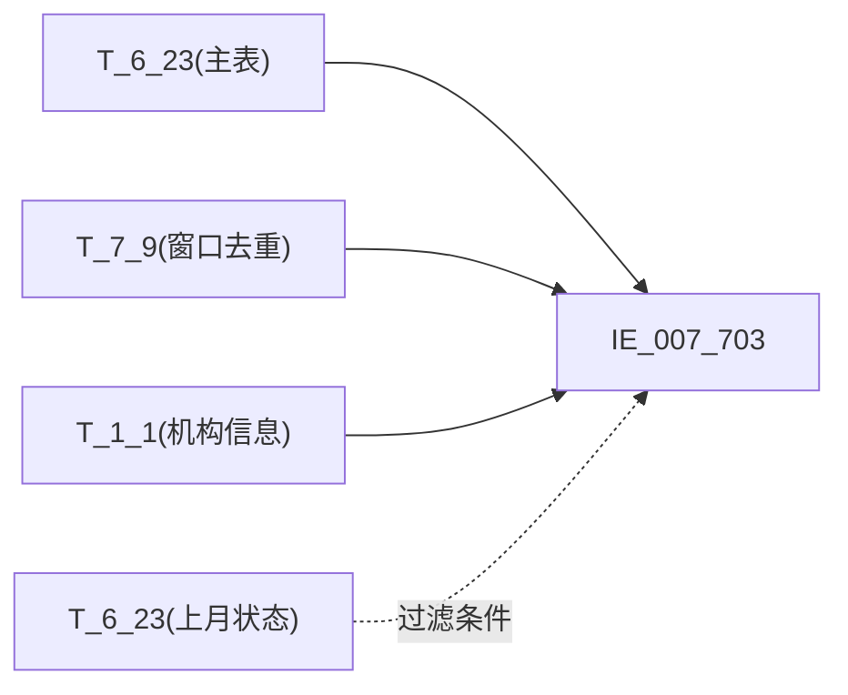

# 血缘-IE_007_703-信贷资产转让表-EAST5.0系统

## 页面边界

- 本页维护 `信贷资产转让表` 从一表通来源表到 EAST5.0 目标表 `IE_007_703` 的设计血缘。
- 证据为业务需求文档和工作区 GBase SQL 草案（_重构.sql），尚未经过生产运行验证。
- 数据表字段定义见 [[数据表-IE_007_703-信贷资产转让表-EAST5.0系统]]；业务报送口径见 [[报表-IE_007_703-信贷资产转让表-EAST5.0系统]]。

## 系统边界

- 起始系统：一表通系统
- 目标系统：EAST5.0系统
- 是否跨系统血缘：是
- 目标对象：`IE_007_703` `信贷资产转让表`

## 业务链路摘要

- 按 `原始材料/业务需求/EAST5.0/046_信贷资产转让表.md` 的字段映射，将一表通来源表加工为 EAST5.0 `信贷资产转让表`。
- 表级规则（Excel第1084行）：主表 T_6_23（采集日期=跑批日期），左关联 T_7_9（去重+窗口排序取 rn=1），左关联 T_1_1（取 JRXKZH），左关联 T_6_23 last_month（上月末状态过滤）。过滤条件：上月末协议状态 IN ('01','02','')。
- SQL 重构稿（2026-05-09）：消除全部 ON 1=1 和 WHERE 1=1 占位，补齐 5 个码值 CASE、4 个日期转换、6 个金额 CAST。缺口字段 GSFZJG/SENSITIVEFLAG/JYDSKHLB 置 NULL。

## 直接上游对象

- [[数据表-T_6_23-信贷资产转让协议-一表通系统]]：一表通来源表（主表）
- [[数据表-T_7_9-信贷资产转让-一表通系统]]：一表通来源表（左关联，取 JYDSKHHMC）
- [[数据表-T_1_1-机构信息-一表通系统]]：一表通来源表（左关联，取 JRXKZH）

## 直接下游对象

- 目标数据表：[[数据表-IE_007_703-信贷资产转让表-EAST5.0系统]]
- 报表业务口径页：[[报表-IE_007_703-信贷资产转让表-EAST5.0系统]]
- SQL 重构稿：`工作区/SQL开发/EAST5.0系统/PROC_EAST_IE_007_703_XDZCZRB_重构.sql`

## Nodes

- [[数据表-T_6_23-信贷资产转让协议-一表通系统]]：一表通来源表（主表）
- [[数据表-T_7_9-信贷资产转让-一表通系统]]：一表通来源表（左关联去重窗函）
- [[数据表-T_1_1-机构信息-一表通系统]]：一表通来源表（左关联取JRXKZH）
- [[数据表-IE_007_703-信贷资产转让表-EAST5.0系统]]：EAST5.0 目标采集表
- [[报表-IE_007_703-信贷资产转让表-EAST5.0系统]]：业务口径说明

## 表级 Edge List

| From | To | Transform | Evidence |
| --- | --- | --- | --- |
| [[数据表-T_6_23-信贷资产转让协议-一表通系统]] | [[数据表-IE_007_703-信贷资产转让表-EAST5.0系统]] | 字段映射、关联、过滤、码值/日期转换后装载 `IE_007_703` | [[来源-EAST5.0系统-IE_007_703-信贷资产转让表]]；`_重构.sql` |
| [[数据表-T_7_9-信贷资产转让-一表通系统]] | [[数据表-IE_007_703-信贷资产转让表-EAST5.0系统]] | 去重+窗口排序取 rn=1，关联取 JYDSKHHMC | [[来源-EAST5.0系统-IE_007_703-信贷资产转让表]]；`_重构.sql` |
| [[数据表-T_1_1-机构信息-一表通系统]] | [[数据表-IE_007_703-信贷资产转让表-EAST5.0系统]] | SUBSTR(机构ID,12) 左关联取 JRXKZH | [[来源-EAST5.0系统-IE_007_703-信贷资产转让表]]；`_重构.sql` |

## 字段级 Edge List

| 源对象 | 源字段 | 目标对象 | 目标字段 | 处理逻辑 | 关系类型 | 证据 |
| --- | --- | --- | --- | --- | --- | --- |
| [[数据表-T_1_1-机构信息-一表通系统]] | `A010003` | [[数据表-IE_007_703-信贷资产转让表-EAST5.0系统]] | `JRXKZH` | 通过 SUBSTR(T_6_23.F230002,12) = SUBSTR(T_1_1.A010001,12) 左关联，取金融许可证号 | 加工映射 | `_重构.sql` |
| [[数据表-T_6_23-信贷资产转让协议-一表通系统]] | `F230002` | [[数据表-IE_007_703-信贷资产转让表-EAST5.0系统]] | `NBJGH` | 加工映射：将【机构id】从第12位开始截取 | 加工映射 | `_重构.sql` |
| [[数据表-T_6_23-信贷资产转让协议-一表通系统]] | `F230001` | [[数据表-IE_007_703-信贷资产转让表-EAST5.0系统]] | `ZRHTH` | 直接映射 | 直接映射 | `_重构.sql` |
| [[数据表-T_6_23-信贷资产转让协议-一表通系统]] | `F230024` | [[数据表-IE_007_703-信贷资产转让表-EAST5.0系统]] | `ZCZRFX` | 加工映射：01→转入，02→转出，ELSE→原值 | 加工映射 | `_重构.sql` |
| [[数据表-T_6_23-信贷资产转让协议-一表通系统]] | `F230025` | [[数据表-IE_007_703-信贷资产转让表-EAST5.0系统]] | `ZCZRFS` | 加工映射：01→直接转让，02→信贷资产证券化，03→其他-信贷资产收益权转让，00-自定义→其他-自定义，ELSE→原值 | 加工映射 | `_重构.sql` |
| [[数据表-T_6_23-信贷资产转让协议-一表通系统]] | `F230008` | [[数据表-IE_007_703-信贷资产转让表-EAST5.0系统]] | `ZRJKRZZH` | 直接映射 | 直接映射 | `_重构.sql` |
| [[数据表-T_6_23-信贷资产转让协议-一表通系统]] | `F230009` | [[数据表-IE_007_703-信贷资产转让表-EAST5.0系统]] | `ZRJKRZMC` | 直接映射 | 直接映射 | `_重构.sql` |
| [[数据表-T_6_23-信贷资产转让协议-一表通系统]] | `F230004` | [[数据表-IE_007_703-信贷资产转让表-EAST5.0系统]] | `JYDSMC` | 直接映射 | 直接映射 | `_重构.sql` |
| [[数据表-T_6_23-信贷资产转让协议-一表通系统]] | `F230005` | [[数据表-IE_007_703-信贷资产转让表-EAST5.0系统]] | `JYDSZZZH` | 直接映射 | 直接映射 | `_重构.sql` |
| [[数据表-T_7_9-信贷资产转让-一表通系统]] | `G090015` | [[数据表-IE_007_703-信贷资产转让表-EAST5.0系统]] | `JYDSKHHMC` | 加工映射：对(协议ID,资产转让方向,对方户名,核心交易日期)去重后，按(协议ID,资产转让方向)分组，核心交易日期升序，取 rn=1 的对方行名 | 加工映射 | `_重构.sql` |
| [[数据表-T_6_23-信贷资产转让协议-一表通系统]] | `F230013` | [[数据表-IE_007_703-信贷资产转让表-EAST5.0系统]] | `BZ` | 直接映射 | 直接映射 | `_重构.sql` |
| [[数据表-T_6_23-信贷资产转让协议-一表通系统]] | `F230016` | [[数据表-IE_007_703-信贷资产转让表-EAST5.0系统]] | `ZRDKBJZE` | 直接映射 + CAST(DECIMAL(20,2)) | 直接映射 | `_重构.sql` |
| [[数据表-T_6_23-信贷资产转让协议-一表通系统]] | `F230017` | [[数据表-IE_007_703-信贷资产转让表-EAST5.0系统]] | `ZRDKLXZE` | 直接映射 + CAST(DECIMAL(20,2)) | 直接映射 | `_重构.sql` |
| [[数据表-T_6_23-信贷资产转让协议-一表通系统]] | `F230014` | [[数据表-IE_007_703-信贷资产转让表-EAST5.0系统]] | `ZRZJ` | 直接映射 + CAST(DECIMAL(20,2)) | 直接映射 | `_重构.sql` |
| [[数据表-T_6_23-信贷资产转让协议-一表通系统]] | `F230011` | [[数据表-IE_007_703-信贷资产转让表-EAST5.0系统]] | `ZRHTQSRQ` | 格式转换：DATE→VARCHAR(8) YYYYMMDD，NULL 保护 | 格式转换 | `_重构.sql` |
| [[数据表-T_6_23-信贷资产转让协议-一表通系统]] | `F230012` | [[数据表-IE_007_703-信贷资产转让表-EAST5.0系统]] | `ZRHTDQRQ` | 格式转换：DATE→VARCHAR(8) YYYYMMDD，NULL 保护 | 格式转换 | `_重构.sql` |
| [[数据表-T_6_23-信贷资产转让协议-一表通系统]] | `F230033` | [[数据表-IE_007_703-信贷资产转让表-EAST5.0系统]] | `JYDSZRRQ` | 格式转换：DATE→VARCHAR(8) YYYYMMDD，NULL 保护 | 格式转换 | `_重构.sql` |
| [[数据表-T_6_23-信贷资产转让协议-一表通系统]] | `F230007` | [[数据表-IE_007_703-信贷资产转让表-EAST5.0系统]] | `JYDSYZFJE` | 直接映射 + CAST(DECIMAL(20,2)) | 直接映射 | `_重构.sql` |
| [[数据表-T_6_23-信贷资产转让协议-一表通系统]] | `F230021` | [[数据表-IE_007_703-信贷资产转让表-EAST5.0系统]] | `BZJBL` | 直接映射 + CAST(DECIMAL(20,2)) | 直接映射 | `_重构.sql` |
| [[数据表-T_6_23-信贷资产转让协议-一表通系统]] | `F230020` | [[数据表-IE_007_703-信贷资产转让表-EAST5.0系统]] | `BZJBZ` | 直接映射 | 直接映射 | `_重构.sql` |
| [[数据表-T_6_23-信贷资产转让协议-一表通系统]] | `F230019` | [[数据表-IE_007_703-信贷资产转让表-EAST5.0系统]] | `BZJJE` | 直接映射 + CAST(DECIMAL(20,2)) | 直接映射 | `_重构.sql` |
| [[数据表-T_6_23-信贷资产转让协议-一表通系统]] | `F230022` | [[数据表-IE_007_703-信贷资产转让表-EAST5.0系统]] | `ZRJYPT` | 加工映射：01→银登中心，02→证券交易所，03→银行间市场，00-自定义→其他-自定义，ELSE→原值 | 加工映射 | `_重构.sql` |
| [[数据表-T_6_23-信贷资产转让协议-一表通系统]] | `F230023` | [[数据表-IE_007_703-信贷资产转让表-EAST5.0系统]] | `SFZYDZXDJ` | 加工映射：1→是，0→否，ELSE→原值 | 加工映射 | `_重构.sql` |
| [[数据表-T_6_23-信贷资产转让协议-一表通系统]] | `F230029` | [[数据表-IE_007_703-信贷资产转让表-EAST5.0系统]] | `ZRHTZT` | 加工映射：01→有效，02→未生效，03→其他-中止，04→终结，05→撤销，06→其他-无效，00-自定义→其他-自定义，ELSE→原值 | 加工映射 | `_重构.sql` |
| [[数据表-T_6_23-信贷资产转让协议-一表通系统]] | `F230031` | [[数据表-IE_007_703-信贷资产转让表-EAST5.0系统]] | `BBZ` | 直接映射 | 直接映射 | `_重构.sql` |
| -- | `P_DATA_DATE` | [[数据表-IE_007_703-信贷资产转让表-EAST5.0系统]] | `CJRQ` | 直接赋参数 | 直接映射 | `_重构.sql` |

## Graph-总览

## 回链检查

- 目标数据表页：已补 SQL 加工逻辑（2026-05-09 重构后）章节。
- 报表业务口径页：已创建或补充血缘回链。
- 一表通源表页：已补下游消费摘要。
- 当前字段级血缘基于业务需求和 SQL 重构稿，未运行验证，状态为 draft。

## 变更与冲突

- 本次为重构校准：消除全部 `ON 1=1` 和 `WHERE 1=1` 占位，补齐所有 JOIN 条件、码值 CASE、日期转换、金额 CAST 和 WHERE 过滤。
- 新增 T_1_1 为第 3 个直接上游对象，新增 T_6_23 last_month 为过滤条件上游。
- 新增 CJRQ 源改为直接赋 P_DATA_PARAM 参数（而非从 F230032 转换）。
- 缺口字段保持 GSFZJG/SENSITIVEFLAG/JYDSKHLB 置 NULL，维持 `draft`。

## Open Questions

- GBase 8a 中 ROW_NUMBER() OVER (PARTITION BY ... ORDER BY ...) 在子查询内的兼容性待验证。
- DATE_SUB(V_DATA_DATE, INTERVAL 1 MONTH) 的语义在月末边界处待确认：若 V_DATA_DATE 始终为月末则正确，否则需用 LAST_DAY 包裹。
- 上月末状态过滤逻辑中 '02'（未生效）纳入报送范围是否与需求"上月有效或未生效或不存在"一致，待业务确认。
- 外部监管实体页 wikilink 待补。

## 缺口字段（2026-05-09 重构后）

| 目标字段 | 字段名称 | 缺口说明 |
| --- | --- | --- |
| `GSFZJG` | 归属分支机构 | 本地 DDL 存在，但业务需求映射表和 SQL 重构稿未能确认来源 |
| `SENSITIVEFLAG` | 涉密标志 | 本地 DDL 存在，但业务需求映射表和 SQL 重构稿未能确认来源 |
| `JYDSKHLB` | 交易对手客户类别 | 本地 DDL 存在，但业务需求映射表和 SQL 重构稿未能确认来源 |
