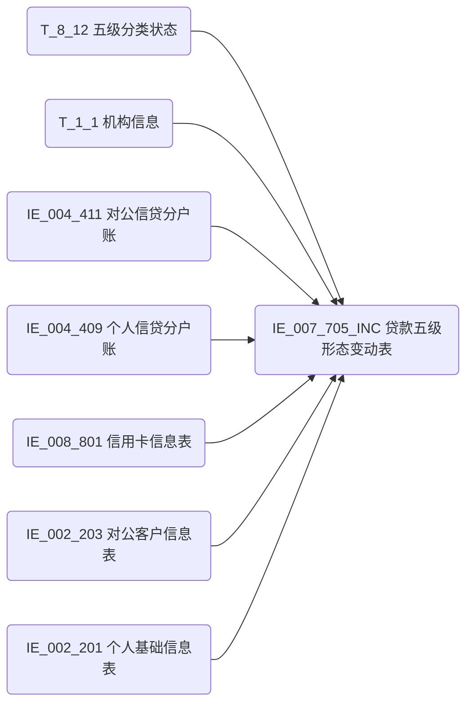

# 血缘-IE_007_705_INC-贷款五级形态变动表-EAST5.0系统

## 页面边界

- 本页维护 `贷款五级形态变动表` 从一表通来源表到 EAST5.0 目标表 `IE_007_705_INC` 的设计血缘。
- 证据为业务需求文档和工作区 GBase SQL 草案，尚未经过生产运行验证。
- 数据表字段定义见 [[数据表-IE_007_705_INC-贷款五级形态变动表-EAST5.0系统]]；业务报送口径见 [[报表-IE_007_705_INC-贷款五级形态变动表-EAST5.0系统]]。

## 系统边界

- 起始系统：一表通系统
- 目标系统：EAST5.0系统
- 是否跨系统血缘：是
- 目标对象：`IE_007_705_INC` `贷款五级形态变动表`

## 业务链路摘要

- 按 `原始材料/业务需求/EAST5.0/048_贷款五级形态变动表.md` 的字段映射，将一表通来源表加工为 EAST5.0 `贷款五级形态变动表`。
- 表级规则：### 2.1 表级规则（Excel第 1121 行） 【五级分类状态】.【采集日期】在跑批日期当月内 且【五级分类状态】.【采集日期】=【五级分类状态】.【调整日期】
- SQL 草案采用按 `P_DATA_DATE` 清理后重插或增量边界过滤的方式；具体投产方式待验证。

## 直接上游对象

- T_8_12 五级分类状态（一表通系统）：主数据源，提供五级分类变动信息
- T_1_1 机构信息（一表通系统）：关联提供银行机构名称和金融许可证号
- IE_004_411 对公信贷分户账（EAST5.0系统）：关联提供对公客户统一编号、归属分支机构、涉密标志
- IE_004_409 个人信贷分户账（EAST5.0系统）：关联提供个人客户统一编号、归属分支机构、涉密标志
- IE_008_801 信用卡信息表（EAST5.0系统）：关联提供信用卡客户统一编号、客户名称、卡号、客户类别
- IE_002_203 对公客户信息表（EAST5.0系统）：关联提供对公客户名称
- IE_002_201 个人基础信息表（EAST5.0系统）：关联提供个人客户名称

## 直接下游对象

- 目标数据表：[[数据表-IE_007_705_INC-贷款五级形态变动表-EAST5.0系统]]
- 报表业务口径页：[[报表-IE_007_705_INC-贷款五级形态变动表-EAST5.0系统]]
- SQL 草案：`工作区/SQL开发/EAST5.0系统/PROC_EAST_IE_007_705_INC_DKWJXTBDB_草案.sql`

## Nodes

- T_8_12 五级分类状态（一表通系统）：主数据源，记录每笔信贷业务的五级分类变动信息。
- T_1_1 机构信息（一表通系统）：机构信息表，关联提供银行机构名称、金融许可证号。
- IE_004_411 对公信贷分户账（EAST5.0系统）：EAST转换结果表，关联提供对公客户统一编号。
- IE_004_409 个人信贷分户账（EAST5.0系统）：EAST转换结果表，关联提供个人客户统一编号。
- IE_008_801 信用卡信息表（EAST5.0系统）：EAST转换结果表，关联提供信用卡客户信息。
- IE_002_203 对公客户信息表（EAST5.0系统）：EAST转换结果表，关联提供对公客户名称。
- IE_002_201 个人基础信息表（EAST5.0系统）：EAST转换结果表，关联提供个人客户名称。
- [[数据表-IE_007_705_INC-贷款五级形态变动表-EAST5.0系统]]：EAST5.0 目标采集表。

## 表级 Edge List

| From | To | Transform | Evidence |
| --- | --- | --- | --- |
| T_8_12 五级分类状态 | [[数据表-IE_007_705_INC-贷款五级形态变动表-EAST5.0系统]] | 主数据源，经字段映射、码值转换、LEFT JOIN关联、表级规则过滤后生成目标表 | [[来源-EAST5.0系统-IE_007_705_INC-贷款五级形态变动表]]；SQL 草案 |
| T_1_1 机构信息 | [[数据表-IE_007_705_INC-贷款五级形态变动表-EAST5.0系统]] | LEFT JOIN on SUBSTR(H120003,12)=SUBSTR(A010001,12)，提供银行机构名称和金融许可证号 | SQL 草案 |
| IE_004_411 对公信贷分户账 | [[数据表-IE_007_705_INC-贷款五级形态变动表-EAST5.0系统]] | LEFT JOIN on H120002=XDJJH，提供对公客户统一编号 | SQL 草案 |
| IE_004_409 个人信贷分户账 | [[数据表-IE_007_705_INC-贷款五级形态变动表-EAST5.0系统]] | LEFT JOIN on H120002=XDJJH，提供个人客户统一编号 | SQL 草案 |
| IE_008_801 信用卡信息表 | [[数据表-IE_007_705_INC-贷款五级形态变动表-EAST5.0系统]] | LEFT JOIN on H120001=XYKZH (ROW_NUMBER首条)，提供信用卡客户信息 | SQL 草案 |
| IE_002_203 对公客户信息表 | [[数据表-IE_007_705_INC-贷款五级形态变动表-EAST5.0系统]] | LEFT JOIN on dk.KHTYBH=KHTYBH，提供对公客户名称 | SQL 草案 |
| IE_002_201 个人基础信息表 | [[数据表-IE_007_705_INC-贷款五级形态变动表-EAST5.0系统]] | LEFT JOIN on gr.KHTYBH=KHTYBH，提供个人客户名称 | SQL 草案 |

## 字段级 Edge List

| 源对象 | 源字段 | 目标对象 | 目标字段 | 处理逻辑 | 关系类型 | 证据 |
| --- | --- | --- | --- | --- | --- | --- |
| T_1_1 机构信息 | A010003(金融许可证号) | [[数据表-IE_007_705_INC-贷款五级形态变动表-EAST5.0系统]] | JRXKZH | 加工映射：SUBSTR(T_8_12.H120003,12) = SUBSTR(T_1_1.A010001,12) 左关联取 A010003 | 加工映射 | SQL 草案 |
| T_8_12 五级分类状态 | H120003(机构ID) | [[数据表-IE_007_705_INC-贷款五级形态变动表-EAST5.0系统]] | NBJGH | 加工映射：从第12位开始截取H120003 | 加工映射 | SQL 草案 |
| T_1_1 机构信息 | A010005(银行机构名称) | [[数据表-IE_007_705_INC-贷款五级形态变动表-EAST5.0系统]] | YHJGMC | 加工映射：SUBSTR(H120003,12)左关联T_1_1取A010005 | 加工映射 | SQL 草案 |
| T_8_12 五级分类状态 | H120001(协议ID) | [[数据表-IE_007_705_INC-贷款五级形态变动表-EAST5.0系统]] | XDHTH | 直接映射 | 直接映射 | SQL 草案 |
| T_8_12 五级分类状态 | H120002(细分资产ID) | [[数据表-IE_007_705_INC-贷款五级形态变动表-EAST5.0系统]] | XDJJH | 对公/个人：直接映射H120002；信用卡：COALESCE(NULLIF(H120002,''), cc.KH) | 加工映射 | SQL 草案 |
| IE_004_411 对公信贷分户账 | KHTYBH | [[数据表-IE_007_705_INC-贷款五级形态变动表-EAST5.0系统]] | KHTYBH | 加工映射：H120002左关联IE_004_411.XDJJH取KHTYBH | 加工映射 | SQL 草案 |
| IE_004_409 个人信贷分户账 | KHTYBH | [[数据表-IE_007_705_INC-贷款五级形态变动表-EAST5.0系统]] | KHTYBH | 加工映射：H120002左关联IE_004_409.XDJJH取KHTYBH | 加工映射 | SQL 草案 |
| IE_008_801 信用卡信息表 | KHTYBH | [[数据表-IE_007_705_INC-贷款五级形态变动表-EAST5.0系统]] | KHTYBH | 加工映射：H120001左关联IE_008_801.XYKZH取KHTYBH(ROW_NUMBER首条) | 加工映射 | SQL 草案 |
| IE_002_203 对公客户信息表 | KHMC | [[数据表-IE_007_705_INC-贷款五级形态变动表-EAST5.0系统]] | KHMC | 加工映射：dk.KHTYBH左关联IE_002_203.KHTYBH取KHMC | 加工映射 | SQL 草案 |
| IE_002_201 个人基础信息表 | KHXM | [[数据表-IE_007_705_INC-贷款五级形态变动表-EAST5.0系统]] | KHMC | 加工映射：gr.KHTYBH左关联IE_002_201.KHTYBH取KHXM | 加工映射 | SQL 草案 |
| IE_008_801 信用卡信息表 | KHMC | [[数据表-IE_007_705_INC-贷款五级形态变动表-EAST5.0系统]] | KHMC | 加工映射：H120001左关联IE_008_801.XYKZH取KHMC(ROW_NUMBER首条) | 加工映射 | SQL 草案 |
| T_8_12 五级分类状态 | H120004(调整日期) | [[数据表-IE_007_705_INC-贷款五级形态变动表-EAST5.0系统]] | TZRQ | 格式转换：DATE_FORMAT(H120004, '%Y%m%d') | 码值转换/格式转换 | SQL 草案 |
| T_8_12 五级分类状态 | H120006(原五级分类) | [[数据表-IE_007_705_INC-贷款五级形态变动表-EAST5.0系统]] | YWJFL | 码值透传：01正常02关注03次级04可疑05损失00为空 | 加工映射 | SQL 草案 |
| T_8_12 五级分类状态 | H120005(当前五级分类) | [[数据表-IE_007_705_INC-贷款五级形态变动表-EAST5.0系统]] | XWJFL | 码值透传：01正常02关注03次级04可疑05损失00为空 | 加工映射 | SQL 草案 |
| T_8_12 五级分类状态 | H120008(变动原因) | [[数据表-IE_007_705_INC-贷款五级形态变动表-EAST5.0系统]] | BDYY | 直接映射 | 直接映射 | SQL 草案 |
| T_8_12 五级分类状态 | H120007(变动方式) | [[数据表-IE_007_705_INC-贷款五级形态变动表-EAST5.0系统]] | BDFS | 码值透传：01人工02自动 | 加工映射 | SQL 草案 |
| T_8_12 五级分类状态 | H120009(经办员工ID) | [[数据表-IE_007_705_INC-贷款五级形态变动表-EAST5.0系统]] | JBGYH | 加工映射：变动方式=02(自动)时置空，否则直接映射 | 加工映射 | SQL 草案 |
| T_8_12 五级分类状态 | H120015(备注) | [[数据表-IE_007_705_INC-贷款五级形态变动表-EAST5.0系统]] | BBZ | 直接映射 | 直接映射 | SQL 草案 |
| 参数 P_DATA_DATE | - | [[数据表-IE_007_705_INC-贷款五级形态变动表-EAST5.0系统]] | CJRQ | 格式转换：取参数P_DATA_DATE(YYYYMMDD) | 码值转换/格式转换 | SQL 草案 |
| IE_004_411 对公信贷分户账 | GSFZJG | [[数据表-IE_007_705_INC-贷款五级形态变动表-EAST5.0系统]] | GSFZJG | 缺口字段：COALESCE(dk.GSFZJG, gr.GSFZJG, cc.GSFZJG) | 加工映射 | SQL 草案 |
| IE_004_409 个人信贷分户账 | GSFZJG | [[数据表-IE_007_705_INC-贷款五级形态变动表-EAST5.0系统]] | GSFZJG | 缺口字段：COALESCE(dk.GSFZJG, gr.GSFZJG, cc.GSFZJG) | 加工映射 | SQL 草案 |
| IE_008_801 信用卡信息表 | GSFZJG | [[数据表-IE_007_705_INC-贷款五级形态变动表-EAST5.0系统]] | GSFZJG | 缺口字段：COALESCE(dk.GSFZJG, gr.GSFZJG, cc.GSFZJG) | 加工映射 | SQL 草案 |
| IE_008_801 信用卡信息表 | KHLB | [[数据表-IE_007_705_INC-贷款五级形态变动表-EAST5.0系统]] | KHLB | 缺口字段：从信用卡信息表获取 | 加工映射 | SQL 草案 |
| IE_004_411 对公信贷分户账 | SENSITIVEFLAG | [[数据表-IE_007_705_INC-贷款五级形态变动表-EAST5.0系统]] | SENSITIVEFLAG | 缺口字段：COALESCE(dk.SENSITIVEFLAG, gr.SENSITIVEFLAG, cc.SENSITIVEFLAG) | 加工映射 | SQL 草案 |
| IE_004_409 个人信贷分户账 | SENSITIVEFLAG | [[数据表-IE_007_705_INC-贷款五级形态变动表-EAST5.0系统]] | SENSITIVEFLAG | 缺口字段：COALESCE(dk.SENSITIVEFLAG, gr.SENSITIVEFLAG, cc.SENSITIVEFLAG) | 加工映射 | SQL 草案 |
| IE_008_801 信用卡信息表 | SENSITIVEFLAG | [[数据表-IE_007_705_INC-贷款五级形态变动表-EAST5.0系统]] | SENSITIVEFLAG | 缺口字段：COALESCE(dk.SENSITIVEFLAG, gr.SENSITIVEFLAG, cc.SENSITIVEFLAG) | 加工映射 | SQL 草案 |

## Graph-总览

## 回链检查

- 目标数据表页：已补 SQL 草案上游依赖摘要或待本次批处理补齐。
- 报表业务口径页：已创建或补充血缘回链。
- 一表通源表页：已补下游消费摘要或待本次批处理补齐。
- 当前字段级血缘基于业务需求和 SQL 草案，未运行验证，状态为待确认。

## 变更与冲突

- 本次为新增设计血缘或补齐草案血缘，不覆盖已验证生产血缘。
- 未发现需要将 `validated` 页面降级的情况；本页保持 `draft`。

## Open Questions

- SQL 草案尚未在 GBase 环境执行语法校验和跑数验证。
- T_8_12 和 T_1_1 的 SUBSTR(机构ID, 12) 截取逻辑需要在 GBase 环境验证是否与数据实际存储格式匹配。
- 缺口字段 GSFZJG/KHLB/SENSITIVEFLAG 的取值规则需要业务确认（当前从关联EAST表获取）。
- 该表是否存在下游校验报表、质检规则或跨表一致性约束，待后续 ingest。
- DATE_FORMAT 在 GBase 8a 的兼容性待跑数验证。

## 缺口字段（2026-05-09 重构后已补来源）

| 目标字段 | 字段名称 | 缺口说明 |
| --- | --- | --- |
| `GSFZJG` | 归属分支机构 | 本地 DDL 存在。来源已确认：COALESCE(dk.GSFZJG, gr.GSFZJG, cc.GSFZJG) 从EAST信贷分户账/信用卡信息表获取。需业务确认取值合理性。 |
| `KHLB` | 客户类别 | 本地 DDL 存在。来源已确认：从信用卡信息表(IE_008_801.KHLB)获取。需业务确认对公/个人贷款是否允许为空。 |
| `SENSITIVEFLAG` | 涉密标志 | 本地 DDL 存在。来源已确认：COALESCE(dk.SENSITIVEFLAG, gr.SENSITIVEFLAG, cc.SENSITIVEFLAG) 从EAST信贷分户账/信用卡信息表获取。 |
