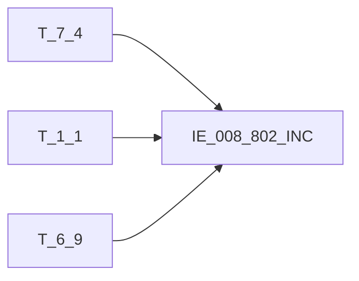

# 血缘-IE_008_802_INC-信用卡交易明细表-EAST5.0系统

## 页面边界

- 本页维护 `信用卡交易明细表` 从一表通来源表到 EAST5.0 目标表 `IE_008_802_INC` 的设计血缘。
- 证据为业务需求文档和工作区 GBase SQL 草案，尚未经过生产运行验证。
- 数据表字段定义见 [[数据表-IE_008_802_INC-信用卡交易明细表-EAST5.0系统]]；业务报送口径见 [[报表-IE_008_802_INC-信用卡交易明细表-EAST5.0系统]]。

## 系统边界

- 起始系统：一表通系统
- 目标系统：EAST5.0系统
- 是否跨系统血缘：是
- 目标对象：`IE_008_802_INC` `信用卡交易明细表`

## 业务链路摘要

- 按 `原始材料/业务需求/EAST5.0/050_信用卡交易明细表.md` 的字段映射，将一表通来源表加工为 EAST5.0 `信用卡交易明细表`。
- 表级规则：### 2.1 表级规则（Excel第 1182 行） 直接映射
- SQL 草案采用按 `P_DATA_DATE` 清理后重插或增量边界过滤的方式；具体投产方式待验证。

## 直接上游对象

- [[数据表-T_7_4-信用卡交易-一表通系统]]：一表通来源表。
- [[数据表-T_1_1-机构信息-一表通系统]]：一表通来源表。
- [[数据表-T_6_9-信用卡协议-一表通系统]]：一表通来源表。

## 直接下游对象

- 目标数据表：[[数据表-IE_008_802_INC-信用卡交易明细表-EAST5.0系统]]
- 报表业务口径页：[[报表-IE_008_802_INC-信用卡交易明细表-EAST5.0系统]]
- SQL 草案：`工作区/SQL开发/EAST5.0系统/PROC_EAST_IE_008_802_INC_XYKJYMXB_草案.sql`

## Nodes

- [[数据表-T_7_4-信用卡交易-一表通系统]]：一表通来源表。
- [[数据表-T_1_1-机构信息-一表通系统]]：一表通来源表。
- [[数据表-T_6_9-信用卡协议-一表通系统]]：一表通来源表。
- [[数据表-IE_008_802_INC-信用卡交易明细表-EAST5.0系统]]：EAST5.0 目标采集表。
- [[报表-IE_008_802_INC-信用卡交易明细表-EAST5.0系统]]：业务口径说明。

## 表级 Edge List

| From | To | Transform | Evidence |
| --- | --- | --- | --- |
| [[数据表-T_7_4-信用卡交易-一表通系统]] | [[数据表-IE_008_802_INC-信用卡交易明细表-EAST5.0系统]] | 字段映射、关联、过滤、码值/日期转换后装载 `IE_008_802_INC` | [[来源-EAST5.0系统-IE_008_802_INC-信用卡交易明细表]]；SQL 草案 |
| [[数据表-T_1_1-机构信息-一表通系统]] | [[数据表-IE_008_802_INC-信用卡交易明细表-EAST5.0系统]] | 字段映射、关联、过滤、码值/日期转换后装载 `IE_008_802_INC` | [[来源-EAST5.0系统-IE_008_802_INC-信用卡交易明细表]]；SQL 草案 |
| [[数据表-T_6_9-信用卡协议-一表通系统]] | [[数据表-IE_008_802_INC-信用卡交易明细表-EAST5.0系统]] | 字段映射、关联、过滤、码值/日期转换后装载 `IE_008_802_INC` | [[来源-EAST5.0系统-IE_008_802_INC-信用卡交易明细表]]；SQL 草案 |

## 字段级 Edge List

| 源对象 | 源字段 | 目标对象 | 目标字段 | 处理逻辑 | 关系类型 | 证据 |
| --- | --- | --- | --- | --- | --- | --- |
| [[数据表-T_7_4-信用卡交易-一表通系统]] | `G040001` | [[数据表-IE_008_802_INC-信用卡交易明细表-EAST5.0系统]] | `JYXLH` | 直接映射 | 直接映射 | [[来源-EAST5.0系统-IE_008_802_INC-信用卡交易明细表]]；SQL 草案 |
| [[数据表-T_1_1-机构信息-一表通系统]] | `A010003` | [[数据表-IE_008_802_INC-信用卡交易明细表-EAST5.0系统]] | `JRXKZH` | 加工映射：用【信用卡交易】.【卡号】关联【信用卡协议】.【卡号】取【信用卡协议】.【机构id】，从第12位开始截取【信用卡协议】的【机构id】，关联【机构信息】的【内部机构号】取【金融许可证号】 | 加工映射 | [[来源-EAST5.0系统-IE_008_802_INC-信用卡交易明细表]]；SQL 草案 |
| [[数据表-T_6_9-信用卡协议-一表通系统]] | `待确认` | [[数据表-IE_008_802_INC-信用卡交易明细表-EAST5.0系统]] | `NBJGH` | 加工映射：用【信用卡交易】.【卡号】关联【信用卡协议】.【卡号】取【信用卡协议】.【机构id】，从第12位开始截取【信用卡协议】的【机构id】 | 加工映射 | [[来源-EAST5.0系统-IE_008_802_INC-信用卡交易明细表]]；SQL 草案 |
| [[数据表-T_1_1-机构信息-一表通系统]] | `A010005` | [[数据表-IE_008_802_INC-信用卡交易明细表-EAST5.0系统]] | `YHJGMC` | 加工映射：用【信用卡交易】.【卡号】关联【信用卡协议】.【卡号】取【信用卡协议】.【机构id】，从第12位开始截取【信用卡协议】的【机构id】，关联【机构信息】的【内部机构号】取【银行机构名称】 | 加工映射 | [[来源-EAST5.0系统-IE_008_802_INC-信用卡交易明细表]]；SQL 草案 |
| [[数据表-T_7_4-信用卡交易-一表通系统]] | `G040012` | [[数据表-IE_008_802_INC-信用卡交易明细表-EAST5.0系统]] | `MXKMBH` | 直接映射 | 直接映射 | [[来源-EAST5.0系统-IE_008_802_INC-信用卡交易明细表]]；SQL 草案 |
| [[数据表-T_7_4-信用卡交易-一表通系统]] | `G040013` | [[数据表-IE_008_802_INC-信用卡交易明细表-EAST5.0系统]] | `MXKMMC` | 直接映射 | 直接映射 | [[来源-EAST5.0系统-IE_008_802_INC-信用卡交易明细表]]；SQL 草案 |
| [[数据表-T_7_4-信用卡交易-一表通系统]] | `G040004` | [[数据表-IE_008_802_INC-信用卡交易明细表-EAST5.0系统]] | `KHTYBH` | 直接映射 | 直接映射 | [[来源-EAST5.0系统-IE_008_802_INC-信用卡交易明细表]]；SQL 草案 |
| 待确认 | `待确认` | [[数据表-IE_008_802_INC-信用卡交易明细表-EAST5.0系统]] | `KHMC` | 客户姓名 | 直接映射 | [[来源-EAST5.0系统-IE_008_802_INC-信用卡交易明细表]]；SQL 草案 |
| 待确认 | `待确认` | [[数据表-IE_008_802_INC-信用卡交易明细表-EAST5.0系统]] | `ZJLB` | 加工映射 | 直接映射 | [[来源-EAST5.0系统-IE_008_802_INC-信用卡交易明细表]]；SQL 草案 |
| 待确认 | `待确认` | [[数据表-IE_008_802_INC-信用卡交易明细表-EAST5.0系统]] | `ZJHM` | 加工映射 | 直接映射 | [[来源-EAST5.0系统-IE_008_802_INC-信用卡交易明细表]]；SQL 草案 |
| [[数据表-T_7_4-信用卡交易-一表通系统]] | `G040003` | [[数据表-IE_008_802_INC-信用卡交易明细表-EAST5.0系统]] | `XYKZH` | 直接映射 | 直接映射 | [[来源-EAST5.0系统-IE_008_802_INC-信用卡交易明细表]]；SQL 草案 |
| [[数据表-T_7_4-信用卡交易-一表通系统]] | `G040002` | [[数据表-IE_008_802_INC-信用卡交易明细表-EAST5.0系统]] | `KH` | 直接映射 | 直接映射 | [[来源-EAST5.0系统-IE_008_802_INC-信用卡交易明细表]]；SQL 草案 |
| [[数据表-T_7_4-信用卡交易-一表通系统]] | `G040009` | [[数据表-IE_008_802_INC-信用卡交易明细表-EAST5.0系统]] | `KPJYLX` | 加工映射：'01'转成'消费交易'，'02'转成'现金交易'，'03'转成'还款交易，'04'转成'转账交易'，'00-XX'转成'其他-XX' | 加工映射 | [[来源-EAST5.0系统-IE_008_802_INC-信用卡交易明细表]]；SQL 草案 |
| [[数据表-T_7_4-信用卡交易-一表通系统]] | `G040021` | [[数据表-IE_008_802_INC-信用卡交易明细表-EAST5.0系统]] | `JYJDBZ` | 加工映射：'01'转为'借'，'02'转为'贷' | 加工映射 | [[来源-EAST5.0系统-IE_008_802_INC-信用卡交易明细表]]；SQL 草案 |
| [[数据表-T_7_4-信用卡交易-一表通系统]] | `G040007` | [[数据表-IE_008_802_INC-信用卡交易明细表-EAST5.0系统]] | `HXJYRQ` | 加工映射：数据格式转成yyyymmdd | 加工映射 | [[来源-EAST5.0系统-IE_008_802_INC-信用卡交易明细表]]；SQL 草案 |
| [[数据表-T_7_4-信用卡交易-一表通系统]] | `G040008` | [[数据表-IE_008_802_INC-信用卡交易明细表-EAST5.0系统]] | `HXJYSJ` | 加工映射：删除":"，将数据格式转成HHMMSS | 加工映射 | [[来源-EAST5.0系统-IE_008_802_INC-信用卡交易明细表]]；SQL 草案 |
| [[数据表-T_7_4-信用卡交易-一表通系统]] | `G040015` | [[数据表-IE_008_802_INC-信用卡交易明细表-EAST5.0系统]] | `BZ` | 直接映射 | 直接映射 | [[来源-EAST5.0系统-IE_008_802_INC-信用卡交易明细表]]；SQL 草案 |
| [[数据表-T_7_4-信用卡交易-一表通系统]] | `G040010` | [[数据表-IE_008_802_INC-信用卡交易明细表-EAST5.0系统]] | `JYJE` | 直接映射 | 直接映射 | [[来源-EAST5.0系统-IE_008_802_INC-信用卡交易明细表]]；SQL 草案 |
| [[数据表-T_7_4-信用卡交易-一表通系统]] | `G040011` | [[数据表-IE_008_802_INC-信用卡交易明细表-EAST5.0系统]] | `ZHYE` | 直接映射 | 直接映射 | [[来源-EAST5.0系统-IE_008_802_INC-信用卡交易明细表]]；SQL 草案 |
| [[数据表-T_7_4-信用卡交易-一表通系统]] | `G040017` | [[数据表-IE_008_802_INC-信用卡交易明细表-EAST5.0系统]] | `DFZH` | 直接映射 | 直接映射 | [[来源-EAST5.0系统-IE_008_802_INC-信用卡交易明细表]]；SQL 草案 |
| [[数据表-T_7_4-信用卡交易-一表通系统]] | `G040018` | [[数据表-IE_008_802_INC-信用卡交易明细表-EAST5.0系统]] | `DFHM` | 直接映射 | 直接映射 | [[来源-EAST5.0系统-IE_008_802_INC-信用卡交易明细表]]；SQL 草案 |
| [[数据表-T_7_4-信用卡交易-一表通系统]] | `G040019` | [[数据表-IE_008_802_INC-信用卡交易明细表-EAST5.0系统]] | `DFXH` | 直接映射 | 直接映射 | [[来源-EAST5.0系统-IE_008_802_INC-信用卡交易明细表]]；SQL 草案 |
| [[数据表-T_7_4-信用卡交易-一表通系统]] | `G040020` | [[数据表-IE_008_802_INC-信用卡交易明细表-EAST5.0系统]] | `DFXM` | 直接映射 | 直接映射 | [[来源-EAST5.0系统-IE_008_802_INC-信用卡交易明细表]]；SQL 草案 |
| [[数据表-T_7_4-信用卡交易-一表通系统]] | `G040022` | [[数据表-IE_008_802_INC-信用卡交易明细表-EAST5.0系统]] | `SHBH` | 直接映射 | 直接映射 | [[来源-EAST5.0系统-IE_008_802_INC-信用卡交易明细表]]；SQL 草案 |
| [[数据表-T_7_4-信用卡交易-一表通系统]] | `G040023` | [[数据表-IE_008_802_INC-信用卡交易明细表-EAST5.0系统]] | `SHMC` | 直接映射 | 直接映射 | [[来源-EAST5.0系统-IE_008_802_INC-信用卡交易明细表]]；SQL 草案 |
| [[数据表-T_7_4-信用卡交易-一表通系统]] | `G040031` | [[数据表-IE_008_802_INC-信用卡交易明细表-EAST5.0系统]] | `ZY` | 直接映射 | 直接映射 | [[来源-EAST5.0系统-IE_008_802_INC-信用卡交易明细表]]；SQL 草案 |
| [[数据表-T_7_4-信用卡交易-一表通系统]] | `G040024` | [[数据表-IE_008_802_INC-信用卡交易明细表-EAST5.0系统]] | `XSXXJYBZ` | 加工映射：'01'转为'线上'，'02'转为'线下' | 加工映射 | [[来源-EAST5.0系统-IE_008_802_INC-信用卡交易明细表]]；SQL 草案 |
| [[数据表-T_7_4-信用卡交易-一表通系统]] | `G040016` | [[数据表-IE_008_802_INC-信用卡交易明细表-EAST5.0系统]] | `SXFBZ` | 直接映射 | 直接映射 | [[来源-EAST5.0系统-IE_008_802_INC-信用卡交易明细表]]；SQL 草案 |
| [[数据表-T_7_4-信用卡交易-一表通系统]] | `G040014` | [[数据表-IE_008_802_INC-信用卡交易明细表-EAST5.0系统]] | `SXFJE` | 直接映射 | 直接映射 | [[来源-EAST5.0系统-IE_008_802_INC-信用卡交易明细表]]；SQL 草案 |
| [[数据表-T_7_4-信用卡交易-一表通系统]] | `G040036` | [[数据表-IE_008_802_INC-信用卡交易明细表-EAST5.0系统]] | `JYZDRQ` | 直接映射 | 直接映射 | [[来源-EAST5.0系统-IE_008_802_INC-信用卡交易明细表]]；SQL 草案 |
| [[数据表-T_7_4-信用卡交易-一表通系统]] | `G040037` | [[数据表-IE_008_802_INC-信用卡交易明细表-EAST5.0系统]] | `ZCHKRQ` | 直接映射 | 直接映射 | [[来源-EAST5.0系统-IE_008_802_INC-信用卡交易明细表]]；SQL 草案 |
| [[数据表-T_7_4-信用卡交易-一表通系统]] | `G040025` | [[数据表-IE_008_802_INC-信用卡交易明细表-EAST5.0系统]] | `FQFKBZ` | 加工映射：【分期业务ID】非空转为'是'，其他转为‘否’ | 加工映射 | [[来源-EAST5.0系统-IE_008_802_INC-信用卡交易明细表]]；SQL 草案 |
| [[数据表-T_7_4-信用卡交易-一表通系统]] | `G040034` | [[数据表-IE_008_802_INC-信用卡交易明细表-EAST5.0系统]] | `TQJQBZ` | 加工映射：'1'转为'是'，'0'转为'否' | 加工映射 | [[来源-EAST5.0系统-IE_008_802_INC-信用卡交易明细表]]；SQL 草案 |
| [[数据表-T_7_4-信用卡交易-一表通系统]] | `G040030` | [[数据表-IE_008_802_INC-信用卡交易明细表-EAST5.0系统]] | `JYQD` | 加工映射：'01' 转为 '柜面'，'02' 转为 'ATM'，'03' 转为 'VTM'，'04' 转为 'POS'，'05' 转为 '网银'，'06' 转为 '手机银行'，'07-XX' 转为 '第三方支付-XX'，'08' 转为 '银联交易'，'00-XX' 转为 '其他-XX' | 加工映射 | [[来源-EAST5.0系统-IE_008_802_INC-信用卡交易明细表]]；SQL 草案 |
| [[数据表-T_7_4-信用卡交易-一表通系统]] | `G040026` | [[数据表-IE_008_802_INC-信用卡交易明细表-EAST5.0系统]] | `IPDZ` | 直接映射 | 直接映射 | [[来源-EAST5.0系统-IE_008_802_INC-信用卡交易明细表]]；SQL 草案 |
| [[数据表-T_7_4-信用卡交易-一表通系统]] | `G040027` | [[数据表-IE_008_802_INC-信用卡交易明细表-EAST5.0系统]] | `MACDZ` | 直接映射 | 直接映射 | [[来源-EAST5.0系统-IE_008_802_INC-信用卡交易明细表]]；SQL 草案 |
| [[数据表-T_7_4-信用卡交易-一表通系统]] | `G040035` | [[数据表-IE_008_802_INC-信用卡交易明细表-EAST5.0系统]] | `BBZ` | 直接映射 | 直接映射 | [[来源-EAST5.0系统-IE_008_802_INC-信用卡交易明细表]]；SQL 草案 |
| 待确认 | `待确认` | [[数据表-IE_008_802_INC-信用卡交易明细表-EAST5.0系统]] | `CJRQ` | 默认值：报告日，数据格式转成yyyymmdd | 加工映射 | [[来源-EAST5.0系统-IE_008_802_INC-信用卡交易明细表]]；SQL 草案 |

## Graph-总览

## 回链检查

- 目标数据表页：已补 SQL 草案上游依赖摘要或待本次批处理补齐。
- 报表业务口径页：已创建或补充血缘回链。
- 一表通源表页：已补下游消费摘要或待本次批处理补齐。
- 当前字段级血缘基于业务需求和 SQL 草案，未运行验证，状态为待确认。

## 变更与冲突

- 本次为新增设计血缘或补齐草案血缘，不覆盖已验证生产血缘。
- 未发现需要将 `validated` 页面降级的情况；本页保持 `draft`。

## Open Questions

- GBase 草案中的复杂 JOIN、窗口去重、终态纳入和增量边界需要人工复核。
- 部分字段的码值 CASE 在草案中仍为待补，需要结合外部填报说明和跑数结果闭环。
- 外部监管实体页 wikilink 待补。

## 缺口字段（2026-05-04）

| 目标字段 | 字段名称 | 缺口说明 |
| --- | --- | --- |
| `SENSITIVEFLAG` | 涉密标志 | 本地 DDL 存在，但业务需求映射表和 SQL 草案未能确认来源，字段级血缘待补。 |
| `DFKHLB` | 对方客户类别 | 本地 DDL 存在，但业务需求映射表和 SQL 草案未能确认来源，字段级血缘待补。 |
| `GSFZJG` | 归属分支机构 | 本地 DDL 存在，但业务需求映射表和 SQL 草案未能确认来源，字段级血缘待补。 |
| `KHLB` | 客户类别 | 本地 DDL 存在，但业务需求映射表和 SQL 草案未能确认来源，字段级血缘待补。 |
