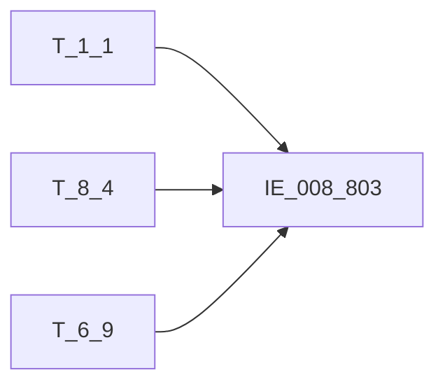

# 血缘-IE_008_803-信用卡授信情况表-EAST5.0系统

## 页面边界

- 本页维护 `信用卡授信情况表` 从一表通来源表到 EAST5.0 目标表 `IE_008_803` 的设计血缘。
- 证据为业务需求文档和工作区 GBase SQL 草案，尚未经过生产运行验证。
- 数据表字段定义见 [[数据表-IE_008_803-信用卡授信情况表-EAST5.0系统]]；业务报送口径见 [[报表-IE_008_803-信用卡授信情况表-EAST5.0系统]]。

## 系统边界

- 起始系统：一表通系统
- 目标系统：EAST5.0系统
- 是否跨系统血缘：是
- 目标对象：`IE_008_803` `信用卡授信情况表`

## 业务链路摘要

- 按 `原始材料/业务需求/EAST5.0/051_信用卡授信情况表.md` 的字段映射，将一表通来源表加工为 EAST5.0 `信用卡授信情况表`。
- 表级规则：### 2.1 表级规则（Excel第 1221 行） 取未失效及失效日期在当月的账户
- SQL 草案采用按 `P_DATA_DATE` 清理后重插或增量边界过滤的方式；具体投产方式待验证。

## 直接上游对象

- [[数据表-T_1_1-机构信息-一表通系统]]：一表通来源表。
- [[数据表-T_8_4-信用卡账户状态-一表通系统]]：一表通来源表。
- [[数据表-T_6_9-信用卡协议-一表通系统]]：一表通来源表。

## 直接下游对象

- 目标数据表：[[数据表-IE_008_803-信用卡授信情况表-EAST5.0系统]]
- 报表业务口径页：[[报表-IE_008_803-信用卡授信情况表-EAST5.0系统]]
- SQL 草案：`工作区/SQL开发/EAST5.0系统/PROC_EAST_IE_008_803_XYKSXQKB_草案.sql`

## Nodes

- [[数据表-T_1_1-机构信息-一表通系统]]：一表通来源表。
- [[数据表-T_8_4-信用卡账户状态-一表通系统]]：一表通来源表。
- [[数据表-T_6_9-信用卡协议-一表通系统]]：一表通来源表。
- [[数据表-IE_008_803-信用卡授信情况表-EAST5.0系统]]：EAST5.0 目标采集表。
- [[报表-IE_008_803-信用卡授信情况表-EAST5.0系统]]：业务口径说明。

## 表级 Edge List

| From | To | Transform | Evidence |
| --- | --- | --- | --- |
| [[数据表-T_1_1-机构信息-一表通系统]] | [[数据表-IE_008_803-信用卡授信情况表-EAST5.0系统]] | 字段映射、关联、过滤、码值/日期转换后装载 `IE_008_803` | [[来源-EAST5.0系统-IE_008_803-信用卡授信情况表]]；SQL 草案 |
| [[数据表-T_8_4-信用卡账户状态-一表通系统]] | [[数据表-IE_008_803-信用卡授信情况表-EAST5.0系统]] | 字段映射、关联、过滤、码值/日期转换后装载 `IE_008_803` | [[来源-EAST5.0系统-IE_008_803-信用卡授信情况表]]；SQL 草案 |
| [[数据表-T_6_9-信用卡协议-一表通系统]] | [[数据表-IE_008_803-信用卡授信情况表-EAST5.0系统]] | 字段映射、关联、过滤、码值/日期转换后装载 `IE_008_803` | [[来源-EAST5.0系统-IE_008_803-信用卡授信情况表]]；SQL 草案 |

## 字段级 Edge List

| 源对象 | 源字段 | 目标对象 | 目标字段 | 处理逻辑 | 关系类型 | 证据 |
| --- | --- | --- | --- | --- | --- | --- |
| [[数据表-T_1_1-机构信息-一表通系统]] | `A010003` | [[数据表-IE_008_803-信用卡授信情况表-EAST5.0系统]] | `JRXKZH` | 加工映射：从第12位开始截取【信用卡账户状态】的【机构id】，关联【机构信息】的【内部机构号】取【金融许可证号】 | 加工映射 | [[来源-EAST5.0系统-IE_008_803-信用卡授信情况表]]；SQL 草案 |
| [[数据表-T_8_4-信用卡账户状态-一表通系统]] | `待确认` | [[数据表-IE_008_803-信用卡授信情况表-EAST5.0系统]] | `NBJGH` | 加工映射：从第12位开始截取【信用卡账户状态】的【机构id】 | 加工映射 | [[来源-EAST5.0系统-IE_008_803-信用卡授信情况表]]；SQL 草案 |
| [[数据表-T_1_1-机构信息-一表通系统]] | `A010005` | [[数据表-IE_008_803-信用卡授信情况表-EAST5.0系统]] | `YHJGMC` | 加工映射：从第12位开始截取【信用卡账户状态】的【机构id】，关联【机构信息】的【内部机构号】取【银行机构名称】 | 加工映射 | [[来源-EAST5.0系统-IE_008_803-信用卡授信情况表]]；SQL 草案 |
| [[数据表-T_8_4-信用卡账户状态-一表通系统]] | `H040001` | [[数据表-IE_008_803-信用卡授信情况表-EAST5.0系统]] | `KHTYBH` | 直接映射 | 直接映射 | [[来源-EAST5.0系统-IE_008_803-信用卡授信情况表]]；SQL 草案 |
| 待确认 | `待确认` | [[数据表-IE_008_803-信用卡授信情况表-EAST5.0系统]] | `KHMC` | 客户姓名 | 直接映射 | [[来源-EAST5.0系统-IE_008_803-信用卡授信情况表]]；SQL 草案 |
| 待确认 | `待确认` | [[数据表-IE_008_803-信用卡授信情况表-EAST5.0系统]] | `ZJLB` | 加工映射 | 直接映射 | [[来源-EAST5.0系统-IE_008_803-信用卡授信情况表]]；SQL 草案 |
| 待确认 | `待确认` | [[数据表-IE_008_803-信用卡授信情况表-EAST5.0系统]] | `ZJHM` | 加工映射 | 直接映射 | [[来源-EAST5.0系统-IE_008_803-信用卡授信情况表]]；SQL 草案 |
| [[数据表-T_8_4-信用卡账户状态-一表通系统]] | `H040003` | [[数据表-IE_008_803-信用卡授信情况表-EAST5.0系统]] | `XYKZH` | 直接映射 | 直接映射 | [[来源-EAST5.0系统-IE_008_803-信用卡授信情况表]]；SQL 草案 |
| [[数据表-T_8_4-信用卡账户状态-一表通系统]] | `H040037` | [[数据表-IE_008_803-信用卡授信情况表-EAST5.0系统]] | `ZHZT` | 加工映射：取【信用卡账户状态】.【账户状态】按以下转换方式转换；'01' 转为'正常'；'02' 转为'预销户'；'03' 转为'销户'；'04' 转为'冻结'；'05' 转为'止付'；'00-XX' 转为'其他-XX' | 码值转换/格式转换 | [[来源-EAST5.0系统-IE_008_803-信用卡授信情况表]]；SQL 草案 |
| [[数据表-T_8_4-信用卡账户状态-一表通系统]] | `H040013` | [[数据表-IE_008_803-信用卡授信情况表-EAST5.0系统]] | `BZ` | 直接映射 | 直接映射 | [[来源-EAST5.0系统-IE_008_803-信用卡授信情况表]]；SQL 草案 |
| [[数据表-T_8_4-信用卡账户状态-一表通系统]] | `H040011` | [[数据表-IE_008_803-信用卡授信情况表-EAST5.0系统]] | `ZHYE` | 直接映射 | 直接映射 | [[来源-EAST5.0系统-IE_008_803-信用卡授信情况表]]；SQL 草案 |
| [[数据表-T_6_9-信用卡协议-一表通系统]] | `F090018` | [[数据表-IE_008_803-信用卡授信情况表-EAST5.0系统]] | `ZSXEDSX` | 【8.4信用卡账户状态】的信用卡账号关联【6.9信用卡协议】的信用卡账号，取【信用卡协议】.【附属卡标识】='0'时的【总授信额度上限】 | 加工映射 | [[来源-EAST5.0系统-IE_008_803-信用卡授信情况表]]；SQL 草案 |
| [[数据表-T_8_4-信用卡账户状态-一表通系统]] | `待确认` | [[数据表-IE_008_803-信用卡授信情况表-EAST5.0系统]] | `YJXJSXED` | 加工映射 | 直接映射 | [[来源-EAST5.0系统-IE_008_803-信用卡授信情况表]]；SQL 草案 |
| [[数据表-T_8_4-信用卡账户状态-一表通系统]] | `H040032` | [[数据表-IE_008_803-信用卡授信情况表-EAST5.0系统]] | `ZJSXPGRQ` | 加工映射：取【信用卡账户状态】.【最近授信评估日期】并转换成'YYYYMMDD'格式 | 码值转换/格式转换 | [[来源-EAST5.0系统-IE_008_803-信用卡授信情况表]]；SQL 草案 |
| [[数据表-T_8_4-信用卡账户状态-一表通系统]] | `待确认` | [[数据表-IE_008_803-信用卡授信情况表-EAST5.0系统]] | `DQSXED` | 加工映射 | 直接映射 | [[来源-EAST5.0系统-IE_008_803-信用卡授信情况表]]；SQL 草案 |
| [[数据表-T_8_4-信用卡账户状态-一表通系统]] | `待确认` | [[数据表-IE_008_803-信用卡授信情况表-EAST5.0系统]] | `QZLSED` | 加工映射 | 直接映射 | [[来源-EAST5.0系统-IE_008_803-信用卡授信情况表]]；SQL 草案 |
| [[数据表-T_8_4-信用卡账户状态-一表通系统]] | `H040038` | [[数据表-IE_008_803-信用卡授信情况表-EAST5.0系统]] | `TZJE` | 直接映射 | 直接映射 | [[来源-EAST5.0系统-IE_008_803-信用卡授信情况表]]；SQL 草案 |
| [[数据表-T_8_4-信用卡账户状态-一表通系统]] | `H040039` | [[数据表-IE_008_803-信用卡授信情况表-EAST5.0系统]] | `QZFQYE` | 直接映射 | 直接映射 | [[来源-EAST5.0系统-IE_008_803-信用卡授信情况表]]；SQL 草案 |
| [[数据表-T_8_4-信用卡账户状态-一表通系统]] | `H040018` | [[数据表-IE_008_803-信用卡授信情况表-EAST5.0系统]] | `DJYE` | 直接映射 | 直接映射 | [[来源-EAST5.0系统-IE_008_803-信用卡授信情况表]]；SQL 草案 |
| [[数据表-T_8_4-信用卡账户状态-一表通系统]] | `待确认` | [[数据表-IE_008_803-信用卡授信情况表-EAST5.0系统]] | `DQSXYE` | 已使用本币授信额度\ | 直接映射 | [[来源-EAST5.0系统-IE_008_803-信用卡授信情况表]]；SQL 草案 |
| [[数据表-T_8_4-信用卡账户状态-一表通系统]] | `H040012` | [[数据表-IE_008_803-信用卡授信情况表-EAST5.0系统]] | `YQJE` | 直接映射 | 直接映射 | [[来源-EAST5.0系统-IE_008_803-信用卡授信情况表]]；SQL 草案 |
| [[数据表-T_8_4-信用卡账户状态-一表通系统]] | `H040031` | [[数据表-IE_008_803-信用卡授信情况表-EAST5.0系统]] | `YQRQ` | 加工映射：取【信用卡账户状态】.【逾期起始日期】并转换成'YYYYMMDD'格式 | 码值转换/格式转换 | [[来源-EAST5.0系统-IE_008_803-信用卡授信情况表]]；SQL 草案 |
| [[数据表-T_8_4-信用卡账户状态-一表通系统]] | `H040010` | [[数据表-IE_008_803-信用卡授信情况表-EAST5.0系统]] | `YSXF` | 直接映射 | 直接映射 | [[来源-EAST5.0系统-IE_008_803-信用卡授信情况表]]；SQL 草案 |
| [[数据表-T_8_4-信用卡账户状态-一表通系统]] | `H040015` | [[数据表-IE_008_803-信用卡授信情况表-EAST5.0系统]] | `WJFL` | 加工映射：取五级分类，并按以下转码：；1、'01' 转为 '正常'；2、'02' 转为 '关注'；3、'03' 转为 '次级'；4、'04' 转为 '可疑'；5、'05 转为 '损失' | 加工映射 | [[来源-EAST5.0系统-IE_008_803-信用卡授信情况表]]；SQL 草案 |
| [[数据表-T_8_4-信用卡账户状态-一表通系统]] | `H040019` | [[数据表-IE_008_803-信用卡授信情况表-EAST5.0系统]] | `DYLJJYBS` | 直接映射 | 直接映射 | [[来源-EAST5.0系统-IE_008_803-信用卡授信情况表]]；SQL 草案 |
| [[数据表-T_8_4-信用卡账户状态-一表通系统]] | `H040020` | [[数据表-IE_008_803-信用卡授信情况表-EAST5.0系统]] | `DYLJTZJE` | 直接映射 | 直接映射 | [[来源-EAST5.0系统-IE_008_803-信用卡授信情况表]]；SQL 草案 |
| [[数据表-T_8_4-信用卡账户状态-一表通系统]] | `H040021` | [[数据表-IE_008_803-信用卡授信情况表-EAST5.0系统]] | `BYLJXFJE` | 直接映射 | 直接映射 | [[来源-EAST5.0系统-IE_008_803-信用卡授信情况表]]；SQL 草案 |
| [[数据表-T_8_4-信用卡账户状态-一表通系统]] | `H040022` | [[数据表-IE_008_803-信用卡授信情况表-EAST5.0系统]] | `BYLJQXZZJE` | 直接映射 | 直接映射 | [[来源-EAST5.0系统-IE_008_803-信用卡授信情况表]]；SQL 草案 |
| [[数据表-T_8_4-信用卡账户状态-一表通系统]] | `H040023` | [[数据表-IE_008_803-信用卡授信情况表-EAST5.0系统]] | `BYLJFQJYJE` | 直接映射 | 直接映射 | [[来源-EAST5.0系统-IE_008_803-信用卡授信情况表]]；SQL 草案 |
| [[数据表-T_8_4-信用卡账户状态-一表通系统]] | `H040024` | [[数据表-IE_008_803-信用卡授信情况表-EAST5.0系统]] | `BYLJSR` | 直接映射 | 直接映射 | [[来源-EAST5.0系统-IE_008_803-信用卡授信情况表]]；SQL 草案 |
| [[数据表-T_8_4-信用卡账户状态-一表通系统]] | `H040033` | [[数据表-IE_008_803-信用卡授信情况表-EAST5.0系统]] | `ZXZJCXRQ` | 加工映射：取【信用卡账户状态】.【最近征信查询日期】并转换成'YYYYMMDD'格式 | 码值转换/格式转换 | [[来源-EAST5.0系统-IE_008_803-信用卡授信情况表]]；SQL 草案 |
| [[数据表-T_8_4-信用卡账户状态-一表通系统]] | `H040026` | [[数据表-IE_008_803-信用卡授信情况表-EAST5.0系统]] | `YYXYKFKHS` | 直接映射 | 直接映射 | [[来源-EAST5.0系统-IE_008_803-信用卡授信情况表]]；SQL 草案 |
| [[数据表-T_8_4-信用卡账户状态-一表通系统]] | `H040027` | [[数据表-IE_008_803-信用卡授信情况表-EAST5.0系统]] | `YYTHSXJE` | 直接映射 | 直接映射 | [[来源-EAST5.0系统-IE_008_803-信用卡授信情况表]]；SQL 草案 |
| [[数据表-T_8_4-信用卡账户状态-一表通系统]] | `H040034` | [[数据表-IE_008_803-信用卡授信情况表-EAST5.0系统]] | `ZJXZSXRQ` | 加工映射：取【信用卡账户状态】.【最近新增授信日期】并转换成'YYYYMMDD'格式 | 码值转换/格式转换 | [[来源-EAST5.0系统-IE_008_803-信用卡授信情况表]]；SQL 草案 |
| [[数据表-T_8_4-信用卡账户状态-一表通系统]] | `H040030` | [[数据表-IE_008_803-信用卡授信情况表-EAST5.0系统]] | `XZSXLX` | 加工映射：【信用卡账户状态】.【新增授信类型】按以下映射关系赋值 ；【新增授信类型】 = '01' 赋值 '新发卡授信' ；【新增授信类型】 = '02' 赋值 '固定额度上调' ；【新增授信类型】 = '03' 赋值 '专项分期额度上调' ；【新增授信类型】 = '00-XX' 赋值 '其他-XX' | 加工映射 | [[来源-EAST5.0系统-IE_008_803-信用卡授信情况表]]；SQL 草案 |
| [[数据表-T_8_4-信用卡账户状态-一表通系统]] | `H040028` | [[数据表-IE_008_803-信用卡授信情况表-EAST5.0系统]] | `CSBZ` | 加工映射：遍历一表通当月每日催收标识的报送值，报送过“是”则转换结果为“是”，全部为“否”则转换结果为“否” | 码值转换/格式转换 | [[来源-EAST5.0系统-IE_008_803-信用卡授信情况表]]；SQL 草案 |
| [[数据表-T_8_4-信用卡账户状态-一表通系统]] | `H040029` | [[数据表-IE_008_803-信用卡授信情况表-EAST5.0系统]] | `CSFS` | 加工映射：01→电话催收/02→信函催收/03→外访催收/04→司法催收/05→其他-委外催收/00-XX→其他-XX；简化版取采集日单日快照值 | 加工映射 | [[来源-EAST5.0系统-IE_008_803-信用卡授信情况表]]；SQL 草案 |
| [[数据表-T_8_4-信用卡账户状态-一表通系统]] | `H040042` | [[数据表-IE_008_803-信用卡授信情况表-EAST5.0系统]] | `BBZ` | 直接映射 | 直接映射 | [[来源-EAST5.0系统-IE_008_803-信用卡授信情况表]]；SQL 草案 |
| 待确认 | `待确认` | [[数据表-IE_008_803-信用卡授信情况表-EAST5.0系统]] | `CJRQ` | 默认值：报告日，数据格式转成yyyymmdd | 加工映射 | [[来源-EAST5.0系统-IE_008_803-信用卡授信情况表]]；SQL 草案 |

## Graph-总览

## 回链检查

- 目标数据表页：已补 SQL 草案上游依赖摘要或待本次批处理补齐。
- 报表业务口径页：已创建或补充血缘回链。
- 一表通源表页：已补下游消费摘要或待本次批处理补齐。
- 当前字段级血缘基于业务需求和 SQL 草案，未运行验证，状态为待确认。

## 变更与冲突

- 本次为新增设计血缘或补齐草案血缘，不覆盖已验证生产血缘。
- 2026-05-10 第2轮校准：CSFS 字段级 Edge List 从"直接映射(原始码值直通)"更新为"加工映射(码值转换)"；ZHZT/XZSXLX 补充'00-XX'通配说明。
- 未发现需要将 `validated` 页面降级的情况；本页保持 `draft`。

## Open Questions

- GBase 草案中的复杂 JOIN、窗口去重、终态纳入和增量边界需要人工复核。
- 部分字段的码值 CASE 在草案中仍为待补，需要结合外部填报说明和跑数结果闭环。
- 外部监管实体页 wikilink 待补。

## 缺口字段（2026-05-04）

| 目标字段 | 字段名称 | 缺口说明 |
| --- | --- | --- |
| `KHLB` | 客户类别 | 本地 DDL 存在，但业务需求映射表和 SQL 草案未能确认来源，字段级血缘待补。 |
| `GSFZJG` | 归属分支机构 | 本地 DDL 存在，但业务需求映射表和 SQL 草案未能确认来源，字段级血缘待补。 |
| `SENSITIVEFLAG` | 涉密标志 | 本地 DDL 存在，但业务需求映射表和 SQL 草案未能确认来源，字段级血缘待补。 |
