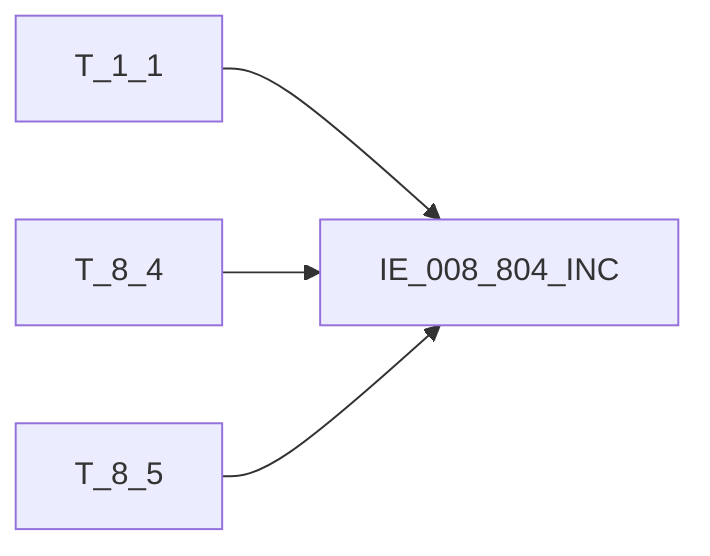

# 血缘-IE_008_804_INC-信用卡分期业务表-EAST5.0系统

## 页面边界

- 本页维护 `信用卡分期业务表` 从一表通来源表到 EAST5.0 目标表 `IE_008_804_INC` 的设计血缘。
- 证据为业务需求文档和工作区 GBase SQL 草案，尚未经过生产运行验证。
- 数据表字段定义见 [[数据表-IE_008_804_INC-信用卡分期业务表-EAST5.0系统]]；业务报送口径见 [[报表-IE_008_804_INC-信用卡分期业务表-EAST5.0系统]]。

## 系统边界

- 起始系统：一表通系统
- 目标系统：EAST5.0系统
- 是否跨系统血缘：是
- 目标对象：`IE_008_804_INC` `信用卡分期业务表`

## 业务链路摘要

- 按 `原始材料/业务需求/EAST5.0/052_信用卡分期业务表.md` 的字段映射，将一表通来源表加工为 EAST5.0 `信用卡分期业务表`。
- 表级规则：### 2.1 表级规则（Excel第 1261 行） 取分期办理日期在当月的
- SQL 草案采用按 `P_DATA_DATE` 清理后重插或增量边界过滤的方式；具体投产方式待验证。

## 直接上游对象

- [[数据表-T_1_1-机构信息-一表通系统]]：一表通来源表。
- [[数据表-T_8_4-信用卡账户状态-一表通系统]]：一表通来源表。
- [[数据表-T_8_5-信用卡分期状态-一表通系统]]：一表通来源表。

## 直接下游对象

- 目标数据表：[[数据表-IE_008_804_INC-信用卡分期业务表-EAST5.0系统]]
- 报表业务口径页：[[报表-IE_008_804_INC-信用卡分期业务表-EAST5.0系统]]
- SQL 草案：`工作区/SQL开发/EAST5.0系统/PROC_EAST_IE_008_804_INC_XYKFQYWB_草案.sql`

## Nodes

- [[数据表-T_1_1-机构信息-一表通系统]]：一表通来源表。
- [[数据表-T_8_4-信用卡账户状态-一表通系统]]：一表通来源表。
- [[数据表-T_8_5-信用卡分期状态-一表通系统]]：一表通来源表。
- [[数据表-IE_008_804_INC-信用卡分期业务表-EAST5.0系统]]：EAST5.0 目标采集表。
- [[报表-IE_008_804_INC-信用卡分期业务表-EAST5.0系统]]：业务口径说明。

## 表级 Edge List

| From | To | Transform | Evidence |
| --- | --- | --- | --- |
| [[数据表-T_1_1-机构信息-一表通系统]] | [[数据表-IE_008_804_INC-信用卡分期业务表-EAST5.0系统]] | 字段映射、关联、过滤、码值/日期转换后装载 `IE_008_804_INC` | [[来源-EAST5.0系统-IE_008_804_INC-信用卡分期业务表]]；SQL 草案 |
| [[数据表-T_8_4-信用卡账户状态-一表通系统]] | [[数据表-IE_008_804_INC-信用卡分期业务表-EAST5.0系统]] | 字段映射、关联、过滤、码值/日期转换后装载 `IE_008_804_INC` | [[来源-EAST5.0系统-IE_008_804_INC-信用卡分期业务表]]；SQL 草案 |
| [[数据表-T_8_5-信用卡分期状态-一表通系统]] | [[数据表-IE_008_804_INC-信用卡分期业务表-EAST5.0系统]] | 字段映射、关联、过滤、码值/日期转换后装载 `IE_008_804_INC` | [[来源-EAST5.0系统-IE_008_804_INC-信用卡分期业务表]]；SQL 草案 |

## 字段级 Edge List

| 源对象 | 源字段 | 目标对象 | 目标字段 | 处理逻辑 | 关系类型 | 证据 |
| --- | --- | --- | --- | --- | --- | --- |
| [[数据表-T_1_1-机构信息-一表通系统]] | `A010003` | [[数据表-IE_008_804_INC-信用卡分期业务表-EAST5.0系统]] | `JRXKZH` | 加工映射：用【信用卡分期状态】.【信用卡账号】关联【信用卡账户状态】.【信用卡账号】取【信用卡账户状态】.【机构ID】，然后从第12位开始截取至最后，关联【机构信息】的【内部机构号】取【金融许可证号】 | 加工映射 | [[来源-EAST5.0系统-IE_008_804_INC-信用卡分期业务表]]；SQL 草案 |
| [[数据表-T_8_4-信用卡账户状态-一表通系统]] | `H040043` | [[数据表-IE_008_804_INC-信用卡分期业务表-EAST5.0系统]] | `NBJGH` | 加工映射：用【信用卡分期状态】.【信用卡账号】关联【信用卡账户状态】.【信用卡账号】取【信用卡账户状态】.【机构ID】，从第12位开始截取至最后 | 加工映射 | [[来源-EAST5.0系统-IE_008_804_INC-信用卡分期业务表]]；SQL 草案 |
| [[数据表-T_1_1-机构信息-一表通系统]] | `A010005` | [[数据表-IE_008_804_INC-信用卡分期业务表-EAST5.0系统]] | `YHJGMC` | 加工映射：用【信用卡分期状态】.【信用卡账号】关联【信用卡账户状态】.【信用卡账号】取【信用卡账户状态】.【机构ID】，然后从第12位开始截取至最后，关联【机构信息】的【内部机构号】取【银行机构名称】 | 加工映射 | [[来源-EAST5.0系统-IE_008_804_INC-信用卡分期业务表]]；SQL 草案 |
| [[数据表-T_8_5-信用卡分期状态-一表通系统]] | `H050001` | [[数据表-IE_008_804_INC-信用卡分期业务表-EAST5.0系统]] | `FQYWBH` | 直接映射 | 直接映射 | [[来源-EAST5.0系统-IE_008_804_INC-信用卡分期业务表]]；SQL 草案 |
| [[数据表-T_8_5-信用卡分期状态-一表通系统]] | `H050004` | [[数据表-IE_008_804_INC-信用卡分期业务表-EAST5.0系统]] | `KHTYBH` | 直接映射 | 直接映射 | [[来源-EAST5.0系统-IE_008_804_INC-信用卡分期业务表]]；SQL 草案 |
| 待确认 | `待确认` | [[数据表-IE_008_804_INC-信用卡分期业务表-EAST5.0系统]] | `KHMC` | 客户姓名 | 直接映射 | [[来源-EAST5.0系统-IE_008_804_INC-信用卡分期业务表]]；SQL 草案 |
| 待确认 | `待确认` | [[数据表-IE_008_804_INC-信用卡分期业务表-EAST5.0系统]] | `ZJLB` | 加工映射 | 直接映射 | [[来源-EAST5.0系统-IE_008_804_INC-信用卡分期业务表]]；SQL 草案 |
| 待确认 | `待确认` | [[数据表-IE_008_804_INC-信用卡分期业务表-EAST5.0系统]] | `ZJHM` | 加工映射 | 直接映射 | [[来源-EAST5.0系统-IE_008_804_INC-信用卡分期业务表]]；SQL 草案 |
| [[数据表-T_8_5-信用卡分期状态-一表通系统]] | `H050024` | [[数据表-IE_008_804_INC-信用卡分期业务表-EAST5.0系统]] | `XYKZH` | 直接映射 | 直接映射 | [[来源-EAST5.0系统-IE_008_804_INC-信用卡分期业务表]]；SQL 草案 |
| [[数据表-T_8_5-信用卡分期状态-一表通系统]] | `H050005` | [[数据表-IE_008_804_INC-信用卡分期业务表-EAST5.0系统]] | `FQJYLX` | 加工映射：'01'转成'普通分期总额'，'02'转成'普通分期单笔'，'03'转成'专项分期总额'，'04'转成'专项分期单笔'，'05'转成'现金分期总额'，'06'转成'现金分期单笔'，'00-XX'转成'其他-XX' | 加工映射 | [[来源-EAST5.0系统-IE_008_804_INC-信用卡分期业务表]]；SQL 草案 |
| [[数据表-T_8_5-信用卡分期状态-一表通系统]] | `H050006` | [[数据表-IE_008_804_INC-信用卡分期业务表-EAST5.0系统]] | `FQYWLX` | 加工映射：'01'转成'账单分期'，'02'转成'单笔消费分期'，'03'转成'现金分期'，'04'转成'POS商户分期'，'05'转成'邮购电购分期'，'06'转成'汽车分期'，'07'转成'家装分期'，'08'转成'车位分期'，'09'转成'教育分期'，'10'转成'婚庆分期'，'00-XX'的转成'其他-XX' | 加工映射 | [[来源-EAST5.0系统-IE_008_804_INC-信用卡分期业务表]]；SQL 草案 |
| [[数据表-T_8_5-信用卡分期状态-一表通系统]] | `H050013` | [[数据表-IE_008_804_INC-信用卡分期业务表-EAST5.0系统]] | `BLFQRQ` | 加工映射：数据格式转成YYYYMMDD | 加工映射 | [[来源-EAST5.0系统-IE_008_804_INC-信用卡分期业务表]]；SQL 草案 |
| [[数据表-T_8_5-信用卡分期状态-一表通系统]] | `H050014` | [[数据表-IE_008_804_INC-信用卡分期业务表-EAST5.0系统]] | `BLFQSJ` | 加工映射：删除":"，将数据格式转成HHMMSS | 加工映射 | [[来源-EAST5.0系统-IE_008_804_INC-信用卡分期业务表]]；SQL 草案 |
| [[数据表-T_8_5-信用卡分期状态-一表通系统]] | `H050007` | [[数据表-IE_008_804_INC-信用卡分期业务表-EAST5.0系统]] | `BZ` | 直接映射 | 直接映射 | [[来源-EAST5.0系统-IE_008_804_INC-信用卡分期业务表]]；SQL 草案 |
| [[数据表-T_8_5-信用卡分期状态-一表通系统]] | `H050008` | [[数据表-IE_008_804_INC-信用卡分期业务表-EAST5.0系统]] | `FQZED` | 直接映射 | 直接映射 | [[来源-EAST5.0系统-IE_008_804_INC-信用卡分期业务表]]；SQL 草案 |
| [[数据表-T_8_5-信用卡分期状态-一表通系统]] | `H050009` | [[数据表-IE_008_804_INC-信用卡分期业务表-EAST5.0系统]] | `KYFQED` | 直接映射 | 直接映射 | [[来源-EAST5.0系统-IE_008_804_INC-信用卡分期业务表]]；SQL 草案 |
| [[数据表-T_8_5-信用卡分期状态-一表通系统]] | `H050010` | [[数据表-IE_008_804_INC-信用卡分期业务表-EAST5.0系统]] | `FQJE` | 直接映射 | 直接映射 | [[来源-EAST5.0系统-IE_008_804_INC-信用卡分期业务表]]；SQL 草案 |
| [[数据表-T_8_5-信用卡分期状态-一表通系统]] | `H050015` | [[数据表-IE_008_804_INC-信用卡分期业务表-EAST5.0系统]] | `FQZRKH` | 直接映射 | 直接映射 | [[来源-EAST5.0系统-IE_008_804_INC-信用卡分期业务表]]；SQL 草案 |
| [[数据表-T_8_5-信用卡分期状态-一表通系统]] | `H050020` | [[数据表-IE_008_804_INC-信用卡分期业务表-EAST5.0系统]] | `FQZRHM` | 直接映射 | 直接映射 | [[来源-EAST5.0系统-IE_008_804_INC-信用卡分期业务表]]；SQL 草案 |
| [[数据表-T_8_5-信用卡分期状态-一表通系统]] | `H050016` | [[数据表-IE_008_804_INC-信用卡分期业务表-EAST5.0系统]] | `GXHFQBZ` | 加工映射：'1'转为'是'，其他转为'否' | 加工映射 | [[来源-EAST5.0系统-IE_008_804_INC-信用卡分期业务表]]；SQL 草案 |
| [[数据表-T_8_5-信用卡分期状态-一表通系统]] | `H050012` | [[数据表-IE_008_804_INC-信用卡分期业务表-EAST5.0系统]] | `FQLL` | 直接映射 | 直接映射 | [[来源-EAST5.0系统-IE_008_804_INC-信用卡分期业务表]]；SQL 草案 |
| [[数据表-T_8_5-信用卡分期状态-一表通系统]] | `H050011` | [[数据表-IE_008_804_INC-信用卡分期业务表-EAST5.0系统]] | `FQQS` | 直接映射 | 直接映射 | [[来源-EAST5.0系统-IE_008_804_INC-信用卡分期业务表]]；SQL 草案 |
| [[数据表-T_8_5-信用卡分期状态-一表通系统]] | `H050023` | [[数据表-IE_008_804_INC-信用卡分期业务表-EAST5.0系统]] | `BBZ` | 直接映射 | 直接映射 | [[来源-EAST5.0系统-IE_008_804_INC-信用卡分期业务表]]；SQL 草案 |
| 待确认 | `待确认` | [[数据表-IE_008_804_INC-信用卡分期业务表-EAST5.0系统]] | `CJRQ` | 默认值：报告日，数据格式转成yyyymmdd | 加工映射 | [[来源-EAST5.0系统-IE_008_804_INC-信用卡分期业务表]]；SQL 草案 |

## Graph-总览

## 回链检查

- 目标数据表页：已补 SQL 草案上游依赖摘要或待本次批处理补齐。
- 报表业务口径页：已创建或补充血缘回链。
- 一表通源表页：已补下游消费摘要或待本次批处理补齐。
- 当前字段级血缘基于业务需求和 SQL 草案，未运行验证，状态为待确认。

## 变更与冲突

- 本次为新增设计血缘或补齐草案血缘，不覆盖已验证生产血缘。
- 未发现需要将 `validated` 页面降级的情况；本页保持 `draft`。

## Open Questions

- GBase 草案中的复杂 JOIN、窗口去重、终态纳入和增量边界需要人工复核。
- 部分字段的码值 CASE 在草案中仍为待补，需要结合外部填报说明和跑数结果闭环。
- 外部监管实体页 wikilink 待补。

## 缺口字段（2026-05-04）

| 目标字段 | 字段名称 | 缺口说明 |
| --- | --- | --- |
| `SENSITIVEFLAG` | 涉密标志 | 本地 DDL 存在，但业务需求映射表和 SQL 草案未能确认来源，字段级血缘待补。 |
| `KHLB` | 客户类别 | 本地 DDL 存在，但业务需求映射表和 SQL 草案未能确认来源，字段级血缘待补。 |
| `GSFZJG` | 归属分支机构 | 本地 DDL 存在，但业务需求映射表和 SQL 草案未能确认来源，字段级血缘待补。 |
| `FQZRKHLB` | 分期转入客户类别 | 本地 DDL 存在，但业务需求映射表和 SQL 草案未能确认来源，字段级血缘待补。 |
