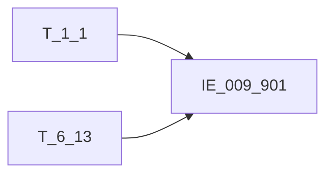

# 血缘-IE_009_901-票据出票信息表-EAST5.0系统

## 页面边界

- 本页维护 `票据出票信息表` 从一表通来源表到 EAST5.0 目标表 `IE_009_901` 的设计血缘。
- 证据为业务需求文档和工作区 GBase SQL 草案，尚未经过生产运行验证。
- 数据表字段定义见 [[数据表-IE_009_901-票据出票信息表-EAST5.0系统]]；业务报送口径见 [[报表-IE_009_901-票据出票信息表-EAST5.0系统]]。

## 系统边界

- 起始系统：一表通系统
- 目标系统：EAST5.0系统
- 是否跨系统血缘：是
- 目标对象：`IE_009_901` `票据出票信息表`

## 业务链路摘要

- 按 `原始材料/业务需求/EAST5.0/053_票据出票信息表.md` 的字段映射，将一表通来源表加工为 EAST5.0 `票据出票信息表`。
- 表级规则：### 2.1 表级规则（Excel第 1286 行） 过滤条件：业务类型 = '01'(承兑)，关联上月末6.13票据协议表，剔除上月已失效范围且剔除一直垫款状态的业务。
- SQL 草案采用按 `P_DATA_DATE` 清理后重插或增量边界过滤的方式；具体投产方式待验证。

## 直接上游对象

- [[数据表-T_1_1-机构信息-一表通系统]]：一表通来源表。
- [[数据表-T_6_13-票据协议-一表通系统]]：一表通来源表。

## 直接下游对象

- 目标数据表：[[数据表-IE_009_901-票据出票信息表-EAST5.0系统]]
- 报表业务口径页：[[报表-IE_009_901-票据出票信息表-EAST5.0系统]]
- SQL 草案：`工作区/SQL开发/EAST5.0系统/PROC_EAST_IE_009_901_PJCPXXB_草案.sql`

## Nodes

- [[数据表-T_1_1-机构信息-一表通系统]]：一表通来源表。
- [[数据表-T_6_13-票据协议-一表通系统]]：一表通来源表。
- [[数据表-IE_009_901-票据出票信息表-EAST5.0系统]]：EAST5.0 目标采集表。
- [[报表-IE_009_901-票据出票信息表-EAST5.0系统]]：业务口径说明。

## 表级 Edge List

| From | To | Transform | Evidence |
| --- | --- | --- | --- |
| [[数据表-T_1_1-机构信息-一表通系统]] | [[数据表-IE_009_901-票据出票信息表-EAST5.0系统]] | 字段映射、关联、过滤、码值/日期转换后装载 `IE_009_901` | [[来源-EAST5.0系统-IE_009_901-票据出票信息表]]；SQL 草案 |
| [[数据表-T_6_13-票据协议-一表通系统]] | [[数据表-IE_009_901-票据出票信息表-EAST5.0系统]] | 字段映射、关联、过滤、码值/日期转换后装载 `IE_009_901` | [[来源-EAST5.0系统-IE_009_901-票据出票信息表]]；SQL 草案 |

## 字段级 Edge List

| 源对象 | 源字段 | 目标对象 | 目标字段 | 处理逻辑 | 关系类型 | 证据 |
| --- | --- | --- | --- | --- | --- | --- |
| [[数据表-T_1_1-机构信息-一表通系统]] | `A010003` | [[数据表-IE_009_901-票据出票信息表-EAST5.0系统]] | `JRXKZH` | 直接映射 | 直接映射 | [[来源-EAST5.0系统-IE_009_901-票据出票信息表]]；SQL 草案 |
| [[数据表-T_6_13-票据协议-一表通系统]] | `F130003` | [[数据表-IE_009_901-票据出票信息表-EAST5.0系统]] | `NBJGH` | 加工映射：SUBSTR(机构ID,12) | 加工映射 | [[来源-EAST5.0系统-IE_009_901-票据出票信息表]]；SQL 草案 |
| [[数据表-T_1_1-机构信息-一表通系统]] | `A010005` | [[数据表-IE_009_901-票据出票信息表-EAST5.0系统]] | `YHJGMC` | 直接映射 | 直接映射 | [[来源-EAST5.0系统-IE_009_901-票据出票信息表]]；SQL 草案 |
| [[数据表-T_6_13-票据协议-一表通系统]] | `F130009` | [[数据表-IE_009_901-票据出票信息表-EAST5.0系统]] | `MXKMBH` | 直接映射 | 直接映射 | [[来源-EAST5.0系统-IE_009_901-票据出票信息表]]；SQL 草案 |
| [[数据表-T_6_13-票据协议-一表通系统]] | `F130010` | [[数据表-IE_009_901-票据出票信息表-EAST5.0系统]] | `MXKMMC` | 直接映射 | 直接映射 | [[来源-EAST5.0系统-IE_009_901-票据出票信息表]]；SQL 草案 |
| [[数据表-T_6_13-票据协议-一表通系统]] | `F130016` | [[数据表-IE_009_901-票据出票信息表-EAST5.0系统]] | `PJHM` | 直接映射 | 直接映射 | [[来源-EAST5.0系统-IE_009_901-票据出票信息表]]；SQL 草案 |
| [[数据表-T_6_13-票据协议-一表通系统]] | `F130015` | [[数据表-IE_009_901-票据出票信息表-EAST5.0系统]] | `PJLX` | 加工映射：CASE WHEN T1.票据类型 = '01' THEN '银行承兑汇票'； WHEN T1.票据类型 = '02' THEN '商业承兑汇票'； ELSE '' END | 加工映射 | [[来源-EAST5.0系统-IE_009_901-票据出票信息表]]；SQL 草案 |
| [[数据表-T_6_13-票据协议-一表通系统]] | `F130019` | [[数据表-IE_009_901-票据出票信息表-EAST5.0系统]] | `BZ` | 直接映射 | 直接映射 | [[来源-EAST5.0系统-IE_009_901-票据出票信息表]]；SQL 草案 |
| [[数据表-T_6_13-票据协议-一表通系统]] | `F130020` | [[数据表-IE_009_901-票据出票信息表-EAST5.0系统]] | `PMJE` | 直接映射 | 直接映射 | [[来源-EAST5.0系统-IE_009_901-票据出票信息表]]；SQL 草案 |
| [[数据表-T_6_13-票据协议-一表通系统]] | `F130036` | [[数据表-IE_009_901-票据出票信息表-EAST5.0系统]] | `PJCPRQ` | 加工映射：日期转YYYYMMDD格式 | 加工映射 | [[来源-EAST5.0系统-IE_009_901-票据出票信息表]]；SQL 草案 |
| [[数据表-T_6_13-票据协议-一表通系统]] | `F130037` | [[数据表-IE_009_901-票据出票信息表-EAST5.0系统]] | `PJDQRQ` | 加工映射：日期转YYYYMMDD格式 | 加工映射 | [[来源-EAST5.0系统-IE_009_901-票据出票信息表]]；SQL 草案 |
| [[数据表-T_6_13-票据协议-一表通系统]] | `F130004` | [[数据表-IE_009_901-票据出票信息表-EAST5.0系统]] | `CPRBH` | 直接映射 | 直接映射 | [[来源-EAST5.0系统-IE_009_901-票据出票信息表]]；SQL 草案 |
| [[数据表-T_6_13-票据协议-一表通系统]] | `F130005` | [[数据表-IE_009_901-票据出票信息表-EAST5.0系统]] | `CPRMC` | 直接映射 | 直接映射 | [[来源-EAST5.0系统-IE_009_901-票据出票信息表]]；SQL 草案 |
| [[数据表-T_6_13-票据协议-一表通系统]] | `F130013` | [[数据表-IE_009_901-票据出票信息表-EAST5.0系统]] | `CPRZH` | 直接映射 | 直接映射 | [[来源-EAST5.0系统-IE_009_901-票据出票信息表]]；SQL 草案 |
| [[数据表-T_6_13-票据协议-一表通系统]] | `F130014` | [[数据表-IE_009_901-票据出票信息表-EAST5.0系统]] | `CPRKHHMC` | 直接映射 | 直接映射 | [[来源-EAST5.0系统-IE_009_901-票据出票信息表]]；SQL 草案 |
| [[数据表-T_6_13-票据协议-一表通系统]] | `F130006` | [[数据表-IE_009_901-票据出票信息表-EAST5.0系统]] | `SKRMC` | 直接映射 | 直接映射 | [[来源-EAST5.0系统-IE_009_901-票据出票信息表]]；SQL 草案 |
| [[数据表-T_6_13-票据协议-一表通系统]] | `F130011` | [[数据表-IE_009_901-票据出票信息表-EAST5.0系统]] | `SKRZH` | 直接映射 | 直接映射 | [[来源-EAST5.0系统-IE_009_901-票据出票信息表]]；SQL 草案 |
| [[数据表-T_6_13-票据协议-一表通系统]] | `F130012` | [[数据表-IE_009_901-票据出票信息表-EAST5.0系统]] | `SKRKHHMC` | 直接映射 | 直接映射 | [[来源-EAST5.0系统-IE_009_901-票据出票信息表]]；SQL 草案 |
| [[数据表-T_6_13-票据协议-一表通系统]] | `F130025` | [[数据表-IE_009_901-票据出票信息表-EAST5.0系统]] | `SFZBHTX` | 加工映射：CASE WHEN T1.ZBHTXBS ='1' THEN '是' ELSE '否' END | 加工映射 | [[来源-EAST5.0系统-IE_009_901-票据出票信息表]]；SQL 草案 |
| [[数据表-T_6_13-票据协议-一表通系统]] | `F130046` | [[数据表-IE_009_901-票据出票信息表-EAST5.0系统]] | `MYBJ` | 直接映射 | 直接映射 | [[来源-EAST5.0系统-IE_009_901-票据出票信息表]]；SQL 草案 |
| [[数据表-T_6_13-票据协议-一表通系统]] | `F130034` | [[数据表-IE_009_901-票据出票信息表-EAST5.0系统]] | `SXFBZ` | 直接映射 | 直接映射 | [[来源-EAST5.0系统-IE_009_901-票据出票信息表]]；SQL 草案 |
| [[数据表-T_6_13-票据协议-一表通系统]] | `F130035` | [[数据表-IE_009_901-票据出票信息表-EAST5.0系统]] | `SXFJE` | 直接映射 | 直接映射 | [[来源-EAST5.0系统-IE_009_901-票据出票信息表]]；SQL 草案 |
| [[数据表-T_6_13-票据协议-一表通系统]] | `F130024` | [[数据表-IE_009_901-票据出票信息表-EAST5.0系统]] | `BZJBL` | 直接映射 | 直接映射 | [[来源-EAST5.0系统-IE_009_901-票据出票信息表]]；SQL 草案 |
| [[数据表-T_6_13-票据协议-一表通系统]] | `F130022` | [[数据表-IE_009_901-票据出票信息表-EAST5.0系统]] | `BZJBZ` | 直接映射 | 直接映射 | [[来源-EAST5.0系统-IE_009_901-票据出票信息表]]；SQL 草案 |
| [[数据表-T_6_13-票据协议-一表通系统]] | `F130023` | [[数据表-IE_009_901-票据出票信息表-EAST5.0系统]] | `BZJJE` | 直接映射 | 直接映射 | [[来源-EAST5.0系统-IE_009_901-票据出票信息表]]；SQL 草案 |
| [[数据表-T_6_13-票据协议-一表通系统]] | `F130021` | [[数据表-IE_009_901-票据出票信息表-EAST5.0系统]] | `BZJZH` | 直接映射 | 直接映射 | [[来源-EAST5.0系统-IE_009_901-票据出票信息表]]；SQL 草案 |
| [[数据表-T_6_13-票据协议-一表通系统]] | `F130047` | [[数据表-IE_009_901-票据出票信息表-EAST5.0系统]] | `PJZT` | 加工映射：正常，卖断，解付，垫款，核销码值直接映射，“00-自定义”映射为“其他-自定义”；CASE WHEN T1.PJZT = '01' THEN '正常'； WHEN T1.PJZT = '02' THEN '卖断'； WHEN T1.PJZT = '03' THEN '解付'； WHEN T1.PJZT = '04' THEN '垫款'； WHEN T1.PJZT = '05' THEN '核销'； WHEN T1.PJZT L... | 码值转换/格式转换 | [[来源-EAST5.0系统-IE_009_901-票据出票信息表]]；SQL 草案 |
| [[数据表-T_6_13-票据协议-一表通系统]] | `F130042` | [[数据表-IE_009_901-票据出票信息表-EAST5.0系统]] | `JBYGH` | 加工映射：CASE WHEN 经办员工ID = '自动' THEN ''； ELSE 经办员工ID； END | 加工映射 | [[来源-EAST5.0系统-IE_009_901-票据出票信息表]]；SQL 草案 |
| [[数据表-T_6_13-票据协议-一表通系统]] | `F130048` | [[数据表-IE_009_901-票据出票信息表-EAST5.0系统]] | `BBZ` | 提取《6.13票据协议》备注中内容。 | 加工映射 | [[来源-EAST5.0系统-IE_009_901-票据出票信息表]]；SQL 草案 |
| [[数据表-T_6_13-票据协议-一表通系统]] | `F130049` | [[数据表-IE_009_901-票据出票信息表-EAST5.0系统]] | `CJRQ` | 加工映射：日期转YYYYMMDD格式 | 加工映射 | [[来源-EAST5.0系统-IE_009_901-票据出票信息表]]；SQL 草案 |

## Graph-总览

## 回链检查

- 目标数据表页：已补 SQL 草案上游依赖摘要或待本次批处理补齐。
- 报表业务口径页：已创建或补充血缘回链。
- 一表通源表页：已补下游消费摘要或待本次批处理补齐。
- 当前字段级血缘基于业务需求和 SQL 草案，未运行验证，状态为待确认。

## 变更与冲突

- 本次为新增设计血缘或补齐草案血缘，不覆盖已验证生产血缘。
- 未发现需要将 `validated` 页面降级的情况；本页保持 `draft`。

## Open Questions

- GBase 草案中的复杂 JOIN、窗口去重、终态纳入和增量边界需要人工复核。
- 部分字段的码值 CASE 在草案中仍为待补，需要结合外部填报说明和跑数结果闭环。
- 外部监管实体页 wikilink 待补。

## 缺口字段（2026-05-04）

| 目标字段 | 字段名称 | 缺口说明 |
| --- | --- | --- |
| `GSFZJG` | 归属分支机构 | 本地 DDL 存在，但业务需求映射表和 SQL 草案未能确认来源，字段级血缘待补。 |
| `SKRKHLB` | 收款人客户类别 | 本地 DDL 存在，但业务需求映射表和 SQL 草案未能确认来源，字段级血缘待补。 |
| `CPRKHLB` | 出票人客户类别 | 本地 DDL 存在，但业务需求映射表和 SQL 草案未能确认来源，字段级血缘待补。 |
| `SENSITIVEFLAG` | 涉密标志 | 本地 DDL 存在，但业务需求映射表和 SQL 草案未能确认来源，字段级血缘待补。 |
