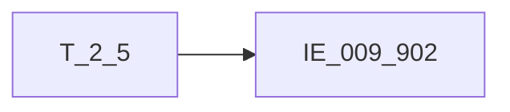

# 血缘-IE_009_902-保函与信用证表-EAST5.0系统

## 页面边界

- 本页维护 `保函与信用证表` 从一表通来源表到 EAST5.0 目标表 `IE_009_902` 的设计血缘。
- 证据为业务需求文档和工作区 GBase SQL 草案，尚未经过生产运行验证。
- 数据表字段定义见 [[数据表-IE_009_902-保函与信用证表-EAST5.0系统]]；业务报送口径见 [[报表-IE_009_902-保函与信用证表-EAST5.0系统]]。

## 系统边界

- 起始系统：一表通系统
- 目标系统：EAST5.0系统
- 是否跨系统血缘：是
- 目标对象：`IE_009_902` `保函与信用证表`

## 业务链路摘要

- 按 `原始材料/业务需求/EAST5.0/054_保函与信用证表.md` 的字段映射，将一表通来源表加工为 EAST5.0 `保函与信用证表`。
- 表级规则：### 2.1 表级规则（Excel第 1317 行） 保函类：业务类型为融资性保函、非融资性保函或备用信用证，关联上月末保函及其他担保协议表，剔除上月已失效数据，卡出当月失效数据。 信用证：内关联信用证状态，关联条件为【信用证协议】.【信用证ID】= 【信用证状态】.【信用证ID】 且 【信用证协议】.【采集日期】= 【信用证状态】.【采集日期】，关联上月末信用证表，剔除上月已失效数据，卡出当月失效数据。 其他担保类：业务类型不为融资性保函、非融资性保函或备用信用证，关联上月末保函及其他担保协议表，剔除上月已失效数据，卡出当月失效数据。 贷款承诺：关联上月末贷款承诺表，剔除上月已失效数据，卡出当月失效数据。取承诺类型为0101、0201、0301的部分。
- SQL 草案采用按 `P_DATA_DATE` 清理后重插或增量边界过滤的方式；具体投产方式待验证。

## 直接上游对象

- [[数据表-T_2_5-个人客户基本情况-一表通系统]]：一表通来源表。

## 直接下游对象

- 目标数据表：[[数据表-IE_009_902-保函与信用证表-EAST5.0系统]]
- 报表业务口径页：[[报表-IE_009_902-保函与信用证表-EAST5.0系统]]
- SQL 草案：`工作区/SQL开发/EAST5.0系统/PROC_EAST_IE_009_902_BHYXYZB_草案.sql`

## Nodes

- [[数据表-T_2_5-个人客户基本情况-一表通系统]]：一表通来源表。
- [[数据表-IE_009_902-保函与信用证表-EAST5.0系统]]：EAST5.0 目标采集表。
- [[报表-IE_009_902-保函与信用证表-EAST5.0系统]]：业务口径说明。

## 表级 Edge List

| From | To | Transform | Evidence |
| --- | --- | --- | --- |
| [[数据表-T_2_5-个人客户基本情况-一表通系统]] | [[数据表-IE_009_902-保函与信用证表-EAST5.0系统]] | 字段映射、关联、过滤、码值/日期转换后装载 `IE_009_902` | [[来源-EAST5.0系统-IE_009_902-保函与信用证表]]；SQL 草案 |

## 字段级 Edge List

| 源对象 | 源字段 | 目标对象 | 目标字段 | 处理逻辑 | 关系类型 | 证据 |
| --- | --- | --- | --- | --- | --- | --- |
| 待确认 | `待确认` | [[数据表-IE_009_902-保函与信用证表-EAST5.0系统]] | `JRXKZH` | 保函及其他担保协议：直接映射；信用证：直接映射；贷款承诺：直接映射 | 直接映射 | [[来源-EAST5.0系统-IE_009_902-保函与信用证表]]；SQL 草案 |
| 待确认 | `待确认` | [[数据表-IE_009_902-保函与信用证表-EAST5.0系统]] | `NBJGH` | 保函及其他担保协议：加工映射：SUBSTR(机构ID,12)；信用证：加工映射：SUBSTR(机构ID,12)；贷款承诺：加工映射：SUBSTR(机构ID,12) | 加工映射 | [[来源-EAST5.0系统-IE_009_902-保函与信用证表]]；SQL 草案 |
| 待确认 | `待确认` | [[数据表-IE_009_902-保函与信用证表-EAST5.0系统]] | `YHJGMC` | 保函及其他担保协议：直接映射；信用证：直接映射；贷款承诺：直接映射 | 直接映射 | [[来源-EAST5.0系统-IE_009_902-保函与信用证表]]；SQL 草案 |
| 待确认 | `待确认` | [[数据表-IE_009_902-保函与信用证表-EAST5.0系统]] | `MXKMBH` | 保函及其他担保协议：直接映射；信用证：直接映射；贷款承诺：直接映射 | 直接映射 | [[来源-EAST5.0系统-IE_009_902-保函与信用证表]]；SQL 草案 |
| 待确认 | `待确认` | [[数据表-IE_009_902-保函与信用证表-EAST5.0系统]] | `MXKMMC` | 保函及其他担保协议：直接映射；信用证：直接映射；贷款承诺：直接映射 | 直接映射 | [[来源-EAST5.0系统-IE_009_902-保函与信用证表]]；SQL 草案 |
| 待确认 | `待确认` | [[数据表-IE_009_902-保函与信用证表-EAST5.0系统]] | `HTBH` | 保函及其他担保协议：直接映射；信用证：直接映射；贷款承诺：直接映射 | 直接映射 | [[来源-EAST5.0系统-IE_009_902-保函与信用证表]]；SQL 草案 |
| 待确认 | `待确认` | [[数据表-IE_009_902-保函与信用证表-EAST5.0系统]] | `YWZL` | 【保函及其他担保协议】加工映射：；CASE WHEN 业务类型 = '01' THEN '融资性保函' ； WHEN 业务类型 = '02' THEN '非融资性保函' ； WHEN 业务类型 = '06' THEN '其他-其他担保类业务'； WHEN 业务类型= '03' THEN '销售协议'； WHEN 业务类型 = '04' THEN '购买协议'； WHEN 业务类型 = '05' THEN '提货担保'； WHEN 业务类... | 码值转换/格式转换 | [[来源-EAST5.0系统-IE_009_902-保函与信用证表]]；SQL 草案 |
| 待确认 | `待确认` | [[数据表-IE_009_902-保函与信用证表-EAST5.0系统]] | `XYZBZDM` | 保函及其他担保协议：直接映射；信用证：直接映射；贷款承诺：直接映射 | 直接映射 | [[来源-EAST5.0系统-IE_009_902-保函与信用证表]]；SQL 草案 |
| 待确认 | `待确认` | [[数据表-IE_009_902-保函与信用证表-EAST5.0系统]] | `XYZJE` | 保函及其他担保协议：直接映射；信用证：直接映射；贷款承诺：直接映射 | 直接映射 | [[来源-EAST5.0系统-IE_009_902-保函与信用证表]]；SQL 草案 |
| 待确认 | `待确认` | [[数据表-IE_009_902-保函与信用证表-EAST5.0系统]] | `YDFJE` | 保函及其他担保协议：加工映射：【保函及其他担保协议】.已兑付金额；信用证：直接映射；贷款承诺：业务额度加工映射：【贷款承诺】.业务额度 - 【贷款承诺】.未使用的额度 | 直接映射 | [[来源-EAST5.0系统-IE_009_902-保函与信用证表]]；SQL 草案 |
| 待确认 | `待确认` | [[数据表-IE_009_902-保函与信用证表-EAST5.0系统]] | `XYZYE` | 保函及其他担保协议：直接映射；信用证：加工映射：直接映射；贷款承诺：直接映射 | 直接映射 | [[来源-EAST5.0系统-IE_009_902-保函与信用证表]]；SQL 草案 |
| 待确认 | `待确认` | [[数据表-IE_009_902-保函与信用证表-EAST5.0系统]] | `KTQSRQ` | 保函及其他担保协议：加工映射：日期转YYYYMMDD格式；信用证：加工映射：日期转YYYYMMDD格式；贷款承诺：加工映射：日期转YYYYMMDD格式 | 加工映射 | [[来源-EAST5.0系统-IE_009_902-保函与信用证表]]；SQL 草案 |
| 待确认 | `待确认` | [[数据表-IE_009_902-保函与信用证表-EAST5.0系统]] | `KTDQRQ` | 保函及其他担保协议：加工映射：日期转YYYYMMDD格式；信用证：加工映射：日期转YYYYMMDD格式；贷款承诺：加工映射：日期转YYYYMMDD格式 | 加工映射 | [[来源-EAST5.0系统-IE_009_902-保函与信用证表]]；SQL 草案 |
| 待确认 | `待确认` | [[数据表-IE_009_902-保函与信用证表-EAST5.0系统]] | `SQRBH` | 保函及其他担保协议：直接映射；信用证：直接映射；贷款承诺：直接映射 | 直接映射 | [[来源-EAST5.0系统-IE_009_902-保函与信用证表]]；SQL 草案 |
| [[数据表-T_2_5-个人客户基本情况-一表通系统]] | `待确认` | [[数据表-IE_009_902-保函与信用证表-EAST5.0系统]] | `SQRMC` | 保函及其他担保协议：加工映射：通过客户ID关联【单一法人基本情况/个人客户基本情况/同业客户基本情况/个体工商户及小微企业主基本情况】获取客户名称；信用证：加工映射：通过客户ID关联【单一法人基本情况/个人客户基本情况/同业客户基本情况/个体工商户及小微企业主基本情况】获取客户名称；贷款承诺：加工映射：通过客户ID关联【单一法人基本情况/个人客户基本情况/同业客户基本情况/个体工商户及小微企业主基本情况】获取客户名称 | 加工映射 | [[来源-EAST5.0系统-IE_009_902-保函与信用证表]]；SQL 草案 |
| [[数据表-T_2_5-个人客户基本情况-一表通系统]] | `待确认` | [[数据表-IE_009_902-保函与信用证表-EAST5.0系统]] | `SQRGJDM` | 保函及其他担保协议：加工映射：通过客户ID关联【单一法人基本情况/个人客户基本情况/同业客户基本情况/个体工商户及小微企业主基本情况】获取注册国家地区代码；信用证：加工映射：通过客户ID关联【单一法人基本情况/个人客户基本情况/同业客户基本情况/个体工商户及小微企业主基本情况】获取注册国家地区代码；贷款承诺：加工映射：通过客户ID关联【单一法人基本情况/个人客户基本情况/同业客户基本情况/个体工商户及小微企业主基本情况】获取注册国家地区... | 加工映射 | [[来源-EAST5.0系统-IE_009_902-保函与信用证表]]；SQL 草案 |
| 待确认 | `待确认` | [[数据表-IE_009_902-保函与信用证表-EAST5.0系统]] | `SYRMC` | 保函及其他担保协议：直接映射；信用证协议：直接映射；贷款承诺：固定值：null | 直接映射 | [[来源-EAST5.0系统-IE_009_902-保函与信用证表]]；SQL 草案 |
| 待确认 | `待确认` | [[数据表-IE_009_902-保函与信用证表-EAST5.0系统]] | `SYRGJDM` | 保函及其他担保协议：直接映射；信用证协议：直接映射；贷款承诺：固定值：null | 直接映射 | [[来源-EAST5.0系统-IE_009_902-保函与信用证表]]；SQL 草案 |
| 待确认 | `待确认` | [[数据表-IE_009_902-保函与信用证表-EAST5.0系统]] | `SYRZH` | 保函及其他担保协议：直接映射；信用证协议：直接映射；贷款承诺：固定值：null | 直接映射 | [[来源-EAST5.0系统-IE_009_902-保函与信用证表]]；SQL 草案 |
| 待确认 | `待确认` | [[数据表-IE_009_902-保函与信用证表-EAST5.0系统]] | `SYRKHHMC` | 保函及其他担保协议：直接映射；信用证协议：直接映射；贷款承诺：固定值：null | 直接映射 | [[来源-EAST5.0系统-IE_009_902-保函与信用证表]]；SQL 草案 |
| 待确认 | `待确认` | [[数据表-IE_009_902-保函与信用证表-EAST5.0系统]] | `ZFQX` | 保函及其他担保协议：固定值：0；信用证协议：直接映射；贷款承诺：固定值：null | 直接映射 | [[来源-EAST5.0系统-IE_009_902-保函与信用证表]]；SQL 草案 |
| 待确认 | `待确认` | [[数据表-IE_009_902-保函与信用证表-EAST5.0系统]] | `HTMYBJ` | 保函及其他担保协议：直接映射；信用证协议：直接映射；贷款承诺：直接映射 | 直接映射 | [[来源-EAST5.0系统-IE_009_902-保函与信用证表]]；SQL 草案 |
| 待确认 | `待确认` | [[数据表-IE_009_902-保函与信用证表-EAST5.0系统]] | `SXFBZ` | 保函及其他担保协议：直接映射；信用证协议：直接映射；贷款承诺：直接映射 | 直接映射 | [[来源-EAST5.0系统-IE_009_902-保函与信用证表]]；SQL 草案 |
| 待确认 | `待确认` | [[数据表-IE_009_902-保函与信用证表-EAST5.0系统]] | `SXFJE` | 保函及其他担保协议：直接映射；信用证协议：直接映射；贷款承诺：直接映射 | 直接映射 | [[来源-EAST5.0系统-IE_009_902-保函与信用证表]]；SQL 草案 |
| 待确认 | `待确认` | [[数据表-IE_009_902-保函与信用证表-EAST5.0系统]] | `BZJBL` | 保函及其他担保协议：直接映射；信用证协议：直接映射；贷款承诺：直接映射 | 直接映射 | [[来源-EAST5.0系统-IE_009_902-保函与信用证表]]；SQL 草案 |
| 待确认 | `待确认` | [[数据表-IE_009_902-保函与信用证表-EAST5.0系统]] | `BZJBZ` | 保函及其他担保协议：直接映射；信用证协议：直接映射；贷款承诺：直接映射 | 直接映射 | [[来源-EAST5.0系统-IE_009_902-保函与信用证表]]；SQL 草案 |
| 待确认 | `待确认` | [[数据表-IE_009_902-保函与信用证表-EAST5.0系统]] | `BZJJE` | 保函及其他担保协议：直接映射；信用证协议：直接映射；贷款承诺：直接映射 | 直接映射 | [[来源-EAST5.0系统-IE_009_902-保函与信用证表]]；SQL 草案 |
| 待确认 | `待确认` | [[数据表-IE_009_902-保函与信用证表-EAST5.0系统]] | `HTZT` | 保函及其他担保协议：加工映射：CASE WHEN T1.担保协议状态 = '02' THEN '正常'； WHEN T1.担保协议状态 = '01' THEN '未生效'； WHEN T1.担保协议状态 = '03' THEN '失效'； WHEN T1.担保协议状态 = '04' THEN '垫款'； WHEN T1.担保协议状态 = '05' THEN '撤销'； WHEN T1.担保协议状态 = '06' THEN '终结'； W... | 加工映射 | [[来源-EAST5.0系统-IE_009_902-保函与信用证表]]；SQL 草案 |
| 待确认 | `待确认` | [[数据表-IE_009_902-保函与信用证表-EAST5.0系统]] | `JBYGH` | 保函及其他担保协议：加工映射：CASE WHEN 经办员工ID = '自动' THEN ''； ELSE 经办员工ID； END；信用证协议：加工映射：CASE WHEN 经办员工ID = '自动' THEN ''； ELSE 经办员工ID； END；贷款承诺：加工映射：CASE WHEN 经办员工ID = '自动' THEN ''； ELSE 经办员工ID； END | 加工映射 | [[来源-EAST5.0系统-IE_009_902-保函与信用证表]]；SQL 草案 |
| 待确认 | `待确认` | [[数据表-IE_009_902-保函与信用证表-EAST5.0系统]] | `BBZ` | 保函及其他担保协议：提取《6.12保函及其他担保协议》中备注内容。；信用证协议：提取《6.11信用证协议》、《8.2信用证状态》备注内容。；贷款承诺：提取《6.24贷款承诺》备注内容。 | 加工映射 | [[来源-EAST5.0系统-IE_009_902-保函与信用证表]]；SQL 草案 |
| 待确认 | `待确认` | [[数据表-IE_009_902-保函与信用证表-EAST5.0系统]] | `CJRQ` | 保函及其他担保协议：直接映射；信用证协议：直接映射；贷款承诺：直接映射 | 直接映射 | [[来源-EAST5.0系统-IE_009_902-保函与信用证表]]；SQL 草案 |

## Graph-总览

## 回链检查

- 目标数据表页：已补 SQL 草案上游依赖摘要或待本次批处理补齐。
- 报表业务口径页：已创建或补充血缘回链。
- 一表通源表页：已补下游消费摘要或待本次批处理补齐。
- 当前字段级血缘基于业务需求和 SQL 草案，未运行验证，状态为待确认。

## 变更与冲突

- 本次为新增设计血缘或补齐草案血缘，不覆盖已验证生产血缘。
- 未发现需要将 `validated` 页面降级的情况；本页保持 `draft`。

## Open Questions

- GBase 草案中的复杂 JOIN、窗口去重、终态纳入和增量边界需要人工复核。
- 部分字段的码值 CASE 在草案中仍为待补，需要结合外部填报说明和跑数结果闭环。
- 外部监管实体页 wikilink 待补。

## 缺口字段（2026-05-04）

| 目标字段 | 字段名称 | 缺口说明 |
| --- | --- | --- |
| `SENSITIVEFLAG` | 涉密标志 | 本地 DDL 存在，但业务需求映射表和 SQL 草案未能确认来源，字段级血缘待补。 |
| `GSFZJG` | 归属分支机构 | 本地 DDL 存在，但业务需求映射表和 SQL 草案未能确认来源，字段级血缘待补。 |
| `SQRKHLB` | 申请人客户类别 | 本地 DDL 存在，但业务需求映射表和 SQL 草案未能确认来源，字段级血缘待补。 |
| `SYRKHLB` | 受益人客户类别 | 本地 DDL 存在，但业务需求映射表和 SQL 草案未能确认来源，字段级血缘待补。 |
