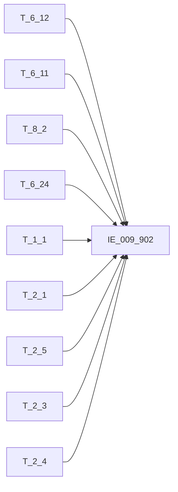

# 血缘-IE_009_902-保函与信用证表-EAST5.0系统

## 页面边界

- 本页维护 `保函与信用证表` 从一表通来源表到 EAST5.0 目标表 `IE_009_902` 的设计血缘。
- 证据为业务需求文档和工作区 GBase SQL 草案，尚未经过生产运行验证。
- 数据表字段定义见 [[数据表-IE_009_902-保函与信用证表-EAST5.0系统]]；业务报送口径见 [[报表-IE_009_902-保函与信用证表-EAST5.0系统]]。

## 系统边界

- 起始系统：一表通系统
- 目标系统：EAST5.0系统
- 是否跨系统血缘：是
- 目标对象：`IE_009_902` `保函与信用证表`

## 业务链路摘要

- 按 `原始材料/业务需求/EAST5.0/054_保函与信用证表.md` 的字段映射，将一表通来源表加工为 EAST5.0 `保函与信用证表`。
- 四种业务类别通过 UNION ALL 合并：保函类(T_6_12)、信用证(T_6_11 INNER JOIN T_8_2)、其他担保类(T_6_12)、贷款承诺(T_6_24)。
- 全量逻辑：DELETE+INSERT，LEFT JOIN 上月数据实现"剔除上月已失效数据，卡出当月失效数据"。
- 2026-05-10（第2轮）：修复信用证 BBZ 拼接、SQRMC 补 T_2_4.B040003。

## 直接上游对象

- [[数据表-T_6_12-保函及其他担保协议-一表通系统]]：保函类/其他担保类主源
- [[数据表-T_6_11-信用证协议-一表通系统]]：信用证主源
- [[数据表-T_8_2-信用证状态-一表通系统]]：信用证补充源
- [[数据表-T_6_24-贷款承诺-一表通系统]]：贷款承诺主源
- [[数据表-T_2_1-单一法人基本情况-一表通系统]]：申请人名称/国家代码（对公客户）
- [[数据表-T_2_5-个人客户基本情况-一表通系统]]：申请人名称/国家代码（个人客户）
- [[数据表-T_2_3-同业客户基本情况-一表通系统]]：申请人名称/国家代码（同业客户）
- [[数据表-T_2_4-个体工商户及小微企业主基本情况-一表通系统]]：申请人名称（个体工商户经营者姓名）

## 直接下游对象

- 目标数据表：[[数据表-IE_009_902-保函与信用证表-EAST5.0系统]]
- 报表业务口径页：[[报表-IE_009_902-保函与信用证表-EAST5.0系统]]
- SQL 草案：`工作区/SQL开发/EAST5.0系统/PROC_EAST_IE_009_902_BHYXYZB_草案.sql`

## Nodes

- [[数据表-T_6_12-保函及其他担保协议-一表通系统]]
- [[数据表-T_6_11-信用证协议-一表通系统]]
- [[数据表-T_8_2-信用证状态-一表通系统]]
- [[数据表-T_6_24-贷款承诺-一表通系统]]
- [[数据表-T_1_1-机构信息-一表通系统]]
- [[数据表-T_2_1-单一法人基本情况-一表通系统]]
- [[数据表-T_2_5-个人客户基本情况-一表通系统]]
- [[数据表-T_2_3-同业客户基本情况-一表通系统]]
- [[数据表-T_2_4-个体工商户及小微企业主基本情况-一表通系统]]
- [[数据表-IE_009_902-保函与信用证表-EAST5.0系统]]：EAST5.0 目标采集表。
- [[报表-IE_009_902-保函与信用证表-EAST5.0系统]]：业务口径说明。

## 表级 Edge List

| From | To | Transform | Evidence |
| --- | --- | --- | --- |
| [[数据表-T_6_12-保函及其他担保协议-一表通系统]] | [[数据表-IE_009_902-保函与信用证表-EAST5.0系统]] | 保函类/其他担保类：按 F120032 过滤 → 字段映射 → 码值转换 → LEFT JOIN T_1_1/T_2_1/T_2_5/T_2_3/T_2_4/T_6_12(上月) | SQL 草案 |
| [[数据表-T_6_11-信用证协议-一表通系统]] | [[数据表-IE_009_902-保函与信用证表-EAST5.0系统]] | 信用证：INNER JOIN T_8_2 → 字段映射 → 码值转换 → LEFT JOIN T_1_1/T_2_1/T_2_5/T_2_3/T_2_4/T_8_2(上月) | SQL 草案 |
| [[数据表-T_8_2-信用证状态-一表通系统]] | [[数据表-IE_009_902-保函与信用证表-EAST5.0系统]] | 信用证状态补充：H020012→HTZT、H020004→MXKMMC、H020003→MXKMBH、H020007→YDFJE、H020014→XYZYE、H020015→BBZ(拼接) | SQL 草案 |
| [[数据表-T_6_24-贷款承诺-一表通系统]] | [[数据表-IE_009_902-保函与信用证表-EAST5.0系统]] | 贷款承诺：按 F240007 过滤 → 字段映射 → 码值转换 → LEFT JOIN T_1_1/T_2_1/T_2_5/T_2_3/T_2_4/T_6_24(上月) | SQL 草案 |

## 字段级 Edge List

=== 保函类 & 其他担保类（T_6_12） ===

| 源对象 | 源字段 | 目标对象 | 目标字段 | 处理逻辑 | 关系类型 | 证据 |
| --- | --- | --- | --- | --- | --- | --- |
| T_6_12 | F120016 | IE_009_902 | BZJBZ | COALESCE(F120016, '') | 直接映射 | SQL 草案 |
| T_6_12 | F120029 | IE_009_902 | HTZT | CASE 码值转换：'02'→正常/'01'→未生效/'03'→失效/'04'→垫款/'05'→撤销/'06'→终结/'00-XX'→其他-XX/ELSE→终结 | 加工映射 | SQL 草案 |
| T_6_12 | F120024 | IE_009_902 | JBYGH | CASE WHEN '自动' THEN '' ELSE COALESCE(F120024,'') END | 加工映射 | SQL 草案 |
| T_6_12 | F120028 | IE_009_902 | CJRQ | DATE_FORMAT(F120028, '%Y%m%d') | 加工映射 | SQL 草案 |
| T_1_1 | A010003 | IE_009_902 | JRXKZH | COALESCE(A010003, '')，ON guar.F120003=inst.A010001 | 关联映射 | SQL 草案 |
| T_1_1 | A010005 | IE_009_902 | YHJGMC | COALESCE(A010005, '')，同 JRXKZH 关联 | 关联映射 | SQL 草案 |
| T_6_12 | F120007 | IE_009_902 | MXKMMC | COALESCE(F120007, '') | 直接映射 | SQL 草案 |
| T_6_12 | F120032 | IE_009_902 | YWZL | CASE 码值转换：'01'→融资性保函/'02'→非融资性保函/'03'→销售协议/'04'→购买协议/'05'→提货担保/'06'→其他-其他担保类业务/'07'→备用信用证/'00-XX'→其他-XX/ELSE→'' | 加工映射 | SQL 草案 |
| T_6_12 | F120034 | IE_009_902 | YDFJE | CAST(F120034 AS DECIMAL(20,2)) COALESCE 0 | 直接映射 | SQL 草案 |
| T_6_12 | F120014 | IE_009_902 | KTDQRQ | DATE_FORMAT(F120014, '%Y%m%d') | 加工映射 | SQL 草案 |
| T_6_12 | F120004 | IE_009_902 | SQRBH | COALESCE(F120004, '') | 直接映射 | SQL 草案 |
| T_2_1/T_2_5/T_2_3 | B010028/B050032/B030011 | IE_009_902 | SQRGJDM | COALESCE(corp.B010028, ind.B050032, inter.B030011, 'CHN') | 关联映射 | SQL 草案 |
| T_6_12 | F120021 | IE_009_902 | SYRMC | COALESCE(F120021, '') | 直接映射 | SQL 草案 |
| — | 固定值0 | IE_009_902 | ZFQX | 保函类/其他担保类无对应字段，固定值 0 | 固定值 | SQL 草案 |
| T_6_12 | F120020 | IE_009_902 | SXFBZ | COALESCE(F120020, '') | 直接映射 | SQL 草案 |
| T_6_12 | F120013 | IE_009_902 | KTQSRQ | DATE_FORMAT(F120013, '%Y%m%d') | 加工映射 | SQL 草案 |
| T_6_12 | F120019 | IE_009_902 | SXFJE | CAST(F120019 AS DECIMAL(20,2)) COALESCE 0 | 直接映射 | SQL 草案 |
| T_6_12 | F120018 | IE_009_902 | BZJBL | CAST(F120018 AS DECIMAL(20,2)) COALESCE 0 | 直接映射 | SQL 草案 |
| T_6_12 | F120003 | IE_009_902 | GSFZJG | SUBSTR(F120003, 12) | 加工映射 | SQL 草案 |
| T_6_12 | F120003 | IE_009_902 | NBJGH | SUBSTR(F120003, 12) | 加工映射 | SQL 草案 |
| T_6_12 | F120006 | IE_009_902 | MXKMBH | COALESCE(F120006, '') | 直接映射 | SQL 草案 |
| T_6_12 | F120002 | IE_009_902 | HTBH | COALESCE(F120002, '') | 直接映射 | SQL 草案 |
| T_6_12 | F120010 | IE_009_902 | XYZBZDM | COALESCE(F120010, '') | 直接映射 | SQL 草案 |
| T_6_12 | F120009 | IE_009_902 | XYZJE | CAST(F120009 AS DECIMAL(20,2)) COALESCE 0 | 直接映射 | SQL 草案 |
| T_6_12 | F120023 | IE_009_902 | XYZYE | CAST(F120023 AS DECIMAL(20,2)) COALESCE 0 | 直接映射 | SQL 草案 |
| T_2_1/T_2_5/T_2_3/T_2_4 | B010003/B050003/B030003/B040003 | IE_009_902 | SQRMC | COALESCE(corp.B010003, ind.B050003, inter.B030003, busi.B040003, '') | 关联映射 | SQL 草案 |
| T_6_12 | F120022 | IE_009_902 | SYRGJDM | COALESCE(F120022, '') | 直接映射 | SQL 草案 |
| T_6_12 | F120030 | IE_009_902 | SYRZH | COALESCE(F120030, '') | 直接映射 | SQL 草案 |
| T_6_12 | F120031 | IE_009_902 | SYRKHHMC | COALESCE(F120031, '') | 直接映射 | SQL 草案 |
| T_6_12 | F120011 | IE_009_902 | HTMYBJ | COALESCE(F120011, '') | 直接映射 | SQL 草案 |
| T_6_12 | F120017 | IE_009_902 | BZJJE | CAST(F120017 AS DECIMAL(20,2)) COALESCE 0 | 直接映射 | SQL 草案 |
| T_6_12 | F120027 | IE_009_902 | BBZ | COALESCE(F120027, '') | 直接映射 | SQL 草案 |
| — | — | IE_009_902 | SENSITIVEFLAG | 固定值 '' | 缺口 | SQL 草案 |
| — | — | IE_009_902 | SQRKHLB | 固定值 '' | 缺口 | SQL 草案 |
| — | — | IE_009_902 | SYRKHLB | 固定值 '' | 缺口 | SQL 草案 |

=== 信用证（T_6_11 INNER JOIN T_8_2） ===

| 源对象 | 源字段 | 目标对象 | 目标字段 | 处理逻辑 | 关系类型 | 证据 |
| --- | --- | --- | --- | --- | --- | --- |
| T_6_11 | F110030 | IE_009_902 | BZJBZ | COALESCE(F110030, '') | 直接映射 | SQL 草案 |
| T_8_2 | H020012 | IE_009_902 | HTZT | CASE 码值转换（同保函类码值逻辑） | 加工映射 | SQL 草案 |
| T_6_11 | F110033 | IE_009_902 | JBYGH | CASE WHEN '自动' THEN '' ELSE COALESCE(F110033,'') END | 加工映射 | SQL 草案 |
| T_6_11 | F110038 | IE_009_902 | CJRQ | DATE_FORMAT(F110038, '%Y%m%d') | 加工映射 | SQL 草案 |
| T_1_1 | A010003 | IE_009_902 | JRXKZH | COALESCE(A010003, '') | 关联映射 | SQL 草案 |
| T_1_1 | A010005 | IE_009_902 | YHJGMC | COALESCE(A010005, '') | 关联映射 | SQL 草案 |
| T_8_2 | H020004 | IE_009_902 | MXKMMC | COALESCE(H020004, '') | 直接映射 | SQL 草案 |
| T_6_11 | F110006 | IE_009_902 | YWZL | CASE: '01'→国内信用证/'02'→国际信用证/ELSE→'' | 加工映射 | SQL 草案 |
| T_8_2 | H020007 | IE_009_902 | YDFJE | CAST(H020007 AS DECIMAL(20,2)) COALESCE 0 | 直接映射 | SQL 草案 |
| T_6_11 | F110011 | IE_009_902 | KTDQRQ | DATE_FORMAT(F110011, '%Y%m%d') | 加工映射 | SQL 草案 |
| T_6_11 | F110004 | IE_009_902 | SQRBH | COALESCE(F110004, '') | 直接映射 | SQL 草案 |
| T_6_11/T_2_1/T_2_5/T_2_3 | F110019/B010028/B050032/B030011 | IE_009_902 | SQRGJDM | COALESCE(lc.F110019, corp.B010028, ind.B050032, inter.B030011, 'CHN') | 关联映射 | SQL 草案 |
| T_6_11 | F110020 | IE_009_902 | SYRMC | COALESCE(F110020, '') | 直接映射 | SQL 草案 |
| T_6_11 | F110026 | IE_009_902 | ZFQX | COALESCE(F110026, 0) | 直接映射 | SQL 草案 |
| T_6_11 | F110027 | IE_009_902 | SXFBZ | COALESCE(F110027, '') | 直接映射 | SQL 草案 |
| T_6_11 | F110010 | IE_009_902 | KTQSRQ | DATE_FORMAT(F110010, '%Y%m%d') | 加工映射 | SQL 草案 |
| T_6_11 | F110028 | IE_009_902 | SXFJE | CAST(F110028 AS DECIMAL(20,2)) COALESCE 0 | 直接映射 | SQL 草案 |
| T_6_11 | F110032 | IE_009_902 | BZJBL | CAST(F110032 AS DECIMAL(20,2)) COALESCE 0 | 直接映射 | SQL 草案 |
| T_6_11 | F110003 | IE_009_902 | GSFZJG | SUBSTR(F110003, 12) | 加工映射 | SQL 草案 |
| T_6_11 | F110003 | IE_009_902 | NBJGH | SUBSTR(F110003, 12) | 加工映射 | SQL 草案 |
| T_8_2 | H020003 | IE_009_902 | MXKMBH | COALESCE(H020003, '') | 直接映射 | SQL 草案 |
| T_6_11 | F110002 | IE_009_902 | HTBH | COALESCE(F110002, '') | 直接映射 | SQL 草案 |
| T_6_11 | F110008 | IE_009_902 | XYZBZDM | COALESCE(F110008, '') | 直接映射 | SQL 草案 |
| T_6_11 | F110009 | IE_009_902 | XYZJE | CAST(F110009 AS DECIMAL(20,2)) COALESCE 0 | 直接映射 | SQL 草案 |
| T_8_2 | H020014 | IE_009_902 | XYZYE | CAST(H020014 AS DECIMAL(20,2)) COALESCE 0 | 直接映射 | SQL 草案 |
| T_2_1/T_2_5/T_2_3/T_2_4 | B010003/B050003/B030003/B040003 | IE_009_902 | SQRMC | COALESCE(corp.B010003, ind.B050003, inter.B030003, busi.B040003, '') | 关联映射 | SQL 草案 |
| T_6_11 | F110021 | IE_009_902 | SYRGJDM | COALESCE(F110021, '') | 直接映射 | SQL 草案 |
| T_6_11 | F110037 | IE_009_902 | SYRZH | COALESCE(F110037, '') | 直接映射 | SQL 草案 |
| T_6_11 | F110022 | IE_009_902 | SYRKHHMC | COALESCE(F110022, '') | 直接映射 | SQL 草案 |
| T_6_11 | F110018 | IE_009_902 | HTMYBJ | COALESCE(F110018, '') | 直接映射 | SQL 草案 |
| T_6_11 | F110031 | IE_009_902 | BZJJE | CAST(F110031 AS DECIMAL(20,2)) COALESCE 0 | 直接映射 | SQL 草案 |
| T_6_11 + T_8_2 | F110036 + H020015 | IE_009_902 | BBZ | CONCAT_WS(';', lc.F110036, lcstat.H020015) | 加工映射 | SQL 草案 |
| — | — | IE_009_902 | SENSITIVEFLAG | 固定值 '' | 缺口 | SQL 草案 |
| — | — | IE_009_902 | SQRKHLB | 固定值 '' | 缺口 | SQL 草案 |
| — | — | IE_009_902 | SYRKHLB | 固定值 '' | 缺口 | SQL 草案 |

=== 贷款承诺（T_6_24） ===

| 源对象 | 源字段 | 目标对象 | 目标字段 | 处理逻辑 | 关系类型 | 证据 |
| --- | --- | --- | --- | --- | --- | --- |
| T_6_24 | F240022 | IE_009_902 | BZJBZ | COALESCE(F240022, '') | 直接映射 | SQL 草案 |
| T_6_24 | F240013 | IE_009_902 | HTZT | CASE:'01'→正常/'02'→未生效/'03'→其他-中止/'04'→终结/'05'→撤销/'06'→失效/'00-XX'→其他-XX/ELSE→终结 | 加工映射 | SQL 草案 |
| T_6_24 | F240015 | IE_009_902 | JBYGH | CASE WHEN '自动' THEN '' ELSE COALESCE(F240015,'') END | 加工映射 | SQL 草案 |
| T_6_24 | F240018 | IE_009_902 | CJRQ | DATE_FORMAT(F240018, '%Y%m%d') | 加工映射 | SQL 草案 |
| T_1_1 | A010003 | IE_009_902 | JRXKZH | COALESCE(A010003, '') | 关联映射 | SQL 草案 |
| T_1_1 | A010005 | IE_009_902 | YHJGMC | COALESCE(A010005, '') | 关联映射 | SQL 草案 |
| T_6_24 | F240009 | IE_009_902 | MXKMMC | COALESCE(F240009, '') | 直接映射 | SQL 草案 |
| — | 固定值 | IE_009_902 | YWZL | 固定值 '其他-贷款承诺' | 固定值 | SQL 草案 |
| T_6_24 | F240005 - F240010 | IE_009_902 | YDFJE | CAST(F240005 - F240010 AS DECIMAL(20,2)) COALESCE 0 | 加工映射 | SQL 草案 |
| T_6_24 | F240012 | IE_009_902 | KTDQRQ | DATE_FORMAT(F240012, '%Y%m%d') | 加工映射 | SQL 草案 |
| T_6_24 | F240004 | IE_009_902 | SQRBH | COALESCE(F240004, '') | 直接映射 | SQL 草案 |
| T_2_1/T_2_5/T_2_3 | B010028/B050032/B030011 | IE_009_902 | SQRGJDM | COALESCE(corp.B010028, ind.B050032, inter.B030011, 'CHN') | 关联映射 | SQL 草案 |
| — | NULL | IE_009_902 | SYRMC | 固定值 NULL | 固定值 | SQL 草案 |
| — | NULL | IE_009_902 | ZFQX | 固定值 NULL | 固定值 | SQL 草案 |
| T_6_24 | F240020 | IE_009_902 | SXFBZ | COALESCE(F240020, '') | 直接映射 | SQL 草案 |
| T_6_24 | F240011 | IE_009_902 | KTQSRQ | DATE_FORMAT(F240011, '%Y%m%d') | 加工映射 | SQL 草案 |
| T_6_24 | F240021 | IE_009_902 | SXFJE | CAST(F240021 AS DECIMAL(20,2)) COALESCE 0 | 直接映射 | SQL 草案 |
| T_6_24 | F240024 | IE_009_902 | BZJBL | CAST(F240024 AS DECIMAL(20,2)) COALESCE 0 | 直接映射 | SQL 草案 |
| T_6_24 | F240003 | IE_009_902 | GSFZJG | SUBSTR(F240003, 12) | 加工映射 | SQL 草案 |
| T_6_24 | F240003 | IE_009_902 | NBJGH | SUBSTR(F240003, 12) | 加工映射 | SQL 草案 |
| T_6_24 | F240008 | IE_009_902 | MXKMBH | COALESCE(F240008, '') | 直接映射 | SQL 草案 |
| T_6_24 | F240002 | IE_009_902 | HTBH | COALESCE(F240002, '') | 直接映射 | SQL 草案 |
| T_6_24 | F240006 | IE_009_902 | XYZBZDM | COALESCE(F240006, '') | 直接映射 | SQL 草案 |
| T_6_24 | F240005 | IE_009_902 | XYZJE | CAST(F240005 AS DECIMAL(20,2)) COALESCE 0 | 直接映射 | SQL 草案 |
| T_6_24 | F240010 | IE_009_902 | XYZYE | CAST(F240010 AS DECIMAL(20,2)) COALESCE 0 | 直接映射 | SQL 草案 |
| T_2_1/T_2_5/T_2_3/T_2_4 | B010003/B050003/B030003/B040003 | IE_009_902 | SQRMC | COALESCE(corp.B010003, ind.B050003, inter.B030003, busi.B040003, '') | 关联映射 | SQL 草案 |
| — | NULL | IE_009_902 | SYRGJDM | 固定值 NULL | 固定值 | SQL 草案 |
| — | NULL | IE_009_902 | SYRZH | 固定值 NULL | 固定值 | SQL 草案 |
| — | NULL | IE_009_902 | SYRKHHMC | 固定值 NULL | 固定值 | SQL 草案 |
| T_6_24 | F240026 | IE_009_902 | HTMYBJ | COALESCE(F240026, '') | 直接映射 | SQL 草案 |
| T_6_24 | F240023 | IE_009_902 | BZJJE | CAST(F240023 AS DECIMAL(20,2)) COALESCE 0 | 直接映射 | SQL 草案 |
| T_6_24 | F240025 | IE_009_902 | BBZ | COALESCE(F240025, '') | 直接映射 | SQL 草案 |
| — | — | IE_009_902 | SENSITIVEFLAG | 固定值 '' | 缺口 | SQL 草案 |
| — | — | IE_009_902 | SQRKHLB | 固定值 '' | 缺口 | SQL 草案 |
| — | — | IE_009_902 | SYRKHLB | 固定值 '' | 缺口 | SQL 草案 |

## Graph-总览

## 回链检查

- 目标数据表页：已补 SQL 草案上游依赖摘要或待本次批处理补齐。
- 报表业务口径页：已创建或补充血缘回链。
- 一表通源表页：已补下游消费摘要或待本次批处理补齐。
- 当前字段级血缘基于业务需求和 SQL 草案，未运行验证，状态为待确认。

## 变更与冲突

- 本次为新增设计血缘或补齐草案血缘，不覆盖已验证生产血缘。
- 未发现需要将 `validated` 页面降级的情况；本页保持 `draft`。
- 2026-05-10（第2轮）：字段级 Edge List 全部 35 个字段三套来源（保函类/其他担保类、信用证、贷款承诺）已完整闭环。新增 T_6_24、T_1_1、T_2_1、T_2_5、T_2_3、T_2_4 节点。修复 BBZ 和 SQRMC 的 COALESCE 链。
- 2026-05-10（第3轮-重试）：逐字段对标源表 DDL 完成第3轮验证：确认全部 35 个字段映射正确、4 个 UNION ALL 分支 INSERT/SELECT 列序一致、T_6_12/T_6_11/T_8_2/T_6_24 字段名与源表 DDL 完全匹配、T_2_1/T_2_5/T_2_3/T_2_4/T_1_1 JOIN 字段名正确。缺口字段 4 个（SENSITIVEFLAG/GSFZJG/SQRKHLB/SYRKHLB）保持现状。

## Open Questions

- GBase 草案中的复杂 JOIN、窗口去重、终态纳入和增量边界需要人工复核。
- 部分字段的码值 CASE 在草案中仍为待补，需要结合外部填报说明和跑数结果闭环。
- 外部监管实体页 wikilink 待补。
- DATE_SUB 取上月末语义在月末边界处待确认。

## 缺口字段（2026-05-10 第2轮）

| 目标字段 | 字段名称 | 缺口说明 |
| --- | --- | --- |
| `SENSITIVEFLAG` | 涉密标志 | 本地 DDL 存在，但业务需求映射表和 SQL 草案未能确认来源，字段级血缘待补。 |
| `GSFZJG` | 归属分支机构 | 本地 DDL 存在，但业务需求映射表未给来源，SQL 借用 SUBSTR(机构ID,12) 暂填，待确认。 |
| `SQRKHLB` | 申请人客户类别 | 本地 DDL 存在，但业务需求映射表和 SQL 草案未能确认来源，字段级血缘待补。 |
| `SYRKHLB` | 受益人客户类别 | 本地 DDL 存在，但业务需求映射表和 SQL 草案未能确认来源，字段级血缘待补。 |
