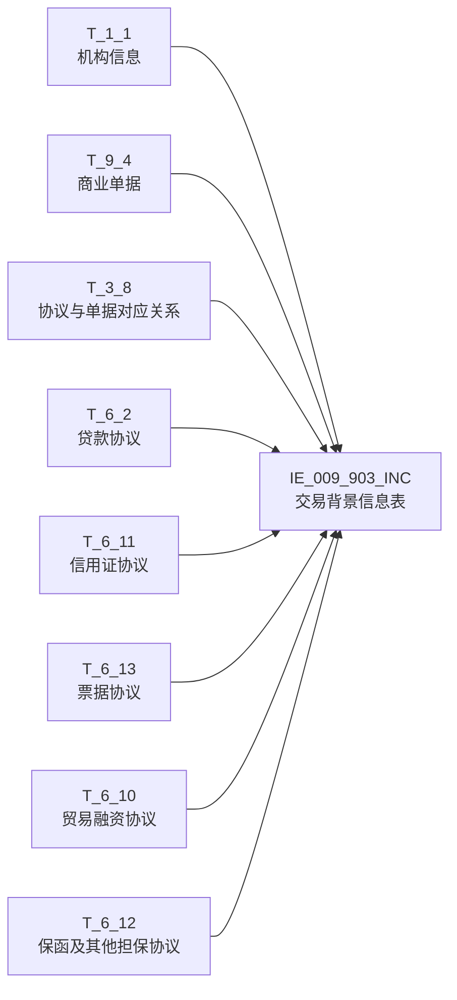

# 血缘-IE_009_903_INC-交易背景信息表-EAST5.0系统

## 页面边界

- 本页维护 `交易背景信息表` 从一表通来源表到 EAST5.0 目标表 `IE_009_903_INC` 的设计血缘。
- 证据为业务需求文档和工作区 GBase SQL 草案，尚未经过生产运行验证。
- 数据表字段定义见 [[数据表-IE_009_903_INC-交易背景信息表-EAST5.0系统]]；业务报送口径见 [[报表-IE_009_903_INC-交易背景信息表-EAST5.0系统]]。

## 系统边界

- 起始系统：一表通系统
- 目标系统：EAST5.0系统
- 是否跨系统血缘：是
- 目标对象：`IE_009_903_INC` `交易背景信息表`

## 业务链路摘要

- 按 `原始材料/业务需求/EAST5.0/055_交易背景信息表.md` 的字段映射，将一表通来源表加工为 EAST5.0 `交易背景信息表`。
- 表级规则（Excel第1349行）：主表【商业单据】T_9_4 → INNER JOIN 子查询 T11（协议与单据对应关系 T_3_8 + 左连接贷款协议 T_6_2 判断本月生效合同 + 左连接上月对应关系 T_3_8 LST 判断上月未报送过）→ LEFT JOIN 4 种协议表（信用证/票据/贸易融资/保函）取币种+金额+备注 → LEFT JOIN 机构信息 T_1_1 取金融许可证号+机构名称。
- SQL 草案采用按 `P_DATA_DATE` 清理后重插的方式；2026-05-10 已按业务需求逐字段重构，消除全部 JOIN/WHERE TODO 占位。

## 直接上游对象

- [[数据表-T_1_1-机构信息-一表通系统]]：一表通来源表，取 JRXKZH/YHJGMC。
- [[数据表-T_9_4-商业单据-一表通系统]]：一表通来源表，主表。
- [[数据表-T_3_8-交易与单据对应关系-一表通系统]]：一表通来源表，内关联子查询提供业务种类/备注/协议ID。
- [[数据表-T_6_2-贷款协议-一表通系统]]：一表通来源表，子查询内判断本月生效合同；主查询取备注。
- [[数据表-T_6_11-信用证协议-一表通系统]]：一表通来源表，取协议币种/开证金额/备注。
- [[数据表-T_6_13-票据协议-一表通系统]]：一表通来源表，取协议币种/票据金额/备注。
- [[数据表-T_6_10-贸易融资协议-一表通系统]]：一表通来源表，取协议币种/贸易融资金额/备注。
- [[数据表-T_6_12-保函及其他担保协议-一表通系统]]：一表通来源表，取协议币种/协议金额/备注。
- SQL 草案：`工作区/SQL开发/EAST5.0系统/PROC_EAST_IE_009_903_INC_JYBJXXB_草案.sql`（2026-05-10 重构）

## 直接下游对象

- 目标数据表：[[数据表-IE_009_903_INC-交易背景信息表-EAST5.0系统]]
- 报表业务口径页：[[报表-IE_009_903_INC-交易背景信息表-EAST5.0系统]]
- SQL 草案：`工作区/SQL开发/EAST5.0系统/PROC_EAST_IE_009_903_INC_JYBJXXB_草案.sql`

## Nodes

- [[数据表-T_1_1-机构信息-一表通系统]]：一表通来源表。
- [[数据表-T_9_4-商业单据-一表通系统]]：一表通来源表。
- [[数据表-T_3_8-交易与单据对应关系-一表通系统]]：一表通来源表。
- [[数据表-T_6_2-贷款协议-一表通系统]]：一表通来源表。
- [[数据表-T_6_11-信用证协议-一表通系统]]：一表通来源表。
- [[数据表-T_6_13-票据协议-一表通系统]]：一表通来源表。
- [[数据表-T_6_10-贸易融资协议-一表通系统]]：一表通来源表。
- [[数据表-T_6_12-保函及其他担保协议-一表通系统]]：一表通来源表。
- [[数据表-IE_009_903_INC-交易背景信息表-EAST5.0系统]]：EAST5.0 目标采集表。
- [[报表-IE_009_903_INC-交易背景信息表-EAST5.0系统]]：业务口径说明。
- 子查询 T11（协议与单据对应关系 T_3_8 内关联贷款协议 T_6_2 + 上月对应关系 T_3_8 LST）

## 表级 Edge List

| From | To | Transform | Evidence |
| --- | --- | --- | --- |
| [[数据表-T_9_4-商业单据-一表通系统]] | [[数据表-IE_009_903_INC-交易背景信息表-EAST5.0系统]] | 主表，INNER JOIN 子查询 T11 后字段映射、码值转换、日期转换 | SQL 草案 2026-05-10 重构 |
| [[数据表-T_3_8-交易与单据对应关系-一表通系统]] | [[数据表-IE_009_903_INC-交易背景信息表-EAST5.0系统]] | 内关联子查询 T11，提供业务种类/备注/协议ID | SQL 草案 2026-05-10 重构 |
| [[数据表-T_6_2-贷款协议-一表通系统]] | [[数据表-IE_009_903_INC-交易背景信息表-EAST5.0系统]] | 子查询内判断本月生效合同；主查询取备注 | SQL 草案 2026-05-10 重构 |
| [[数据表-T_6_11-信用证协议-一表通系统]] | [[数据表-IE_009_903_INC-交易背景信息表-EAST5.0系统]] | LEFT JOIN 取协议币种/开证金额/备注 | SQL 草案 2026-05-10 重构 |
| [[数据表-T_6_13-票据协议-一表通系统]] | [[数据表-IE_009_903_INC-交易背景信息表-EAST5.0系统]] | LEFT JOIN 取协议币种/票据金额/备注 | SQL 草案 2026-05-10 重构 |
| [[数据表-T_6_10-贸易融资协议-一表通系统]] | [[数据表-IE_009_903_INC-交易背景信息表-EAST5.0系统]] | LEFT JOIN 取协议币种/贸易融资金额/备注 | SQL 草案 2026-05-10 重构 |
| [[数据表-T_6_12-保函及其他担保协议-一表通系统]] | [[数据表-IE_009_903_INC-交易背景信息表-EAST5.0系统]] | LEFT JOIN 取协议币种/协议金额/备注 | SQL 草案 2026-05-10 重构 |
| [[数据表-T_1_1-机构信息-一表通系统]] | [[数据表-IE_009_903_INC-交易背景信息表-EAST5.0系统]] | LEFT JOIN 取金融许可证号/银行机构名称 | SQL 草案 2026-05-10 重构 |

## 字段级 Edge List

| 源对象 | 源字段 | 目标对象 | 目标字段 | 处理逻辑 | 关系类型 | 证据 |
| --- | --- | --- | --- | --- | --- | --- |
| [[数据表-T_1_1-机构信息-一表通系统]] | `A010003` | [[数据表-IE_009_903_INC-交易背景信息表-EAST5.0系统]] | `JRXKZH` | 直接映射 | 直接映射 | SQL 草案 2026-05-10 重构 |
| [[数据表-T_9_4-商业单据-一表通系统]] | `J040002` | [[数据表-IE_009_903_INC-交易背景信息表-EAST5.0系统]] | `NBJGH` | 加工映射：SUBSTR(机构ID,12) | 加工映射 | SQL 草案 2026-05-10 重构 |
| [[数据表-T_1_1-机构信息-一表通系统]] | `A010005` | [[数据表-IE_009_903_INC-交易背景信息表-EAST5.0系统]] | `YHJGMC` | 直接映射 | 直接映射 | SQL 草案 2026-05-10 重构 |
| [[数据表-T_3_8-交易与单据对应关系-一表通系统]] | `C080008` | [[数据表-IE_009_903_INC-交易背景信息表-EAST5.0系统]] | `YWZL` | 加工映射：CASE 13分支 + '00%'通配→'其他-XX' + ELSE '' | 加工映射 | SQL 草案 2026-05-10 重构 |
| [[数据表-T_3_8-交易与单据对应关系-一表通系统]] | `C080002` | [[数据表-IE_009_903_INC-交易背景信息表-EAST5.0系统]] | `PJHHTH` | 直接映射 | 直接映射 | SQL 草案 2026-05-10 重构 |
| [[数据表-T_6_11-信用证协议-一表通系统]] | `F110008` | [[数据表-IE_009_903_INC-交易背景信息表-EAST5.0系统]] | `BZ` | 加工映射：COALESCE 4 协议表协议币种 | 加工映射 | SQL 草案 2026-05-10 重构 |
| [[数据表-T_6_11-信用证协议-一表通系统]] | `F110009` | [[数据表-IE_009_903_INC-交易背景信息表-EAST5.0系统]] | `HTJE` | 加工映射：COALESCE 4 协议表金额+CAST | 加工映射 | SQL 草案 2026-05-10 重构 |
| [[数据表-T_9_4-商业单据-一表通系统]] | `J040001` | [[数据表-IE_009_903_INC-交易背景信息表-EAST5.0系统]] | `DJBH` | 直接映射 | 直接映射 | SQL 草案 2026-05-10 重构 |
| [[数据表-T_9_4-商业单据-一表通系统]] | `J040006` | [[数据表-IE_009_903_INC-交易背景信息表-EAST5.0系统]] | `DJZL` | 加工映射：CASE 13分支 + '00%'通配→REPLACE('00','') + ELSE '' | 加工映射 | SQL 草案 2026-05-10 重构 |
| [[数据表-T_9_4-商业单据-一表通系统]] | `J040004` | [[数据表-IE_009_903_INC-交易背景信息表-EAST5.0系统]] | `DJBZ` | 直接映射 | 直接映射 | SQL 草案 2026-05-10 重构 |
| [[数据表-T_9_4-商业单据-一表通系统]] | `J040005` | [[数据表-IE_009_903_INC-交易背景信息表-EAST5.0系统]] | `DJJE` | 直接映射 + CAST DECIMAL | 直接映射 | SQL 草案 2026-05-10 重构 |
| [[数据表-T_9_4-商业单据-一表通系统]] | `J040007` | [[数据表-IE_009_903_INC-交易背景信息表-EAST5.0系统]] | `BBZ` | CONCAT_WS 7 表备注拼接 | 加工映射 | SQL 草案 2026-05-10 重构 |
| [[数据表-T_3_8-交易与单据对应关系-一表通系统]] | `C080006` | [[数据表-IE_009_903_INC-交易背景信息表-EAST5.0系统]] | `BBZ` | CONCAT_WS 7 表备注拼接 | 加工映射 | SQL 草案 2026-05-10 重构 |
| [[数据表-T_6_2-贷款协议-一表通系统]] | `F020062` | [[数据表-IE_009_903_INC-交易背景信息表-EAST5.0系统]] | `BBZ` | CONCAT_WS 7 表备注拼接 | 加工映射 | SQL 草案 2026-05-10 重构 |
| [[数据表-T_6_11-信用证协议-一表通系统]] | `F110036` | [[数据表-IE_009_903_INC-交易背景信息表-EAST5.0系统]] | `BBZ` | CONCAT_WS 7 表备注拼接 | 加工映射 | SQL 草案 2026-05-10 重构 |
| [[数据表-T_6_13-票据协议-一表通系统]] | `F130048` | [[数据表-IE_009_903_INC-交易背景信息表-EAST5.0系统]] | `BBZ` | CONCAT_WS 7 表备注拼接 | 加工映射 | SQL 草案 2026-05-10 重构 |
| [[数据表-T_6_10-贸易融资协议-一表通系统]] | `F100025` | [[数据表-IE_009_903_INC-交易背景信息表-EAST5.0系统]] | `BBZ` | CONCAT_WS 7 表备注拼接 | 加工映射 | SQL 草案 2026-05-10 重构 |
| [[数据表-T_6_12-保函及其他担保协议-一表通系统]] | `F120027` | [[数据表-IE_009_903_INC-交易背景信息表-EAST5.0系统]] | `BBZ` | CONCAT_WS 7 表备注拼接 | 加工映射 | SQL 草案 2026-05-10 重构 |
| [[数据表-T_9_4-商业单据-一表通系统]] | `J040008` | [[数据表-IE_009_903_INC-交易背景信息表-EAST5.0系统]] | `CJRQ` | 加工映射：DATE→YYYYMMDD | 加工映射 | SQL 草案 2026-05-10 重构 |

## Graph-总览

## 回链检查

- 目标数据表页：已补 SQL 草案上游依赖摘要，标注 2026-05-10 重构后。
- 报表业务口径页：已创建或补充血缘回链。
- 一表通源表页：已补下游消费摘要或待本次批处理补齐。
- 当前字段级血缘基于业务需求和 SQL 草案重构结果，未运行验证，状态为待确认。

## 变更与冲突

- 本次为 2026-05-10 第1轮重构校准：依据《055_交易背景信息表.md》逐字段重写存储过程草案，消除全部 ON 1=1 占位，补齐 7 个 JOIN 条件、2 个码值 CASE 转换、备注 7 表拼接、子查询 T11 表级规则实现。
- 2026-05-10 第2轮修复：补齐 T_6_11/T_6_13/T_6_10/T_6_12 四个协议表 LEFT JOIN 的采集日期条件（F110038/F130049/F100026/F120028），防止因复合主键含采集日期产生重复行。
- 未覆盖已验证生产血缘；本页保持 `draft`。

## Open Questions

- GBase 草案已按业务需求重构（2026-05-10），尚未执行语法校验和跑数校验。
- 子查询 T11 中的 `V_LAST_MONTH_END` 计算（LAST_DAY + DATE_SUB）在 GBase 8a 中兼容性待验证。
- `DATE_ADD(V_DATA_DATE, INTERVAL 1 - DAY(V_DATA_DATE) DAY)` 计算本月第一天在 GBase 8a 中兼容性待验证。
- 外部监管实体页 wikilink 待补。<｜end▁of▁thinking｜>

## 缺口字段（2026-05-10）

| 目标字段 | 字段名称 | 缺口说明 |
| --- | --- | --- |
| `SENSITIVEFLAG` | 涉密标志 | 本地 DDL 存在，但业务需求映射表和 SQL 草案未能确认来源，字段级血缘待补。 |
| `GSFZJG` | 归属分支机构 | 本地 DDL 存在，但业务需求映射表和 SQL 草案未能确认来源，字段级血缘待补。 |
